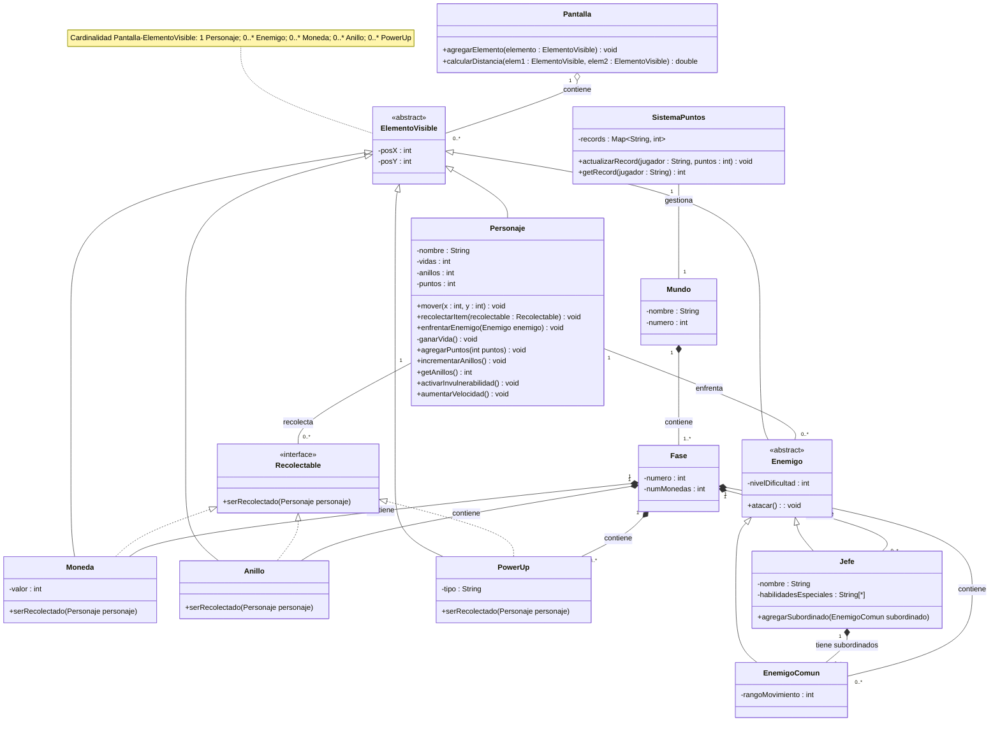

# ED04_2

## Propuesta de solución

```mermaid
classDiagram
    class ElementoVisible {
        <<abstract>>
        -posX : int
        -posY : int
    }

    class Recolectable {
        <<interface>>
        +serRecolectado(Personaje personaje)
    }

    class Moneda {
        -valor : int
        +serRecolectado(Personaje personaje)
    }

    class Anillo {
        +serRecolectado(Personaje personaje)
    }

    class PowerUp {
        -tipo : String
        +serRecolectado(Personaje personaje)
    }

    class Personaje {
        -nombre : String
        -vidas : int
        -anillos : int
        -puntos : int
        +mover(x : int, y : int) void
        +recolectarItem(recolectable : Recolectable) void
        +enfrentarEnemigo(Enemigo enemigo) void
        -ganarVida() void
        +agregarPuntos(int puntos) void
        +incrementarAnillos() void
        +getAnillos() int
        +activarInvulnerabilidad() void
        +aumentarVelocidad() void
    }

    class Enemigo {
       <<abstract>>
        -nivelDificultad : int
        +atacar() : void
    }

    class EnemigoComun {
        -rangoMovimiento : int
    }

    class Jefe {
        -nombre : String
        -habilidadesEspeciales : String[*]
        +agregarSubordinado(EnemigoComun subordinado)
    }

    class Fase {
        -numero : int
        -numMonedas : int
    }

    class Mundo {
        -nombre : String
        -numero : int
    }

    class Pantalla {
        +agregarElemento(elemento : ElementoVisible) void
        +calcularDistancia(elem1 : ElementoVisible, elem2 : ElementoVisible) double
    }

    class SistemaPuntos {
        -records : Map~String, int~
        +actualizarRecord(jugador : String, puntos : int) void
        +getRecord(jugador : String) int
    }

    ElementoVisible <|-- Moneda
    ElementoVisible <|-- Anillo
    ElementoVisible <|-- PowerUp
    ElementoVisible <|-- Personaje
    ElementoVisible <|-- Enemigo
    Enemigo <|-- EnemigoComun
    Enemigo <|-- Jefe
    Recolectable <|.. Moneda
    Recolectable <|.. Anillo
    Recolectable <|.. PowerUp
    Personaje "1" -- "0..*" Recolectable : recolecta
    Jefe "1" *-- "0..*" EnemigoComun : tiene subordinados
    Pantalla "1" o-- "0..*" ElementoVisible : contiene
    Mundo "1" *-- "1..*" Fase : contiene
    Fase "1" *-- "0..10" Moneda : contiene
    Fase "1" *-- "0..*" Anillo : contiene
    Fase "1" *-- "0..*" PowerUp : contiene
    Fase "1" *-- "0..*" EnemigoComun : contiene
    Fase "1" *-- "0..*" Jefe : contiene
    SistemaPuntos "1" -- "1" Mundo : gestiona
    Personaje "1" -- "0..*" Enemigo : enfrenta

    note for ElementoVisible "Cardinalidad Pantalla-ElementoVisible: 1 Personaje; 0..* Enemigo; 0..* Moneda; 0..* Anillo; 0..* PowerUp" 

```
