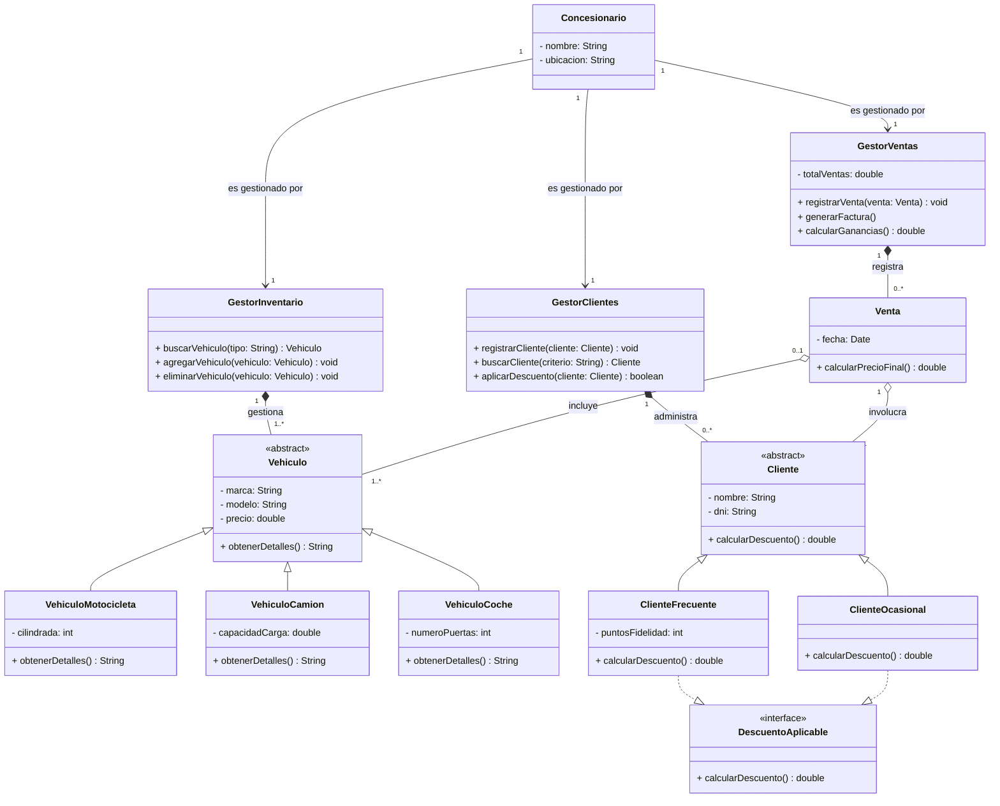

# ED04_1 Sistema de Gestión para un Concesionario de Vehículos

## Solución propuesta

```mermaid
classDiagram
    %% Clases principales
    class Concesionario {
        - nombre: String
        - ubicacion: String
    }

    class GestorInventario {
        + buscarVehiculo(tipo: String) Vehiculo
        + agregarVehiculo(vehiculo: Vehiculo) void
        + eliminarVehiculo(vehiculo: Vehiculo) void
    }

    class GestorVentas {
        - totalVentas: double
        + registrarVenta(venta: Venta) void
        + generarFactura()
        + calcularGanancias() double
    }

    class GestorClientes {
        + registrarCliente(cliente: Cliente) void
        + buscarCliente(criterio: String) Cliente 
        + aplicarDescuento(cliente: Cliente) boolean
    }

    class Vehiculo {
        <<abstract>>
        - marca: String
        - modelo: String
        - precio: double
        + obtenerDetalles() String
    }

    class VehiculoMotocicleta {
        - cilindrada: int
        + obtenerDetalles() String
    }

    class VehiculoCamion {
        - capacidadCarga: double
        + obtenerDetalles() String
    }

    class VehiculoCoche {
        - numeroPuertas: int
        + obtenerDetalles() String
    }

    class Cliente {
        <<abstract>>
        - nombre: String
        - dni: String
        + calcularDescuento() double
    }

    class ClienteFrecuente {
        - puntosFidelidad: int
        + calcularDescuento() double
    }

    class ClienteOcasional {
        + calcularDescuento() double
    }

    class Venta {
        - fecha: Date
        + calcularPrecioFinal() double
    }

    class DescuentoAplicable {
        <<interface>>
        + calcularDescuento() double
    }

    %% Relaciones
    Concesionario "1" --> "1" GestorInventario : es gestionado por
    Concesionario "1" --> "1" GestorVentas : es gestionado por
    Concesionario "1" --> "1" GestorClientes : es gestionado por

    GestorInventario "1" *-- "1..*" Vehiculo : gestiona
    GestorClientes "1" *-- "0..*" Cliente : administra
    GestorVentas "1" *-- "0..*" Venta : registra

    Venta "1" o-- "1" Cliente : involucra
    Venta "0..1" o-- "1..*" Vehiculo : incluye

    Vehiculo <|-- VehiculoMotocicleta
    Vehiculo <|-- VehiculoCamion
    Vehiculo <|-- VehiculoCoche

    Cliente <|-- ClienteFrecuente
    Cliente <|-- ClienteOcasional

    ClienteFrecuente ..|> DescuentoAplicable
    ClienteOcasional ..|> DescuentoAplicable
```