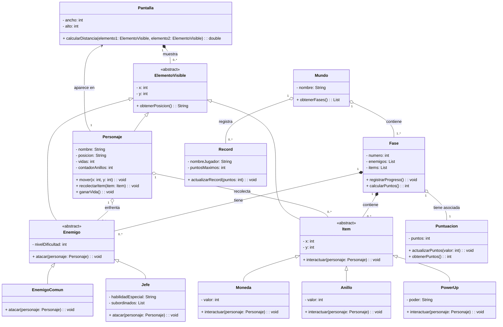

# ED04_2

## Propuesta de solución

```mermaid
classDiagram
    %% Clases principales
    class Mundo {
        - nombre: String
        + obtenerFases(): List<Fase>
    }

    class Fase {
        - numero: int
        - enemigos: List<Enemigo>
        - items: List<Item>
        + registrarProgreso(): void
        + calcularPuntos(): int
    }

    class Pantalla {
        - ancho: int
        - alto: int
        + calcularDistancia(elemento1: ElementoVisible, elemento2: ElementoVisible): double
    }

    class ElementoVisible {
        <<abstract>>
        - x: int
        - y: int
        + obtenerPosicion(): String
    }

    %% Clases relacionadas con el personaje
    class Personaje {
        - nombre: String
        - posicion: String
        - vidas: int
        - contadorAnillos: int
        + mover(x: int, y: int): void
        + recolectarItem(item: Item): void
        + ganarVida(): void
    }

    class Item {
        <<abstract>>
        - x: int
        - y: int
        + interactuar(personaje: Personaje): void
    }

    class Moneda {
        - valor: int
        + interactuar(personaje: Personaje): void
    }

    class Anillo {
        - valor: int
        + interactuar(personaje: Personaje): void
    }

    class PowerUp {
        - poder: String
        + interactuar(personaje: Personaje): void
    }

    %% Clases relacionadas con enemigos
    class Enemigo {
        <<abstract>>
        - nivelDificultad: int
        + atacar(personaje: Personaje): void
    }

    class EnemigoComun {
        + atacar(personaje: Personaje): void
    }

    class Jefe {
        - habilidadEspecial: String
        - subordinados: List<EnemigoComun>
        + atacar(personaje: Personaje): void
    }

    %% Clases relacionadas con puntos y récords
    class Puntuacion {
        - puntos: int
        + actualizarPuntos(valor: int): void
        + obtenerPuntos(): int
    }

    class Record {
        - nombreJugador: String
        - puntosMaximos: int
        + actualizarRecord(puntos: int): void
    }

    %% Relaciones
    Mundo "1" o-- "1..*" Fase : contiene
    Fase "1" *-- "0..*" Enemigo : tiene
    Fase "1" *-- "0..*" Item : contiene
    Pantalla "1" *-- "0..*" ElementoVisible : muestra

    Personaje "1" --> "1" Pantalla : aparece en
    Personaje "1" o-- "0..*" Item : recolecta
    Personaje "1" o-- "0..*" Enemigo : enfrenta

    Item <|-- Moneda
    Item <|-- Anillo
    Item <|-- PowerUp

    Enemigo <|-- EnemigoComun
    Enemigo <|-- Jefe

    Fase "1" o-- "1" Puntuacion : tiene asociada
    Mundo "1" o-- "0..*" Record : registra

    ElementoVisible <|-- Personaje
    ElementoVisible <|-- Enemigo
    ElementoVisible <|-- Item
```
