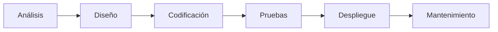
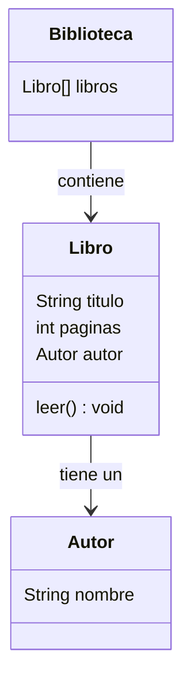

# **1. Introducción**
Como hemos visto en las primeras unidades didacticas, el proceso de creación de aplicaciones y sistemas informáticas es complejo y consta de múltiples fases o etapas.


En cada una de estas etapas, se llevan a cabo diferentes actividades, y, por tanto, necesitamos diferentes herramientas para realizarlas.

Además, sabemos que la forma de organizar estas etapas, así como las formas de trabajar, son multiples y muy diversas, por lo que debemos adaptarlas al sistema a desarrollar.

Uno de los conceptos asociados a esta estrategia a la hora de desarrollar nuestro sistema es el de paradigma de desarrollo.

## **1.1. Paradigma de desarrollo de software**

En el mundo del desarrollo de software, un **paradigma de programación** es un enfoque o estilo para diseñar y escribir código. Cada paradigma organiza y resuelve los problemas de manera distinta, lo que afecta directamente la forma en que entendemos, diseñamos y modelamos los sistemas, incluyendo el uso de UML. A continuación, describimos los paradigmas más importantes:

### **1.1.1. Programación Imperativa**

La programación imperativa se basa en la idea de dar instrucciones paso a paso para resolver un problema.

-   **Características clave**:
    -   El programador especifica cómo debe ejecutarse cada operación.
    -   Se centra en cambiar el estado del programa mediante variables y estructuras de control (como bucles y condicionales).
-   **Ejemplo de lenguajes**: C, Pascal.

### **1.1.2. Programación Orientada a Objetos (POO)**

Este paradigma organiza el código en torno a objetos que combinan datos (atributos) y comportamientos (métodos).

-   **Características clave**:
    -   Principios como **encapsulación**, **herencia** y **polimorfismo**.
    -   Modela el sistema basándose en entidades del mundo real.
-   **Ejemplo de lenguajes**: Java, C++, Python, C#.

### **1.1.3. Programación Funcional**

La programación funcional se centra en resolver problemas utilizando funciones matemáticas puras, sin modificar el estado ni los datos.

-   **Características clave**:
    -   Evita efectos secundarios y cambios de estado.
    -   Facilita la concurrencia y el paralelismo.
-   **Ejemplo de lenguajes**: Haskell, Scala, JavaScript (con funciones de orden superior).

#### **1.1.4. Programación Declarativa**

En este paradigma, el programador especifica qué desea obtener, pero no cómo lograrlo.

-   **Características clave**:
    -   Los lenguajes declarativos se usan a menudo en bases de datos o sistemas de reglas.
    -   Ejemplo: Escribir una consulta SQL para obtener datos sin especificar cómo buscarlos.
-   **Ejemplo de lenguajes**: SQL, Prolog.

### **1.1.5. Paradigmas Combinados**

Muchos lenguajes modernos combinan varios paradigmas para adaptarse mejor a diferentes tipos de problemas.

-   Ejemplo: Python es tanto orientado a objetos como funcional, y JavaScript mezcla paradigmas funcionales, orientados a objetos y declarativos.

## **1.2. Importancia de los diagramas de clases en el desarrollo de aplicaciones**

Los diagramas de clases son un pilar fundamental en la **programación orientada a objetos**, ya que permiten representar de manera visual las estructuras y relaciones de los componentes clave de un sistema. Su uso facilita la comprensión, el diseño y la comunicación en equipos de desarrollo, especialmente en proyectos complejos.

## **1.3. UML en el contexto de la ingeniería de software**

El Lenguaje Unificado de Modelado (**UML, Unified Modeling Language**) es un estándar ampliamente utilizado en la ingeniería de software para **especificar, visualizar, construir y documentar** sistemas. UML no solo se limita a los diagramas de clases, sino que abarca una amplia variedad de diagramas que se adaptan a las distintas fases del ciclo de vida del desarrollo de software.

UML proporciona una base común que permite a desarrolladores, analistas y otros actores del proyecto comunicarse de manera eficiente. Al incluir diagramas estructurales, de comportamiento y de interacción, cubre todos los aspectos del diseño y la implementación de un sistema.

## **1.4. Tipos de diagramas en UML y su relación con el ciclo de vida**

UML clasifica sus diagramas en tres grandes categorías:

1.  **Diagramas estructurales**
    
    -   Representan la arquitectura estática del sistema.
    -   Ejemplos: **Diagramas de clases, objetos, componentes y despliegue**.
    -   **Fase del ciclo de vida**: Más utilizados en las fases de análisis y diseño.
2.  **Diagramas de comportamiento**
    
    -   Muestran la lógica dinámica y el comportamiento del sistema.
    -   Ejemplos: **Diagramas de casos de uso, actividades y estados**.
    -   **Fase del ciclo de vida**: Orientados al análisis de requisitos y validación.
3.  **Diagramas de interacción**
    
    -   Profundizan en cómo los elementos del sistema interactúan entre sí.
    -   Ejemplos: **Diagramas de secuencia, colaboración, tiempos e interacción general**.
    -   **Fase del ciclo de vida**: Comunes en diseño detallado y pruebas.

## **1.5. Relación de los diagramas de clases con el ciclo de vida**

El **diagrama de clases**, al ser un diagrama estructural, tiene un papel destacado en las siguientes fases:

-   **Análisis de requisitos**: Representa los conceptos clave y sus relaciones.
-   **Diseño**: Especifica la estructura detallada del sistema, incluyendo clases, atributos y métodos.
-   **Implementación**: Sirve como base para generar código automáticamente.
-   **Mantenimiento**: Permite interpretar, modificar y documentar sistemas existentes.

## **1.6. Historia y Evolución de UML**

El Lenguaje Unificado de Modelado (**UML**) ha evolucionado desde sus inicios en la década de 1990 hasta convertirse en un estándar internacional ampliamente utilizado en el desarrollo de software. Aquí repasamos su historia, las versiones más relevantes y cómo ha llegado a ser una herramienta indispensable en la ingeniería de software.

### **1.6.1. Los Orígenes de UML**

Antes de UML, no existía un estándar común para modelar sistemas orientados a objetos, lo que dificultaba la comunicación entre equipos y organizaciones. En la década de 1980 y principios de 1990, varios métodos competían por dominar el diseño orientado a objetos, como:

-   **OMT (Object Modeling Technique)** de James Rumbaugh.
-   **Booch Method** de Grady Booch.
-   **OOSE (Object-Oriented Software Engineering)** de Ivar Jacobson.

Estos tres métodos tenían enfoques complementarios pero inconsistentes. En 1994, los creadores de estos métodos (Booch, Rumbaugh y Jacobson) unieron fuerzas para desarrollar un lenguaje unificado. Este esfuerzo culminó en la creación de UML.

### **1.6.2. La Primera Versión de UML**

-   En **1997**, la versión **UML 1.0** fue adoptada oficialmente por el **Object Management Group (OMG)**, una organización dedicada a establecer estándares de modelado en ingeniería de software.
-   UML 1.0 combinaba elementos de los tres métodos principales y ofrecía un marco coherente para modelar sistemas.

**Características clave de UML 1.0:**

-   Introducción de diagramas estructurales (como los diagramas de clases).
-   Diagramas de comportamiento para modelar dinámicas del sistema.
-   Enfoque en sistemas orientados a objetos.

### **1.6.3. Evolución de UML: Principales Versiones**

Desde su lanzamiento inicial, UML ha evolucionado para incluir nuevas capacidades y adaptarse a las necesidades de la industria del software.

1.  **UML 1.x (1997-2000)**
    
    -   Versión inicial con mejoras iterativas.
    -   Introducción de más tipos de diagramas, como diagramas de secuencia y casos de uso.
2.  **UML 2.0 (2003)**
    
    -   Publicado por el OMG en 2003. Supuso un salto significativo en funcionalidad y robustez.
    -   Principales mejoras:
        -   Ampliación de los diagramas estructurales y de interacción.
        -   Diagramas de componentes y despliegue más detallados.
        -   Inclusión del concepto de "fragmentos combinados" en diagramas de secuencia.
3.  **UML 2.x (2005 - Actualidad)**
    
    -   Series de actualizaciones menores para perfeccionar la versión 2.0.
    -   Última versión oficial: **UML 2.5.1**, publicada en 2017.
    -   Cambios clave:
        -   Simplificación del estándar para facilitar su adopción.
        -   Mejora en la interoperabilidad con herramientas CASE (Computer-Aided Software Engineering).

### **1.6.4. UML Hoy en Día**

En la actualidad, UML es el estándar más utilizado para modelar sistemas en múltiples industrias, no solo en software, sino también en áreas como sistemas embebidos y gestión empresarial.

-   **Usos comunes**: Análisis de requisitos, diseño de sistemas, comunicación entre equipos.
-   **Herramientas populares**: StarUML, Enterprise Architect, Visual Paradigm, y módulos de UML en IDEs como Eclipse o IntelliJ IDEA.

UML sigue evolucionando en función de las necesidades de la industria y los avances tecnológicos. Aunque no todos los diagramas de UML se usan con la misma frecuencia, los diagramas de clases, casos de uso y secuencia siguen siendo los más populares.

# **2. Conceptos Básicos de la Programación Orientada a Objetos**

La programación orientada a objetos (POO) es un paradigma de programación que organiza el código en torno a "objetos", los cuales representan elementos del mundo real o conceptos abstractos. Es fundamental en el desarrollo de aplicaciones modernas y está directamente relacionado con los diagramas de clases.

## **2.1. Clases y Objetos: Definición y Características**

### **Clases**

Una **clase** es una plantilla o modelo que define cómo serán los objetos.

-   Incluye **atributos**, que son las características o propiedades del objeto (datos).
-   Contiene **métodos**, que son las acciones o comportamientos que el objeto puede realizar (funciones).

**Ejemplo**:  
Imagina que queremos crear una aplicación para gestionar libros en una biblioteca.  
La clase podría llamarse `Libro` y definirse así:

```java
class Libro {
    String titulo;  // Atributo: título del libro
    String autor;   // Atributo: autor del libro

    void leer() {   // Método: leer el libro
        System.out.println("Estás leyendo el libro: " + titulo);
    }
}
```

### **Objetos**

Un **objeto** es una instancia de una clase, es decir, un ejemplar concreto basado en la plantilla de la clase.

-   Si la clase `Libro` es el modelo, un objeto podría ser un libro específico, como "1984" de George Orwell.

**Ejemplo de instanciación**:

```java
Libro libro1 = new Libro(); // Crear un objeto de la clase Libro
libro1.titulo = "1984";     // Asignar valores a los atributos
libro1.autor = "George Orwell";

libro1.leer(); // Llama al método: muestra "Estás leyendo el libro: 1984"` 
```

## **2.2. Atributos, Métodos y Visibilidad**

### **Atributos**

Son las características o propiedades que describen a una clase.  
En el ejemplo anterior, `titulo` y `autor` son atributos de la clase `Libro`.

### **Métodos**

Son las acciones que un objeto puede realizar. En el ejemplo, `leer()` es un método que representa la acción de leer un libro.

### **Visibilidad**

La **visibilidad** determina quién puede acceder a los atributos y métodos de una clase. Las palabras clave más comunes son:

-   **`public`**: accesible desde cualquier parte del programa.
-   **`private`**: accesible solo dentro de la propia clase.
-   **`protected`**: accesible dentro de la clase, sus subclases y el mismo paquete (más avanzado).

**Ejemplo de visibilidad**:

```java
class Libro {
    private String titulo; // Solo accesible dentro de la clase
    public String autor;   // Accesible desde cualquier parte

    public void setTitulo(String titulo) { // Método público para asignar el título
        this.titulo = titulo;
    }

    public String getTitulo() { // Método público para obtener el título
        return titulo;
    }
}` 
```

## **2.3. Relaciones: Herencia, Composición y Agregación**

### **1. Herencia**

Permite que una clase "hija" herede atributos y métodos de una clase "padre". Esto evita la duplicación de código.

**Ejemplo**:  
Si tenemos una clase general `Publicacion`, podemos crear una clase `Libro` que herede de ella.

```java
class Publicacion {
    String titulo;
    String autor;
}

class Libro extends Publicacion {
    int paginas;
}
```

La clase `Libro` hereda `titulo` y `autor` de `Publicacion`, y añade su propio atributo `paginas`.

### **2. Composición**

Ocurre cuando una clase contiene objetos de otras clases como parte de sus atributos, indicando una relación "tiene un".

**Ejemplo**:  
Un objeto de clase `Biblioteca` contiene varios objetos de clase `Libro`.
```java
class Biblioteca {
    Libro[] libros; // Composición: la biblioteca tiene libros
}
```

### **3. Agregación**

Es similar a la composición, pero la relación entre las clases es más débil. Los objetos relacionados pueden existir por separado.

**Ejemplo**:  
Un `Autor` puede escribir varios `Libros`, pero puede existir sin ellos.

```java
class Autor {
    String nombre;
}

class Libro {
    Autor autor; // Agregación: el libro tiene un autor
}
```

## **2.4. Ejemplo Práctico de un Diagrama de Clases**

Para consolidar estos conceptos, vamos a representar un sistema básico de biblioteca usando un diagrama de clases:

-   **Clases**: `Libro`, `Autor`, `Biblioteca`.
-   **Relaciones**:
    -   Composición: `Biblioteca` tiene varios `Libro`.
    -   Agregación: `Libro` tiene un `Autor`.

**Diagrama UML:**


Este ejemplo muestra cómo representar las relaciones entre clases y sus atributos/métodos.