# Tabla de Contenidos
- [Tabla de Contenidos](#tabla-de-contenidos)
<!-- TOC -->

- [Tabla de Contenidos](#tabla-de-contenidos)
- [Atributos](#atributos)
- [Métodos](#métodos)
- [Relaciones](#relaciones)
  - [Asociación](#asociación)
  - [Cardinalidad o Multiplicidad](#cardinalidad-o-multiplicidad)
  - [Navegabilidad](#navegabilidad)
  - [Rol](#rol)
  - [Clase Asociación](#clase-asociación)
  - [Relación unaria](#relación-unaria)
- [Herencia (generalización)](#herencia-generalización)
- [Composición](#composición)
- [Agregación](#agregación)
- [Dependencia](#dependencia)
- [Interfaces](#interfaces)
- [Clases Abstractas](#clases-abstractas)
- [Enumeradores](#enumeradores)
- [Métodos y atributos estáticos y atributos constantes](#métodos-y-atributos-estáticos-y-atributos-constantes)
- [Resumen de simbología para la representación de relaciones](#resumen-de-simbología-para-la-representación-de-relaciones)
- [Polimorfismo](#polimorfismo)
- [Restricciones (constraints)](#restricciones-constraints)
- [Ejemplo de diagrama de clases completo](#ejemplo-de-diagrama-de-clases-completo)

<!-- /TOC -->

La parte superior contiene el nombre de la clase; la parte intermedia, los atributos (que pueden no existir y, por tanto, se podrían omitir) y la parte inferior, los métodos (que también pueden no existir).

# Atributos

Los **atributos** son las propiedades o características que describen a una clase. Se representan en la segunda sección del rectángulo y siguen esta sintaxis:

`[visibilidad] nombre: tipo` 

-   **Visibilidades**:
    -   `+` (pública): el atributo es accesible desde cualquier clase.
    -   `#` (protegida): el atributo es accesible solo desde la clase y sus subclases.
    -   `-` (privada): el atributo es accesible solo desde la propia clase.
    -   `~` (package): el atributo es accesible desde las clases del mismo paquete.

**Ejemplo de atributos en UML (Mermaid):**

Copiar código

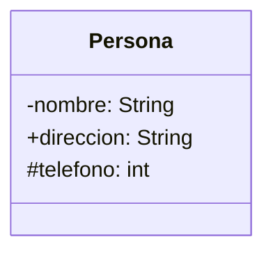

# Métodos

Los **métodos**, también llamados operaciones, son la implementación de un servicio de la clase que muestra un comportamiento común a todos los objetos de dicha clase. Definen cómo interactúa la clase con su entorno. Se representan en la tercera sección del rectángulo y siguen esta sintaxis:

`[visibilidad] nombre(parámetros): tipo_de_retorno` 

**Ejemplo de métodos en UML:**

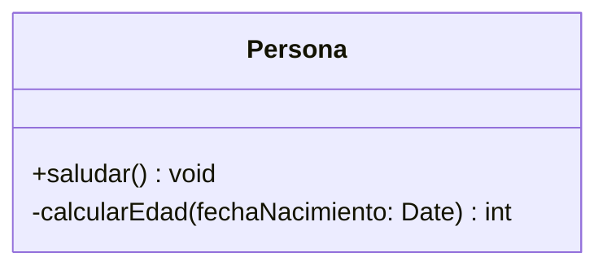

Igual que los atributos, su visibilidad puede ser pública, privada, protegida o de paquete.

# Relaciones

En el mundo real, muchos objetos están vinculados o relacionados entre sí. Esas relaciones en UML muestran cómo interactúan las clases entre sí, y se denominan **asociaciones**. Las asociaciones tienen un nombre y poseen una **cardinalidad** o **multiplicidad**.

## Asociación

Una **asociación** representa una relación entre dos o más clases. Se dibuja como una línea simple entre las clases.

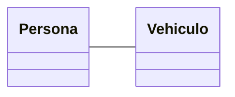

## Cardinalidad o Multiplicidad

La cardinalidad especifica el número de instancias de una clase que pueden asociarse a otra. Se representa con números en los extremos de las líneas que conectan las clases.

-   **Valores comunes de multiplicidad**:
    -   `1`: Una única instancia.
    -   `0..1`: Ninguna o una instancia.
    -   `0..*` o `*`: Cero o más instancias.
    -   `1..*`: Al menos una instancia.
    -   `N..M`: Entre N y M veces.
    -   `M`: Exactamente M veces.

**Ejemplo de cardinalidad:**

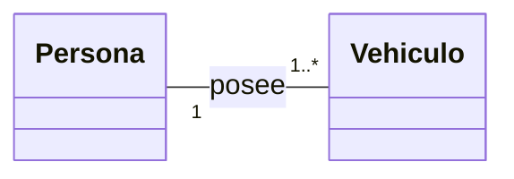

## Navegabilidad

La navegabilidad indica si una clase conoce a la otra y puede interactuar con ella. Se representa con una flecha en el extremo de la línea de asociación. De esta manera, la asociación puede ser **unidireccional** o **bidireccional**.
Si se convierte a Java dos clases unidas por una asociación bidireccional, cada una de ellas tendrá un objeto o conjunto de objetos (dependiendo de la multiplicidad entre ellas). 

**Ejemplos**

A continuación, vamos a ver un ejemplo de dos clases que se relacionan mediante asociaciones unidirecionales o bidireccionales.
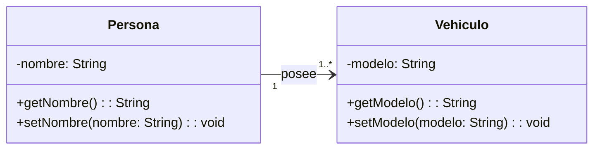

En este caso, vemos que se trata de una relación unidireccional. Su implementación en Java sería la siguiente:

```java
class Vehiculo {
    private String modelo;

    public Vehiculo(String modelo) {
        this.modelo = modelo;
    }

    public String getModelo() {
        return modelo;
    }

    public void setModelo(String modelo) {
        this.modelo = modelo;
    }
}

class Persona {
    private String nombre;
    private Vehiculo vehiculo; // Asociación unidireccional

    public Persona(String nombre, Vehiculo vehiculo) {
        this.nombre = nombre;
        this.vehiculo = vehiculo;
    }

    public String getNombre() {
        return nombre;
    }

    public void setNombre(String nombre) {
        this.nombre = nombre;
    }

    public Vehiculo getVehiculo() {
        return vehiculo;
    }
}
```

La clase `Persona` conoce y tiene acceso a un objeto de tipo `Vehiculo`, pero `Vehiculo` no tiene referencia alguna a `Persona`.

En una relación bidireccional, ambas clases conocen a la otra. Esto se representa en UML con flechas en ambos sentidos o sin flechas explícitas, ya que se asume la reciprocidad.

Diagrama UML:

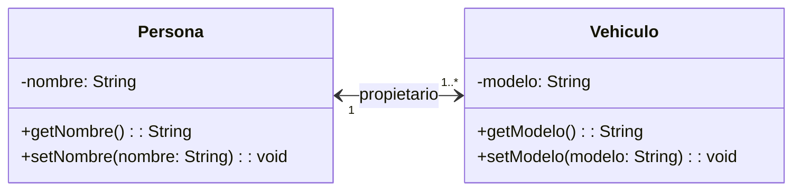

Esta sería su implementación en Java:

```java
import java.util.ArrayList;
import java.util.List;

class Vehiculo {
    private String modelo;
    private Persona propietario; // Asociación bidireccional

    public Vehiculo(String modelo) {
        this.modelo = modelo;
    }

    public String getModelo() {
        return modelo;
    }

    public void setModelo(String modelo) {
        this.modelo = modelo;
    }

    public Persona getPropietario() {
        return propietario;
    }

    public void setPropietario(Persona propietario) {
        this.propietario = propietario;
    }
}

class Persona {
    private String nombre;
    private List<Vehiculo> vehiculos = new ArrayList<>(); // Asociación bidireccional

    public Persona(String nombre) {
        this.nombre = nombre;
    }

    public String getNombre() {
        return nombre;
    }

    public void setNombre(String nombre) {
        this.nombre = nombre;
    }

    public List<Vehiculo> getVehiculos() {
        return vehiculos;
    }

    public void agregarVehiculo(Vehiculo vehiculo) {
        this.vehiculos.add(vehiculo);
        vehiculo.setPropietario(this); // Vinculación bidireccional
    }
}
```

`Persona` tiene una lista de vehículos asociados, y cada `Vehiculo` tiene una referencia a su propietario.
El método `agregarVehiculo` asegura que ambos extremos de la relación se actualicen de forma consistente.

## Rol
En cada asociacion, podemos definir dos **roles**, que describen la semántica de la relación en el sentido indicado. Se representa en los extremos de la asociación correspondiente.

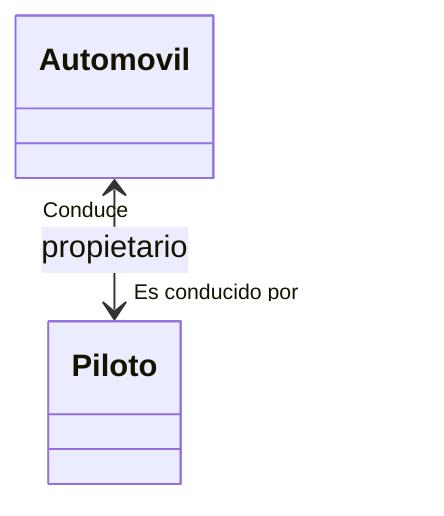

## Clase Asociación

Cuando una relación tiene atributos propios, se puede representar como una **clase asociación**.

**Ejemplo de clase asociación:**


## Relación unaria

TBD

# Herencia (generalización)

La herencia es una relación jerárquica que permite que una clase (hija) herede los atributos y métodos de otra clase (padre). En UML, se representa con una flecha con punta vacía 

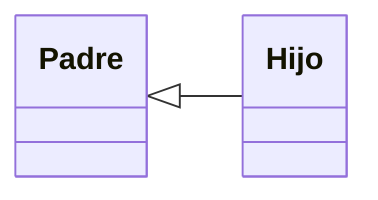
que apunta de la clase hija a la clase padre.

Ejemplo UML:

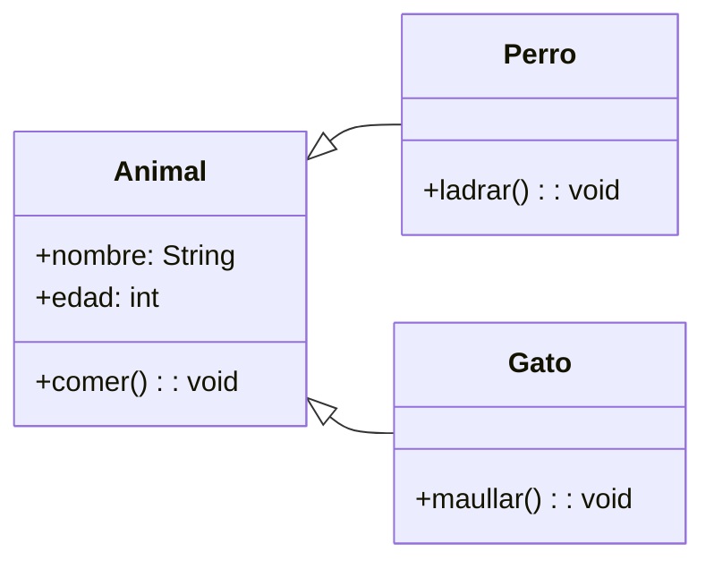

Animal es la clase base, y Perro y Gato heredan sus atributos y métodos.

# Composición
La composición es una relación de "todo-parte" fuerte. Las partes no pueden existir sin el "todo". Se representa con un **rombo sólido** en el extremo del "todo".

Ejemplo UML:

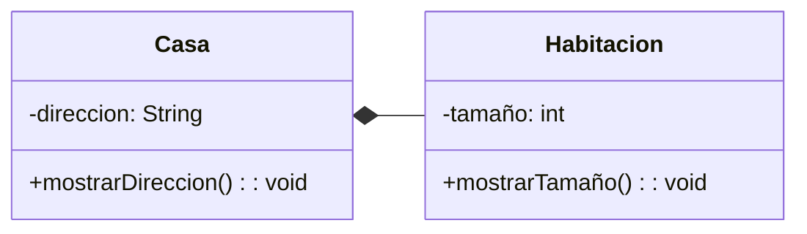

Si una Casa es destruida, sus Habitacion también lo serán.

# Agregación
La agregación es una relación de "todo-parte" débil, donde las partes pueden existir de forma independiente. Se representa con un **rombo vacío** en el extremo del "todo".

Ejemplo UML:

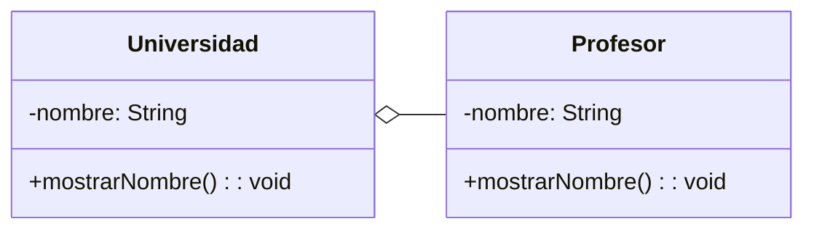

Los Profesor pueden existir sin pertenecer a una Universidad.

# Dependencia

La relación de **dependencia** en UML se utiliza para modelar una conexión débil entre dos elementos, donde un cambio en el elemento independiente (el proveedor) puede afectar al elemento dependiente (el cliente). Este tipo de relación refleja que una clase utiliza o depende de otra para funcionar, pero no posee una asociación directa ni control completo sobre ella.

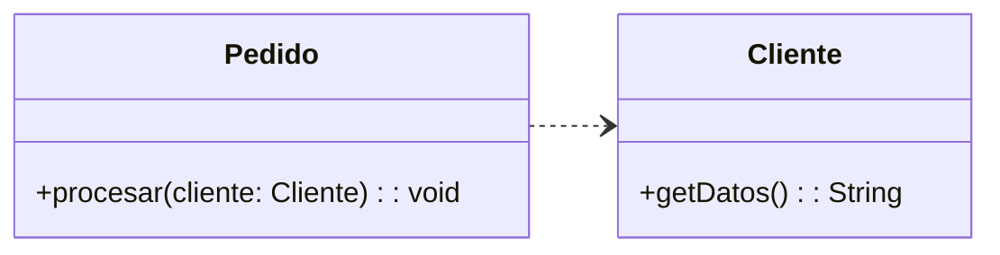

En este ejemplo, la clase `Pedido` depende de `Cliente` porque utiliza sus métodos o propiedades para procesar el pedido. No existe una relación permanente entre ambas clases, simplemente se utiliza temporalmente.

# Interfaces
Una interfaz define un conjunto de métodos que una clase debe implementar. En UML, se representa como una clase con el nombre en cursiva o precedido de `<<interface>>`.

Ejemplo UML:

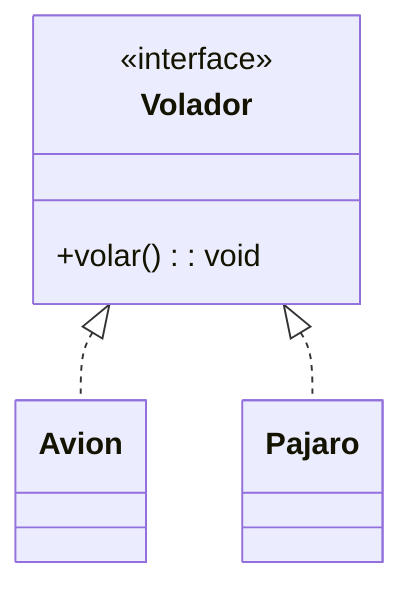

En el ejemplo, `Volador` define un contrato que `Avion` y `Pajaro` deben cumplir al implementar el método `volar`.


A diferencia de en la herencia, cuando una clase implementa los métodos de una interfaz, hablamos de una relación de "realización" y utilizamos una flecha con punta vacía y con línea discontinua.

# Clases Abstractas

Una clase abstracta no se puede instanciar directamente y puede contener **métodos abstractos** (sin implementación; debe tener al menos). En UML, se representa con el nombre de la clase en **cursiva** o con la anotación `<<abstract>>`. Los métodos y atributos abstractos deben representarse en cursiva.

Ejemplo UML:

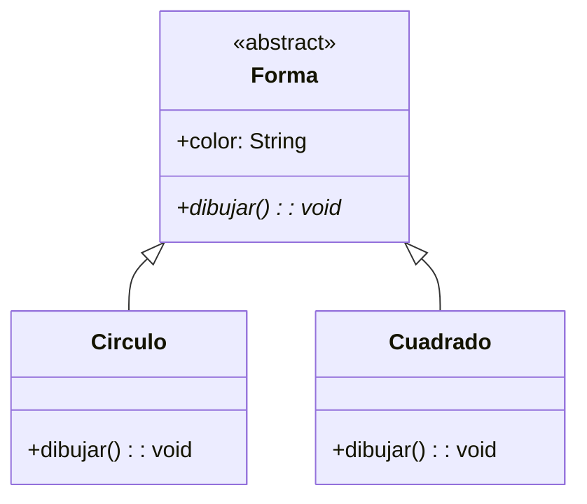

`Forma` es una clase abstracta, y sus subclases (`Circulo` y `Cuadrado`) deben implementar el método `dibujar`.

# Enumeradores
Los enumeradores se definen mediante la anotacion `<<Enumeration>>` de la siguiente manera:

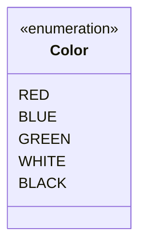

# Métodos y atributos estáticos y atributos constantes
Los métodos y atributos estáticos son aquellos que pertenecen a la clase y no a sus isntancias (objetos). En los diagramas UML, se representan con un <u>subrayado</u>. Por su parte, UML **no contempla** el uso de constantes en sus diagramas. Sin embargo, podemos definir los atributos constantes utilizando letras mayúsculas.

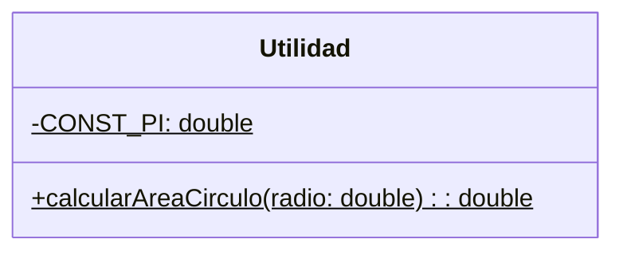


# Resumen de simbología para la representación de relaciones

| Tipo de Relación | Descripción | Símbolo en UML |
| ----- | ----- | ----- | 
| **Asociación** | Relación entre clases que indica una conexión lógica. | Línea simple o flecha para navegabilidad. |
| **Asociación Unidireccional** | Una clase conoce a otra, pero no viceversa. | Flecha simple `→`. |
| **Asociación Bidireccional** | Ambas clases se conocen mutuamente. | Línea sin flechas (o flechas en ambos extremos). | 
| **Agregación** | Relación "todo-parte" débil. Las partes pueden existir independientemente. | Línea con rombo vacío en el lado del "todo". | 
| **Composición** | Relación "todo-parte" fuerte. Las partes no pueden existir sin el "todo". | Línea con rombo lleno en el lado del "todo". |
| **Herencia (Generalización)** | Relación jerárquica donde una clase hija hereda de una clase padre. | Flecha con punta vacía apuntando al padre. | 
| **Realización (Interfaces)** | Una clase implementa los métodos definidos en una interfaz. | Línea discontinua con punta vacía apuntando a la interfaz. | 
| **Dependencia** | Una clase utiliza temporalmente a otra (relación débil). | Línea discontinua con punta abierta. |

Ejemplo UML:

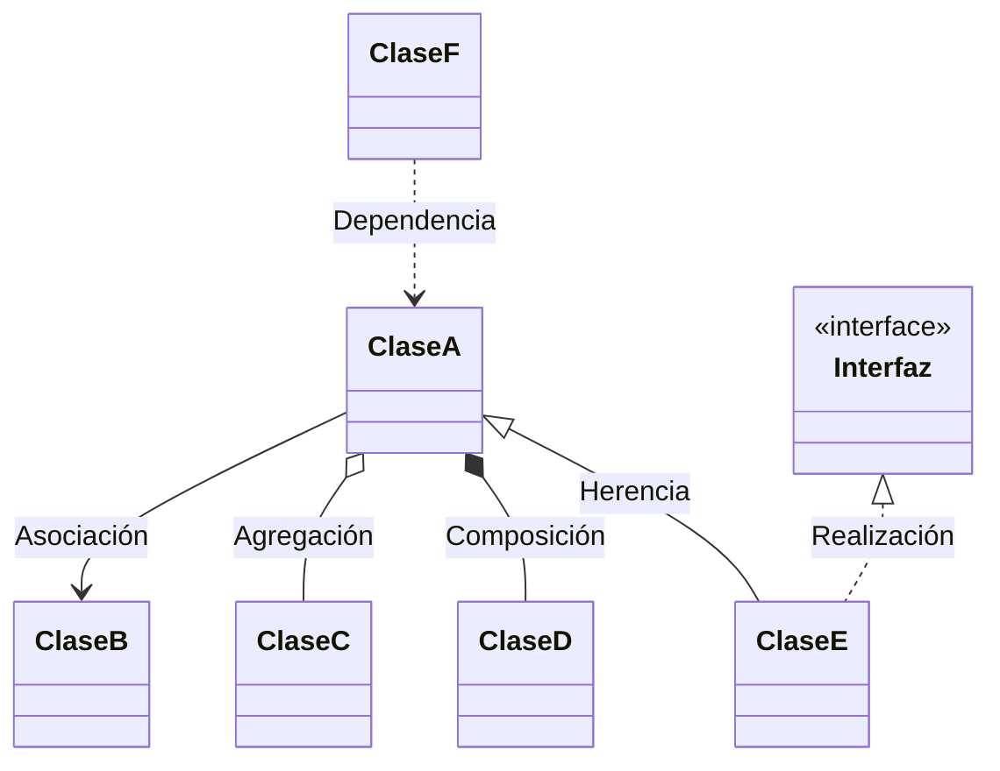

# Polimorfismo

El polimorfismo permite que diferentes clases respondan de manera distinta a un mismo mensaje o método.

- Polimorfismo en tiempo de compilación: Sobrecarga de métodos.
- Polimorfismo en tiempo de ejecución: Sobreescritura de métodos.
  
Ejemplo UML:

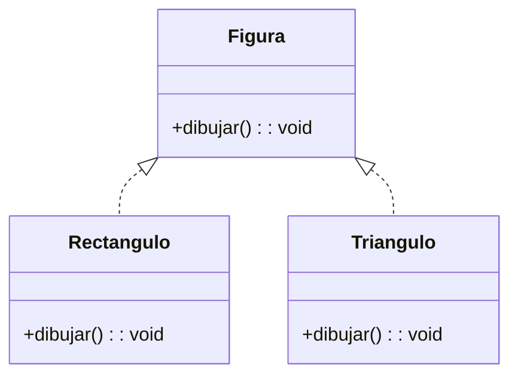

Implementación en Java:

```java
class Figura {
    public void dibujar() {
        System.out.println("Dibujar figura genérica");
    }
}

class Rectangulo extends Figura {
    @Override
    public void dibujar() {
        System.out.println("Dibujar un rectángulo");
    }
}

class Triangulo extends Figura {
    @Override
    public void dibujar() {
        System.out.println("Dibujar un triángulo");
    }
}

public class PolimorfismoDemo {
    public static void main(String[] args) {
        Figura figura1 = new Rectangulo();
        Figura figura2 = new Triangulo();

        figura1.dibujar(); // Dibujar un rectángulo
        figura2.dibujar(); // Dibujar un triángulo
    }
}
```

La clase base Figura define un método dibujar.
Rectangulo y Triangulo sobrescriben este método, permitiendo un comportamiento distinto en tiempo de ejecución.

# Restricciones (constraints)

En UML, las restricciones permiten especificar reglas o condiciones que limitan el comportamiento o las relaciones entre los elementos. Estas se colocan entre llaves {} y se pueden asociar a elementos individuales, relaciones o diagramas completos. A continuación, se describen los principales tipos de restricciones que se pueden definir en UML

- **Restricciones de cardinalidad**: como ya hemos visto anteriormente, limitan el número de instancias permitidas en una relación. Estas restricciones se aplican comúnmente en asociaciones.
- **Restricciones de exclusividad**: Indican que dos relaciones son mutuamente excluyentes (no pueden existir simultáneamente).

- **Restricciones de unicidad**: especifican que ciertos valores o relaciones deben ser únicos. En el caso de atributos, se suele indicar con el texto {id} despues del atributo.
- **Restricciones de orden**: indican que las instancias de una relación deben estar ordenadas.
- **Restricciones de validación**: permiten definir condiciones más complejas para garantizar que ciertos atributos o relaciones cumplan requisitos específicos.
- **Restricciones de dependencia**: limitan las relaciones de dependencia entre clases o componentes. Por ejemplo, una clase A depende de B solo bajo ciertas condiciones.
- **Restricciones de composición**: especifican que una parte (componente) no puede pertenecer a más de un todo (composición).
- **Restricciones de generalización**: limitan la participación en una jerarquía de herencia. Estas restricciones incluyen:
  - **Disjoint vs Overlapping**: Con `Disjoin`, Las subclases no pueden solaparse (una instancia pertenece a una sola subclase).
  - **Complete/Incomplete**: Con `Complete`, todas las instancias de la superclase deben pertenecer a alguna subclase (y por tanto, no a la clase padre).
  
- **Restricciones de valores predeterminados**: Permiten definir valores iniciales para atributos o relaciones.

Eejmplo con restricciones variadas:


Ademas, también se pueden añadir **notas**, en un rectángulo con la esquina superior derecha doblada, donde podemos realizar descripciones en lenguaje natural de estas restricciones o aclaraciones.

# Ejemplo de diagrama de clases completo

El dueño de un hotel pide a desarrollar un programa para consultar sobre las habitaciones disponibles y reservar habitaciones de su hotel..
El hotel posee tres tipos de habitaciones: simple, doble y matrimonial, y dos tipos de clientes: habituales y esporádicos. Una reserva almacena datos del cliente, de la habitación reservada, la fecha de comienzo y el número de días que será ocupada la habitación
El recepcionista del hotel debe poder hacer la siguientes operaciones:
- Obtener un listado de las habitaciones disponible de acuerdo a su tipo
- Preguntar por el precio de una habitación de acuerdo a su tipo
- Preguntar por el descuento ofrecido a los clientes habituales
- Preguntar por el precio total para un cliente dado, especificando su numero de DNI, tipo de habitación y número de noches.
- Dibujar en pantalla la foto de un habitación de acuerdo a su tipo
- Reservar una habitación especificando el número de la habitación, DNI y nombre del cliente.
- Eliminar una reserva especificando el número de la habitación
El administrador puede usar el programa para:
- Cambiar el precio de una habitación de acuerdo a su tipo
- Cambiar el valor del descuento ofrecido a los clientes habituales
- Calcular las ganancias que tendrán en un mes especificado (considere que todos los meses tienen treinta días).
El hotel posee información sobre que clientes son habituales. El diseño a desarrollar debe facilitar la extensibilidad de nuevos tipos de habitación o clientes y a su vez permitir agregar nuevas consultas

A continuación, se muestra una propuesta de solución:

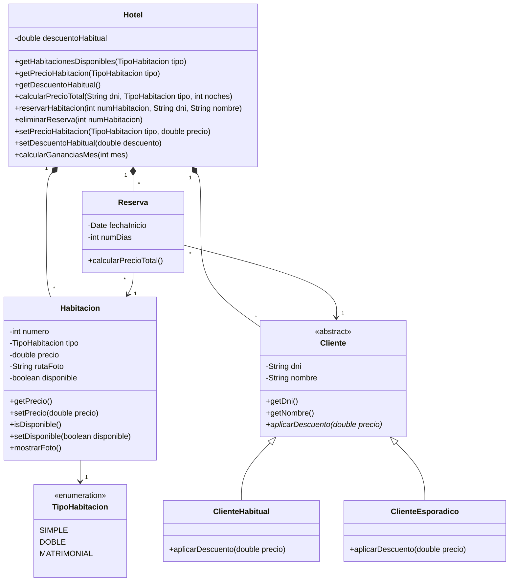

Como podemos observar, el diagrama resultado tiene una clase `Hotel` con múltiples responsabilidades (gestionar las habitaciones, los clientes, o las reservas). Esto va en contra del principio de Responsabilidad Única (primer principio SOLID) por lo que se propone una segunda versión del diseño con nuevas clases que se encarguen de responsabilidades espeecíficas:

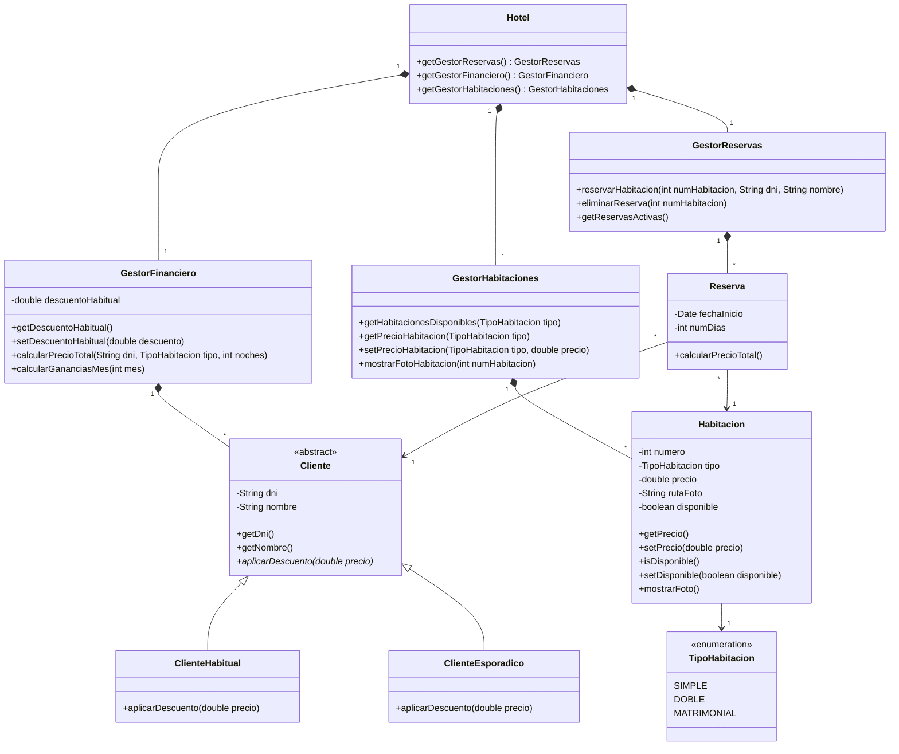

En esta segunda versión hemos creado tres gestores especializados:
- GestorReservas: Maneja todo lo relacionado con reservas.
- GestorFinanciero: Maneja precios, descuentos y cálculos financieros.
- GestorHabitaciones: Maneja la gestión de habitaciones.
