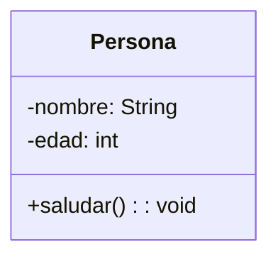
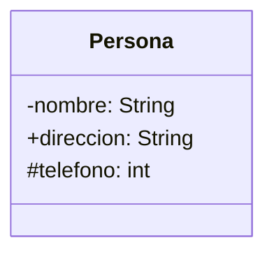
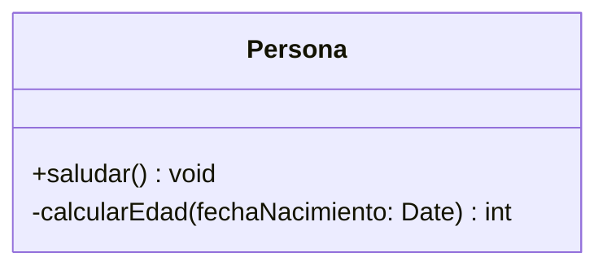
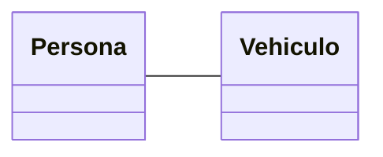
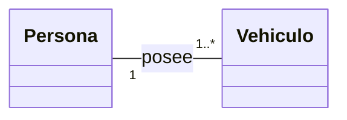
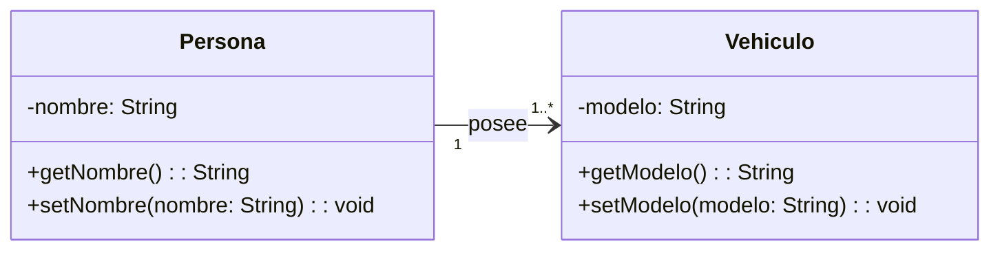
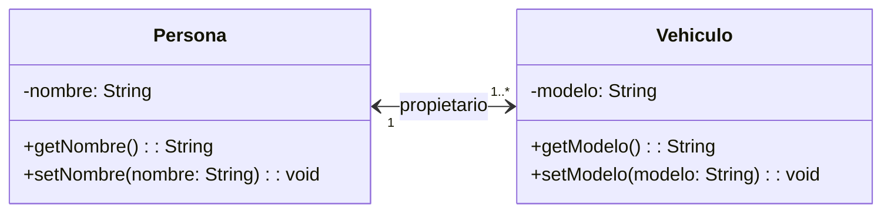

# Tabla de Contenidos
<!-- TOC -->

- [Tabla de Contenidos](#tabla-de-contenidos)
- [**Clases**](#clases)
- [**Atributos**](#atributos)
- [**Métodos**](#métodos)
- [**Relaciones**](#relaciones)
  - [**Asociación**](#asociación)
  - [**Cardinalidad o Multiplicidad**](#cardinalidad-o-multiplicidad)
  - [**Navegabilidad**](#navegabilidad)
  - [**Clase Asociación**](#clase-asociación)

<!-- /TOC -->Asociación**](#clase-asociación)

<!-- /TOC -->

# **Clases**

Una **clase** es la unidad básica que encapsula toda la información para la representación de un conjunto de objetos que comparten características (**atributos**) y comportamientos (**métodos**).

En UML, una clase se representa con un rectángulo dividido en tres secciones:
    1.  **Nombre de la clase** (parte superior).
    2.  **Atributos** (parte intermedia).
    3.  **Métodos** (parte inferior).

**Ejemplo básico de clase en UML:**



La parte superior contiene el nombre de la clase; la parte intermedia, los atributos (que pueden no existir y, por tanto, se podrían omitir) y la parte inferior, los métodos (que también pueden no existir).

# **Atributos**

Los **atributos** son las propiedades o características que describen a una clase. Se representan en la segunda sección del rectángulo y siguen esta sintaxis:

`[visibilidad] nombre: tipo` 

-   **Visibilidades**:
    -   `+` (pública): el atributo es accesible desde cualquier clase.
    -   `#` (protegida): el atributo es accesible solo desde la clase y sus subclases.
    -   `-` (privada): el atributo es accesible solo desde la propia clase.
    -   `~` (package): el atributo es accesible desde las clases del mismo paquete.

**Ejemplo de atributos en UML (Mermaid):**

Copiar código



# **Métodos**

Los **métodos**, también llamados operaciones, son la implementación de un servicio de la clase que muestra un comportamiento común a todos los objetos de dicha clase. Definen cómo interactúa la clase con su entorno. Se representan en la tercera sección del rectángulo y siguen esta sintaxis:

`[visibilidad] nombre(parámetros): tipo_de_retorno` 

**Ejemplo de métodos en UML:**



Igual que los atributos, su visibilidad puede ser pública, privada, protegida o de paquete.

# **Relaciones**

En el mundo real, muchos objetos están vinculados o relacionados entre sí. Esas relaciones en UML muestran cómo interactúan las clases entre sí, y se denominan **asociaciones**. Las asociaciones tienen un nombre y poseen una **cardinalidad** o **multiplicidad**.

## **Asociación**

Una **asociación** representa una relación entre dos o más clases. Se dibuja como una línea simple entre las clases.



## **Cardinalidad o Multiplicidad**

La cardinalidad especifica el número de instancias de una clase que pueden asociarse a otra. Se representa con números en los extremos de las líneas que conectan las clases.

-   **Valores comunes de multiplicidad**:
    -   `1`: Una única instancia.
    -   `0..1`: Ninguna o una instancia.
    -   `0..*` o `*`: Cero o más instancias.
    -   `1..*`: Al menos una instancia.
    -   `N..M`: Entre N y M veces.
    -   `M`: Exactamente M veces.

**Ejemplo de cardinalidad:**



## **Navegabilidad**

La navegabilidad indica si una clase conoce a la otra y puede interactuar con ella. Se representa con una flecha en el extremo de la línea de asociación. De esta manera, la asociación puede ser **unidireccional** o **bidireccional**.
Si se convierte a Java dos clases unidas por una asociación bidireccional, cada una de ellas tendrá un objeto o conjunto de objetos (dependiendo de la multiplicidad entre ellas). 

**Ejemplos**

A continuación, vamos a ver un ejemplo de dos clases que se relacionan mediante asociaciones unidirecionales o bidireccionales.


En este caso, vemos que se trata de una relación unidireccional. Su implementación en Java sería la siguiente:

```java
class Vehiculo {
    private String modelo;

    public Vehiculo(String modelo) {
        this.modelo = modelo;
    }

    public String getModelo() {
        return modelo;
    }

    public void setModelo(String modelo) {
        this.modelo = modelo;
    }
}

class Persona {
    private String nombre;
    private Vehiculo vehiculo; // Asociación unidireccional

    public Persona(String nombre, Vehiculo vehiculo) {
        this.nombre = nombre;
        this.vehiculo = vehiculo;
    }

    public String getNombre() {
        return nombre;
    }

    public void setNombre(String nombre) {
        this.nombre = nombre;
    }

    public Vehiculo getVehiculo() {
        return vehiculo;
    }
}
```

La clase Persona conoce y tiene acceso a un objeto de tipo Vehiculo, pero Vehiculo no tiene referencia alguna a Persona.

En una relación bidireccional, ambas clases conocen a la otra. Esto se representa en UML con flechas en ambos sentidos o sin flechas explícitas, ya que se asume la reciprocidad.

Diagrama UML:



Esta sería su implementación en Java:

```java
import java.util.ArrayList;
import java.util.List;

class Vehiculo {
    private String modelo;
    private Persona propietario; // Asociación bidireccional

    public Vehiculo(String modelo) {
        this.modelo = modelo;
    }

    public String getModelo() {
        return modelo;
    }

    public void setModelo(String modelo) {
        this.modelo = modelo;
    }

    public Persona getPropietario() {
        return propietario;
    }

    public void setPropietario(Persona propietario) {
        this.propietario = propietario;
    }
}

class Persona {
    private String nombre;
    private List<Vehiculo> vehiculos = new ArrayList<>(); // Asociación bidireccional

    public Persona(String nombre) {
        this.nombre = nombre;
    }

    public String getNombre() {
        return nombre;
    }

    public void setNombre(String nombre) {
        this.nombre = nombre;
    }

    public List<Vehiculo> getVehiculos() {
        return vehiculos;
    }

    public void agregarVehiculo(Vehiculo vehiculo) {
        this.vehiculos.add(vehiculo);
        vehiculo.setPropietario(this); // Vinculación bidireccional
    }
}
```

Persona tiene una lista de vehículos asociados, y cada Vehiculo tiene una referencia a su propietario.
El método agregarVehiculo asegura que ambos extremos de la relación se actualicen de forma consistente.

## **Clase Asociación**

Cuando una relación tiene atributos propios, se puede representar como una **clase asociación**.

**Ejemplo de clase asociación:**


