# Notación UML para la generación de diagramas de clases

**Índice**

- [Notación UML para la generación de diagramas de clases](#notación-uml-para-la-generación-de-diagramas-de-clases)
  - [1. Introduccion](#1-introduccion)
  - [2. Clases](#2-clases)
  - [3. Atributos](#3-atributos)
  - [4. Métodos](#4-métodos)
  - [5. Relaciones](#5-relaciones)
    - [5.1. Asociación](#51-asociación)
    - [5.2. Cardinalidad o Multiplicidad](#52-cardinalidad-o-multiplicidad)
    - [5.3. Navegabilidad](#53-navegabilidad)
    - [5.4. Rol](#54-rol)
    - [5.5. Clase Asociación](#55-clase-asociación)
    - [5.6. Relación unaria](#56-relación-unaria)
  - [6. Herencia (generalización)](#6-herencia-generalización)
  - [7. Composición](#7-composición)
  - [8. Agregación](#8-agregación)
  - [9. Dependencia](#9-dependencia)
  - [10. ¿Cómo distinguir los diferentes tipos de relación?](#10-cómo-distinguir-los-diferentes-tipos-de-relación)
  - [11. Interfaces](#11-interfaces)
  - [12. Clases Abstractas](#12-clases-abstractas)
  - [13. Enumeradores](#13-enumeradores)
  - [14. Métodos y atributos estáticos y atributos constantes](#14-métodos-y-atributos-estáticos-y-atributos-constantes)
  - [15. Resumen de simbología para la representación de relaciones](#15-resumen-de-simbología-para-la-representación-de-relaciones)
  - [16. Polimorfismo](#16-polimorfismo)
  - [17. Notas en UML](#17-notas-en-uml)
    - [17.1. Tipos de Información en las Notas](#171-tipos-de-información-en-las-notas)
    - [17.2. Uso de Notas con Restricciones Formales (OCL)](#172-uso-de-notas-con-restricciones-formales-ocl)
    - [17.3. Ejemplo de Notas en Diagramas UML](#173-ejemplo-de-notas-en-diagramas-uml)
    - [17.4. Buenas Prácticas al Usar Notas](#174-buenas-prácticas-al-usar-notas)
  - [18. Restricciones (constraints)](#18-restricciones-constraints)
  - [19. Cómo crear un diagrama de clases a partir de la descripción de un problema](#19-cómo-crear-un-diagrama-de-clases-a-partir-de-la-descripción-de-un-problema)
    - [19.1. Paso 1: Comprender la Descripción del Problema](#191-paso-1-comprender-la-descripción-del-problema)
    - [19.2. Paso 2: Identificar Clases y Atributos](#192-paso-2-identificar-clases-y-atributos)
    - [19.3. Paso 3: Determinar las Relaciones entre las Clases](#193-paso-3-determinar-las-relaciones-entre-las-clases)
    - [19.4. Paso 4: Definir Métodos y Comportamientos](#194-paso-4-definir-métodos-y-comportamientos)
    - [19.5. Paso 5: Representar el Diagrama en Notación UML](#195-paso-5-representar-el-diagrama-en-notación-uml)
  - [20. Ejemplo Práctico: Resolviendo un Problema](#20-ejemplo-práctico-resolviendo-un-problema)
  - [21. Otro ejemplo de diagrama de clases completo](#21-otro-ejemplo-de-diagrama-de-clases-completo)

<!-- /TOC -->

## 1. Introduccion

En la sección anterior hemos visto cómo los diagramas de clases UML permiten representar las diferentes clases y sus relaciones en una representación de un problema del mundo real. A continuación, veremos todos los elementos involucrados en este tipo de diagramas.

## 2. Clases

Una **clase** es la unidad básica que encapsula toda la información para la representación de un conjunto de objetos que comparten características (**atributos**) y comportamientos (**métodos**).

En UML, una clase se representa con un rectángulo dividido en tres secciones:
    1.  **Nombre de la clase** (parte superior).
    2.  **Atributos** (parte intermedia).
    3.  **Métodos** (parte inferior).

**Ejemplo básico de clase en UML:**

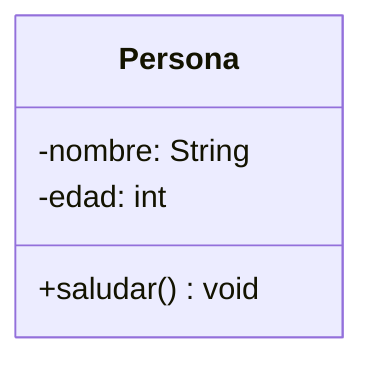

La parte superior contiene el nombre de la clase; la parte intermedia, los atributos (que pueden no existir y, por tanto, se podrían omitir) y la parte inferior, los métodos (que también pueden no existir).

## 3. Atributos

Los **atributos** son las propiedades o características que describen a una clase. Se representan en la segunda sección del rectángulo y siguen esta sintaxis:

`[visibilidad] nombre: tipo`

- **Visibilidades**:
  - `+` (pública): el atributo es accesible desde cualquier clase.
  - `#` (protegida): el atributo es accesible solo desde la clase y sus subclases.
  - `-` (privada): el atributo es accesible solo desde la propia clase.
  - `~` (package): el atributo es accesible desde las clases del mismo paquete.

**Ejemplo de atributos en UML:**

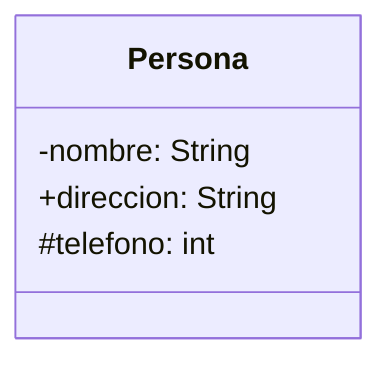

## 4. Métodos

Los **métodos**, también llamados operaciones, son la implementación de un servicio de la clase que muestra un comportamiento común a todos los objetos de dicha clase. Definen cómo interactúa la clase con su entorno. Se representan en la tercera sección del rectángulo y siguen esta sintaxis:

`[visibilidad] nombre(parámetros): tipo_de_retorno`

**Ejemplo de métodos en UML:**

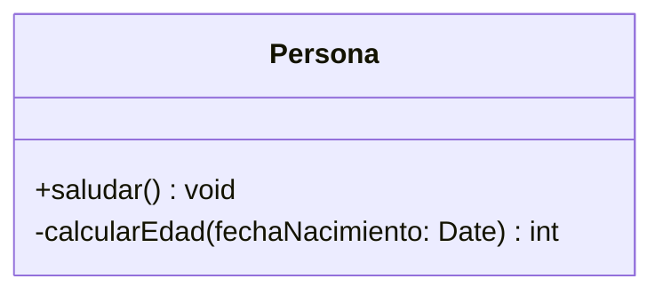

Igual que los atributos, su visibilidad puede ser pública, privada, protegida o de paquete.

## 5. Relaciones

En el mundo real, muchos objetos están vinculados o relacionados entre sí. Esas relaciones en UML muestran cómo interactúan las clases entre sí, y se denominan **asociaciones**. Las asociaciones tienen un nombre y poseen una **cardinalidad** o **multiplicidad**.

### 5.1. Asociación

Una **asociación** representa una relación entre dos o más clases. Se dibuja como una línea simple entre las clases.

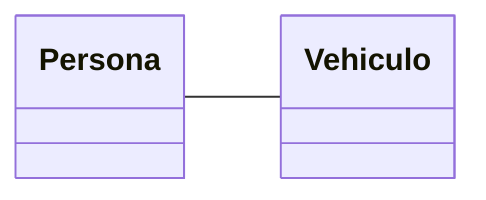

### 5.2. Cardinalidad o Multiplicidad

La cardinalidad especifica el número de instancias de una clase que pueden asociarse a otra. Se representa con números en los extremos de las líneas que conectan las clases.

- **Valores comunes de multiplicidad**:
  - `1`: Una única instancia.
  - `0..1`: Ninguna o una instancia.
  - `0..*` o `*`: Cero o más instancias.
  - `1..*`: Al menos una instancia.
  - `N..M`: Entre N y M veces.
  - `M`: Exactamente M veces.

**Ejemplo de cardinalidad:**

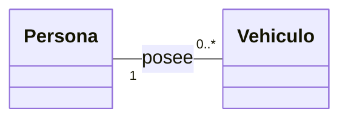

La cardinalidad también puede afectar a atributos o métodos. En algunas ocasiones, una clase tendrá como atributo una **colección** de elementos del mismo tipo (tipicamente de tipos primitivos: boolean, integer, String, ...). En otras ocasiones, un método de una clase puede recibir por parámetro una colección, o devolverla como retorno.

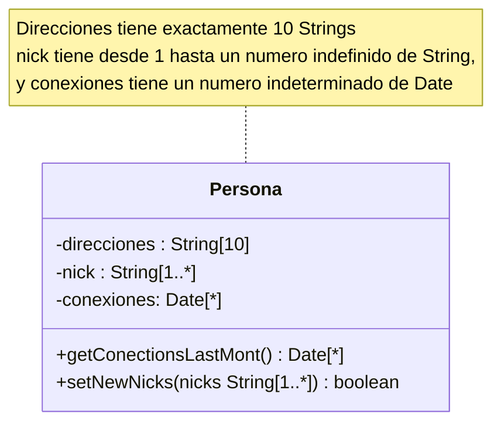

### 5.3. Navegabilidad

La navegabilidad indica si una clase conoce a la otra y puede interactuar con ella. Se representa con una flecha en el extremo de la línea de asociación. De esta manera, la asociación puede ser **unidireccional** o **bidireccional**.
Si se convierte a Java dos clases unidas por una asociación bidireccional, cada una de ellas tendrá un objeto o conjunto de objetos (dependiendo de la multiplicidad entre ellas).

**Ejemplos:**

A continuación, vamos a ver un ejemplo de dos clases que se relacionan mediante asociaciones unidirecionales o bidireccionales.

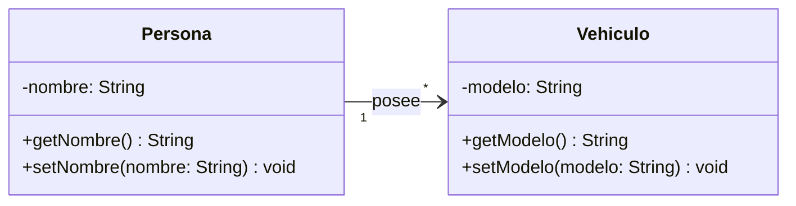

En este caso, vemos que se trata de una relación unidireccional. Su implementación en Java sería la siguiente:

```java
class Vehiculo {
    private String modelo;

    public Vehiculo(String modelo) {
        this.modelo = modelo;
    }

    public String getModelo() {
        return modelo;
    }

    public void setModelo(String modelo) {
        this.modelo = modelo;
    }
}
class Persona {
    private String nombre;
    private List<Vehiculo> vehiculos = new ArrayList<>(); // Asociación bidireccional

    public Persona(String nombre) {
        this.nombre = nombre;
    }

    public String getNombre() {
        return nombre;
    }

    public void setNombre(String nombre) {
        this.nombre = nombre;
    }

    public List<Vehiculo> getVehiculos() {
        return vehiculos;
    }

    public void agregarVehiculo(Vehiculo vehiculo) {
        this.vehiculos.add(vehiculo);
        vehiculo.setPropietario(this); // Vinculación bidireccional
    }
}
```

La clase `Persona` conoce y tiene acceso a una colección (Lista) de objetos de tipo `Vehiculo`, pero `Vehiculo` no tiene referencia alguna a `Persona` (su propietario).

En una relación bidireccional, ambas clases conocen a la otra. Esto se representa en UML con flechas en ambos sentidos o sin flechas explícitas, ya que se asume la reciprocidad.

Diagrama UML:

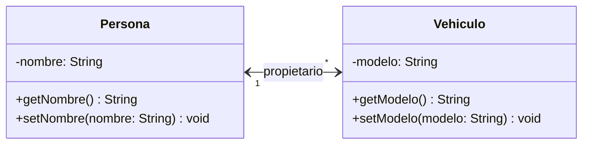

Esta sería su implementación en Java:

```java
import java.util.ArrayList;
import java.util.List;

class Vehiculo {
    private String modelo;
    private Persona propietario; // Asociación bidireccional

    public Vehiculo(String modelo) {
        this.modelo = modelo;
    }

    public String getModelo() {
        return modelo;
    }

    public void setModelo(String modelo) {
        this.modelo = modelo;
    }

    public Persona getPropietario() {
        return propietario;
    }

    public void setPropietario(Persona propietario) {
        this.propietario = propietario;
    }
}

class Persona {
    private String nombre;
    private List<Vehiculo> vehiculos = new ArrayList<>(); // Asociación bidireccional

    public Persona(String nombre) {
        this.nombre = nombre;
    }

    public String getNombre() {
        return nombre;
    }

    public void setNombre(String nombre) {
        this.nombre = nombre;
    }

    public List<Vehiculo> getVehiculos() {
        return vehiculos;
    }

    public void agregarVehiculo(Vehiculo vehiculo) {
        this.vehiculos.add(vehiculo);
        vehiculo.setPropietario(this); // Vinculación bidireccional
    }
}
```

`Persona` tiene una lista de vehículos asociados, y cada `Vehiculo` tiene una referencia a su propietario.
El método `agregarVehiculo` asegura que ambos extremos de la relación se actualicen de forma consistente.

### 5.4. Rol

En cada asociacion, podemos definir dos **roles**, que describen la semántica de la relación en el sentido indicado. Se representa en los extremos de la asociación correspondiente.

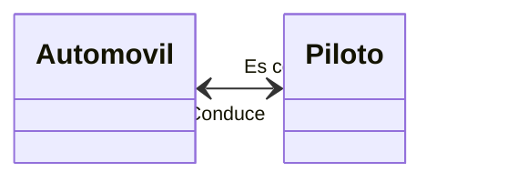

### 5.5. Clase Asociación

Cuando una relación tiene atributos propios, se puede representar como una **clase asociación**.

**Ejemplo de clase asociación:**

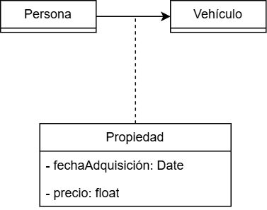

### 5.6. Relación unaria

En el contexto de los diagramas de clases UML, una relación unaria, también conocida como **auto-relación**, ocurre cuando una clase está relacionada consigo misma. Este tipo de relación es útil para modelar situaciones donde las instancias de una clase pueden interactuar entre sí de alguna manera específica.

Este tipo de relación se representa gráficamente mediante una línea que conecta la clase consigo misma, formando un bucle. Se puede utilizar en casos donde las instancias de una misma clase están organizadas jerárquicamente, colaboran entre sí o tienen una dependencia directa.

Un ejemplo común de relación unaria es el de una clase que representa empleados en una organización, donde un empleado puede ser el jefe de otro empleado.

Imaginemos una clase llamada `Empleado`, donde un empleado puede supervisar a otros empleados. La relación unaria entre empleados se puede modelar como sigue:

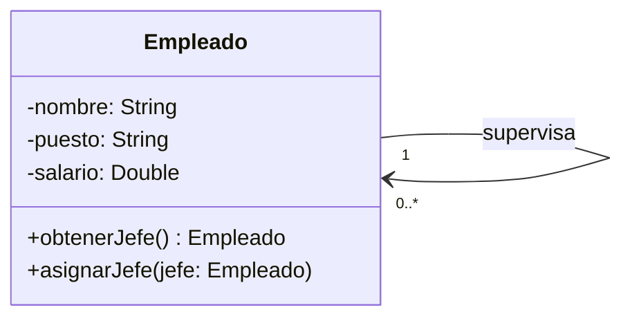

- **Clase**: La clase `Empleado` tiene atributos como `nombre`, `puesto` y `salario`.  
- **Relación Unaria**:  
  - Un empleado puede supervisar a múltiples empleados (multiplicidad `0..*` en el lado supervisado).  
  - Un empleado solo puede tener un supervisor directo (multiplicidad `1` en el lado supervisor).  
- **Métodos**:  
  - `obtenerJefe()` permite consultar quién es el supervisor directo de un empleado.  
  - `asignarJefe(jefe: Empleado)` establece la relación entre un empleado y su supervisor.

**Casos de Uso Comunes:**

1. **Jerarquías Organizacionales**: Como el ejemplo anterior, donde las instancias de una clase representan relaciones jerárquicas.  
2. **Redes o Grafos**: Modelar conexiones entre nodos, como usuarios que se siguen mutuamente en redes sociales.  
3. **Partes de un Todo**: Como en un árbol de componentes donde cada componente puede estar compuesto por otros componentes de la misma clase.

**Consideraciones para Diseñar Relaciones Unarias:**

1. **Multiplicidad**: Es fundamental definir correctamente las cardinalidades de la relación para reflejar la realidad del sistema.  
2. **Restricciones**:  
   - ¿Puede una instancia relacionarse consigo misma? Si no, esto debe especificarse.  
   - ¿Hay límites en la profundidad de la jerarquía?  
3. **Impacto en la Implementación**:  
   - Se debe decidir cómo se representarán estas relaciones en el código (por ejemplo, como referencias en atributos).  
   - Se debe manejar adecuadamente la validación de las relaciones para evitar ciclos o inconsistencias.

**Otro Ejemplo: Productos Relacionados:**

En un sistema de catálogo de productos, un producto puede estar relacionado con otros productos complementarios.

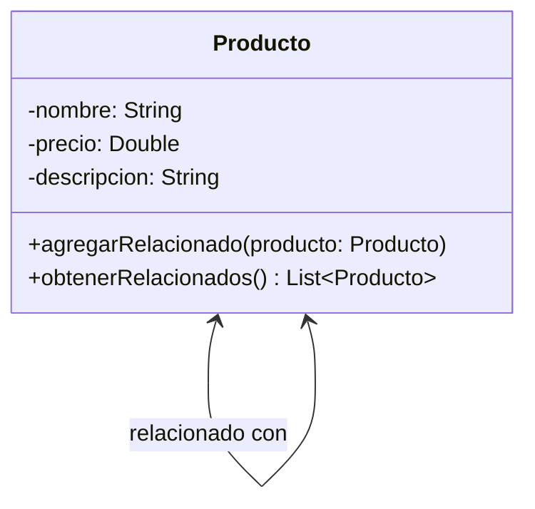

En este caso:

- La relación es bidireccional, pero sigue siendo unaria.  
- Un producto puede estar relacionado con muchos otros productos.

## 6. Herencia (generalización)

La herencia es una relación jerárquica que permite que una clase (hija) herede los atributos y métodos de otra clase (padre). En UML, se representa con una flecha con punta vacía:

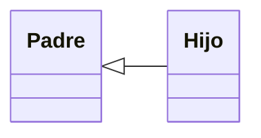

que apunta de la clase hija a la clase padre.

Ejemplo UML:

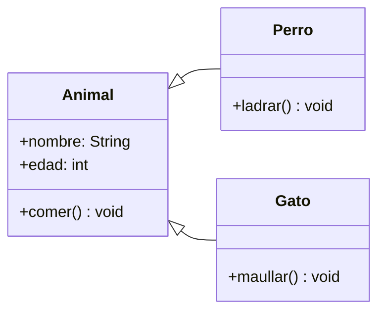

Animal es la clase base, y Perro y Gato heredan sus atributos y métodos.

## 7. Composición

La composición es una relación de "todo-parte" fuerte. Las partes no pueden existir sin el "todo". Se representa con un **rombo sólido** en el extremo del "todo".

Ejemplo UML:

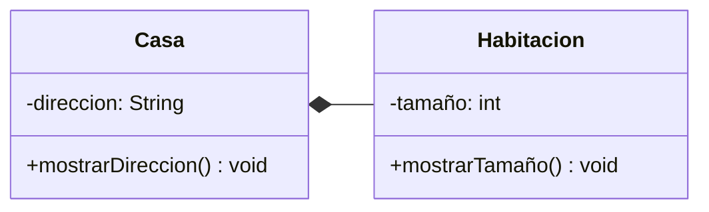

Si una Casa es destruida, sus Habitacion también lo serán.

## 8. Agregación

La agregación es una relación de "todo-parte" débil, donde las partes pueden existir de forma independiente. Se representa con un **rombo vacío** en el extremo del "todo".

Ejemplo UML:

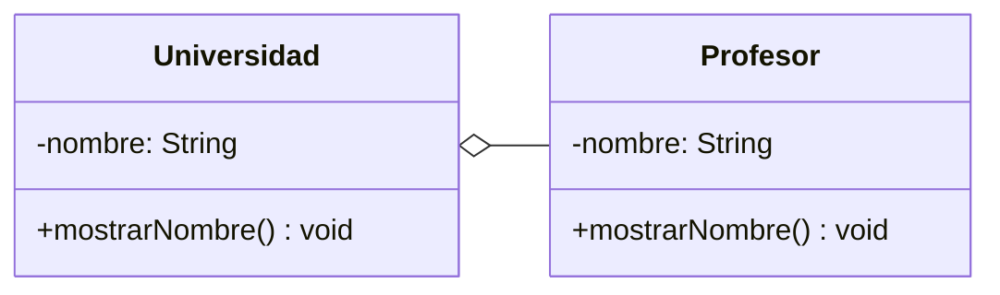

Los Profesor pueden existir sin pertenecer a una Universidad.

*¿Cómo distinguir la composición de la agregación?*

Hay características muy distintivas entre ambos tipos de relaciones, que se resumen en la siguiente tabla:

|       | Agregación  | Composición |
| ----- | ----------- | ----------- |
| Varias asociaciones comparten los componentes (partes) | Sí | No |
| Destrucción de los componentes (partes) al destruir al compuesto (todo) | NO | SÍ |
| Cardinalidad del compuesto (todo) | Cualquiera | 0..1 o 1 |

## 9. Dependencia

La relación de **dependencia** en UML se utiliza para modelar una conexión débil entre dos elementos, donde un cambio en el elemento independiente (el proveedor) puede afectar al elemento dependiente (el cliente). Este tipo de relación refleja que una clase utiliza o depende de otra para funcionar, pero no posee una asociación directa ni control completo sobre ella.

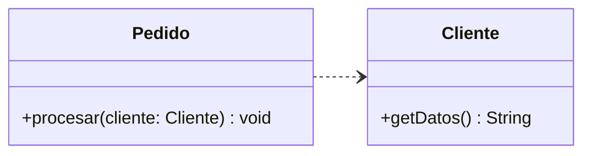

En este ejemplo, la clase `Pedido` depende de `Cliente` porque utiliza sus métodos o propiedades para procesar el pedido. No existe una relación permanente entre ambas clases, simplemente se utiliza temporalmente.

## 10. ¿Cómo distinguir los diferentes tipos de relación?

La **diferencia clave** entre una **asociación (clientela)**, una **agregación o composición** o una relación de dependencia radica en la **naturaleza y la fuerza de la relación entre las clases involucradas**, particularmente en términos de propiedad y ciclo de vida.

**Asociación (Clientela):**

- Es una relación **estructural genérica** entre dos clases.  
- **No implica propiedad.** Ninguna de las clases "posee" a la otra.  
- Representa una **colaboración** entre objetos, donde uno utiliza o interactúa con otro.  
- El ciclo de vida de los objetos no está relacionado, es decir, un objeto puede existir independientemente del otro.  
- **Ejemplo:** Una clase `Cliente` está asociada a una clase `Pedido`, pero el cliente no "posee" el pedido, simplemente interactúa con él.

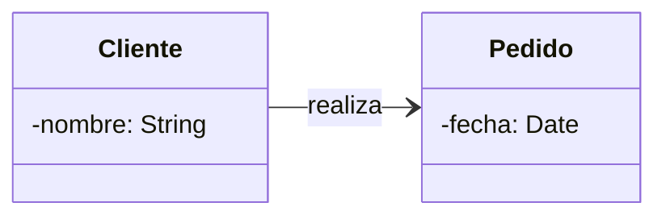

**Agregación:**

- Es un tipo especial de asociación que representa una relación **"todo-parte" débil**.  
- **No implica una fuerte propiedad.** El objeto "todo" puede contener partes, pero las partes pueden existir independientemente del "todo".  
- Relación más fuerte que una simple asociación, pero más débil que una composición.  
- **Ejemplo:** Una clase `Profesor` está asociado a una clase `Departamento`, pero el profesor puede cambiar de departamento o existir sin él.

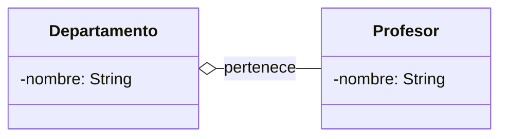

**Composición:**

- Es un tipo especial de asociación que representa una relación **"todo-parte" fuerte.**  
- **Implica propiedad.** El objeto "todo" posee las partes, y las partes no pueden existir independientemente del "todo".  
- El ciclo de vida de las partes está **estrechamente ligado** al ciclo de vida del "todo". Si el "todo" se destruye, sus partes también lo hacen.  
- **Ejemplo:** Una clase `Casa` tiene objetos `Habitación`. Las habitaciones no tienen sentido fuera de la casa.

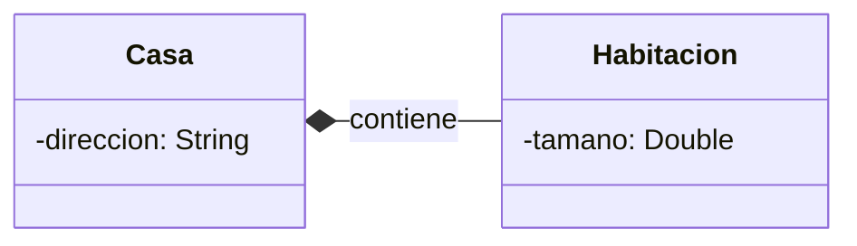

**Dependencia:**

- Representa una relación muy débil y temporal, no una relación estructural.
- Los ciclos de vida son del todo independientes.  
- **Ejemplo:** Una clase `Impresora` depende de la clase `Documento` para imprimir un archivo. Sin embargo, la `Impresora` no "posee" ni tiene un atributo del tipo `Documento`. Simplemente usa la instancia del documento temporalmente.

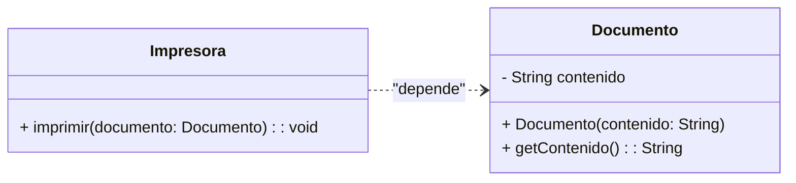

**Resumen de diferencias:**

| Característica | Asociación | Agregación | Composición | Dependencia |
| ----- | ----- | ----- | ----- | ----- |
| **Propiedad** | No | Débil | Fuerte | No |
| **Independencia** | Total | Parcial | Ninguna | Total |
| **Ciclo de vida** | Independiente | Relativamente débil | Dependiente | Independiente |
| **Fuerza de la relación** | Débil | Moderada | Fuerte | Muy débil |
| **Ejemplo típico** | Cliente \- Pedido | Profesor \- Departamento | Casa \- Habitación | Clase \- Servicio |

La diferencia clave, por tanto, es que **la asociación no implica propiedad ni ciclo de vida compartido**, mientras que la agregación y la composición representan relaciones "todo-parte" con diferente grado de acoplamiento

## 11. Interfaces

Una interfaz define un conjunto de métodos que una clase debe implementar. En UML, se representa como una clase con el nombre en cursiva o precedido del estereotipo `<<interface>>`.

Ejemplo UML:

```mermaid
classDiagram
    class Volador {
        <<interface>>
        +volar() void*
    }

    class Avion {
    }

    class Pajaro {
    }

    Volador <|.. Avion
    Volador <|.. Pajaro
```

En el ejemplo, `Volador` define un contrato que `Avion` y `Pajaro` deben cumplir al implementar el método `volar`.

A diferencia de en la herencia, cuando una clase implementa los métodos de una interfaz, hablamos de una relación de "realización" y utilizamos una flecha con punta vacía y con línea discontinua.

## 12. Clases Abstractas

Una clase abstracta no se puede instanciar directamente y puede contener **métodos abstractos** (sin implementación; debe tener al menos). En UML, se representa con el nombre de la clase en **cursiva** o con el estereotipo `<<abstract>>`. Los métodos y atributos abstractos deben representarse en cursiva.

Ejemplo UML:

```mermaid
classDiagram
    class Forma {
        <<abstract>>
        +color: String
        +dibujar() void*
    }

    class Circulo {
        +dibujar() void
    }

    class Cuadrado {
        +dibujar() void
    }

    Forma <|-- Circulo
    Forma <|-- Cuadrado
```

`Forma` es una clase abstracta, y sus subclases (`Circulo` y `Cuadrado`) deben implementar el método `dibujar`.

## 13. Enumeradores

Los enumeradores se definen mediante el estereotipo `<<Enumeration>>` de la siguiente manera:

```mermaid
---
config:
    class:
        hideEmptyMembersBox: true
---
classDiagram
    class Color {
        <<enumeration>>
        RED
        BLUE
        GREEN
        WHITE
        BLACK
}
```

***¿Que son los estereotipos?***

Los estereotipos son el mecanismo de extensibilidad que más se utiliza en uml, y que nos permite definir nuevos elementos de modelado UML basándose en uno existente. Cada estereotipo puede definir un conjunto de valores etiquetados y restricciones que se aplican al elemento esterotipado, y se indica escribiéndolo entre comillas francesas '<<>>'. 

Aunque no es objetivo de nuestro estudio crear estereotipos, sí conviente saber e indentificar los estereotipos que proporcionan las herramientas de modelado. Para los diagramas de clases, los más comunes son:

- [Interface](#11-interfaces)
- [Abstract](#12-clases-abstractas)
- [Enumeration](#13-enumeradores)
- DataType: es similar a una clase, pero sus instancias se indentifican por sus propios valores. Se usan tipicamente para representar tipos de valor primitivos o estructuradas, como fecha, hora, genero, dirección...

    ```mermaid
    ---
    config:
        class:
            hideEmptyMembersBox: true
    ---
        classDiagram
        class DateTime {
            <<DateType>>
        }
    ```

- Exception: sirve para especificar que una clase representa una excepción, una situación excepcional que esperas capturar y gestionar en tu programa. En este ejemplo se muestra una clase Excepción que representa el desbordamiento (*overflow*) de una cola de eventos (*EventQueue*):
  
    


## 14. Métodos y atributos estáticos y atributos constantes

Los métodos y atributos estáticos son aquellos que pertenecen a la clase y no a sus isntancias (objetos). En los diagramas UML, se representan con un <u>subrayado</u>. Por su parte, UML **no contempla** el uso de constantes en sus diagramas. Sin embargo, podemos definir los atributos constantes utilizando letras mayúsculas.

```mermaid
classDiagram
    class Utilidad {
        -CONST_PI: double = 3.1415 $
        +calcularAreaCirculo(radio: double) double $
    }
```

## 15. Resumen de simbología para la representación de relaciones

| Tipo de Relación | Descripción | Símbolo en UML |
| ----- | ----- | ----- |
| **Asociación** | Relación entre clases que indica una conexión lógica. | Línea simple o flecha para navegabilidad. |
| **Asociación Unidireccional** | Una clase conoce a otra, pero no viceversa. | Flecha simple `→`. |
| **Asociación Bidireccional** | Ambas clases se conocen mutuamente. | Línea sin flechas (o flechas en ambos extremos). |
| **Agregación** | Relación "todo-parte" débil. Las partes pueden existir independientemente. | Línea con rombo vacío en el lado del "todo". |
| **Composición** | Relación "todo-parte" fuerte. Las partes no pueden existir sin el "todo". | Línea con rombo lleno en el lado del "todo". |
| **Herencia (Generalización)** | Relación jerárquica donde una clase hija hereda de una clase padre. | Flecha con punta vacía apuntando al padre. |
| **Realización (Interfaces)** | Una clase implementa los métodos definidos en una interfaz. | Línea discontinua con punta vacía apuntando a la interfaz. |
| **Dependencia** | Una clase utiliza temporalmente a otra (relación débil). | Línea discontinua con punta abierta. |

Ejemplo UML:

```mermaid
classDiagram
    class ClaseA
    class ClaseB
    class ClaseC
    class ClaseD
    class ClaseE
    class ClaseF
    class Interfaz {
        <<interface>>
    }

    ClaseA --> ClaseB : Asociación
    ClaseA o-- ClaseC : Agregación
    ClaseA *-- ClaseD : Composición
    ClaseA <|-- ClaseE : Herencia
    Interfaz <|.. ClaseE : Realización
    ClaseF ..> ClaseA : Dependencia
```

## 16. Polimorfismo

El polimorfismo permite que diferentes clases respondan de manera distinta a un mismo mensaje o método.

- Polimorfismo en tiempo de compilación: Sobrecarga de métodos.
- Polimorfismo en tiempo de ejecución: Sobreescritura de métodos.
  
Ejemplo UML:

```mermaid
classDiagram
    class Figura {
        +dibujar() void
    }

    class Rectangulo {
        +dibujar() void
    }

    class Triangulo {
        +dibujar() void
    }

    Figura <|.. Rectangulo
    Figura <|.. Triangulo
```

Implementación en Java:

```java
class Figura {
    public void dibujar() {
        System.out.println("Dibujar figura genérica");
    }
}

class Rectangulo extends Figura {
    @Override
    public void dibujar() {
        System.out.println("Dibujar un rectángulo");
    }
}

class Triangulo extends Figura {
    @Override
    public void dibujar() {
        System.out.println("Dibujar un triángulo");
    }
}

public class PolimorfismoDemo {
    public static void main(String[] args) {
        Figura figura1 = new Rectangulo();
        Figura figura2 = new Triangulo();

        figura1.dibujar(); // Dibujar un rectángulo
        figura2.dibujar(); // Dibujar un triángulo
    }
}
```

La clase base Figura define un método dibujar.
Rectangulo y Triangulo sobrescriben este método, permitiendo un comportamiento distinto en tiempo de ejecución.

## 17. Notas en UML

En los diagramas de clases UML, las **notas** son un elemento visual y textual utilizado para proporcionar información adicional sobre los elementos del modelo. No afectan directamente al diseño estructural o la lógica del sistema, pero son fundamentales para documentar y clarificar aspectos que no pueden ser representados formalmente en el diagrama. Esto incluye decisiones de diseño, explicaciones de restricciones, ejemplos de uso o cualquier información que facilite la comprensión del modelo.

Se representan como un rectángulo con la esquina superior derecha doblada (parecida a un post-it).

- Se utiliza para adjuntar comentarios, explicaciones o restricciones adicionales a uno o varios elementos del diagrama.  
- Las notas no tienen un impacto directo en la implementación del sistema; su función es puramente descriptiva.
- Puede estar conectado a uno o más elementos con una línea discontinua.  
- Contienen un bloque de texto que describe la nota. El texto puede incluir comentarios en lenguaje natural o expresiones formales (como restricciones en OCL \- *Object Constraint Language*).

**Propósito de las Notas:**

1. **Documentación adicional**: Permiten anotar decisiones de diseño que no son evidentes en el diagrama.  
2. **Restricciones**: Expresan reglas o condiciones específicas (por ejemplo, "El precio no puede ser negativo").  
3. **Explicaciones de relaciones**: Aclaran el propósito o la naturaleza de una relación entre clases.  
4. **Ejemplos de uso**: Ofrecen ejemplos concretos de cómo una clase, atributo o método es utilizado.  
5. **Tareas o recordatorios**: Indican elementos pendientes o en revisión dentro del diseño.

### 17.1. Tipos de Información en las Notas

1. **Comentarios generales**:  
   `Nota: Esta clase puede ampliarse en el futuro para incluir más tipos de habitaciones.`
2. **Restricciones de diseño**:  
   ``Restricción: El atributo `edad` debe ser mayor o igual a 18.``
3. **Ejemplo de uso**:  
   ``Ejemplo: Para reservar una habitación, primero llame al método `verDisponibilidad()`.``
4. **Decisiones de diseño**:  
   `Decisión: Se usó agregación en lugar de composición para permitir mayor flexibilidad en la relación.`

### 17.2. Uso de Notas con Restricciones Formales (OCL)

En UML, es común usar las notas para expresar restricciones formales utilizando OCL (Object Constraint Language). Estas restricciones añaden condiciones específicas sobre atributos o relaciones.

**Ejemplo de Restricción Formal en OCL**:

```plaintext
    context Cliente
    inv: self.edad >= 18
```

Esta restricción indica que la edad de un cliente debe ser mayor o igual a 18.

### 17.3. Ejemplo de Notas en Diagramas UML

```mermaid
classDiagram
    direction TD
    
    %% Nota general sobre el diagrama
    note "Este diagrama modela la relación entre clientes y habitaciones en un hotel."

    class Cliente {
        +String nombre
        +int edad
        +reservarHabitacion()
    }

    class Habitacion {
        +int numero
        +double precio
        +reservar()
    }

    %% Nota conectada a un elemento
    note for Cliente "Los clientes deben tener al menos 18 años para realizar una reserva."

    %% Nota sobre una restricción
    note for Habitacion "El precio debe ser mayor a cero."
```

### 17.4. Buenas Prácticas al Usar Notas

1. **Sé claro y conciso**: Evita saturar el diagrama con texto innecesario.  
2. **Ubicación estratégica**: Coloca las notas cerca de los elementos relacionados para evitar confusión.  
3. **Línea discontinua**: Conecta las notas a los elementos relevantes para mostrar la relación.  
4. **Uso moderado**: Usa las notas solo cuando sea estrictamente necesario. Si son demasiadas, considera documentar los detalles en una especificación aparte.

## 18. Restricciones (constraints)

En UML, las restricciones permiten especificar reglas o condiciones que limitan el comportamiento o las relaciones entre los elementos. Estas se colocan entre llaves {} y se pueden asociar a elementos individuales, relaciones o diagramas completos. A continuación, se describen los principales tipos de restricciones que se pueden definir en UML

- **Restricciones de cardinalidad**: como ya hemos visto anteriormente, limitan el número de instancias permitidas en una relación. Estas restricciones se aplican comúnmente en asociaciones, pero también en atributos para colecciones de tipos primitivos (o su úso en los métodos).
- **Restricciones de exclusividad**: Indican que dos relaciones son mutuamente excluyentes (no pueden existir simultáneamente).
  
    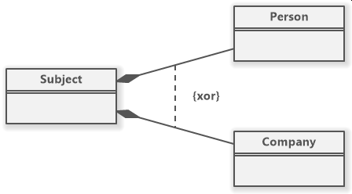
    
- **Restricciones de unicidad**: especifican que ciertos valores o relaciones deben ser únicos. En el caso de atributos, se suele indicar con el texto "{id}" despues del atributo.

    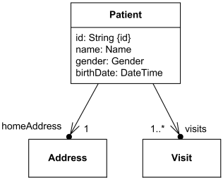

- **Restricciones de orden**: indican que las instancias de una relación deben estar ordenadas. Se combinan con las restricciones de unicidad dentro de la propia colección, para indicar si en ésta, los elementos son ónicos y tienen un criterio de orden, o no.

    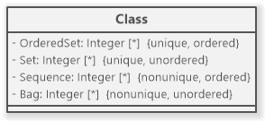

- **Restricciones de validación**: permiten definir condiciones más complejas para garantizar que ciertos atributos o relaciones cumplan requisitos específicos.
- **Restricciones de dependencia**: limitan las relaciones de dependencia entre clases o componentes. Por ejemplo, una clase A depende de B solo bajo ciertas condiciones.
- **Restricciones de composición**: especifican que una parte (componente) no puede pertenecer a más de un todo (composición).
- **Restricciones de generalización**: limitan la participación en una jerarquía de herencia. Estas restricciones incluyen:
  - **Disjoint vs Overlapping**: Con `Disjoin`, Las subclases no pueden solaparse (una instancia pertenece a una sola subclase).
  - **Complete/Incomplete**: Con `Complete`, todas las instancias de la superclase deben pertenecer a alguna subclase (y por tanto, no a la clase padre).
  
- **Restricciones de valores predeterminados**: Permiten definir valores iniciales para atributos o relaciones.

Eejmplo con restricciones variadas:


Ademas, también se pueden añadir **notas**, en un rectángulo con la esquina superior derecha doblada, donde podemos realizar descripciones en lenguaje natural de estas restricciones o aclaraciones.

## 19. Cómo crear un diagrama de clases a partir de la descripción de un problema

Los diagramas de clases son herramientas esenciales en el desarrollo de software, ya que permiten estructurar y organizar los elementos principales de un sistema antes de pasar a la implementación. Crear un diagrama de clases a partir de una descripción requiere un proceso sistemático que garantice la correcta representación de las entidades, sus atributos, métodos y relaciones. Este apartado detalla los pasos necesarios para realizar este proceso, acompañados de un ejemplo práctico.

### 19.1. Paso 1: Comprender la Descripción del Problema

El primer paso consiste en leer atentamente la descripción proporcionada y comprender el contexto del sistema que se desea modelar. Es fundamental identificar:

- Los actores principales del sistema.  
- Las entidades o conceptos clave mencionados.  
- Las acciones o relaciones descritas entre las entidades.

Una buena práctica es subrayar palabras clave relacionadas con clases (sustantivos), atributos (características) y métodos (acciones).

**Ejemplo:**  
Descripción del problema: *“Una biblioteca administra libros y usuarios. Los libros tienen un título, autor, ISBN y una cantidad disponible. Los usuarios pueden ser estudiantes o profesores. Los estudiantes tienen un identificador único, y los profesores tienen un departamento asociado. Los usuarios pueden tomar libros en préstamo, y cada préstamo debe registrar la fecha de inicio y la fecha de devolución.”*

### 19.2. Paso 2: Identificar Clases y Atributos

Una vez comprendido el problema, se identifican las clases principales a partir de los sustantivos destacados. Luego, se determinan los atributos relevantes para cada clase.

**Ejemplo:**

- Clases:  
  - Libro  
  - Usuario (Estudiante, Profesor)  
  - Préstamo  
- Atributos:  
  - **Libro**: título, autor, ISBN, cantidadDisponible  
  - **Estudiante**: identificador  
  - **Profesor**: departamento  
  - **Préstamo**: fechaInicio, fechaDevolución

### 19.3. Paso 3: Determinar las Relaciones entre las Clases

El siguiente paso consiste en identificar cómo se relacionan las clases entre sí. Esto incluye asociaciones, agregaciones, composiciones y herencias. Se deben analizar las cardinalidades y la navegabilidad.

**Ejemplo:**

- Relación 1: Un **Usuario** puede realizar múltiples **Préstamos**, pero cada préstamo está asociado a un único usuario (relación 1 a N).  
- Relación 2: Cada **Préstamo** está asociado a un único **Libro**, pero un libro puede ser prestado múltiples veces (relación 1 a N).  
- Relación 3: Los **Estudiantes** y **Profesores** son tipos específicos de usuarios (herencia).

### 19.4. Paso 4: Definir Métodos y Comportamientos

Con las relaciones definidas, se identifican los métodos principales de cada clase, que representan las acciones o comportamientos mencionados en el problema.

**Ejemplo:**

- **Usuario**: realizarPréstamo()  
- **Libro**: actualizarCantidadDisponible()  
- **Préstamo**: calcularDuración()

### 19.5. Paso 5: Representar el Diagrama en Notación UML

Con toda la información recopilada, se dibuja el diagrama utilizando notación UML. Se incluyen las clases, sus atributos y métodos, y las relaciones con las cardinalidades y navegabilidad correspondientes.

**Ejemplo:**

```mermaid
    classDiagram  
        class Libro {  
            - String titulo  
            - String autor  
            - String ISBN  
            - int cantidadDisponible  
            + actualizarCantidadDisponible() void  
        }

        class Usuario {  
            <<abstract>>  
            - String nombre  
            + realizarPrestamo() void  
        }

        class Estudiante {  
            - String identificador  
        }

        class Profesor {  
            - String departamento  
        }

        class Prestamo {  
            - Date fechaInicio  
            - Date fechaDevolucion  
            + calcularDuracion() int  
        }

        Usuario <|-- Estudiante  
        Usuario <|-- Profesor  
        Usuario "1" --> "N" Prestamo  
        Prestamo "1" --> "1" Libro
```

## 20. Ejemplo Práctico: Resolviendo un Problema

**Descripción:**  
Una tienda de música en línea vende álbumes y permite a los usuarios registrarse para comprar canciones o álbumes completos. Los álbumes tienen un título, un artista y un año de lanzamiento. Las canciones tienen un título, una duración y un precio. Los usuarios registrados tienen un correo electrónico y un nombre de usuario. Los usuarios pueden realizar múltiples compras, y cada compra debe incluir la fecha y una lista de canciones o álbumes comprados.

**Resolución:**

1. Clases identificadas: Álbum, Canción, Usuario, Compra.  
2. Atributos:  
   - Álbum: título, artista, añoLanzamiento.  
   - Canción: título, duración, precio.  
   - Usuario: correo, nombreUsuario.  
   - Compra: fecha.  
3. Relaciones:  
   - Un álbum contiene varias canciones (composición).  
   - Un usuario puede realizar varias compras (asociación 1 a N).  
   - Cada compra incluye múltiples canciones o álbumes (agregación).

**Diagrama:**

```mermaid
    classDiagram  
        class Album {  
            - String titulo  
            - String artista  
            - int añoLanzamiento  
        }

        class Cancion {  
            - String titulo  
            - double duracion  
            - double precio  
        }

        class Usuario {  
            - String correo  
            - String nombreUsuario  
    }

        class Compra {  
            - Date fecha  
        }

        Album *-- Cancion  
        Usuario "1" --> "N" Compra  
        Compra "N" o-- "N" Cancion  
        Compra "N" o-- "N" Album
```

## 21. Otro ejemplo de diagrama de clases completo

El dueño de un hotel pide a desarrollar un programa para consultar sobre las habitaciones disponibles y reservar habitaciones de su hotel..
El hotel posee tres tipos de habitaciones: simple, doble y matrimonial, y dos tipos de clientes: habituales y esporádicos. Una reserva almacena datos del cliente, de la habitación reservada, la fecha de comienzo y el número de días que será ocupada la habitación
El recepcionista del hotel debe poder hacer la siguientes operaciones:

- Obtener un listado de las habitaciones disponible de acuerdo a su tipo
- Preguntar por el precio de una habitación de acuerdo a su tipo
- Preguntar por el descuento ofrecido a los clientes habituales
- Preguntar por el precio total para un cliente dado, especificando su numero de DNI, tipo de habitación y número de noches.
- Dibujar en pantalla la foto de un habitación de acuerdo a su tipo
- Reservar una habitación especificando el número de la habitación, DNI y nombre del cliente.
- Eliminar una reserva especificando el número de la habitación
El administrador puede usar el programa para:
- Cambiar el precio de una habitación de acuerdo a su tipo
- Cambiar el valor del descuento ofrecido a los clientes habituales
- Calcular las ganancias que tendrán en un mes especificado (considere que todos los meses tienen treinta días).
El hotel posee información sobre que clientes son habituales. El diseño a desarrollar debe facilitar la extensibilidad de nuevos tipos de habitación o clientes y a su vez permitir agregar nuevas consultas

A continuación, se muestra una propuesta de solución:

```mermaid

classDiagram
    %% Clases Principales %%
    class Hotel {
        -double descuentoHabitual
        +getHabitacionesDisponibles(TipoHabitacion tipo)
        +getPrecioHabitacion(TipoHabitacion tipo)
        +getDescuentoHabitual()
        +calcularPrecioTotal(String dni, TipoHabitacion tipo, int noches)
        +reservarHabitacion(int numHabitacion, String dni, String nombre)
        +eliminarReserva(int numHabitacion)
        +setPrecioHabitacion(TipoHabitacion tipo, double precio)
        +setDescuentoHabitual(double descuento)
        +calcularGananciasMes(int mes)
    }

    class Habitacion {
        -int numero
        -TipoHabitacion tipo
        -double precio
        -String rutaFoto
        -boolean disponible
        +getPrecio()
        +setPrecio(double precio)
        +isDisponible()
        +setDisponible(boolean disponible)
        +mostrarFoto()
    }

    class Cliente {
        <<abstract>>
        -String dni
        -String nombre
        +getDni()
        +getNombre()
        +aplicarDescuento(double precio)*
    }

    class ClienteHabitual {
        +aplicarDescuento(double precio)
    }

    class ClienteEsporadico {
        +aplicarDescuento(double precio)
    }

    class Reserva {
        -Date fechaInicio
        -int numDias
        +calcularPrecioTotal()
    }

    class TipoHabitacion {
        <<enumeration>>
        SIMPLE
        DOBLE
        MATRIMONIAL
    }

    Hotel "1" *-- "*" Habitacion
    Hotel "1" *-- "*" Cliente
    Hotel "1" *-- "*" Reserva
    Reserva "*" --> "1" Cliente
    Reserva "*" --> "1" Habitacion
    Habitacion --> "1" TipoHabitacion
    Cliente <|-- ClienteHabitual
    Cliente <|-- ClienteEsporadico

```

Como podemos observar, el diagrama resultado tiene una clase `Hotel` con múltiples responsabilidades (gestionar las habitaciones, los clientes, o las reservas). Esto va en contra del principio de Responsabilidad Única (primer principio SOLID) por lo que se propone una segunda versión del diseño con nuevas clases que se encarguen de responsabilidades espeecíficas:

```mermaid

classDiagram
    %% Clases Principales %%
    class Hotel {
        +getGestorReservas() GestorReservas
        +getGestorFinanciero() GestorFinanciero
        +getGestorHabitaciones() GestorHabitaciones
    }

    class GestorReservas {
        +reservarHabitacion(int numHabitacion, String dni, String nombre)
        +eliminarReserva(int numHabitacion)
        +getReservasActivas()
    }

    class GestorFinanciero {
        -double descuentoHabitual
        +getDescuentoHabitual()
        +setDescuentoHabitual(double descuento)
        +calcularPrecioTotal(String dni, TipoHabitacion tipo, int noches)
        +calcularGananciasMes(int mes)
    }

    class GestorHabitaciones {
        +getHabitacionesDisponibles(TipoHabitacion tipo)
        +getPrecioHabitacion(TipoHabitacion tipo)
        +setPrecioHabitacion(TipoHabitacion tipo, double precio)
        +mostrarFotoHabitacion(int numHabitacion)
    }

    class Habitacion {
        -int numero
        -TipoHabitacion tipo
        -double precio
        -String rutaFoto
        -boolean disponible
        +getPrecio()
        +setPrecio(double precio)
        +isDisponible()
        +setDisponible(boolean disponible)
        +mostrarFoto()
    }

    class Cliente {
        <<abstract>>
        -String dni
        -String nombre
        +getDni()
        +getNombre()
        +aplicarDescuento(double precio)*
    }

    class ClienteHabitual {
        +aplicarDescuento(double precio)
    }

    class ClienteEsporadico {
        +aplicarDescuento(double precio)
    }

    class Reserva {
        -Date fechaInicio
        -int numDias
        +calcularPrecioTotal()
    }

    class TipoHabitacion {
        <<enumeration>>
        SIMPLE
        DOBLE
        MATRIMONIAL
    }

    Hotel "1" *-- "1" GestorReservas
    Hotel "1" *-- "1" GestorFinanciero
    Hotel "1" *-- "1" GestorHabitaciones
    GestorHabitaciones "1" *-- "*" Habitacion
    GestorReservas "1" *-- "*" Reserva
    GestorFinanciero "1" *-- "*" Cliente
    Reserva "*" --> "1" Cliente
    Reserva "*" --> "1" Habitacion
    Habitacion --> "1" TipoHabitacion
    Cliente <|-- ClienteHabitual
    Cliente <|-- ClienteEsporadico

```

En esta segunda versión hemos creado tres gestores especializados:

- GestorReservas: Maneja todo lo relacionado con reservas.
- GestorFinanciero: Maneja precios, descuentos y cálculos financieros.
- GestorHabitaciones: Maneja la gestión de habitaciones.
