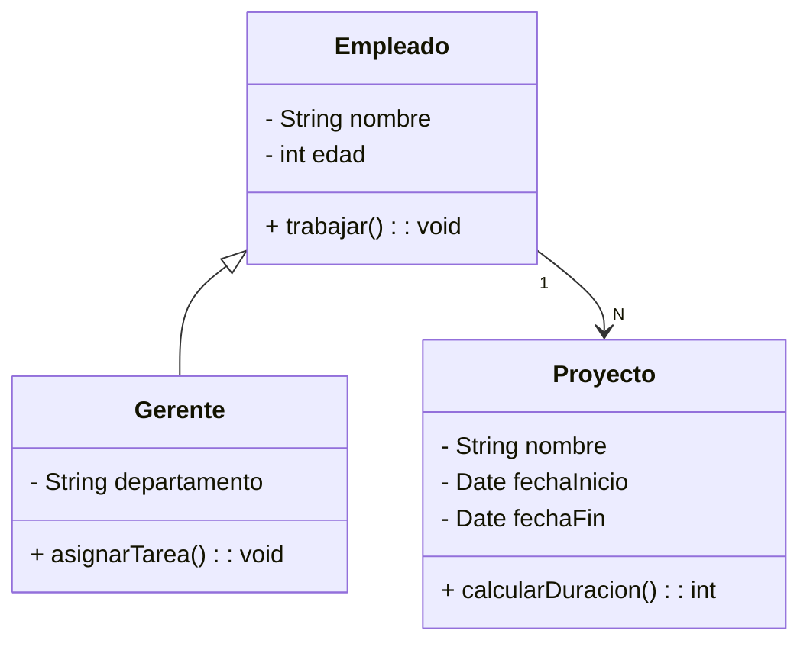

# Herramientas para generar diagramas de clase, generación de código e ingeniería inversa

- [Herramientas para la generación de Diagramas de Clases](#herramientas-para-la-generación-de-diagramas-de-clases)
  - [Herramientas Genéricas](#herramientas-genéricas)
  - [Herramientas Especializadas en UML](#herramientas-especializadas-en-uml)
  - [Herramientas Open Source y Gratuitas](#herramientas-open-source-y-gratuitas)
  - [Herramientas Online y Colaborativas](#herramientas-online-y-colaborativas)
  - [Tabla resumen con las distintas herramientas de modelado UML](#tabla-resumen-con-las-distintas-herramientas-de-modelado-uml)
  - [Elección de la Herramienta Adecuada](#elección-de-la-herramienta-adecuada)
- [Cómo Generar Código a partir de un Diagrama de Clases](#cómo-generar-código-a-partir-de-un-diagrama-de-clases)
  - [Comprensión del Proceso de Generación de Código](#comprensión-del-proceso-de-generación-de-código)
  - [Ejemplo Práctico de Generación de Código](#ejemplo-práctico-de-generación-de-código)
  - [Beneficios de Generar Código desde UML](#beneficios-de-generar-código-desde-uml)
- [Proceso de Ingeniería Inversa en IntelliJ IDEA](#proceso-de-ingeniería-inversa-en-intellij-idea)
  - [Preparación del Entorno](#preparación-del-entorno)
  - [Generación del Diagrama UML](#generación-del-diagrama-uml)
  - [Ejemplo Práctico](#ejemplo-práctico)
  - [Ventajas de la Ingeniería Inversa con IntelliJ IDEA](#ventajas-de-la-ingeniería-inversa-con-intellij-idea)
  - [Limitaciones y Consideraciones](#limitaciones-y-consideraciones)
- [¿Es buena práctica hacer uso de la ingeniería inversa?](#es-buena-práctica-hacer-uso-de-la-ingeniería-inversa)
  - [Limitaciones y Riesgos](#limitaciones-y-riesgos)
  - [¿Cuándo es una buena práctica?](#cuándo-es-una-buena-práctica)
  - [¿Cuándo no es recomendable?](#cuándo-no-es-recomendable)
  - [Buenas prácticas al usar ingeniería inversa](#buenas-prácticas-al-usar-ingeniería-inversa)

## Herramientas para la generación de Diagramas de Clases

En el desarrollo de software, los diagramas de clases son una herramienta fundamental para modelar y visualizar la estructura de un sistema. Estos diagramas permiten definir las clases que compondrán el software, sus atributos, métodos y relaciones. Para crearlos, existen diversas **herramientas** en el mercado, que van desde soluciones simples y **genéricas** hasta herramientas **altamente especializadas** para diagramación y modelado en UML (Lenguaje Unificado de Modelado). En este apartado exploraremos algunas de estas herramientas, sus características principales y sus aplicaciones en distintos contextos.

Las herramientas para diagramas de clases pueden dividirse en dos grandes categorías: las genéricas, que no están diseñadas específicamente para UML, y las especializadas, que ofrecen un soporte más completo para este tipo de modelado.

### Herramientas Genéricas

Una de las herramientas genéricas más populares es **[Draw.io](https://app.diagrams.net/)**, una plataforma en línea gratuita que permite la creación de una amplia variedad de diagramas, incluyendo UML. Al ser accesible desde cualquier navegador web, Draw.io es una opción ideal para quienes buscan facilidad de uso y no necesitan funcionalidades avanzadas como la generación de código. Sin embargo, su biblioteca de símbolos UML es limitada, lo que puede dificultar la creación de diagramas muy complejos. Esta herramienta destaca por su integración con servicios en la nube como Google Drive y GitHub, facilitando el trabajo colaborativo.

Otra herramienta de uso general es **[Microsoft Visio](https://www.microsoft.com/es-es/microsoft-365/visio/flowchart-software)**, ampliamente conocida en el ámbito empresarial. Visio cuenta con una extensa biblioteca de formas y diagramas que la convierten en una herramienta versátil, aunque su soporte para UML es menos robusto. A pesar de esto, su popularidad radica en la familiaridad que ofrece a los usuarios de Microsoft Office y su capacidad para integrarse con otros productos de esta suite. Sin embargo, el alto coste de esta herramienta puede ser un obstáculo para estudiantes y pequeñas empresas.

### Herramientas Especializadas en UML

En el campo de las herramientas diseñadas específicamente para UML, **[Visual Paradigm](https://www.visual-paradigm.com/editions/community/)** se presenta como una de las opciones más potentes y completas. Esta herramienta no solo permite la creación de diagramas UML, sino que también ofrece funcionalidades avanzadas como la generación de código en múltiples lenguajes de programación y la ingeniería inversa para generar diagramas a partir de código existente. Es particularmente adecuada para proyectos de gran escala, aunque su curva de aprendizaje y su coste pueden desanimar a los principiantes o a quienes trabajan en proyectos más pequeños.

**[StarUML](https://staruml.io/)**, en cambio, es una solución más ligera que combina un enfoque minimalista con herramientas esenciales para diagramas UML. Aunque no cuenta con todas las funcionalidades avanzadas de Visual Paradigm, su interfaz intuitiva y su capacidad de generar código en lenguajes como Java, C++ y Python la convierten en una opción atractiva para estudiantes y desarrolladores que trabajan en proyectos de mediana envergadura.

### Herramientas Open Source y Gratuitas

En el ámbito del software libre, herramientas como **[PlantUML](https://plantuml.com/class-diagram)** han ganado popularidad. PlantUML se distingue por su enfoque basado en texto: los diagramas se generan escribiendo una sintaxis específica que describe las clases, relaciones y otros elementos. Este enfoque es ideal para desarrolladores acostumbrados a trabajar con código, ya que permite integrar fácilmente los diagramas en IDEs como IntelliJ IDEA, Visual Studio Code y Eclipse. Sin embargo, este método puede resultar menos intuitivo para quienes prefieren un enfoque visual y directo.

De manera similar, **[Mermaid](https://mermaid.js.org/syntax/classDiagram.html)** es otra herramienta basada en texto que se utiliza ampliamente para generar diagramas directamente en Markdown, lo que la hace especialmente útil en plataformas de documentación como GitHub y GitLab. Aunque no está tan enfocada en UML como PlantUML, su simplicidad y su capacidad de integrarse en flujos de trabajo modernos la convierten en una herramienta valiosa para la creación rápida de diagramas.

### Herramientas Online y Colaborativas

En un mundo cada vez más colaborativo, las herramientas en línea como **[Lucidchart](https://www.lucidchart.com/pages/es)** ofrecen una experiencia integral para la creación de diagramas. Lucidchart combina una interfaz intuitiva con opciones avanzadas para trabajo en equipo, lo que permite a varios usuarios trabajar simultáneamente en un diagrama. Su modelo de suscripción puede ser un inconveniente, pero su capacidad de integración con herramientas de productividad como Slack y Google Workspace la hacen especialmente útil para equipos distribuidos.

### Tabla resumen con las distintas herramientas de modelado UML

| Herramienta | Categoría | Características | Ventajas | Desventajas | Precio |
| ----- | ----- | ----- | ----- | ----- | ----- |
| **Draw.io** | Genérica | Herramienta online para diagramas diversos, incluyendo UML. | Gratuita, fácil de usar, colaboración en la nube. | Biblioteca UML limitada, sin generación de código. | Gratis |
| **Microsoft Visio** | Genérica | Herramienta de diagramación empresarial con soporte básico para UML. | Familiar para usuarios de Office, amplia biblioteca de diagramas. | Costosa, soporte UML limitado. | Pago |
| **Visual Paradigm** | Especializada en UML | Creación de diagramas UML, generación de código, ingeniería inversa, y trabajo colaborativo. | Funcionalidades completas, ideal para proyectos grandes. | Costosa, curva de aprendizaje alta. | Freemium/Pago |
| **StarUML** | Especializada en UML | Herramienta ligera con soporte para UML y generación de código en múltiples lenguajes. | Interfaz intuitiva, adecuada para estudiantes y proyectos medianos. | Menos funciones avanzadas en comparación con Visual Paradigm. | Pago |
| **PlantUML** | Open Source/Gratuita | Generación de diagramas mediante sintaxis de texto. | Integración con IDEs, ideal para desarrolladores acostumbrados al código. | Menos intuitiva para principiantes, no visual. | Gratis/Open Source |
| **Mermaid** | Open Source/Gratuita | Creación de diagramas mediante texto, especialmente útil en plataformas de documentación. | Fácil integración en Markdown, rápida creación de diagramas básicos. | Enfoque más limitado en UML que PlantUML. | Gratis/Open Source |
| **Lucidchart** | Online/Colaborativa | Plataforma online con opciones avanzadas para colaboración y diagramas UML. | Trabajo colaborativo, integración con herramientas como Google Workspace. | Requiere suscripción, dependiente de internet. | Freemium/Pago |

### Elección de la Herramienta Adecuada

La elección de una herramienta para diagramas de clases depende de varios factores, como el alcance del proyecto, el nivel de experiencia del usuario y las funcionalidades requeridas. Mientras que herramientas genéricas como Draw.io o Visio pueden ser suficientes para diagramas básicos, proyectos más complejos pueden beneficiarse de soluciones especializadas como Visual Paradigm o StarUML. Por otro lado, desarrolladores interesados en automatizar y documentar sus proyectos pueden encontrar en PlantUML y Mermaid herramientas que se ajusten a sus necesidades.

En cualquier caso, conocer las fortalezas y limitaciones de cada herramienta es clave para seleccionar la que mejor se adapte a las necesidades del proyecto y del equipo.

## Cómo Generar Código a partir de un Diagrama de Clases

Generar código a partir de un diagrama de clases es un proceso que traduce la representación conceptual y visual de un sistema a un código fuente funcional en un lenguaje de programación. Este enfoque ayuda a mantener una conexión directa entre el diseño y la implementación, lo que reduce errores y mejora la consistencia del desarrollo del software.

### Comprensión del Proceso de Generación de Código

TBD

### Ejemplo Práctico de Generación de Código

**Diagrama de Clases:**  
Aquí tienes un diagrama UML simple que describe un sistema de gestión de empleados:



**Código Generado (Java):**  
El código que se puede generar a partir del diagrama anterior es:

```java

// Clase Empleado
public class Empleado {
    private String nombre;
    private int edad;
    public void trabajar() {
        // Implementación
    }
}

// Clase Gerente
public class Gerente extends Empleado {
    private String departamento;
    public void asignarTarea() {
        // Implementación
    }
}

// Clase Proyecto
import java.util.Date;
public class Proyecto {
    private String nombre;
    private Date fechaInicio;
    private Date fechaFin;
    public int calcularDuracion() {
       // Implementación
       return 0;
    }
}
```

### Beneficios de Generar Código desde UML

1. **Reducción de Errores**: Evita errores manuales en la transcripción del diseño al código.  
2. **Consistencia**: Mantiene la alineación entre el modelo conceptual y la implementación.  
3. **Ahorro de Tiempo**: Automatiza tareas repetitivas como la creación de clases y métodos.

## Proceso de Ingeniería Inversa en IntelliJ IDEA

La **ingeniería inversa** en el contexto del desarrollo de software es el proceso de generar un diagrama UML, como el diagrama de clases, a partir de código fuente existente. Esta práctica es útil para comprender sistemas complejos, documentar código o analizar la arquitectura del software.

IntelliJ IDEA, uno de los IDEs más avanzados, soporta esta funcionalidad a través de herramientas integradas o complementos. 

Las herramientas relacionadas con la generación de diagramas de clases desde Intellij IDEA son parte de su versión ultimate, por lo que no podremos aplicarlas desde la versión community,  pero, como estudiantes, se puede obtener una licencia gratuíta siguiendo los pasos descritos [aquí](https://www.jetbrains.com/community/education/#students).

A continuación, explicamos el proceso de generación de un diagrama de clases desde código Java paso a paso.

### Preparación del Entorno

Antes de comenzar con la ingeniería inversa, asegúrate de cumplir con los siguientes requisitos:

1. **Instalación de IntelliJ IDEA**: Descarga e instala la versión Ultimate, ya que esta ofrece un soporte más completo para UML.  
2. **Cargar el Proyecto**: Abre el proyecto Java o Kotlin cuyo diagrama deseas generar.  
3. **Complementos Requeridos**:  
   - Asegúrate de que el complemento **UML Support** está activado. Para verificar:  
     - Ve a `File > Settings > Plugins`.  
     - Busca "UML Support" y actívalo si no está instalado.

### Generación del Diagrama UML

1. **Abrir el Proyecto**  
   Abre tu proyecto en IntelliJ IDEA y asegúrate de que se compila correctamente.  
2. **Acceso a la Funcionalidad de UML**  
   - Navega al paquete o clase del proyecto del cual deseas generar el diagrama.  
   - Haz clic derecho en el paquete o clase y selecciona:  
     `Diagrams > Show Diagram`.  
3. **Selección del Tipo de Diagrama**  
   - IntelliJ IDEA generará un **diagrama UML de clases** para la selección actual (paquete, módulo o clase).  
   - Puedes personalizar el nivel de detalle del diagrama en:  
     `View Options > Show/Hide Dependencies`, `Show/Hide Attributes`, etc.  
4. **Explorar y Personalizar el Diagrama**  
   - El diagrama generado incluirá clases, interfaces y relaciones como herencias, asociaciones y dependencias.  
   - Puedes mover, organizar y ocultar elementos según sea necesario.  
5. **Exportar el Diagrama**  
   Una vez satisfecho con el diagrama, puedes exportarlo:  
   - Ve a `File > Export Diagram`.  
   - Selecciona el formato deseado, como PNG, SVG o PDF.

### Ejemplo Práctico

**Código de Ejemplo:**  
Supongamos que tienes el siguiente código en tu proyecto:

```java

// Clase Empleado
public class Empleado {
    private String nombre;
    private int edad;
    public void trabajar() {
        System.out.println("Trabajando...");
    }
}

// Clase Gerente
public class Gerente extends Empleado {
    private String departamento;
    public void asignarTarea() {
        System.out.println("Asignando tarea...");
    }
}

// Clase Proyecto
import java.util.Date;
public class Proyecto {
    private String nombre;
    private Date fechaInicio;
    private Date fechaFin;
    public int calcularDuracion() {
        return 0;
    }

}
```

**Generación del Diagrama:**

1. Haz clic derecho en el paquete que contiene las clases.  
2. Selecciona `Diagrams > Show Diagram`.  
3. Ajusta el nivel de detalle para mostrar atributos y métodos.

El diagrama generado incluirá las clases **Empleado**, **Gerente** y **Proyecto**, con relaciones entre ellas.

### Ventajas de la Ingeniería Inversa con IntelliJ IDEA

1. **Documentación Automática**: Permite generar documentación visual de sistemas complejos de manera rápida.  
2. **Comprensión de Sistemas Complejos**: Es ideal para analizar sistemas legados o proyectos desarrollados por otros equipos y permite visualizar rápidamente la estructura y relaciones entre clases.
3. **Análisis de Dependencias**: Facilita la identificación de relaciones y dependencias entre clases.  
4. **Personalización**: Ofrece múltiples opciones para ajustar el nivel de detalle según las necesidades del proyecto.  
5. **Compatibilidad**: Admite proyectos grandes y lenguajes como Java, Kotlin y más.

### Limitaciones y Consideraciones

* **Nivel de Detalle**: El diagrama puede ser difícil de interpretar si el proyecto tiene demasiadas clases o relaciones.  
* **Lógica de Negocio**: La ingeniería inversa no incluye detalles sobre la implementación de métodos o lógica interna.  
* **Complejidad**: Proyectos mal estructurados generan diagramas desorganizados, lo que puede requerir ajustes manuales.

## ¿Es buena práctica hacer uso de la ingeniería inversa?

### Limitaciones y Riesgos

1. **Falta de Abstracción**: Los diagramas generados automáticamente reflejan el estado exacto del código. Esto puede incluir demasiados detalles irrelevantes y carecer de la abstracción necesaria para un diseño comprensible.  
2. **Complejidad Visual**: En sistemas grandes, el diagrama resultante puede ser difícil de interpretar debido al exceso de elementos y relaciones.  
3. **Diseño No Intencional**:  
   - Generar un diagrama después de escribir el código no garantiza que siga principios de diseño sólido como SOLID o GRASP.  
   - El diagrama refleja cómo está diseñado el sistema, no cómo debería estar diseñado.  
4. **Dependencia de Herramientas**: El diagrama depende de la precisión de la herramienta utilizada para generarlo. Algunas relaciones o elementos clave podrían omitirse.

### ¿Cuándo es una buena práctica?

- **Análisis de Código Existente**: Útil para comprender proyectos heredados o sistemas sin documentación previa.  
- **Refactorización**: Ayuda a identificar dependencias o clases que pueden ser refactorizadas.  
- **Documentación Complementaria**: Sirve como apoyo visual en proyectos que ya tienen un diseño establecido.  

### ¿Cuándo no es recomendable?

- **Diseño de Nuevos Sistemas**: El diseño debería preceder al código, y los diagramas deberían reflejar una arquitectura planificada. Generar diagramas después del código puede dar una falsa sensación de diseño.  
- **Documentación Oficial**: Los diagramas generados automáticamente no siempre son claros y pueden no cumplir con los estándares de documentación esperados.  
- **Sistemas Complejos y Desordenados**: En proyectos grandes o mal diseñados, los diagramas resultantes pueden ser caóticos e inútiles.

### Buenas prácticas al usar ingeniería inversa

1. **Refina el Diagrama**: Elimina detalles innecesarios y ajusta el nivel de abstracción para que sea comprensible y útil.  
2. **Combínalo con Documentación Manual**: Usa el diagrama como punto de partida, pero complementa con información de alto nivel, como patrones de diseño y decisiones arquitectónicas.  
3. **Utiliza Herramientas de Calidad**: Herramientas como Visual Paradigm, StarUML o IntelliJ IDEA pueden generar diagramas más precisos y personalizables.  
4. **Fomenta el Diseño Previo**: Utiliza ingeniería inversa solo como apoyo, no como un sustituto de un buen diseño previo al desarrollo.