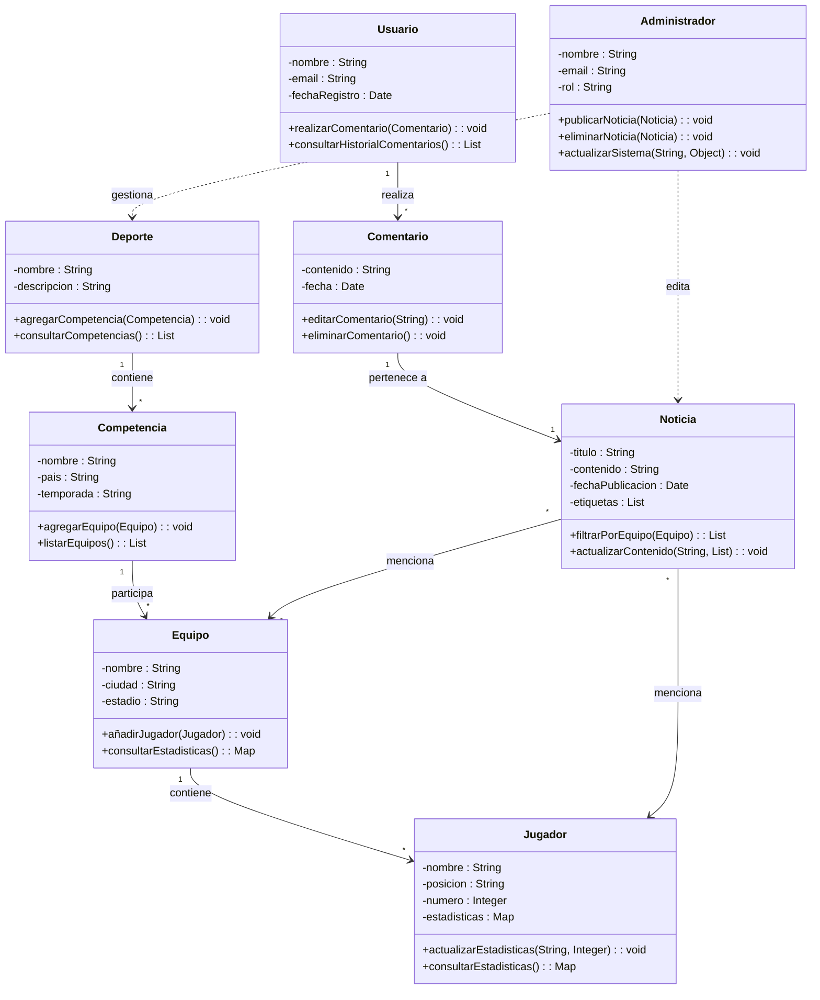

# Ejercicios de diagramas de clases

A continuación se plantean algunos ejercicios sobre la realización de diferentes diagramas de clases para realizar el diseño de diferentes sistemas informáticos.

## Web de deportes

## Red social

## Empresa de comidas

## Empresa de software

## Vuelos

## Accidentes geográficos

## Horario escolar

## Inmuebles

## Olimpiadas
