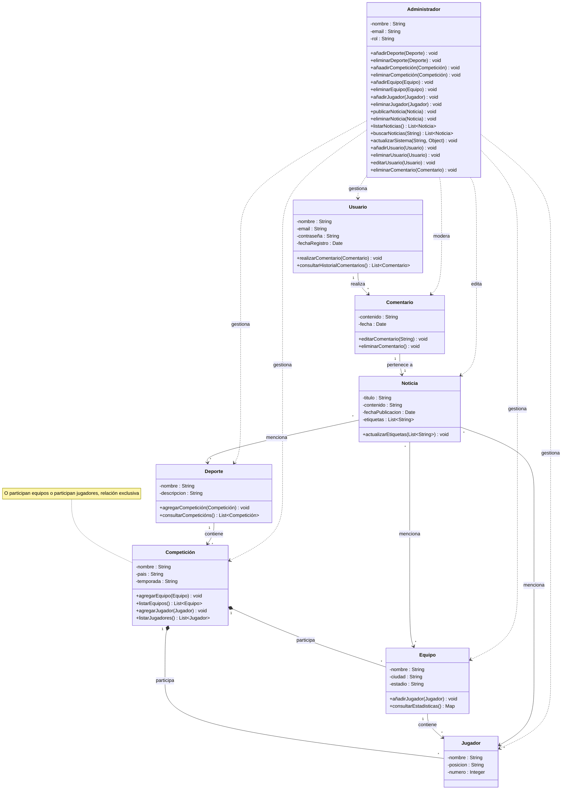
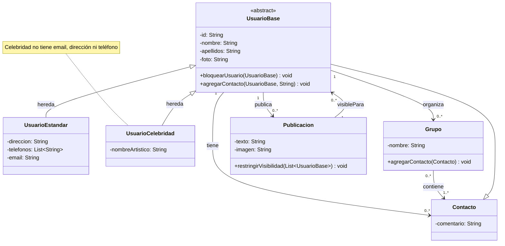
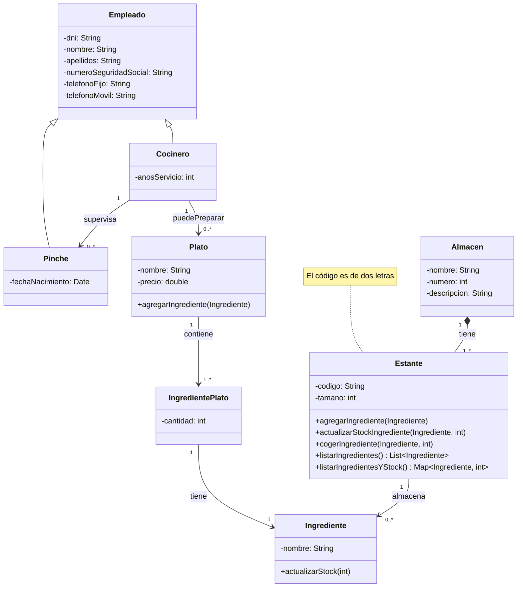
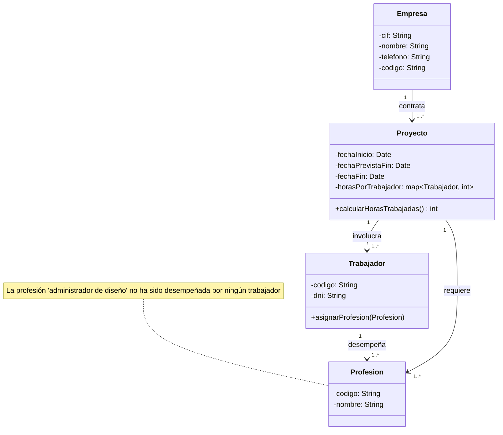
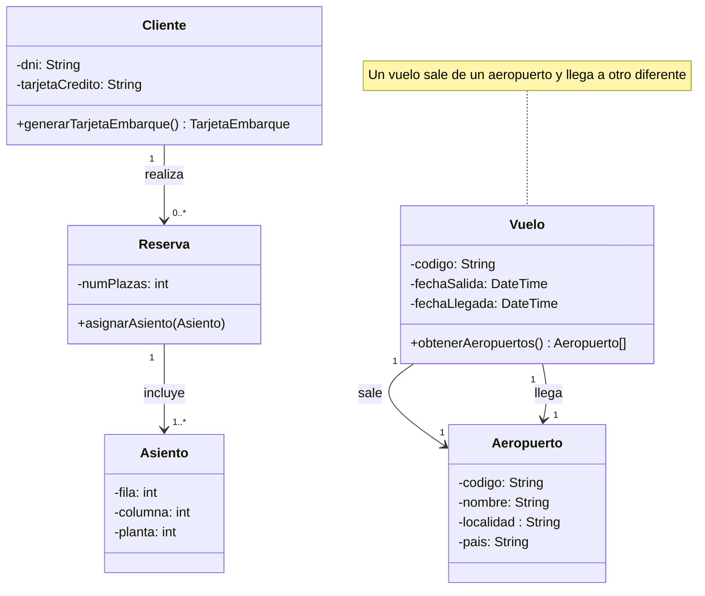

# Soluciones propuestas a los ejercicios de diagramas de clases

## Web de deportes

### 2. **Red Social**  

### 3. **Empresa de Comidas**  

### 4. **Empresa de Software**  

### 5. **Vuelos**

**PENDIENTE DE TERMINAR**

### 6. **Accidentes Geográficos**

### 7. **Horario Escolar**

### 8. **Inmuebles**

### 9. **Olimpiadas**
