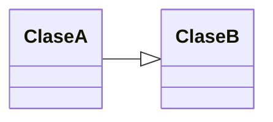

# Cuestionario: Programación Orientada a Objetos y Diagramas de Clases UML

## 1. ¿Cuál de las siguientes afirmaciones describe mejor la Programación Orientada a Objetos (POO)?

a. Un paradigma basado en funciones y procedimientos.
b. Un paradigma basado en entidades llamadas objetos que interactúan entre sí.
c. Un modelo que se basa exclusivamente en la herencia para organizar el código.
d. Una forma de escribir código sin usar estructuras de control.

## 2. ¿Cuál de los siguientes conceptos NO pertenece a la POO?

a. Herencia.
b. Recursividad.
c. Encapsulación.
d. Polimorfismo.

## 3. ¿Qué es una clase en POO?

a. Una plantilla o modelo a partir del cual se crean objetos.
b. Una instancia específica de un objeto.
c. Un conjunto de variables globales.
d. Un archivo de código fuente en Java.

## 4. ¿Cuál de las siguientes características define la encapsulación?

a. Permitir el acceso a todas las variables desde cualquier parte del programa.
b. Ocultar los detalles internos de una clase y controlar el acceso a sus datos.
c. Reutilizar el código a través de la herencia.
d. Modificar el comportamiento de un método en una subclase.

## 5. ¿Cómo se representa la herencia en UML?

a. Con una flecha con punta de triángulo vacío apuntando a la superclase.
b. Con una línea discontinua entre clases.
c. Con un rombo que conecta dos clases.
d. Con una flecha con punta de flecha rellena.

## 6. ¿Cuál de los siguientes elementos de una clase UML indica que un atributo es privado?

a. ` atributo`
b. `+ atributo`
c. `~ atributo`
d. `- atributo`

## 7. ¿Qué representa la relación de composición en UML?

a. Una relación en la que una clase puede existir sin la otra.
b. Una relación fuerte donde una clase contiene otra y su ciclo de vida depende de ella.
c. Una relación que indica que una clase implementa una interfaz.
d. Una relación en la que dos clases comparten métodos.

## 8. En UML, ¿cómo se representa una interfaz?

a. Con el estereotipo `<<interface>>` dentro de un rectángulo.
b. Con una flecha rellena apuntando a la interfaz.
c. Con un círculo y una línea que apunta a la clase.
d. Con un rombo negro entre la interfaz y la clase.

## 9. ¿Cuál de los siguientes modificadores de acceso en Java permite el acceso solo dentro del mismo paquete?

a. `public`
b. `private`
c. `package`
d. `protected`

## 10. ¿Cuál es la diferencia entre agregación y composición?

a. No hay diferencia, ambas son equivalentes.
b. La agregación indica una relación fuerte, y la composición una relación débil.
c. En la composición, la clase contenida no puede existir sin la clase contenedora, mientras que en la agregación sí.
d. La agregación es una forma de herencia, y la composición no.

## 11. ¿Qué representa el polimorfismo en POO?

a. La capacidad de un método para comportarse de manera diferente según el objeto que lo invoque.
b. La ocultación de detalles internos mediante encapsulación.
c. La conversión de una clase en otra mediante herencia.
d. La reutilización de código mediante herencia.

## 12. ¿Cómo se representa una relación de dependencia en UML?

a. Con una línea discontinua y una flecha apuntando a la clase dependida.
b. Con una flecha con triángulo vacío.
c. Con un rombo negro indicando una composición.
d. Con una flecha con triángulo relleno.

## 13. ¿Qué es una clase abstracta?

a. Una clase que solo contiene atributos pero no métodos.
b. Una clase que no puede instanciarse y puede contener métodos abstractos.
c. Una clase que puede instanciarse pero no heredar.
d. Una clase que no tiene constructores.

## 14. ¿Cómo se indica un método estático en UML?

a. Con un subrayado en el nombre del método.
b. Con la palabra `static` antes del nombre del método.
c. Con una flecha apuntando a la clase.
d. Con una línea discontinua.

## 15. ¿Cuál es la principal diferencia entre una interfaz y una clase abstracta?

a. Una interfaz solo define métodos sin implementación, mientras que una clase abstracta puede tener métodos implementados y abstractos.
b. Una interfaz puede instanciarse, pero una clase abstracta no.
c. Una clase abstracta no puede heredar de otra clase.
d. Una interfaz no puede ser implementada por más de una clase.

## 16. ¿Qué tipo de relación indica la siguiente notación UML? 

a. Asociación
b. Herencia
c. Agregación
d. Dependencia

## 17. ¿Cuál de estas afirmaciones sobre la sobrecarga de métodos es correcta?

a. La sobrecarga permite definir varios métodos con el mismo nombre pero con parámetros diferentes.
b. La sobrecarga permite modificar la implementación de un método en una subclase.
c. La sobrecarga permite heredar un método sin modificarlo.
d. La sobrecarga se usa solo en interfaces.

## 18. En UML, ¿cómo se representa la multiplicidad en una asociación?

a. Usando valores como `1`, `0..*`, `1..*` en los extremos de la relación.
b. Con una línea discontinua.
c. Con un triángulo vacío en un extremo de la línea.
d. No se puede representar la multiplicidad en UML.

## 19. ¿Cuál es una ventaja de utilizar diagramas de clases UML en el diseño de software?

a. Facilita la visualización de la estructura y relaciones entre clases.
b. Mejora la documentación y comunicación dentro del equipo.
c. Ayuda a identificar problemas de diseño antes de implementar el código.
d. Todas las anteriores.

## 20. ¿Qué tipo de relación debe usarse para modelar que una clase `Vehículo` tiene un atributo `Motor` que no puede existir por sí solo?

a. Asociación
b. Composición
c. Agregación
d. Herencia
