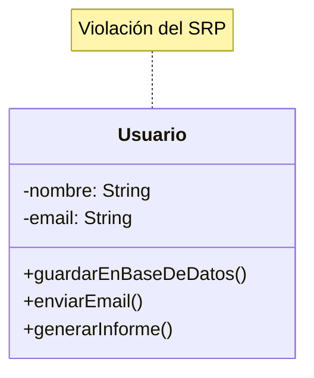
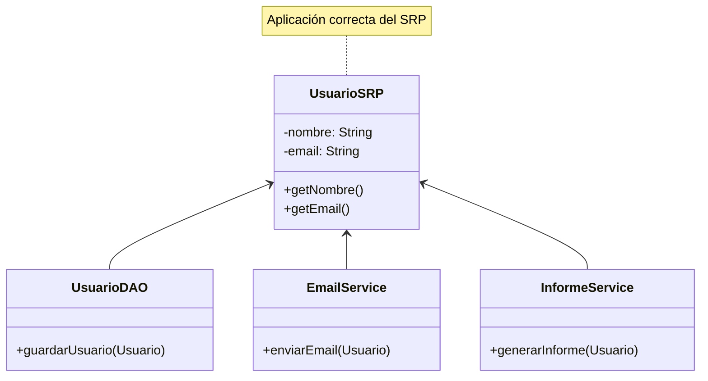
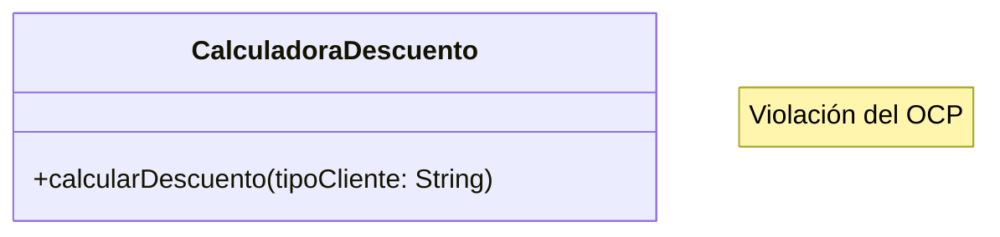
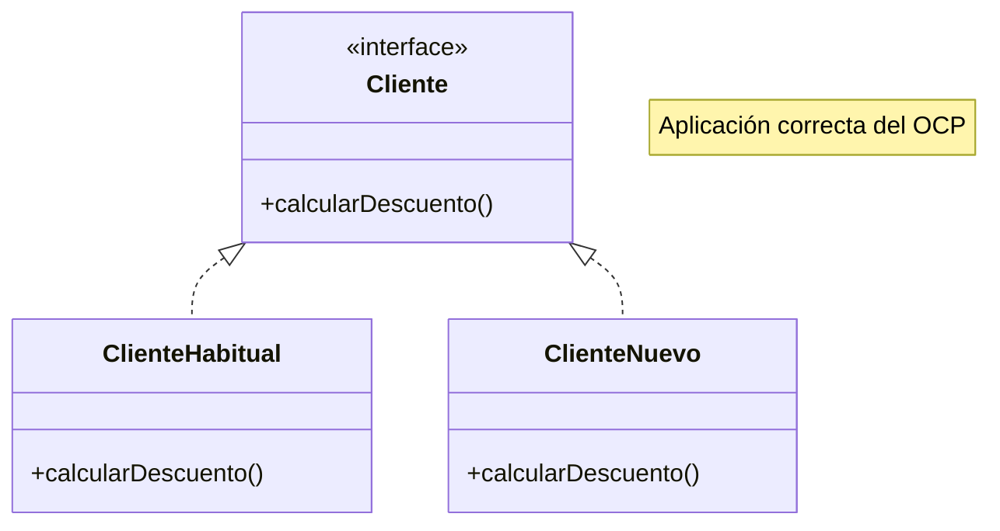
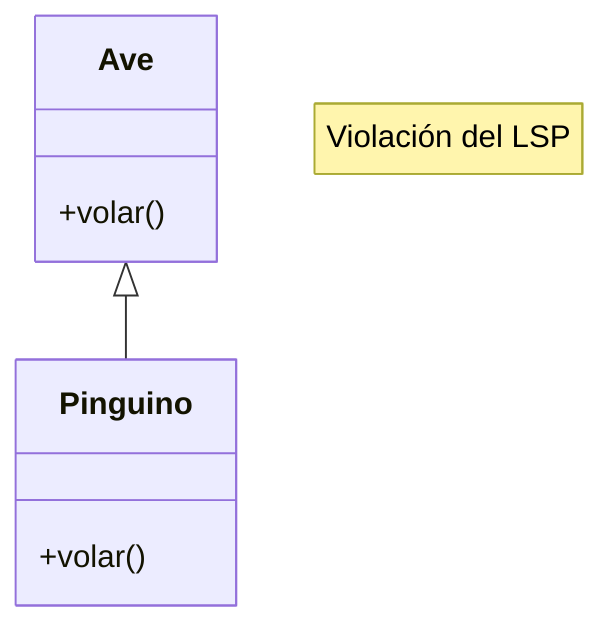
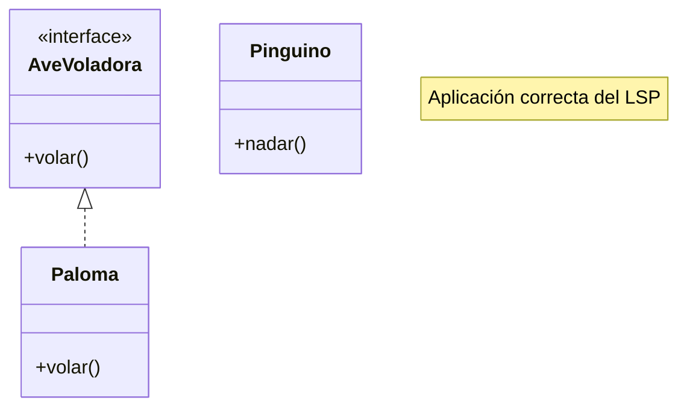
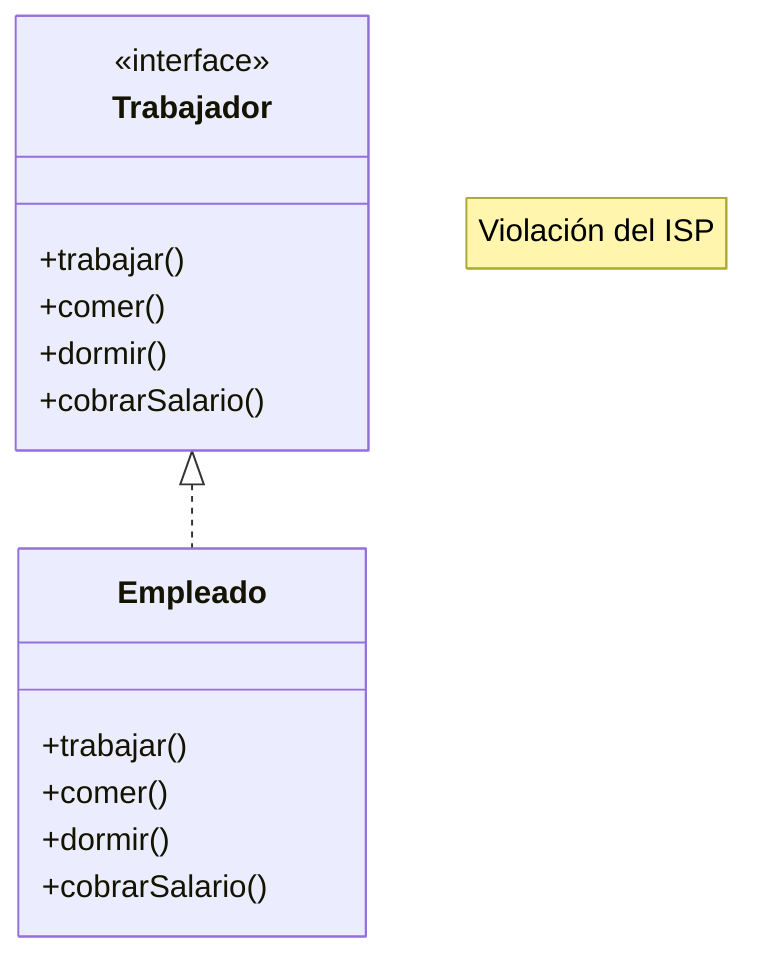
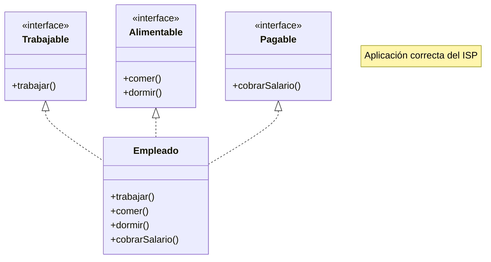
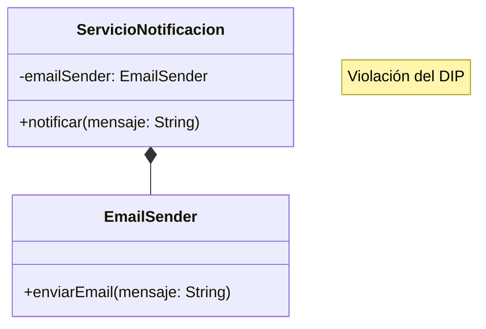
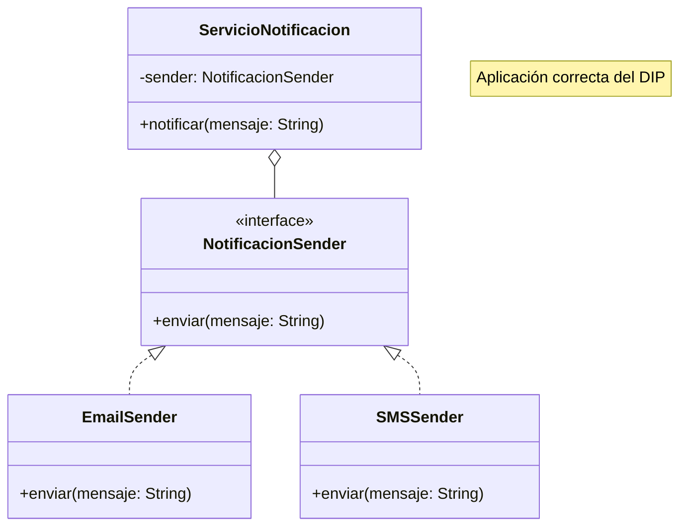

# Principios SOLID en Programación Orientada a Objetos

Los principios **SOLID** son **cinco principios fundamentales** de la programación orientada a objetos que ayudan a crear software más mantenible, flexible y escalable. Las siglas SOLID vienen de:
- S: *Single Responsibility Principle* (O Principio de Responsabilidad Única)
- O: *Open/Closed Principle* (o Principio de Abierto/Cerrado)
- L: *Liskov Substitution Principle* (o Principio de Sustitución de Liskov)
- I: *Interface Segregation Principle* (o Principio de Segregación de Interfaces)
- D: *Dependency Inversion Principle* (o Principio de Inversión de Dependencias)

## S - Principio de Responsabilidad Única (Single Responsibility Principle)

Una clase debe tener una única razón para cambiar, lo que significa que debe tener una sola responsabilidad o tarea.

### Ejemplo Incorrecto:



```java
class Usuario {
    private String nombre;
    private String email;
    
    public void guardarEnBaseDeDatos() { ... }
    public void enviarEmail() { ... }
    public void generarInforme() { ... }
}
```

### Ejemplo Correcto:



```java
class Usuario {
    private String nombre;
    private String email;
    
    public String getNombre() { return nombre; }
    public String getEmail() { return email; }
}

class UsuarioDAO {
    public void guardarUsuario(Usuario usuario) { ... }
}

class EmailService {
    public void enviarEmail(Usuario usuario) { ... }
}

class InformeService {
    public void generarInforme(Usuario usuario) { ... }
}
```

## O - Principio de Abierto/Cerrado (Open/Closed Principle)

Las entidades de software deben estar abiertas para la extensión pero cerradas para la modificación.

### Ejemplo Incorrecto:


```java
class CalculadoraDescuento {
    public double calcularDescuento(String tipoCliente) {
        if (tipoCliente.equals("HABITUAL")) {
            return 0.2;
        } else if (tipoCliente.equals("NUEVO")) {
            return 0.1;
        }
        return 0;
    }
}
```

### Ejemplo Correcto:


```java
interface Cliente {
    double calcularDescuento();
}

class ClienteHabitual implements Cliente {
    public double calcularDescuento() {
        return 0.2;
    }
}

class ClienteNuevo implements Cliente {
    public double calcularDescuento() {
        return 0.1;
    }
}
```

## L - Principio de Sustitución de Liskov (Liskov Substitution Principle)

Los objetos de una clase derivada deben poder sustituir a los objetos de la clase base sin alterar el comportamiento del programa.

### Ejemplo Incorrecto:



```java
class Ave {
    public void volar() { ... }
}

class Pinguino extends Ave {
    public void volar() {
        throw new UnsupportedOperationException(); // ¡Viola LSP!
    }
}
```

### Ejemplo Correcto:


```java
interface AveVoladora {
    void volar();
}

class Paloma implements AveVoladora {
    public void volar() { ... }
}

class Pinguino {
    public void nadar() { ... }
}
```

## I - Principio de Segregación de Interfaces (Interface Segregation Principle)

Los clientes no deberían verse forzados a depender de interfaces que no utilizan.

### Ejemplo Incorrecto:


```java
interface Trabajador {
    void trabajar();
    void comer();
    void dormir();
    void cobrarSalario();
}
```

### Ejemplo Correcto:


```java
interface Trabajable {
    void trabajar();
}

interface Alimentable {
    void comer();
    void dormir();
}

interface Pagable {
    void cobrarSalario();
}

class Empleado implements Trabajable, Alimentable, Pagable {
    public void trabajar() { ... }
    public void comer() { ... }
    public void dormir() { ... }
    public void cobrarSalario() { ... }
}
```

## D - Principio de Inversión de Dependencias (Dependency Inversion Principle)

Los módulos de alto nivel no deberían depender de módulos de bajo nivel. Ambos deberían depender de abstracciones.

### Ejemplo Incorrecto:



```java
class ServicioNotificacion {
    private EmailSender emailSender = new EmailSender();
    
    public void notificar(String mensaje) {
        emailSender.enviarEmail(mensaje);
    }
}
```

### Ejemplo Correcto:



```java
interface NotificacionSender {
    void enviar(String mensaje);
}

class EmailSender implements NotificacionSender {
    public void enviar(String mensaje) {
        // Enviar por email
    }
}

class SMSSender implements NotificacionSender {
    public void enviar(String mensaje) {
        // Enviar por SMS
    }
}

class ServicioNotificacion {
    private NotificacionSender sender;
    
    public ServicioNotificacion(NotificacionSender sender) {
        this.sender = sender;
    }
    
    public void notificar(String mensaje) {
        sender.enviar(mensaje);
    }
}
```

## Beneficios de aplicar SOLID

1. **Mantenibilidad**: El código es más fácil de mantener y modificar
2. **Escalabilidad**: Facilita la adición de nuevas funcionalidades
3. **Testeabilidad**: El código es más fácil de probar
4. **Reutilización**: Promueve la reutilización de código
5. **Flexibilidad**: El sistema es más adaptable a cambios

## Aplicación práctica

Para aplicar correctamente los principios SOLID, es recomendable:

1. Identificar las responsabilidades de cada clase
2. Usar interfaces para definir contratos
3. Mantener las clases y métodos pequeños y enfocados
4. Favorecer la composición sobre la herencia
5. Utilizar inyección de dependencias
6. Programar hacia interfaces, no implementaciones