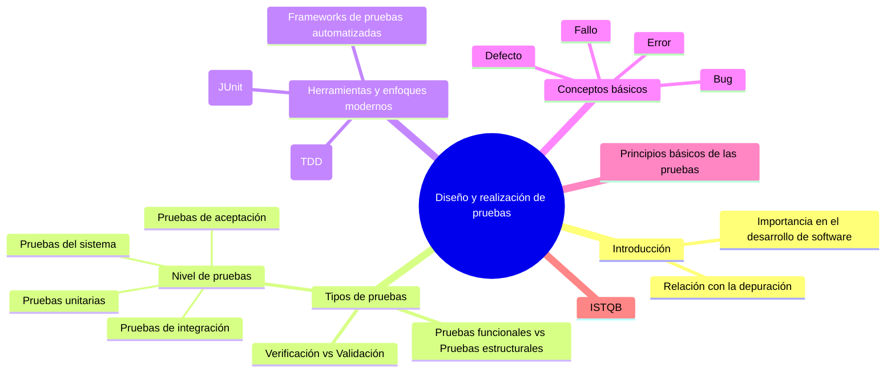

# Diseño y realización de pruebas

- [1. Introducción a las pruebas](#1-introducción-a-las-pruebas)
- [2. Importancia del diseño de pruebas en el desarrollo de software](#2-importancia-del-diseño-de-pruebas-en-el-desarrollo-de-software)
- [3. Relación entre pruebas y depuración](#3-relación-entre-pruebas-y-depuración)
- [4. Tipos de pruebas en el desarrollo de software](#4-tipos-de-pruebas-en-el-desarrollo-de-software)
- [5. Herramientas y enfoques modernos para la realización de pruebas](#5-herramientas-y-enfoques-modernos-para-la-realización-de-pruebas)
- [6. Conceptos básicos: error, defecto, fallo y bug](#6-conceptos-básicos-error-defecto-fallo-y-bug)
  - [6.1. Error](#61-error)
  - [6.2. Defecto](#62-defecto)
  - [6.3. Fallo](#63-fallo)
  - [6.4. Bug](#64-bug)
  - [6.5. Relación entre estos conceptos](#65-relación-entre-estos-conceptos)
- [7. Principios Básicos de las Pruebas de Software](#7-principios-básicos-de-las-pruebas-de-software)
- [8. Diferencia entre Aseguramiento de Calidad, Control de Calidad y Pruebas](#8-diferencia-entre-aseguramiento-de-calidad-control-de-calidad-y-pruebas)
  - [8.1. Diferencias Clave](#81-diferencias-clave)
- [9. ¿Qué es el ISTQB?](#9-qué-es-el-istqb)
  - [9.1. Objetivo Principal del ISTQB](#91-objetivo-principal-del-istqb)
  - [9.2. Esquema de Certificación](#92-esquema-de-certificación)
    - [9.2.1. Nivel Foundation](#921-nivel-foundation)
    - [9.2.2. Nivel Advanced](#922-nivel-advanced)
    - [9.2.3. Nivel Expert](#923-nivel-expert)
  - [9.3. Beneficios de la Certificación ISTQB](#93-beneficios-de-la-certificación-istqb)
  - [9.4. Relación del ISTQB con las Buenas Prácticas de Pruebas](#94-relación-del-istqb-con-las-buenas-prácticas-de-pruebas)
    - [9.4.1. Definición de un marco estructurado de pruebas](#941-definición-de-un-marco-estructurado-de-pruebas)
    - [9.4.2. Selección y diseño de casos de prueba efectivos](#942-selección-y-diseño-de-casos-de-prueba-efectivos)
    - [9.4.3. Adaptación a diferentes modelos de desarrollo](#943-adaptación-a-diferentes-modelos-de-desarrollo)
    - [9.4.4. Gestión de riesgos en las pruebas](#944-gestión-de-riesgos-en-las-pruebas)
    - [9.4.5. Promoción de la automatización y herramientas de soporte](#945-promoción-de-la-automatización-y-herramientas-de-soporte)
  - [9.5. Conclusión](#95-conclusión)
- [10. Recursos adicionales](#10-recursos-adicionales)

**Mapa mental de la sección:**

## 1. Introducción a las pruebas

El diseño y la realización de pruebas constituyen un pilar fundamental en el desarrollo de software. Este proceso no solo asegura que los programas cumplan con los requisitos funcionales establecidos, sino que también minimiza los defectos, mejora la calidad del producto final y garantiza la satisfacción del usuario.

En el contexto de lenguajes como Java, las pruebas unitarias y automáticas han ganado relevancia por su capacidad para detectar errores en etapas tempranas del ciclo de desarrollo. Estas pruebas proporcionan una manera estructurada de validar cada componente del software, permitiendo a los desarrolladores trabajar con mayor confianza y reducir costes asociados a fallos detectados en producción. Además, herramientas como JUnit han revolucionado la manera en que se implementan y ejecutan estas pruebas, estableciendo estándares claros y eficaces.

## 2. Importancia del diseño de pruebas en el desarrollo de software

El diseño de pruebas es un componente esencial dentro del ciclo de vida del desarrollo de software, ya que permite identificar errores y validar el comportamiento esperado de los programas. En un mundo donde las aplicaciones son cada vez más complejas y críticas, garantizar la calidad se ha convertido en una prioridad esencial.

Cuando un software falla, las consecuencias pueden variar desde una simple incomodidad para el usuario hasta pérdidas económicas significativas o incluso daños reputacionales para la empresa. Es aquí donde el diseño de pruebas demuestra su valor, ayudando a mitigar estos riesgos y a asegurar que el producto cumpla con los estándares de calidad exigidos.

Además, el diseño de pruebas fomenta buenas prácticas en la programación. Obliga a los desarrolladores a pensar en posibles escenarios y a considerar casos límite, lo que a su vez conduce a un código más robusto y mantenible. Al integrar este proceso desde las etapas iniciales, se reduce la probabilidad de que defectos importantes lleguen a fases avanzadas del desarrollo, donde solucionarlos puede resultar más costoso.

## 3. Relación entre pruebas y depuración

Aunque las pruebas y la depuración son actividades complementarias, cumplen objetivos diferentes en el desarrollo de software. Las pruebas se centran en identificar defectos, mientras que la depuración se encarga de localizar y corregir la causa de dichos defectos.

La **depuración** se beneficia enormemente de un buen diseño de pruebas, ya que estas últimas proporcionan información valiosa sobre los contextos en los que se producen los errores. Por ejemplo, cuando una prueba unitaria falla, el desarrollador sabe exactamente qué componente necesita ser examinado y ajustado.

Además, las pruebas repetitivas y automatizadas pueden servir como un indicador constante de la calidad del código a medida que este evoluciona. Esto fomenta un ciclo de retroalimentación positiva entre el diseño de pruebas y la depuración, resultando en un producto más estable y confiable.

## 4. Tipos de pruebas en el desarrollo de software

En el ámbito del desarrollo de software, existen diversos tipos de pruebas que se utilizan para verificar y validar diferentes aspectos del producto. Estas pruebas se clasifican en función de su enfoque, objetivo y nivel de detalle.

Por una parte, podemos distinguir el proceso de **verificación** del de **validación**. En general, todas las pruebas tratan de verificar y validar las aplicaciones, entendiendo estos términos como:

- La **verificación** es la comprobación de que un sistema o parte de un sistema, cumple con las condiciones impuestas. Con la verificación se comprueba si la aplicación se está construyendo correctamente, si cumple los requisitos técnicos.
- La **validación** es el proceso de evaluación del sistema o de uno de sus componentes, para determinar si satisface los requisitos especificados, desde el punto de vista del clinte. Respondeo a la pregunta de si se está construyendo la aplicación correcta.

Un enfoque común es diferenciar entre **pruebas funcionales** y **pruebas estructurales**. Las pruebas funcionales, también conocidas como **pruebas de caja negra**, se centran en evaluar el **comportamiento** del software desde la perspectiva del usuario, sin tener en cuenta su implementación interna. Por otro lado, las pruebas estructurales, o de **caja blanca**, examinan el código fuente para garantizar que todas las rutas posibles sean ejecutadas y que las estructuras internas funcionen correctamente.

Otro criterio importante es el nivel de las pruebas. Entre las más destacadas están:

- **Pruebas unitarias:** Validan el correcto funcionamiento de componentes individuales, como funciones o métodos.
- **Pruebas de integración:** Verifican que los módulos interactúen correctamente entre sí.
- **Pruebas del sistema:** Evalúan el comportamiento del sistema completo para asegurar que cumple con los requisitos especificados.
- **Pruebas de aceptación:** Confirman que el software satisface las necesidades del cliente y está listo para su despliegue.

Estos diferentes tipos de pruebas permiten abordar el desarrollo desde múltiples perspectivas, asegurando que el producto final sea robusto y fiable.

## 5. Herramientas y enfoques modernos para la realización de pruebas

En la actualidad, la automatización es clave para el éxito del diseño y la realización de pruebas. Herramientas como JUnit en Java facilitan la creación de pruebas unitarias mediante un conjunto de anotaciones y métodos predeterminados. Esto no solo acelera el proceso, sino que también promueve la estandarización y la reproducibilidad.

El enfoque moderno también incluye prácticas como el **desarrollo guiado por pruebas** (TDD, por sus siglas en inglés). En este paradigma, los desarrolladores escriben primero las pruebas para las funcionalidades deseadas antes de implementar el código. Esto garantiza que cada nuevo fragmento de código pase por un proceso de validación inmediato, reduciendo así el riesgo de introducir defectos.

Además, frameworks de pruebas automatizadas permiten ejecutar un gran número de casos de prueba en un tiempo reducido, lo que resulta especialmente útil en proyectos grandes y complejos. Estas herramientas pueden integrarse en sistemas de integración continua para realizar pruebas de manera regular y detectar problemas de forma temprana.

## 6. Conceptos básicos: error, defecto, fallo y bug

En el desarrollo de software, es fundamental comprender ciertos términos clave relacionados con la calidad del producto y los problemas que pueden surgir durante su ciclo de vida. Estos conceptos, aunque a menudo utilizados indistintamente, tienen significados específicos que es importante distinguir.

### 6.1. Error

Un error se produce cuando un desarrollador comete una equivocación o fallo en el proceso de escritura del código. Estos errores pueden surgir debido a malentendidos de los requisitos, descuidos en la implementación, falta de conocimiento técnico, o incluso errores tipográficos. En este contexto, el error no se manifiesta directamente en el software ejecutable, sino que es un defecto en la creación del código o del diseño.

Ejemplo: Un desarrollador interpreta mal un requerimiento y escribe una función que suma en lugar de multiplicar dos valores.

### 6.2. Defecto

Un defecto, también conocido como "defect" o "fault", es una anomalía o problema en el código o en el diseño del software que puede causar un comportamiento incorrecto. Los defectos suelen ser el resultado de errores cometidos durante el desarrollo. Aunque un defecto existe en el software, no siempre se traduce en un fallo visible para el usuario final.

Ejemplo: Una variable no inicializada en el código puede ser un defecto que, bajo ciertas condiciones, cause un comportamiento impredecible.

### 6.3. Fallo

Un fallo ocurre cuando un defecto en el software se activa durante la ejecución, resultando en un comportamiento incorrecto o inesperado. El fallo es el síntoma observable de un defecto, y puede afectar tanto a la funcionalidad del sistema como a su desempeño.

Ejemplo: Un sistema de reservas online no permite completar la compra debido a una consulta SQL mal escrita en el código.

### 6.4. Bug

El término bug es un sinónimo coloquial de defecto y se utiliza ampliamente en el ámbito del desarrollo de software para referirse a problemas o errores en el código. Aunque en su origen histórico el término se relacionó con un insecto real atrapado en un ordenador, hoy en día se aplica a cualquier anomalía detectada en el software.

### 6.5. Relación entre estos conceptos

La secuencia típica de un problema en el software comienza con un error en el desarrollo, que introduce un defecto en el código o diseño. Si este defecto se ejecuta en ciertas condiciones, puede generar un fallo visible para el usuario. Dichos fallos son comúnmente denominados bugs en el contexto práctico del desarrollo y mantenimiento de software.

## 7. Principios Básicos de las Pruebas de Software

Las pruebas de software son un proceso esencial en el desarrollo de sistemas, no solo para detectar defectos, sino también para garantizar que el producto cumpla con los requisitos y sea apto para su propósito. Según el **ISTQB (International Software Testing Qualifications Board)**, existen principios básicos que guían las buenas prácticas en las pruebas de software:

1. **Las pruebas muestran la presencia de defectos, no su ausencia.**  
   - El objetivo de las pruebas no es demostrar que el software no tiene fallos, sino identificar los defectos existentes.  
2. **Las pruebas exhaustivas son imposibles.**  
   - Probar todas las combinaciones de entradas y estados no es factible, especialmente en sistemas complejos. Por ello, se deben priorizar los casos de prueba basándose en riesgos y criticidad.  
3. **Las pruebas tempranas ahorran tiempo y dinero.**  
   - Detectar defectos en etapas tempranas del desarrollo es más económico y menos disruptivo que resolverlos en fases avanzadas o tras la entrega del producto.  
4. **La acumulación de defectos.**  
   - Los defectos tienden a concentrarse en módulos específicos del software. Este fenómeno, conocido como la regla 80/20, indica que el 80% de los fallos suelen encontrarse en el 20% del código.  
5. **La paradoja del pesticida.**  
   - Si se ejecutan las mismas pruebas repetidamente, estas dejarán de encontrar nuevos defectos. Por ello, es necesario actualizar y diversificar los casos de prueba.  
6. **Las pruebas dependen del contexto.**  
   - La estrategia de pruebas varía según el tipo de software. Por ejemplo, los sistemas críticos requieren pruebas más rigurosas que una aplicación de uso cotidiano.  
7. **La ausencia de defectos no implica calidad.**  
   - Un software puede estar libre de defectos y, aun así, no cumplir con las necesidades del usuario o no ser funcional en su entorno operativo.

Estos principios destacan la importancia de planificar y ejecutar pruebas de manera estratégica, utilizando metodologías y herramientas adaptadas al contexto del desarrollo.

## 8. Diferencia entre Aseguramiento de Calidad, Control de Calidad y Pruebas

En el desarrollo de software, los términos **aseguramiento de calidad (QA)**, **control de calidad (QC)** y **pruebas** suelen utilizarse de manera intercambiable, pero representan aspectos diferentes del proceso de gestión de calidad.

1. **Aseguramiento de Calidad (QA)**  
   - Se enfoca en los procesos.  
   - Su objetivo principal es garantizar que las prácticas utilizadas en el desarrollo y mantenimiento del software cumplan con estándares predefinidos.  
   - Incluye actividades como auditorías de procesos, revisiones y establecimiento de políticas de calidad.  
   - Por ejemplo, en un proyecto de software, el equipo de QA puede definir las normas para la gestión de requisitos o el control de versiones.  
2. **Control de Calidad (QC)**  
   - Se enfoca en los productos.  
   - Su objetivo es validar que el producto final cumple con las especificaciones y requisitos definidos.  
   - Incluye actividades como inspecciones, verificaciones y validaciones de los entregables.  
   - Por ejemplo, un equipo de QC podría realizar una revisión detallada del diseño antes de pasar a la etapa de implementación.  
3. **Pruebas de Software**  
   - Son una parte específica del control de calidad.  
   - Se centran en identificar defectos en el software mediante la ejecución de casos de prueba.  
   - Las pruebas evalúan tanto la funcionalidad como el rendimiento, detectando inconsistencias entre los resultados esperados y los obtenidos.

### 8.1. Diferencias Clave

| Aspecto | QA | QC | Pruebas |
| ----- | ----- | ----- | ----- |
| **Enfoque** | Procesos | Producto | Producto |
| **Objetivo** | Prevenir defectos | Identificar defectos | Identificar defectos específicos |
| **Ejemplo de Actividad** | Auditorías de proceso | Inspecciones de entregables | Ejecución de pruebas unitarias |

## 9. ¿Qué es el ISTQB?

El **ISTQB (International Software Testing Qualifications Board)** es una organización global sin ánimo de lucro que define y mantiene estándares en el ámbito de las pruebas de software. Fundado en 2002, el ISTQB tiene como misión fomentar la calidad en el desarrollo de software a través de un marco de certificación profesional en pruebas, ampliamente reconocido en todo el mundo.

### 9.1. Objetivo Principal del ISTQB

El ISTQB busca establecer un estándar internacional para las competencias, conocimientos y buenas prácticas en pruebas de software. Sus certificaciones están diseñadas para mejorar la profesionalización del testing, asegurando que los especialistas en pruebas tengan una base teórica sólida y habilidades prácticas adecuadas.

### 9.2. Esquema de Certificación

El esquema de certificación del ISTQB está estructurado en diferentes niveles y áreas de especialización:

#### 9.2.1. Nivel Foundation

- Introducción a los conceptos fundamentales de las pruebas de software.  
- Ideal para quienes comienzan su carrera en testing.  
- Cubre temas como el proceso de prueba, técnicas de diseño de pruebas y herramientas básicas.

#### 9.2.2. Nivel Advanced

- Diseñado para testers con experiencia que buscan profundizar en áreas específicas.  
- Tres certificaciones principales:  
  - **Test Manager**: Enfoque en la gestión de proyectos de prueba.  
  - **Test Analyst**: Técnicas avanzadas para diseñar y ejecutar pruebas.  
  - **Technical Test Analyst**: Aspectos técnicos y de automatización de pruebas.

#### 9.2.3. Nivel Expert

- Orientado a profesionales con amplio conocimiento y experiencia en testing.  
- Cubre temas como mejora de procesos de prueba y liderazgo en pruebas.

### 9.3. Beneficios de la Certificación ISTQB

1. **Reconocimiento internacional:** Las certificaciones ISTQB son reconocidas globalmente y demuestran competencias estandarizadas en pruebas de software.  
2. **Crecimiento profesional:** Ayudan a los testers a avanzar en sus carreras al proporcionar credenciales validadas.  
3. **Mejora de la calidad:** Promueve el uso de buenas prácticas que reducen defectos y mejoran la calidad del software.  
4. **Versatilidad:** Sus contenidos son aplicables a diversos contextos de desarrollo (ágil, cascada, etc.).

### 9.4. Relación del ISTQB con las Buenas Prácticas de Pruebas

El **ISTQB** no solo proporciona una certificación reconocida internacionalmente, sino que también promueve un conjunto de buenas prácticas que son esenciales para el diseño y ejecución de pruebas de software. Estas prácticas están alineadas con los principios fundamentales del testing y se aplican en diversos contextos de desarrollo. A continuación, se describen algunas de las conexiones más relevantes:

#### 9.4.1. Definición de un marco estructurado de pruebas

El ISTQB enfatiza la importancia de seguir un proceso estructurado en las pruebas de software. Este marco incluye etapas claras como la planificación, diseño, ejecución y evaluación de pruebas, garantizando un enfoque sistemático y repetible.

- **Impacto en las buenas prácticas:**
  - Ayuda a minimizar errores humanos en la planificación.  
  - Facilita la integración de las pruebas en el ciclo de vida del desarrollo.

#### 9.4.2. Selección y diseño de casos de prueba efectivos

El ISTQB introduce técnicas de diseño de pruebas como la partición de equivalencia, el análisis de valores límite, las tablas de decisión y las pruebas de transición de estados. Estas técnicas permiten optimizar los esfuerzos de prueba y mejorar la cobertura.

- **Impacto en las buenas prácticas:**  
  - Garantizan que se prueben las combinaciones más relevantes de entradas y condiciones.  
  - Reducen redundancias en los casos de prueba, mejorando la eficiencia.

#### 9.4.3. Adaptación a diferentes modelos de desarrollo

El ISTQB reconoce que no todas las metodologías de desarrollo requieren el mismo enfoque de pruebas. Por ejemplo:

- En **metodologías ágiles**, se prioriza la automatización y las pruebas continuas.  
- En **modelos en cascada**, las pruebas se planifican en etapas específicas.  
- **Impacto en las buenas prácticas:**  
  - Permite adaptar las estrategias de prueba según las necesidades del proyecto.  
  - Mejora la colaboración entre equipos de desarrollo y pruebas.

#### 9.4.4. Gestión de riesgos en las pruebas

El ISTQB destaca la importancia de evaluar riesgos técnicos y comerciales para priorizar las pruebas.

- **Impacto en las buenas prácticas:**  
  - En proyectos críticos, como sistemas financieros o médicos, se garantiza que las pruebas se enfoquen en componentes de mayor riesgo.  
  - Optimiza el uso de recursos al dirigir los esfuerzos hacia las áreas más vulnerables.

#### 9.4.5. Promoción de la automatización y herramientas de soporte

El ISTQB identifica la automatización como una herramienta clave para mejorar la eficiencia y consistencia en las pruebas. También enfatiza el uso de herramientas de gestión de pruebas, seguimiento de defectos y análisis de cobertura.

- **Impacto en las buenas prácticas:**  
  - Incrementa la velocidad y la frecuencia de ejecución de pruebas.  
  - Reduce el esfuerzo manual en tareas repetitivas, permitiendo a los testers concentrarse en análisis más complejos.

### 9.5. Conclusión

El ISTQB actúa como un puente entre la teoría y la práctica, proporcionando un marco estándar que se puede aplicar en proyectos reales. Sus principios y técnicas garantizan no solo la calidad del producto, sino también la eficiencia y sostenibilidad del proceso de pruebas. Adoptar las recomendaciones del ISTQB es una forma de asegurar que las pruebas sean un componente estratégico en el desarrollo de software.

## 10. Recursos adicionales

Si te interesa profundizar o aclarar dudas sobre todos los conceptos relacionados con el diseño y ejecución de pruebas que revisaremos a lo largo de este tema, te recomiendo revisar esta [lista de reproducción](https://youtube.com/playlist?list=PL2TAY4y5YTPX7Vi8UuOMCOLe0b47T4qHe&si=sCk3dvG5JHwkXWvk) de Youtube, de la cuenta Full Advanced.

Especialmente interesantes son los episodios 10, 11, 12, 14 o 15.
