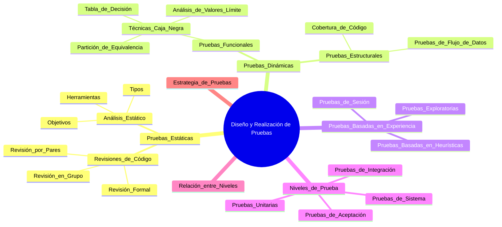
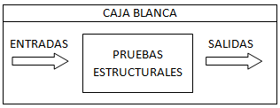

# Diseño y realización de pruebas

- [1. Tipos de Pruebas en el Desarrollo de Software](#1-tipos-de-pruebas-en-el-desarrollo-de-software)
  - [1.1. Pruebas estáticas](#11-pruebas-estáticas)
    - [1.1.1. Revisiones de código](#111-revisiones-de-código)
    - [1.1.2. Análisis estático](#112-análisis-estático)
  - [1.2. Pruebas dinámicas](#12-pruebas-dinámicas)
    - [1.2.1. Pruebas Funcionales](#121-pruebas-funcionales)
    - [1.2.2. Pruebas Estructurales](#122-pruebas-estructurales)
  - [1.3. Pruebas Basadas en Experiencia](#13-pruebas-basadas-en-experiencia)
    - [1.3.1. Técnicas de Pruebas Basadas en Experiencia](#131-técnicas-de-pruebas-basadas-en-experiencia)
    - [1.3.2. Casos Prácticos](#132-casos-prácticos)
- [2. Relación entre Tipos y Niveles de Prueba](#2-relación-entre-tipos-y-niveles-de-prueba)
  - [2.1. Niveles de Pruebas](#21-niveles-de-pruebas)
    - [2.1.1. Pruebas Unitarias](#211-pruebas-unitarias)
    - [2.1.2. Pruebas de Integración](#212-pruebas-de-integración)
    - [2.1.3. Pruebas de Sistema](#213-pruebas-de-sistema)
    - [2.1.4. Pruebas de Aceptación](#214-pruebas-de-aceptación)
  - [2.2. Relación entre Niveles de Prueba](#22-relación-entre-niveles-de-prueba)
  - [2.3. Importancia de una Estrategia de Pruebas por Niveles](#23-importancia-de-una-estrategia-de-pruebas-por-niveles)

**Mapa mental de esta sección**:



## 1. Tipos de Pruebas en el Desarrollo de Software

La calidad de un sistema de software no puede garantizarse sin la aplicación de diferentes tipos de pruebas. Estas pruebas no solo se realizan para detectar defectos, sino también para verificar que el sistema cumple con los requisitos funcionales y no funcionales establecidos. Además, ayudan a garantizar que el software sea confiable, eficiente y cumpla con las expectativas del cliente.

Estas pruebas pueden clasificarse en dos categorías principales: pruebas **estáticas** y pruebas **dinámicas**, cada una con enfoques y objetivos específicos.

Las **pruebas estáticas** se centran en la evaluación de los artefactos de software, como el código fuente, la documentación y los diagramas, sin necesidad de ejecutar el sistema. Este enfoque permite detectar defectos en etapas tempranas del desarrollo, lo que resulta más eficiente y menos costoso que corregir problemas detectados en fases avanzadas. Las revisiones de código, los análisis estáticos y las auditorías de documentación son ejemplos de pruebas estáticas.

Por otro lado, las **pruebas dinámicas** implican la ejecución del sistema para validar su comportamiento y funcionalidad. Este tipo de pruebas evalúa cómo se comporta el software en diferentes escenarios, asegurando que las entradas generan las salidas esperadas y que el sistema responde adecuadamente a situaciones imprevistas. Las pruebas dinámicas incluyen enfoques como las pruebas de caja blanca, que analizan la estructura interna del código, y las pruebas de caja negra, que se basan en las especificaciones funcionales sin considerar cómo está implementado el sistema.

La combinación de ambos enfoques es fundamental para garantizar una cobertura completa del proceso de pruebas. Mientras que las **pruebas estáticas ayudan a prevenir defectos** antes de que el sistema esté operativo, las **pruebas dinámicas validan que el software funcione** correctamente bajo condiciones reales de uso. Este equilibrio entre prevención y validación es la base de una estrategia de pruebas sólida.

El diseño de **casos de prueba** es un aspecto esencial dentro de este proceso. Un caso de prueba se define como un conjunto de entradas, condiciones de ejecución y resultados esperados, desarrollado para verificar el cumplimiento de un objetivo o condición específica de prueba.

### 1.1. Pruebas estáticas

Las pruebas estáticas se realizan **sin ejecutar el código** y se centran en la **revisión y análisis** de los artefactos de software. Estas pruebas permiten detectar defectos en etapas tempranas del desarrollo, lo que resulta más eficiente y menos costoso que corregir problemas detectados en fases avanzadas. Entre las pruebas estáticas más comunes se incluyen:

- **Revisiones de código**: Análisis manual del código fuente para identificar errores, inconsistencias o malas prácticas.
- **Análisis estático**: Herramientas automatizadas que examinan el código en busca de posibles defectos, como errores de sintaxis, variables no utilizadas o vulnerabilidades de seguridad.
- **Auditorías de documentación**: Revisión de la documentación del software para garantizar que esté actualizada, completa y coherente con los requisitos.
- **Inspecciones de diseño**: Evaluación de los diagramas y modelos del sistema para verificar que cumplan con las especificaciones y estándares establecidos.

Estas pruebas permiten identificar problemas en el software antes de que se ejecuten, lo que facilita su corrección y mejora la calidad del producto final. Además, fomentan la colaboración y el aprendizaje entre los miembros del equipo, lo que contribuye a la mejora continua del proceso de desarrollo.

#### 1.1.1. Revisiones de código

Las revisiones de código son una técnica de revisión manual que se utiliza para **identificar defectos en el código fuente**. Este proceso implica la **inspección** del código por parte de otros miembros del equipo, con el objetivo de **mejorar la calidad** y **detectar posibles errores** antes de que el software sea implementado.

Las revisiones de código pueden realizarse de diferentes maneras, como **revisión por pares**, **revisión en grupo** o **revisión formal**. En cada caso, se siguen **procedimientos específicos** para garantizar que se cubran todos los aspectos relevantes del código y se identifiquen posibles problemas.

En la revisión por pares, un **revisor** examina el código de otro miembro del equipo, identificando posibles errores y proporcionando **comentarios** y **sugerencias** para mejorar la calidad del código. Este enfoque fomenta la **colaboración** y el **aprendizaje** entre los miembros del equipo, lo que contribuye a la **mejora continua** del proceso de desarrollo.

En la revisión en grupo, varios miembros del equipo se reúnen para **analizar** y **discutir** el código fuente, identificando posibles problemas y proponiendo soluciones. Este enfoque permite **compartir conocimientos** y **experiencias**, lo que puede llevar a la **detección temprana** de errores y a la **mejora de la calidad** del software.

En las revisiones de código pueden (y deben) existir diferentes roles (no todos estarán preesentes, dependiendo del nivel de formalidad):

- **Autor** del producto bajo revisión
- **Escriba**, quien toma nota de lo discutido
- **Revisores** que ejecutan las revisiones en si mismas
- **Lider**, que es el responsable de la revisión
- **Facilitador**, quien modera la reunión
- **Director**, quien planifica y controla.

En las **revisiones de código**, hay diferentes tipos de revisión dependiendo del nivel de formalidad de la misma:

- **Informal**: No tiene un proceso formal documentado, no es necesaria una reunión de revisión, puede ser realizado entre colegas. El uso de listas de comprobación o Checklist es opcional.
- **Guiada** | Walkthrough: Dirigida por el autor del producto de trabajo, el escriba es obligatorio. El uso de listas de comprobación, y la preparación individual previa es opcional.
- **Técnica**: Se realiza entre pares técnicos del autor, si hay una reunión debe haber una preparación individual previa. Debe haber un facilitador y escriba obligatoriamente, quien idealmente no será el autor.
- **Inspecciones**: Los resultados se documentan formalmente. Requiere preparación individual, tiene roles definidos: autor, director, facilitador, escriba, revisores y líder de revisión, puede incluir también un lector dedicado. El autor, no puede actuar como facilitador, líder de revisión, lector o escriba. Se hace uso de listas de comprobación.

En el proceso de revisión, debe haber diferentees actividades claramente diferenciadas:

1. Planificación: definir el alcance, establecer objetivos, roles, tiempo y plazos
2. Inicio de la revisión: distribuir el material e instruir a los participantes
3. Revisión Individual del material y tomar notas de los defectos encontrados
4. Analizar y comunicar defectos a los responsables
5. Corregir e informar, elaborar informes de hallazgos, recopilar metricas, comprobar criterios de salida

#### 1.1.2. Análisis estático

El análisis estático es una técnica automatizada que se utiliza para **identificar posibles defectos en el código fuente** sin necesidad de ejecutar el programa. Este enfoque permite **detectar errores** de manera temprana y **mejorar la calidad** del software antes de que se implemente.

Existen diferentes herramientas de análisis estático que pueden utilizarse para examinar el código en busca de posibles problemas, como **errores de sintaxis**, **variables no utilizadas** o **vulnerabilidades de seguridad**. Estas herramientas proporcionan informes detallados sobre los problemas detectados, lo que facilita su corrección y mejora la calidad del código.

##### Objetivos del Análisis Estático

El análisis estático de código tiene varios objetivos clave que lo convierten en una técnica esencial para garantizar la calidad del software:

- **Detección temprana de errores**: Identificar problemas en el código antes de que se ejecute, lo que reduce costos y tiempo de corrección.
- **Mejora de la calidad del código**: Asegurar que el código sea limpio, mantenible y eficiente.
- **Cumplimiento de estándares**: Verificar que el código siga las normas y convenciones definidas por el equipo o el lenguaje.
- **Identificación de vulnerabilidades de seguridad**: Detectar posibles riesgos de seguridad, como inyecciones SQL o uso de funciones inseguras.
- **Optimización del rendimiento**: Encontrar áreas del código que puedan afectar el rendimiento, como bucles innecesarios o variables no utilizadas.
- **Facilitar la colaboración**: Asegurar que el código sea consistente y legible, lo que es crucial en proyectos con múltiples desarrolladores.

##### Tipos de Análisis Estático

El análisis estático de código puede clasificarse en varios tipos, dependiendo del enfoque y los aspectos que se evalúen:

1. **Análisis sintáctico**:
   - Verifica que el código cumpla con la sintaxis del lenguaje de programación.
   - Ejemplo: Detectar si falta un punto y coma en un lenguaje como JavaScript o un paréntesis sin cerrar.
   - En los lenguajes compilados, este análisis lo realiza el compilador (aunque los IDEs pueden integrar herramientas que lo hagan en tiempo real sin necesidad de compilar el proyecto).

2. **Análisis semántico**:
   - Evalúa la lógica del código y su correcta ejecución.
   - Ejemplo: Detectar si una variable se usa antes de ser inicializada o si hay tipos de datos incompatibles.

3. **Análisis de flujo de datos**:
   - Examina cómo se mueven los datos a través del código.
   - Ejemplo: Identificar variables no utilizadas, fugas de memoria o posibles valores nulos.

4. **Análisis de seguridad**:
   - Busca vulnerabilidades que puedan ser explotadas en tiempo de ejecución.
   - Ejemplo: Detectar inyecciones SQL, vulnerabilidades XSS o uso de funciones obsoletas.

5. **Análisis de cumplimiento de normas**:
   - Verifica que el código siga las convenciones y estándares definidos.
   - Ejemplo: Asegurar que los nombres de variables sigan `snake_case` o que la indentación sea consistente.

6. **Análisis de complejidad**:
   - Evalúa la complejidad del código, como la complejidad ciclomática.
   - Ejemplo: Identificar funciones con demasiadas ramificaciones o bucles anidados.

La mayoría de IDEs modernos incluyen herramientas de análisis estático que proporcionan sugerencias y advertencias en tiempo real, lo que facilita la corrección de errores y mejora la calidad del código. Por ejemplo, en Intellij IDEA, el inspector de código muestra advertencias y errores en el código fuente, permitiendo al desarrollador corregirlos de manera inmediata. También indica códigos inalcanzables, variables no utilizadas, sugerencias de refactorización... Esto lo hace mediante subrayados de diferentes colores.

En Visual Studio Code, mediante las extensiones, podemos añadir funcionalidades de análisis estático, como ESLint para JavaScript, Pylint para Python o Checkstyle para Java.

##### 3. Herramientas de Análisis Estático

Existen numerosas herramientas que automatizan el análisis estático de código, tanto comerciales como de código abierto. Estas herramientas pueden variar según el lenguaje de programación y las funcionalidades que ofrecen:

1. **Herramientas populares**:
   - **SonarQube**: Soporta múltiples lenguajes y ofrece análisis de calidad, seguridad y cumplimiento de normas.
   - **ESLint**: Ampliamente usado en JavaScript para verificar convenciones de codificación y detectar errores.
   - **Pylint**: Específico para Python, verifica el cumplimiento de PEP 8 y otras normas.
   - **Checkstyle**: Enfocado en Java, verifica convenciones de codificación y buenas prácticas.
   - **Checkmarx**: Herramienta de seguridad que detecta vulnerabilidades en el código.

2. **Funcionalidades comunes**:
   - **Detección de código duplicado**: Identifica fragmentos de código repetidos que pueden simplificarse.
   - **Verificación de estándares**: Asegura que el código siga las convenciones definidas.
   - **Identificación de vulnerabilidades**: Detecta riesgos de seguridad como inyecciones SQL o XSS.
   - **Análisis de complejidad**: Mide la complejidad ciclomática y sugiere refactorizaciones.
   - **Integración con CI/CD**: Permite incorporar el análisis estático en pipelines de integración continua. Esto permite garantizar que el código cumple con los estándares de calidad antes de ser desplegado; la propia herramienta no te permite integrar tu código si no cumple con los estándares definidos.

##### Ejemplo práctico: inspector de código de Intellij IDEA

A continuación se propone un extracto de código con diferentes problemas. Copia y pega el código en tu IDE y observa los errores y advertencias que muestra el inspector de código. Corrige los problemas detectados siguiendo las sugerencias proporcionadas por la herramienta.

```java
public class EjemploInspeccion {

    public static void main(String[] args) {
        int x = 10;
        int y = 0;
        int z = x / y; // 1. División por cero (error en tiempo de ejecución)

        String texto = "Hola";
        System.out.println(texto.charAt(10)); // 2. Acceso fuera de límites (error en tiempo de ejecución)

        String nombre = null;
        if (nombre.equals("Juan")) { // 3. Posible NullPointerException
            System.out.println("Hola, Juan");
        }

        int numero = 5;
        if (numero = 10) { // 4. Asignación en lugar de comparación (error lógico)
            System.out.println("Número es 10");
        }

        for (int i = 0; i < 10; i++); // 5. Punto y coma innecesario (bucle vacío)
        {
            System.out.println("Iteración: " + i);
        }

        int[] numeros = {1, 2, 3};
        for (int i = 0; i <= numeros.length; i++) { // 6. Acceso fuera de límites del array
            System.out.println(numeros[i]);
        }

        String mensaje = "Hola";
        if (mensaje == "Hola") { // 7. Comparación de strings con == en lugar de equals()
            System.out.println("Mensaje es Hola");
        }

        int a = 10;
        int b = 20;
        int resultado = a + b; // 8. Variable 'resultado' no utilizada (advertencia)

        return;

        int inalcanzable = 10; // 9. Código inalcanzable (advertencia)
    }
}
```

##### Coding rules

El análisis de las normas de codificación (como coding rules y naming conventions) es parte del análisis estático de código, ya que es una de las funciones principales de las herramientas de análisis estático. Estas normas son reglas predefinidas que se aplican al código fuente para garantizar su calidad, consistencia y mantenibilidad, y las herramientas de análisis estático las verifican automáticamente.

Las normas de codificación (*coding rules*) son un conjunto de reglas y convenciones que definen cómo debe escribirse el código. Incluyen aspectos como:

- **Naming conventions**: Convenciones para nombrar variables, funciones, clases, etc. (por ejemplo, camelCase, snake_case, o PascalCase).
- **Coding rules**: Reglas sobre la estructura del código, como el uso de llaves, indentación, longitud de líneas, etc.

Estas normas son fundamentales para mantener un código legible, consistente y fácil de mantener, especialmente en proyectos colaborativos.

En el caso de Intellij IDEA, podemos integrar reglas de codificación personalizadas o utilizar las reglas predefinidas por la herramienta.

Puedes seguir las instrucciones definidas en [este anexo](/UD5_diseno_realizacion_pruebas/apuntes/UD5_anexo_configuracion_analisis_estatico_intellij.md).

### 1.2. Pruebas dinámicas

#### 1.2.1. Pruebas Funcionales

Las pruebas funcionales se centran en comprobar que el software cumple con las **especificaciones funcionales** definidas en los requisitos. Estas pruebas evalúan el sistema desde la perspectiva del usuario, simulando diferentes escenarios de uso para validar que las **entradas producen las salidas esperadas**. Es decir, intentan responder preguntas como: "¿Puede el usuario realizar esta acción?" o "¿Funciona esta funcionalidad como se esperaba?".

Entre las pruebas funcionales más comunes se incluyen:

- **Pruebas de regresión**: Garantizan que los cambios o actualizaciones en el software no introduzcan nuevos defectos en las funcionalidades existentes.  
- **Pruebas de aceptación**: Validan que el sistema cumple con los requisitos del cliente y está listo para ser entregado o implementado.  
- **Pruebas de interfaz**: Verifican que las interacciones entre diferentes sistemas, módulos o componentes se realicen correctamente.

Los errores que suelen detectarse mediante pruebas funcionales incluyen:

- Funcionalidades incorrectas o ausentes.  
- Fallos en las interfaces.  
- Errores en estructuras de datos o en el acceso a bases de datos.  
- Problemas de rendimiento.  
- Fallos relacionados con la inicialización o finalización de procesos.

Este enfoque no considera cómo está implementado el sistema internamente, lo que clasifica a las pruebas funcionales dentro de las **pruebas de caja negra**.

##### Técnicas de pruebas de caja negra

Las pruebas de caja negra se basan en la **especificación** del software, sin tener en cuenta cómo está implementado internamente. Estas pruebas se centran en **verificar que el sistema cumple con los requisitos** y **funciona correctamente** desde la perspectiva del usuario. Algunas técnicas comunes de pruebas de caja negra son:

- **Partición de equivalencia**: Divide el conjunto de entradas en grupos que se comportan de manera similar, seleccionando un valor representativo por grupo.
- **Análisis de valores límite**: Evalúa los valores límite de los rangos de entrada, donde suelen concentrarse los errores.
- **Tabla de decisión**: Define las condiciones y acciones de un sistema en una tabla, permitiendo probar todas las combinaciones posibles.
- **Pruebas de estado**: Verifican el comportamiento del sistema en diferentes estados o condiciones.

##### Partición de equivalencia

La partición de equivalencia es una técnica de diseño de pruebas que divide el conjunto de entradas en grupos o clases que se comportan de manera similar. El objetivo de esta técnica es **reducir el número de casos de prueba** necesarios para cubrir todas las posibles situaciones, seleccionando un valor representativo por clase. Puede aplicar en cualquier nivel de pruebas (unitarias, integración, sistema, aceptación).

A continuación se presenta un escenario como ejemplo: *En un sistema electoral tenemos la variable “Edad para votar”, hay personas mayores de edad y menores de edad, todas las personas dentro de cada grupo sin importar los años que tengan, serán tratados de la misma forma en un proceso electoral.*

Para aplicar la partición de equivalencia, se siguen los siguientes pasos:

- **Identificar las clases de equivalencia**: Definir los grupos de entradas que se comportan de manera similar. En el ejemplo anterior, las clases de equivalencia serían “Menores de edad” y “Mayores de edad”.
- **Seleccionar un valor representativo por clase**: Elegir un valor dentro de cada clase que sea representativo de todos los valores de esa clase. Por ejemplo, para la clase “Menores de edad”, se podría seleccionar un valor como 15 años. Para la clase “Mayores de edad”, se podría seleccionar un valor como 25 años.
- **Diseñar casos de prueba**: Crear casos de prueba que cubran los valores representativos de cada clase de equivalencia. En el ejemplo, se podrían diseñar casos de prueba con edades de 15 y 25 años para verificar que el sistema maneje correctamente a los menores y mayores de edad.

**Ejemplo resuelto**: se va a realizar una entrada de datos de un empleado por pantalla, donde se definen 3 campos de entrada y una lista para elegir un oficio. La aplicación acepta los campos de esta manera:

- Empleado: número de 3 dígitos que no empiece por 0.
- Departamento: en blanco, o número de 2 dígitos.
- Oficio: Analista, Diseñador, Programador, o Elige oficio.

Si la entrada es correcta el programa asigna un salario, que se muestra por pantalla, a cada empleado segun estas normas:

- S1: si oficio es Analista, se asigna 2500.
- S2: si oficio es Diseñador, se asigna 2000.
- S3: si oficio es Programador, se asigna 1800.

Si la entrada no es correcta, el programa muestra un mensaje indicando la entrada incorrecta:

- ER1 si el Empleado no es correcto
- ER2 si el Departamento no es correcto
- ER3 si no ha escogido Oficio

Para representar las clases de equivalencia par cada condicion de entrada, podemos emplear una tabla:

| Condición de entrada | Clase de equivalencia | Clases válidas | COD | Clases no válidas | COD |
|-----------------------|-----------------------|----------------|-----|-------------------|-----|
| Empleado              | Rango (Número de 3 dígitos)    | 100-999        | V1  | <100        | NV1  |
| Empleado              |     |      || >999         | NV2  |
| Departamento          | Lógica (presente o ausente)   | En blanco          | V2  | No es un número        | NV3  |
| Departamento          | Rango (Número de 2 dígitos)    | 00-99          | V3  | <00        | NV4  |
| Oficio                | Miembro de un conjunto  | Elige "programador"   | V4  | Elige "Elige oficio" | NV5  |
| Oficio                | Miembro de un conjunto  | Elige "Diseñador"   | V5  | Elige "Elige oficio" | NV5  |
|...|...|...|...|...|...|

A partir de esta tabla, se pueden diseñar casos de prueba para cubrir todas las clases de equivalencia, como por ejemplo:

| Caso de prueba | Clase de equivalencia | Condiciones de entrada | Resultado esperado |
|----------------|-----------------------|------------------------|--------------------|
| CP1 | V1, V3, V4 | Empleado = 500, Departamento = 10, Oficio = Programador | S3 |
| CP2 | V1, V2, V5 | Empleado = 500, Departamento = , Oficio = Diseñdaor | S2 |
| CP3 | NV1, V2, V4 | Empleado = 50, Departamento = , Oficio = Programador | ER1 |
| CP4 | V1, NV3, V4 | Empleado = 500, Departamento = hola, Oficio = Programador | ER2 |
| CP5 | V1, V3, NV5 | Empleado = 500, Departamento = 10, Oficio = Elige oficio | ER3 |
| ... | ... | ... | ... |

Al rellenar la tabla de casos de prueba, se han tenido en cuenta 2 reglas: los casos de prueba válidos cubren tantas clases de equivalencia como sea posible, y los casos de prueba no válidos cubren una sola clase no válida (si se prueban más de una clase no válida en un caso de prueba, no se puede determinar cuál es la causa del fallo, o alguna de ellas nunca se llegue a ejecutar porque la primera enmascare a las demás).

##### Análisis de valores límite

El análisis de valores límite o frontera es una técnica de diseño de pruebas que se centra en los **valores límite** de los rangos de entrada, donde suelen concentrarse los errores. Esta técnica permite **identificar problemas** relacionados con los límites de los rangos y **verificar que el sistema** maneje correctamente estos valores extremos. Existen dos técnicas: análisis de valores de 2 puntos y análisis de valores de 3 puntos.

Al usar la técnica de 2 puntos la Frontera hace referencia a una línea divisoria entre 2 particiones con valores a ambos lados de esa línea, pero la Frontera o el Límite en sí mismo, no es un valor. En la técnica de 3 puntos, el valor Frontera o Límite está "EN" la Frontera, y los otros 2 valores se encuentran a los lados de dicho
valor, bien sean estos provenientes de una partición válida o inválida.

Supongamos un campo que acepta un valor entero único positivo entre 1 y 5. El rango válido es del 1 al 5, ambos extremos incluidos. Sin embargo, sabemos que un campo de valor entero de un dígito puede recibir valores del 0 al 9.

Para aplicar el análisis de valores límite, se siguen los siguientes pasos:

- **Identificar los valores límite**: Definir los valores límite de los rangos de entrada. En el ejemplo anterior, los valores límite (de dos puntos) serían 1, 5, 0 y 9 (valores en la frontera y fuera de ella).
- **Diseñar casos de prueba**: Crear casos de prueba que cubran los valores límite y los valores adyacentes a los límites. En el ejemplo, se podrían diseñar casos de prueba con valores como 0, 1, 5 y 9 para verificar que el sistema maneje correctamente los valores límite y los valores adyacentes.

##### Tabla de decisión

La tabla de decisión es una técnica de diseño de pruebas que se utiliza para **definir y probar todas las combinaciones posibles** de condiciones y acciones de un sistema. Esta técnica es útil cuando se tienen múltiples condiciones que afectan el comportamiento del sistema y se desea verificar que todas las combinaciones sean evaluadas.

Supongamos que tenemos una solicitud de compra de un vehículo, donde debe ingresar el modelo del vehículo y el color. Si ingresa ambos, el sistema procesa ambos datos y por consiguiente la solicitud, y en caso de que uno de los valores falte, se envía un mensaje de error.

Para aplicar la tabla de decisión, se siguen los siguientes pasos:

- **Identificar las condiciones y acciones**: Definir las condiciones y acciones del sistema. En el ejemplo anterior, las condiciones serían “Modelo del vehículo” y “Color del vehículo”, y las acciones serían “Procesar solicitud” y “Mostrar mensaje de error”.
- **Crear la tabla de decisión**: Diseñar una tabla que contenga todas las combinaciones posibles de condiciones y acciones. En el ejemplo, la tabla tendría cuatro combinaciones: Modelo y Color presentes, Modelo presente y Color ausente, Modelo ausente y Color presente, y Modelo y Color ausentes.
- **Diseñar casos de prueba**: Crear casos de prueba que cubran todas las combinaciones de la tabla de decisión. En el ejemplo, se podrían diseñar casos de prueba con diferentes combinaciones de modelo y color para verificar que el sistema maneje correctamente todas las situaciones.

Esta sería la tabla diseñada en el ejemplo anteerior:

| Modelo | Color | Acción |
|--------|-------|--------|
| Presente | Presente | Procesar solicitud |
| Presente | Ausente | Mostrar mensaje de error |
| Ausente | Presente | Mostrar mensaje de error |
| Ausente | Ausente | Mostrar mensaje de error |

Este método puede aplicarse a cualquier cantidad de condiciones, y garantiza que todas las posibles combinaciones han sido cubiertas, e incluso identificar redundancias o escenarios inalcanzables.

##### Ejercicios resueltos

Recordemos que los pasos para diseñar casos de prueba son:

1. **Identificar las clases de equivalencia** (para partición de equivalencia) o **valores límite** (para análisis de valores límite).
2. **Seleccionar un valor representativo por clase** (o valores límite y adyacentes).
3. **Diseñar casos de prueba** que cubran los valores representativos.
4. **Definir los resultados esperados** para cada caso de prueba.

Aplicaremos estos pasos a cada ejercicio.

**Ejercicio 1: Validación de Número de Teléfono**  
Un sistema valida que un número de teléfono tenga exactamente 9 dígitos. Diseña casos de prueba usando **partición de equivalencia**.

**Firma de la función**:

```java
boolean validarTelefono(String telefono);
```

1. **Identificar las clases de equivalencia**:
   - Basada en su longitud
   - Basada en el tipo de caracteres
   - Es importante destacar que ambas deben cumplirse para considerar un teléfono válido.
2. **Seleccionar un valor representativo por clase**:
   - Válida: "123456789" (cumple ambas condiciones de validez).
   - No válida (longitud incorrecta): "12345678"
   - No válida (caracteres no numéricos): "12345abc"
   - Podemos considerar las posiciones de los caracteres no numéricos para tener casos de prueba específicos.

    | Clase de equivalencia       | Clases válidas | COD | Clases no válidas               | COD | 
    |-----------------------------|----------------|-----|---------------------------------|-----|
    | Rango | "000000000" -- "999999999"  | V1  | (Longitud < 9) <br> (Longitud > 9) <br>  (Carácter inicial) <br> (Carácter intermedio) <br> (Carácter final)  | NV1 <br> NV2 <br> NV3 <br> NV4 <br> NV5 |

    Como este problema solo tiene una condición de entrada, definimos un caso e prueba para cada código de clase de equivalencia válido y no válido.
    
3. **Diseñar casos de prueba**:

    | Caso de Prueba | Entrada          | Resultado Esperado | Descripción                                   |
    |----------------|------------------|--------------------|-----------------------------------------------|
    | **Caso 1**     | `"123456789"`    | `true`             | Teléfono válido (9 caracteres numéricos). |
    | **Caso 2**     | `"123a56789"`    | `false`            | Teléfono no válido (carácter no numérico en el medio). |
    | **Caso 3**     | `"12345678b"`    | `false`            | Teléfono no válido (carácter no numérico al final). |
    | **Caso 4**     | `"a23456789"`    | `false`            | Teléfono no válido (carácter no numérico al principio). |
    | **Caso 5**     | `"12345678"`     | `false`            | Teléfono no válido (longitud incorrecta: menos de 9 caracteres). |
    | **Caso 6**     | `"1234567890"`   | `false`            | Teléfono no válido (longitud incorrecta: más de 9 caracteres). |

**Ejercicio 2: Validación de Puntuación en un Examen**
Un sistema valida que la puntuación de un examen esté entre 0 y 100. Diseña casos de prueba usando **análisis de valores límite**.

- **Firma de la función**:

  ```java
  boolean validarPuntuacion(int puntuacion);
  ```

- **Pasos**:
  1. **Identificar los valores límite**:
     - Límite inferior: 0.
     - Límite superior: 100.
  2. **Seleccionar valores límite y adyacentes**:
     - $ \text{Puntuación} = -1  $ (No válida).
     - $ \text{Puntuación} = 0  $ (Válida).
     - $ \text{Puntuación} = 50  $ (Válida).
     - $ \text{Puntuación} = 100  $ (Válida).
     - $ \text{Puntuación} = 101  $ (No válida).
  3. **Diseñar casos de prueba**:
     - Caso 1:  $ \text{Puntuación} = -1  $ → Resultado esperado: false.
     - Caso 2:  $ \text{Puntuación} = 0  $ → Resultado esperado: true.
     - Caso 3:  $ \text{Puntuación} = 50  $ → Resultado esperado: true.
     - Caso 4:  $ \text{Puntuación} = 100  $ → Resultado esperado: true.
     - Caso 5:  $ \text{Puntuación} = 101  $ → Resultado esperado: false.

**Ejercicio 3: Validación de Edad para un Carnet de Conducir**
Un sistema valida que la edad para obtener un carnet de conducir esté entre 18 y 65 años. Diseña casos de prueba usando **análisis de valores límite**.

- **Firma de la función**:

  ```java
  boolean validarEdadCarnet(int edad);
  ```

- **Pasos**:
  1. **Identificar los valores límite**:
     - Límite inferior: 18.
     - Límite superior: 65.
  2. **Seleccionar valores límite y adyacentes**:
     - $ \text{Edad} = 17  $ (No válida).
     - $ \text{Edad} = 18  $ (Válida).
     - $ \text{Edad} = 40  $ (Válida).
     - $ \text{Edad} = 65  $ (Válida).
     - $ \text{Edad} = 66  $ (No válida).
  3. **Diseñar casos de prueba**:
     - Caso 1:  $ \text{Edad} = 17  $ → Resultado esperado: false.
     - Caso 2:  $ \text{Edad} = 18  $ → Resultado esperado: true.
     - Caso 3:  $ \text{Edad} = 40  $ → Resultado esperado: true.
     - Caso 4:  $ \text{Edad} = 65  $ → Resultado esperado: true.
     - Caso 5:  $ \text{Edad} = 66  $ → Resultado esperado: false.

**Ejercicio 4: Sistema de Descuentos en una Tienda**  
Un sistema de descuentos aplica las siguientes reglas:

- Si el cliente es VIP y el valor de la compra es mayor a 100€, se aplica un 20% de descuento.
- Si el cliente es VIP y el valor de la compra es menor o igual a 100€, se aplica un 10% de descuento.
- Si el cliente no es VIP, no se aplica descuento.

Diseña una **tabla de decisión** y los casos de prueba correspondientes.

- **Firma de la función**:
  
  ```java
  double calcularDescuento(boolean esVIP, double valorCompra);
  ```

- **Pasos**:
  1. **Identificar las condiciones y acciones**:
     - Condiciones: Cliente VIP, valor > 100€.
     - Acciones: Descuento del 20%, 10% o 0%.
  2. **Crear la tabla de decisión**:

        | Cliente VIP | valor > 100€ | Descuento Aplicado |
        |-------------|--------------|--------------------|
        | Sí          | Sí           | 20%                |
        | Sí          | No           | 10%                |
        | No          | Sí           | 0%                 |
        | No          | No           | 0%                 |

  3. **Diseñar casos de prueba**:
     - Caso 1: Cliente VIP, valor = 120€ → Descuento = 20%.
     - Caso 2: Cliente VIP, valor = 80€ → Descuento = 10%.
     - Caso 3: Cliente no VIP, valor = 120€ → Descuento = 0%.
     - Caso 4: Cliente no VIP, valor = 80€ → Descuento = 0%.

#### 1.2.2. Pruebas Estructurales

A diferencia de las pruebas funcionales, las pruebas estructurales se enfocan en la **estructura interna del código**. Este enfoque, conocido también como pruebas de caja blanca, busca garantizar que cada línea de código sea ejecutada y que las estructuras lógicas funcionen correctamente según lo previsto.

<div style="text-align:center">



</div>

Algunos ejemplos de pruebas estructurales son:

- **Cobertura de código**: Evalúa el porcentaje de líneas, ramas o rutas del código que son ejecutadas durante las pruebas, proporcionando métricas clave sobre la calidad del testeo.  
- **Pruebas de flujo de datos**: Identifican posibles defectos relacionados con el uso de variables, como inicialización indebida o uso de valores incorrectos.

Estas pruebas requieren un conocimiento profundo del código fuente, lo que las convierte en una herramienta esencial para los desarrolladores. Por su naturaleza, suelen implementarse en fases iniciales del desarrollo.

##### Pruebas de cobertura de código. Criterios de cobertura

Estas pruebas de caja blanca se basan en criterios de cobertura lógica. Estos criterios determinan la calidad de la prueba y aumentan la confianza en la detección de errores. Entre los principales criterios están:

1. **Cobertura de sentencias**  
   - Garantiza que cada instrucción del programa sea ejecutada al menos una vez.  
2. **Cobertura de decisiones**  
   - Asegura que cada resultado lógico de una condición sea evaluado al menos una vez como verdadero y otra como falso.  
   - Ejemplo: En una condición `MIENTRAS (A AND B)`, se generan casos donde `(A AND B)` sea verdadero y donde sea falso.  
3. **Cobertura de condiciones**  
   - Evalúa individualmente cada elemento de una condición lógica, garantizando que tome valores de verdadero y falso.  
   - Ejemplo: Para `MIENTRAS (A AND B)`, se prueban los casos en los que `A` es verdadero o falso, y `B` también lo es. Por tanto, este criterio de cobertura es más exhaustivo que el anterior.  
4. **Cobertura de condiciones y decisiones**  
   - Combina los dos criterios anteriores, evaluando tanto la condición completa como cada elemento por separado.  
5. **Cobertura de caminos de prueba**  
   - Verifica que todos los caminos posibles en el grafo del programa se recorran. Existen variantes:  
     - Ejecutar cada bucle una vez.  
     - Ejecutar bucles múltiples veces (sin entrar, una vez, y al menos dos veces).

##### Pasos para Generar Casos de Prueba

El objetivo de esta técnica de diseño de pruebas es obtener un conjunto de casos de prueba consiguiendo una cobertura de un 100%. Para diseñar casos de prueba con cobertura de sentencias, decisiones y caminos, se sigue un proceso sistemático, que se detalla a continuación:

1. **Creación del grafo**  
    Representar el código mediante un grafo basado en las estructuras del programa: secuencias, condiciones, iteraciones y selecciones múltiples. En este grafo:

    - **Nodos**: Representan bloques de instrucciones consecutivas sin bifurcaciones.  
    - **Aristas**: Conectan los nodos, indicando posibles flujos de ejecución.  

    Este sería el grafo resultado para las estructuras básicas que nos podemos encontrar en un programa:  

    - **Secuencia**: Bloques de instrucciones ejecutadas consecutivamente.  

        ```java
        int x = 5;
        x += 3;
        System.out.println(x);
        ```

        ```mermaid
        graph TD
        A([Inicio]) --> B([Primera instrucción])
        B --> C([Segunda instrucción])
        C --> D([Fin])
        ```

    - **Condición**: Decisiones con bifurcaciones (`if`, `else`).  

        ```java
        int x = 5;
        if (x > 0) {
            System.out.println("Número positivo");
        } else {
            System.out.println("Número negativo");
        }
        ```

        ```mermaid
        graph TD
        A([Inicio]) --> B([Condición: x > 0])
        B -->|Verdadero| C([Imprimir Número positivo])
        B -->|Falso| D([Imprimir Número negativo])
        C --> E([Fin])
        D --> E([Fin])
        ```

        En el caso de que las decisiones tengan **múltiples condiciones**, habrá que separar cada condición en un nodo:

        ```java
        // condicion doble
        int x = 10;
        int y = 5;

        if (x > 0 && y > 0) {
            System.out.println("Ambos números son positivos");
        } else {
            System.out.println("Uno o ambos números no son positivos");
        }
        ```

        ```mermaid
        graph TD
        A([Inicio]) --> B([Condición: x > 0])
        B -->|Verdadero| C([Condición: y > 0])
        C -->|Verdadero| D([Imprimir Ambos números son positivos])
        C -->|Falso| E([Imprimir Uno o ambos números no son positivos])
        B -->|Falso| E
        D --> F([Fin])
        E --> F
        ```

        ```java
        //condicion triple

        int x = 10;
        int y = 5;
        int z = -1;

        if (x > 0 && y > 0 && z > 0) {
            System.out.println("Todos los números son positivos");
        } else {
            System.out.println("Al menos uno de los números no es positivo");
        }
        ```

        ```mermaid
        graph TD
        A([Inicio]) --> B([Condición: x > 0])
        B -->|Verdadero| C([Condición: y > 0])
        C -->|Verdadero| D([Condición: z > 0])
        D -->|Verdadero| E([Imprimir Todos los números son positivos])
        D -->|Falso| F([Imprimir Al menos uno no es positivo])
        C -->|Falso| F
        B -->|Falso| F
        E --> G([Fin])
        F --> G
        ```

    - **Selección múltiple**: Decisiones con múltiples caminos (`switch`).

        ```java
        int dia = 3;
        switch (dia) {
            case 1:
                System.out.println("Lunes");
                break;
            case 2:
                System.out.println("Martes");
                break;
            case 3:
                System.out.println("Miércoles");
                break;
            default:
                System.out.println("Día no válido");
        }
        ```

        ```mermaid
        graph TD
        A([Inicio]) --> B([Switch sobre dia])
        B -->|1| C([Imprimir Lunes])
        B -->|2| D([Imprimir Martes])
        B -->|3| E([Imprimir Miércoles])
        B -->|default| F([Imprimir Día no válido])
        C --> G([Fin])
        D --> G
        E --> G
        F --> G
        ```  

    - **Iteración**: Bucles como `for`, `while` y `do-while`.

        ```java
        int x = 0;
        while (x < 5) {
            System.out.println("Valor de x: " + x);
            x++;
        }
        ```

        ```mermaid
        graph TD
        A([Inicio]) --> B([Condición: x < 5])
        B -->|Verdadero| C([Imprimir valor de x])
        C --> D([Incrementar x])
        D --> B
        B -->|Falso| E([Fin])
        ```

        ```java
        for (int i = 0; i < 5; i++) {
            System.out.println("Valor de i: " + i);
        }
        ```

        ```mermaid
        graph TD
        A([Inicio]) --> B([Inicializar i])
        B --> C([Condición: i < 5])
        C -->|Verdadero| D([Imprimir valor de i])
        D --> E([Incrementar i])
        E --> C
        C -->|Falso| F([Fin])
        ```

    A la hora de construir el grafo, se recomienda:

    - Separar todas las condiciones.
    - Agrupar sentencias 'simples' en bloques.
    - Numerar todos los bloques de sentencias y también las condiciones.

    En el caso de definir el grafo de flujo de una función o método con múltiples return, de cara a facilitar el análisis del método o función, se recomienda unir todos los nodos de retorno en un único nodo de fin.

    ```java
    public int calcular(int x) {
        if (x > 0) {
            return 1;
        } else {
            return -1;
        }
    }
    ```

    ```mermaid
    graph TD
    A([Inicio]) --> B([Condición: x > 0])
    B -->|Verdadero| C([Retorno 1])
    B -->|Falso| D([Retorno -1])
    C --> E([Fin])
    D --> E
    ```
  
2. **Calcular la complejidad ciclomática (McCabe)**  
    La complejidad ciclomática mide la cantidad de caminos independientes en el programa. Podemos utilizar varias fórmulas para obtenerla, pero todas deben dar el mismo resultado:

    - $V(G)=a−n+2$ (siendo $a$ el número de arcos o aristas del grafo y $n$ el número de nodos)
    - $V(G)=r$ siendo $r$ el número de regiones cerradas del grafo (incluyendo la externa).  
    - $V(G)=c+1$ siendo $c$ el número de nodos de condición.

3. **Definir los caminos de prueba**  
   - Identificar caminos desde el inicio hasta el final del grafo.  
   - El número de caminos debe coincidir con la complejidad ciclomática calculada.  
   - Cada camino debe cubrir nuevas aristas o nodos no visitados previamente.  
4. **Definir casos de uso y resultados esperados**  
   - Para cada camino, definir los datos de entrada que permitan recorrerlo.  
   - Establecer los resultados esperados para cada entrada.  
5. **Ejecutar y analizar**  
   - Probar el programa con cada caso de uso y comparar los resultados obtenidos con los esperados.  
   - Documentar cualquier discrepancia para evaluar posibles errores en el código.

##### Ejercicio propuesto: pruebas de cobertura para función en Java que genera la serie de fibonacci

Supongamos que tenemos el siguiente código fuente, que implementa una función **iterativa** para calcular el n-ésimo elemento de la serie de Fibonacci:

```java
public class Fibonacci {

    public static int fibonacci(int n) {
        if (n <= 0) {
            throw new IllegalArgumentException("El número debe ser mayor que 0.");
        }
        if (n == 1) {
            return 0; // Primer número de la serie es 0
        }
        if (n == 2) {
            return 1; // Segundo número de la serie es 1
        }

        int a = 0, b = 1, c = 0; // Inicializamos con a = 0 y b = 1
        for (int i = 3; i <= n; i++) {
            c = a + b;
            a = b;
            b = c;
        }
        return c;
    }

    public static void main(String[] args) {
        System.out.println(fibonacci(1)); // Debería imprimir 0
        System.out.println(fibonacci(2)); // Debería imprimir 1
        System.out.println(fibonacci(5)); // Debería imprimir 3
    }
}
```

Se pide diseñar las pruebas de caja blanca de la funcion `fibonacci()`.

<details>
<summary><strong>Mostrar solución</strong></summary>

**Creación del Grafo de Flujo**: Representamos el código mediante un grafo basado en las estructuras del programa: condiciones, bucles y secuencias.

   ```mermaid
    graph TD
        A([Inicio]) --> B{¿n <= 0?}
        B -->|Sí| C[Lanzar excepción]
        B -->|No| D{¿n == 1?}
        D -->|Sí| E[Devolver 0]
        D -->|No| F{¿n == 2?}
        F -->|Sí| G[Devolver 1]
        F -->|No| H[Inicializar a=0, b=1, c=0]
        H --> I{¿i <= n?}
        I -->|No| N[Devolver c]
        I -->|Sí| J[c = a + b]
        J --> K[a = b]
        K --> L[b = c]
        L --> M[i++]
        M --> I
        C --> O([Fin])
        E --> O
        G --> O
        N --> O
   ```

**Calcular la Complejidad Ciclomática**: podemos usar cualquiera de las 3 fórmulas para calcular la complejidad ciclomática

1. **Fórmula 1**:  $ V(G) = a - n + 2  $  
   - $ a  $: Número de aristas (flechas): 18 (flechas en el grafo).
   - $ n  $: Número de nodos: 15 (A, B, C, D, E, F, G, H, I, J, K, L, M, N, O).

    Aplicando la fórmula:  
    \[
    V(G) = 18 - 15 + 2 = 5
    \]

2. **Fórmula 2**:  $ V(G) = r  $  
   - $ r  $: Número de regiones cerradas en el grafo (incluyendo la región externa):
     - Región 1:  $ B \rightarrow D \rightarrow F \rightarrow H \rightarrow I \rightarrow J \rightarrow K \rightarrow L \rightarrow M \rightarrow I  $.  
     - Región 2:  $ B \rightarrow D \rightarrow F \rightarrow H \rightarrow I \rightarrow N  $.  
     - Región 3:  $ B \rightarrow D \rightarrow E  $.  
     - Región 4:  $ B \rightarrow D \rightarrow F \rightarrow G  $.  
     - Región 5:  $ B \rightarrow C  $.

    Total de regiones: **5**.

    Aplicando la fórmula:  
    \[
    V(G) = 5
    \]

3. **Fórmula 3**:  $ V(G) = c + 1  $  
   - $ c  $: Número de nodos de decisión (condiciones):  
     - $ B  $: ¿n <= 0?  
     - $ D  $: ¿n == 1?  
     - $ F  $: ¿n == 2?  
     - $ I  $: ¿i <= n?  

    Total de nodos de decisión: **4**.

    Aplicando la fórmula:  
    \[
    V(G) = 4 + 1 = 5
    \]

Las tres fórmulas coinciden en que la **complejidad ciclomática** del grafo es **5**. Esto significa que hay **5 caminos independientes** en el código, lo que se alinea con los casos de prueba diseñados anteriormente.

**Definir los caminos y casos de prueba**:

1. **Caso 1**:  $ n = -1  $  
   - **Camino**:  $ A \rightarrow B \rightarrow C \rightarrow O  $.  
   - **Descripción**: Verifica que se lance una excepción para valores no válidos ( $ n \leq 0  $).  

2. **Caso 2**:  $ n = 1  $  
   - **Camino**:  $ A \rightarrow B \rightarrow D \rightarrow E \rightarrow O  $.  
   - **Descripción**: Verifica que se devuelva **0** para  $ n = 1  $ (primer número de la serie).  

3. **Caso 3**:  $ n = 2  $  
   - **Camino**:  $ A \rightarrow B \rightarrow D \rightarrow F \rightarrow G \rightarrow O  $.  
   - **Descripción**: Verifica que se devuelva **1** para  $ n = 2  $ (segundo número de la serie).  

4. **Caso 4**:  $ n = 3  $  
   - **Camino**:  $ A \rightarrow B \rightarrow D \rightarrow F \rightarrow H \rightarrow I \rightarrow N \rightarrow O  $.  
   - **Descripción**: Verifica que se devuelva **1** para  $ n = 3  $ (tercer número de la serie: 0 + 1 = 1).  

5. **Caso 5**:  $ n = 5  $  
   - **Camino**:  $ A \rightarrow B \rightarrow D \rightarrow F \rightarrow H \rightarrow I \rightarrow J \rightarrow K \rightarrow L \rightarrow M \rightarrow I \rightarrow N \rightarrow O  $.  
   - **Descripción**: Verifica que se devuelva **3** para  $ n = 5  $ (quinto número de la serie: 0, 1, 1, 2, 3).  

**Resumen de los Casos de Prueba:**

| Caso de Prueba | Entrada ( $ n  $) | Resultado Esperado | Camino Cubierto                     |
|----------------|-------------------|--------------------|-------------------------------------|
| **Caso 1**     |  $ n = -1  $      | Lanza excepción    |  $ A \rightarrow B \rightarrow C \rightarrow O  $ |
| **Caso 2**     |  $ n = 1  $       | 0                  |  $ A \rightarrow B \rightarrow D \rightarrow E \rightarrow O  $ |
| **Caso 3**     |  $ n = 2  $       | 1                  |  $ A \rightarrow B \rightarrow D \rightarrow F \rightarrow G \rightarrow O  $ |
| **Caso 4**     |  $ n = 3  $       | 1                  |  $ A \rightarrow B \rightarrow D \rightarrow F \rightarrow H \rightarrow I \rightarrow N \rightarrow O  $ |
| **Caso 5**     |  $ n = 5  $       | 3                  |  $ A \rightarrow B \rightarrow D \rightarrow F \rightarrow H \rightarrow I \rightarrow J \rightarrow K \rightarrow L \rightarrow M \rightarrow I \rightarrow N \rightarrow O  $ |

Estos casos de prueba cubren todos los caminos independientes del grafo de flujo, lo que garantiza una **cobertura del 100%** en términos de complejidad ciclomática. Además, se asegura que:

- Se validan los casos base ( $ n = 1  $ y  $ n = 2  $).
- Se prueba el manejo de errores ( $ n \leq 0  $).
- Se verifica el funcionamiento del bucle para valores mayores a 2.

</details>

### 1.3. Pruebas Basadas en Experiencia  

Las pruebas basadas en experiencia son un enfoque en el que los testers utilizan su conocimiento previo, intuición y experiencia práctica para diseñar y ejecutar pruebas. Este tipo de pruebas es especialmente útil cuando no existe una documentación detallada, el tiempo es limitado, o el sistema es demasiado complejo para aplicar técnicas formales de diseño de casos de prueba.  

A diferencia de las pruebas de caja blanca y caja negra, que siguen metodologías específicas, las pruebas basadas en experiencia son más exploratorias y adaptativas, permitiendo a los testers descubrir defectos inesperados o escenarios no previstos. Estas pruebas complementan los enfoques tradicionales y suelen aplicarse en combinación con otros tipos de pruebas.  

#### 1.3.1. Técnicas de Pruebas Basadas en Experiencia  

1. **Pruebas Exploratorias**  
   - Este enfoque consiste en realizar pruebas simultáneamente mientras se diseña el caso de prueba. Los testers exploran el sistema libremente, identificando áreas críticas y descubriendo defectos a medida que interactúan con el software.  
   - **Beneficios:**  
     - Identificación de defectos únicos y difíciles de anticipar.  
     - Flexibilidad para adaptarse a cambios rápidos en el sistema.  
   - **Ejemplo:**  
     Durante las pruebas de una aplicación web, el tester podría explorar la funcionalidad del formulario de inicio de sesión utilizando combinaciones no previstas de datos de entrada, como caracteres especiales o campos vacíos.  

2. **Pruebas Basadas en Heurísticas**  
   - Utilizan reglas empíricas o principios generales para guiar el proceso de prueba. Estas heurísticas pueden incluir listas de comprobación o principios de diseño comúnmente utilizados en sistemas similares.  
   - **Ejemplo:**  
     Aplicar la heurística de "entrada inválida" para verificar cómo el sistema maneja datos fuera de rango o incorrectos.  

3. **Pruebas Basadas en Adivinación de Errores**  
   - Los testers predicen posibles defectos basándose en su conocimiento del sistema y en errores comunes observados en proyectos anteriores.  
   - **Ejemplo:**  
     En una funcionalidad de carga de archivos, un tester podría anticipar que los archivos de gran tamaño o formatos incorrectos podrían causar fallos en el sistema.  

4. **Pruebas de Sesión Basadas en Tiempo**  
   - Implican realizar pruebas exploratorias en sesiones limitadas por tiempo, documentando lo que se prueba y los defectos encontrados.  
   - **Ejemplo:**  
     Un tester asigna 30 minutos para probar la funcionalidad de búsqueda de una tienda en línea, verificando criterios como la velocidad, relevancia de resultados y manejo de errores.  

#### 1.3.2. Casos Prácticos  

1. **Aplicación Web Bancaria**  
   - Un tester explora el sistema, probando escenarios como el inicio de sesión simultáneo desde varios dispositivos, operaciones de transferencia con valores extremos y cierres inesperados de sesión.  
   - **Resultado esperado:** Identificación de defectos relacionados con la concurrencia, manejo de sesiones y validación de datos.  

2. **Aplicación de E-commerce**  
   - El tester simula comportamientos inusuales del usuario, como abandonar el carrito de compras, introducir caracteres no válidos en los formularios y utilizar navegadores antiguos.  
   - **Resultado esperado:** Detección de errores en la usabilidad, compatibilidad y manejo de errores.  

## 2. Relación entre Tipos y Niveles de Prueba

Cada tipo de prueba desempeña un papel clave en los diferentes **niveles de prueba**. Por ejemplo, las pruebas funcionales suelen aplicarse en niveles como las pruebas de integración o de sistema, mientras que las pruebas estructurales son más comunes en pruebas unitarias. La correcta selección y combinación de tipos de prueba asegura una validación integral del software.

A continuación, hablaremos sobre los niveles de prueba dependiendo de la fase en la que nos encontremos en el desarrollo del software.

### 2.1. Niveles de Pruebas  

En el proceso de desarrollo de software, los **niveles de prueba** representan las distintas etapas en las que se verifican y validan los componentes del sistema. Cada nivel tiene un propósito específico y se enfoca en garantizar la calidad desde diferentes perspectivas. A continuación, se describen los principales niveles de prueba utilizados en la industria.

#### 2.1.1. Pruebas Unitarias

Las pruebas unitarias o de unidad son el nivel más básico y tienen como objetivo verificar el correcto funcionamiento de los **componentes individuales** del software, como métodos, funciones o clases. Este nivel es esencial para detectar defectos en las primeras etapas del desarrollo.  

- **Características principales:**
  - Se centran en la unidad más pequeña de código.  
  - Requieren acceso al código fuente.  
  - Normalmente son automatizadas, utilizando frameworks como **JUnit** en Java o **Pytest** en Python.

Estas pruebas se realizan sobre:

- La interfaz del modulo, para asegurar que la información fluye adecuadamente
- Las estructuras de datos locales, para asegurar que mantienen su integridad durante todos los pasos de ejecución del programa.
- Las condiciones límite, para asegurar que funciona correctamente en los límites establecidos durante el proceso de diseño y desarrollo
- Todos los caminos independientes de la estructura de control
- Todos los caminos de manejo de errores.

Aplicaremos, por tanto, las tecnicas de caja blanca o de caja negra vistas anteriormente.

**Ventajas:**  

- Identificación temprana de defectos.  
- Facilitan la depuración, ya que los errores están vinculados a componentes específicos.  
- Mejoran la mantenibilidad del sistema al garantizar que los cambios no rompan funcionalidades existentes.  

#### 2.1.2. Pruebas de Integración

En este nivel, se verifica que los **módulos o componentes interactúen correctamente** entre sí. Estas pruebas se enfocan en las interfaces y la comunicación entre las partes del sistema.  

- **Características principales:**  
  - Se realizan después de las pruebas unitarias.
  - Útiles para identificar errores en las interacciones, como problemas de transferencia de datos o inconsistencias en las interfaces.  

Podemos distinguir dos enfoques fundamentales para llevar a cabo estas pruebas:

- Integración no incremental, o *big bang*. Se prueba cada módulo por separado y luego se combinan todos de una vez, probando el programa completo. En este enfoque se encuentran gran cantidad de errores y la corrección se hace difícil.
- Integración incremental. El programa se va completando y probando en pequeños incrementos. A su vez, podemos distinguir dos estrategas:
  - **Ascendente**, o *bottom-up*, en la que la integración de módulos se realiza desde los de nivel más bajo hacia el módulo principal
  - **Descendente**, o *top-down*, en la que la integración de módulos se hace desde el principal hacia los de nmivel más bajo, moviendose por la jerarquía de control.

- **Ejemplo:**  
  En una aplicación de comercio electrónico, las pruebas de integración verificarían que el módulo de carrito de compras se comunique correctamente con el módulo de pago.  

#### 2.1.3. Pruebas de Sistema

Este nivel se enfoca en verificar el sistema como un todo, evaluando si cumple con los requisitos funcionales y no funcionales especificados. Las pruebas de sistema simulan condiciones reales de uso para garantizar que el software esté listo para su despliegue.  

- **Características principales:**  
  - Evaluación integral del sistema completo.  
  - Incluye pruebas funcionales (verificación de requisitos) y no funcionales (rendimiento, usabilidad, seguridad, etc.).  
  - Ejecutadas en un entorno que imita el entorno de producción.  

**Ejemplo:** Probar un sistema de reservas de vuelos verificando el flujo completo desde la selección de vuelos hasta el pago y la emisión de billetes.  

#### 2.1.4. Pruebas de Aceptación

Las pruebas de aceptación validan que el sistema cumple con las **expectativas del cliente o usuario final** y está listo para su implementación. Este nivel se lleva a cabo al final del ciclo de desarrollo y suele involucrar a los stakeholders del proyecto.  

- **Tipos de pruebas de aceptación:**  
  - **Pruebas de usuario (UAT):** Realizadas por usuarios finales para verificar que el sistema satisface sus necesidades.  
  - **Pruebas de aceptación del cliente:** Validan que el sistema cumpla con los criterios acordados en el contrato.  

- **Ejemplo:**  
  Un usuario final prueba un sistema de gestión de inventarios verificando funcionalidades como la creación de órdenes, la gestión de stock y los reportes.  

### 2.2. Relación entre Niveles de Prueba  

Los niveles de prueba no son independientes; están diseñados para complementarse y proporcionar una cobertura completa. Cada nivel aborda diferentes aspectos del sistema:  

- Las pruebas unitarias aseguran que cada componente funcione correctamente.  
- Las pruebas de integración verifican la interacción entre componentes.  
- Las pruebas de sistema garantizan que el software cumpla con los requisitos globales.  
- Las pruebas de aceptación validan que el sistema sea adecuado para su propósito final.  

### 2.3. Importancia de una Estrategia de Pruebas por Niveles  

La implementación de pruebas en múltiples niveles ayuda a detectar defectos en etapas tempranas, reducir costos de corrección y garantizar que el software sea robusto y confiable. Este enfoque permite abordar riesgos desde diferentes perspectivas y minimizar las posibilidades de fallos en producción.  
