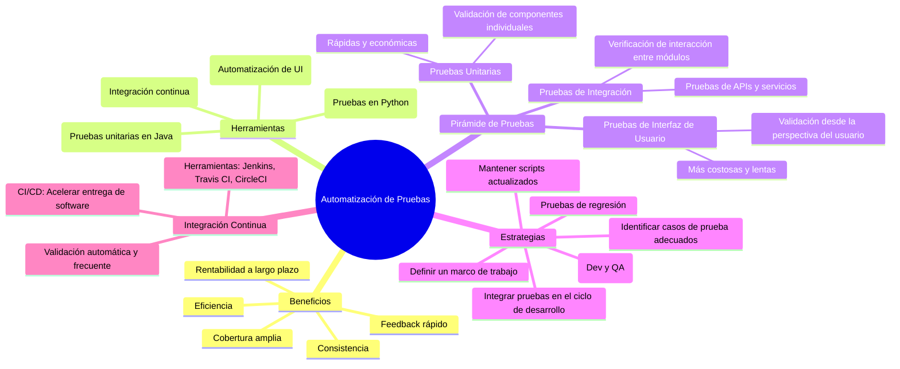
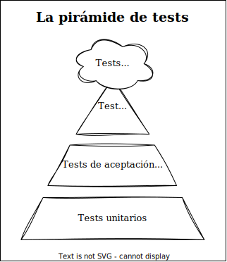

# Automatización de Pruebas

- [1. Introducción a la automatización de pruebas](#1-introducción-a-la-automatización-de-pruebas)
- [2. Conceptos básicos y beneficios](#2-conceptos-básicos-y-beneficios)
- [3. Algunas Herramientas populares](#3-algunas-herramientas-populares)
- [4. Pirámide de Pruebas y su Aplicación](#4-pirámide-de-pruebas-y-su-aplicación)
- [5. Estrategias de Automatización](#5-estrategias-de-automatización)
- [6. Integración continua](#6-integración-continua)

**Mapa mental de esta sección**:



## 1. Introducción a la automatización de pruebas

La automatización de pruebas es una estrategia que utiliza herramientas y scripts para preparar, ejecutar casos de prueba de manera automática y realizar reportes de resultados, reduciendo la intervención manual en el proceso de validación del software. Este enfoque es esencial para agilizar los ciclos de desarrollo, mejorar la precisión de las pruebas y garantizar una cobertura amplia, especialmente en proyectos con requisitos complejos o en constante cambio.  

## 2. Conceptos básicos y beneficios

La automatización de pruebas consiste en diseñar y mantener scripts que repliquen las interacciones de los usuarios, verificaciones de datos y otros escenarios de prueba. Estas pruebas se ejecutan en entornos controlados, proporcionando resultados consistentes y repetibles.  

**Beneficios de la automatización:**  

1. **Eficiencia:** Las pruebas se ejecutan más rápido que manualmente, lo que permite realizar validaciones frecuentes, incluso después de cada cambio en el código.  
2. **Consistencia:** Minimiza el riesgo de errores humanos al ejecutar las mismas pruebas de manera uniforme en cada iteración.  
3. **Cobertura:** Permite probar una mayor cantidad de escenarios y combinaciones en menos tiempo.  
4. **Rentabilidad a largo plazo:** Aunque requiere una inversión inicial en herramientas y desarrollo de scripts, la automatización reduce los costos de pruebas repetitivas y regresión.  
5. **Feedback rápido:** Los errores se detectan y reportan rápidamente, acelerando las correcciones.  

## 3. Algunas Herramientas populares

Existen diversas herramientas de automatización diseñadas para diferentes tipos de pruebas y contextos. A continuación, se destacan algunas de las más utilizadas:  

1. **JUnit (Java):**  
   - Framework para pruebas unitarias en Java.  
   - Permite definir, organizar y ejecutar pruebas de forma automatizada.  
   - Ejemplo:  

   ```java
   import org.junit.jupiter.api.Test;
   import static org.junit.jupiter.api.Assertions.*;

   public class CalculadoraTest {
       @Test
       void testSuma() {
           Calculadora calc = new Calculadora();
           assertEquals(5, calc.suma(2, 3));
       }
   }
   ```  

   Sobre JUnit haremos una sección específica en este tema.

2. **Selenium (Automatización de UI):**  
   - Herramienta para automatizar pruebas de interfaces web.  
   - Soporta múltiples lenguajes como Java, Python y JavaScript.  
   - Ejemplo en Java:

   ```java
   import org.openqa.selenium.WebDriver;
   import org.openqa.selenium.chrome.ChromeDriver;
   import org.openqa.selenium.By;

   public class TestLogin {
      public static void main(String[] args) {
         // Configuración básica del WebDriver (sin ruta específica)
         WebDriver driver = new ChromeDriver();

         // Navegar a la página de login
         driver.get("https://example.com/login");

         // Interactuar con los elementos de la página
         driver.findElement(By.id("username")).sendKeys("usuario");
         driver.findElement(By.id("password")).sendKeys("contraseña");
         driver.findElement(By.id("loginButton")).click();

         // Cerrar el navegador
         driver.quit();
      }
   }
   ```  

3. **Pytest (Python):**  
   - Framework para pruebas unitarias y funcionales.  
   - Soporta la parametrización de casos de prueba para cubrir múltiples escenarios con poco esfuerzo.  

4. **Jenkins (Integración continua):**  
   - Herramienta de automatización que integra pruebas en el flujo de desarrollo, ejecutándolas automáticamente en cada cambio del código.  

## 4. Pirámide de Pruebas y su Aplicación

La pirámide de pruebas es un modelo, presentado por Mike Cohn en su libro *Succeding With Agile: Software Development Using Scrum*, que guía la distribución de esfuerzos en diferentes tipos de pruebas, promoviendo la eficiencia y la cobertura. Está dividida en tres niveles principales:  

1. **Pruebas Unitarias (Base de la pirámide):**  
   - Representan la mayor parte de las pruebas.  
   - Son rápidas, económicas y se centran en validar componentes individuales.  

2. **Pruebas de Integración y pruebas de Servicios (Capa intermedia):**  
   - Verifican cómo interactúan los módulos entre sí.
   - Prueban las llamadas a APIs, servicios y bases de datos.
   - Prueba la lectura y escritura en colas o sistemas de archivos.
   - Son más costosas y requieren tiempo adicional para configuraciones de entorno.  

3. **Pruebas de Interfaz de Usuario (Cima de la pirámide):**  
   - Validan la funcionalidad del sistema desde la perspectiva del usuario.  
   - Son las más costosas y lentas, por lo que deben limitarse a escenarios críticos.

4. **Pruebas manuales**: no podemos obviar las pruebas exploratorias manuales, ya que, no es posible automatizar el 100% de las pruebas, bien  por diversos aspectos técnicos que complicarían demasiado la automatizacion, bien porque perderíamos la oportunidad de conocer bien la aplicación y profundizar en su ciclo de vida.

Cuanto más arriba en la pirámide, más costosas y lentas son las pruebas, y menos retorno de inversión tendrán.

<div style="text-align:center">



</div>

## 5. Estrategias de Automatización

Para implementar la automatización de pruebas de manera efectiva, es importante seguir una estrategia que garantice la calidad y la eficiencia del proceso. Algunas recomendaciones clave son:

1. **Identificar los casos de prueba adecuados:** No todas las pruebas son candidatas para la automatización. Seleccionar los casos más repetitivos, críticos y estables para obtener el máximo beneficio.
2. **Definir un marco de trabajo:** Utilizar un framework de automatización que facilite la creación, ejecución y mantenimiento de los scripts de prueba.
3. **Integrar pruebas en el ciclo de desarrollo:** Incluir las pruebas automatizadas en el flujo de trabajo, ejecutándolas en cada iteración y en entornos de integración continua.
4. **Mantener los scripts actualizados:** Revisar y ajustar los scripts de prueba regularmente para reflejar los cambios en el software y evitar falsos positivos.
5. **Realizar pruebas de regresión:** Automatizar pruebas de regresión para validar que las nuevas funcionalidades no afecten el comportamiento existente.  
6. **Involucrar a los equipos de desarrollo y QA:** Fomentar la colaboración entre los equipos para definir estrategias de pruebas efectivas y compartir conocimientos sobre las herramientas y procesos de automatización.

## 6. Integración continua

La integración continua es una práctica que consiste en integrar y validar los cambios en el código de manera automática y frecuente, para detectar errores tempranamente y garantizar la calidad del software. La automatización de pruebas es un componente esencial de la integración continua, ya que permite ejecutar pruebas de forma rápida y confiable en cada iteración del desarrollo.

Junto al despliegue continuo, la integración continua forma parte de un enfoque más amplio conocido como CI/CD (Continuous Integration/Continuous Deployment), que busca acelerar la entrega de software y mejorar la colaboración entre los equipos de desarrollo y operaciones.

Para la realización de la integración continua, se utilizan herramientas como Jenkins, Travis CI, CircleCI, GitLab CI, entre otras, que permiten automatizar el proceso de integración, compilación, pruebas y despliegue del software en entornos de desarrollo, pruebas y producción.
