# Introducción a las pruebas automáticas unitarias con JUnit

- [1. Introducción](#1-introducción)
  - [1.1. Historia y versiones de JUnit](#11-historia-y-versiones-de-junit)
- [2. Instalación de JUnit](#2-instalación-de-junit)
- [3. Ejemplo de pruebas unitarias con JUnit](#3-ejemplo-de-pruebas-unitarias-con-junit)
  - [3.1. Estructura general del proyecto](#31-estructura-general-del-proyecto)
  - [3.2. Estructura de una Prueba en JUnit](#32-estructura-de-una-prueba-en-junit)
    - [3.2.1. Anotaciones Básicas](#321-anotaciones-básicas)
    - [3.2.2. Métodos de Prueba](#322-métodos-de-prueba)
    - [3.2.3. Aserciones (`Assertions`)](#323-aserciones-assertions)
    - [3.2.4. Buenas Prácticas](#324-buenas-prácticas)
  - [3.3. Aplicación de casos de prueba con JUnit](#33-aplicación-de-casos-de-prueba-con-junit)
    - [3.3.1. Pruebas de Caja Blanca con JUnit](#331-pruebas-de-caja-blanca-con-junit)
    - [3.3.2. Pruebas de Caja Negra con JUnit](#332-pruebas-de-caja-negra-con-junit)
- [4. Como usar JUnit en IntelliJ IDEA](#4-como-usar-junit-en-intellij-idea)
  - [4.1. Configurar JUnit en el Proyecto](#41-configurar-junit-en-el-proyecto)
  - [4.2. Crear una Clase de Prueba](#42-crear-una-clase-de-prueba)
  - [4.3. Ejecutar las Pruebas](#43-ejecutar-las-pruebas)
  - [4.4. Depurar Pruebas](#44-depurar-pruebas)
  - [4.5. Ver la Cobertura de Código](#45-ver-la-cobertura-de-código)
- [5. Ejemplos de aplicación de JUnit](#5-ejemplos-de-aplicación-de-junit)
  - [5.1. Ejemplo 1: Clase `ValidadorContrasena`](#51-ejemplo-1-clase-validadorcontrasena)
  - [5.2. Ejemplo 2: Clase `GestorInventario`](#52-ejemplo-2-clase-gestorinventario)
- [6. Pruebas Avanzadas](#6-pruebas-avanzadas)
  - [6.1. Pruebas Parametrizadas](#61-pruebas-parametrizadas)
    - [6.1.1. **Cómo usar pruebas parametrizadas en JUnit 5**](#611-cómo-usar-pruebas-parametrizadas-en-junit-5)
  - [6.2. Pruebas de Excepciones](#62-pruebas-de-excepciones)
    - [6.2.1. **Cómo probar excepciones en JUnit 5**](#621-cómo-probar-excepciones-en-junit-5)
  - [6.3. Combinación de Pruebas Parametrizadas y de Excepciones](#63-combinación-de-pruebas-parametrizadas-y-de-excepciones)
  - [6.4. Pruebas Anidadas (`@Nested`)](#64-pruebas-anidadas-nested)
    - [6.4.1. **Cómo usar `@Nested` en JUnit 5**](#641-cómo-usar-nested-en-junit-5)
  - [6.5. Deshabilitar Pruebas (`@Disabled`)](#65-deshabilitar-pruebas-disabled)
  - [6.6. Suite de pruebas (`@Suite`)](#66-suite-de-pruebas-suite)
    - [Pasos para crear un suite de tests en JUnit 5](#pasos-para-crear-un-suite-de-tests-en-junit-5)
  - [Otras opciones para agrupar tests](#otras-opciones-para-agrupar-tests)
  - [Resumen](#resumen)
- [7. Ejercicios Prácticos](#7-ejercicios-prácticos)
  - [7.1. Método `esPalindromo`](#71-método-espalindromo)
  - [7.2. Método `calcularFactorial`](#72-método-calcularfactorial)
- [8. Recursos Adicionales](#8-recursos-adicionales)
  - [8.1. Documentación Oficial de JUnit](#81-documentación-oficial-de-junit)
  - [8.2. Libros y Tutoriales Recomendados](#82-libros-y-tutoriales-recomendados)
  - [8.3. Comunidades y Foros para Resolver Dudas](#83-comunidades-y-foros-para-resolver-dudas)

**Mapa mental de esta sección:**

```mermaid
mindmap
  root((JUnit))
    Introducción
      Historia
        JUnit 3
        JUnit 4
        JUnit 5
      Instalación
        Maven
        Gradle
        JAR manual
    Pruebas Unitarias
      Estructura del Proyecto
      Anotaciones
        @Test
        @BeforeEach
        @AfterEach
        @BeforeAll
        @AfterAll
      Aserciones
        assertEquals
        assertTrue
        assertFalse
        assertNull
        assertThrows
        assertAll
      Buenas Prácticas
    Pruebas Avanzadas
      Pruebas Parametrizadas
      Pruebas de Excepciones
    Integración con IntelliJ IDEA
      Configuración
      Creación de Pruebas
      Ejecución
      Depuración
      Cobertura de Código
    Recursos Adicionales
```



## 1. Introducción

En esta sección vamos a aprender a realizar pruebas automáticas unitarias con JUnit. JUnit es un framework de pruebas unitarias para el lenguaje de programación Java. JUnit es una herramienta muy utilizada en el desarrollo de software para realizar pruebas automáticas de las clases y métodos que se desarrollan.

### 1.1. Historia y versiones de JUnit

- JUnit 3: La primera versión popular, basada en herencia. Las pruebas se escribían extendiendo la clase `TestCase`.
- JUnit 4: Introdujo anotaciones como `@Test`, `@Before`, y `@After`, lo que simplificó la escritura de pruebas.
- JUnit 5: La versión más moderna y modular, lanzada en 2017. Incluye características avanzadas como pruebas parametrizadas, extensiones y soporte para Java 8 y superior.

Esta unidad se basará en el funcionamiento de JUnit 5, que es la versión más moderna y recomendada de JUnit.

## 2. Instalación de JUnit

Antes de comenzar a usar JUnit, debemos tener en cuenta que la versión JUnit 5 requiere Java 8 o superior.

Para instalar JUnit en un proyecto de Java, se puede hacer de tres formas:

1. Descargar el archivo JAR de JUnit desde la página oficial de JUnit: [https://junit.org/junit5/](https://junit.org/junit5/). Una vez descargado el archivo JAR, se debe añadir a las librerías del proyecto.
2. Añadir JUnit como dependencia en el archivo `pom.xml` de Maven. Para ello, se debe añadir la siguiente dependencia:

    ```xml
    <dependency>
        <groupId>org.junit.jupiter</groupId>
        <artifactId>junit-jupiter-api</artifactId>
        <version>5.10.0</version>
        <scope>test</scope>
    </dependency>
    <dependency>
        <groupId>org.junit.jupiter</groupId>
        <artifactId>junit-jupiter-engine</artifactId>
        <version>5.10.0</version>
        <scope>test</scope>
    </dependency>
    ```

3. En proyectos Gradle, se puede añadir JUnit como dependencia en el archivo `build.gradle`. Para ello, se debe añadir la siguiente dependencia:

```gradle
testImplementation 'org.junit.jupiter:junit-jupiter-api:5.10.0'
testRuntimeOnly 'org.junit.jupiter:junit-jupiter-engine:5.10.0'
```

En general, se recomienda utilizar **Maven** o **Gradle** para gestionar las dependencias de un proyecto Java, ya que estas herramientas simplifican y automatizan el proceso de añadir y administrar bibliotecas externas. Ambas herramientas descargan automáticamente las dependencias necesarias y las integran en el proyecto, lo que facilita el desarrollo y la mantenibilidad del código. Para obtener más información sobre Maven, puedes consultar su [documentación oficial](https://maven.apache.org/). De manera similar, para aprender más sobre Gradle, visita su [sitio web oficial](https://gradle.org/).

## 3. Ejemplo de pruebas unitarias con JUnit

A continuación se muestra un ejemplo de cómo realizar pruebas unitarias con JUnit:

En este ejemplo, creamos una clase `Calculadora` con dos métodos `suma` y `resta`. A continuación se muestra la clase `Calculadora`:

```java
//Clase Calculadora
public class Calculadora {

    public int suma(int a, int b) {
        return a + b;
    }

    public int resta(int a, int b) {
        return a - b;
    }
}
```

Para realizar los test, definimos la clase `CalculadoraTest` con dos métodos de prueba `testSuma` y `testResta` que prueban los métodos `suma` y `resta` de la clase `Calculadora`. Para ejecutar las pruebas, se debe ejecutar la clase `CalculadoraTest` como una clase de JUnit.

```java
//Ejemplo de uso de JUnit
import static org.junit.jupiter.api.Assertions.assertEquals;
import org.junit.jupiter.api.Test;

public class CalculadoraTest {

    @Test
    public void testSuma() {
        Calculadora calc = new Calculadora();
        assertEquals(5, calc.suma(2, 3));
    }

    @Test
    public void testResta() {
        Calculadora calc = new Calculadora();
        assertEquals(1, calc.resta(3, 2));
    }
}
```

En este ejemplo se ha utilizado el método `assertEquals` de JUnit para comprobar que el resultado de la operación es el esperado. Si el resultado de la operación es el esperado, la prueba se considera correcta. En caso contrario, la prueba falla y se muestra un mensaje de error.

### 3.1. Estructura general del proyecto

Generalmente en nuestros proyectos Java, las clases a probar estarán en `src/main/java`. De esta forma, las pruebas se colocan en el directorio `src/test/java`.

```plaintext
mi-proyecto/
├── src/
│   ├── main/
│   │   └── java/
│   │       └── com/
│   │           └── ejemplo/
│   │               └── Calculadora.java
│   └── test/
│       └── java/
│           └── com/
│               └── ejemplo/
│                   └── CalculadoraTest.java
└── pom.xml
```

### 3.2. Estructura de una Prueba en JUnit

En JUnit, las pruebas se organizan en métodos y clases específicas. Cada prueba es un método que verifica el comportamiento de una unidad de código (como un método o una clase). A continuación, se describen los elementos clave para estructurar una prueba en JUnit.

#### 3.2.1. Anotaciones Básicas

Las anotaciones son la forma en que JUnit identifica y organiza las pruebas. Estas anotaciones se ubican antes de las clases o métodos de prueba y proporcionan información sobre cómo se deben ejecutar las pruebas. Aquí están las más importantes:

1. **`@Test`**:
   - Indica que un método es una prueba.
   - Cada método anotado con `@Test` se ejecuta como una prueba independiente.
   - Ejemplo:

     ```java
     @Test
     public void testSuma() {
         Calculadora calculadora = new Calculadora();
         assertEquals(5, calculadora.suma(2, 3));
     }
     ```

2. **`@BeforeEach` y `@AfterEach`**:
   - **`@BeforeEach`**: Se ejecuta **antes de cada prueba** (`@Test`). Se usa para inicializar recursos o configurar el entorno específico para cada prueba.  
   - **`@AfterEach`**: Se ejecuta **después de cada prueba**. Se usa para liberar recursos o limpiar el entorno después de cada prueba.  
   - Ejemplo:

     ```java
     private Calculadora calculadora;

     @BeforeEach
     public void setUp() {
         calculadora = new Calculadora();
     }

     @AfterEach
     public void tearDown() {
         calculadora = null;
     }
     ```

3. **`@BeforeAll` y `@AfterAll`**:
   - **`@BeforeAll`**: Se ejecuta **una vez antes de todas las pruebas**. Útil para configuraciones costosas que no cambian entre pruebas, como la conexión a una base de datos o la creación de archivos temporales.  
   - **`@AfterAll`**: Se ejecuta **una vez después de todas las pruebas**. Útil para liberar recursos globales, como cerrar conexiones o eliminar archivos temporales.  
   - Estos métodos deben ser estáticos (`static`).
   - Ejemplo:

     ```java
     @BeforeAll
     public static void init() {
         System.out.println("Inicializando recursos para todas las pruebas");
     }

     @AfterAll
     public static void cleanup() {
         System.out.println("Liberando recursos después de todas las pruebas");
     }
     ```

#### 3.2.2. Métodos de Prueba

Los métodos de prueba son los que contienen la lógica de la prueba. Estos métodos deben ser públicos, no tener parámetros y estar anotados con `@Test`. Aquí hay algunas consideraciones importantes:

- **Convenciones de nombres**:
  - Los nombres de los métodos de prueba deben ser descriptivos.
  - Usa nombres como `testSuma`, `testDivisionPorCero`, etc.
  - Alternativamente, puedes usar nombres en formato `camelCase` o separados por guiones bajos (`test_suma`).

- **Independencia**:
  - Cada prueba debe ser independiente de las demás.
  - No se debe asumir un orden de ejecución.

- **Ejemplo de una clase de prueba completa**:

  ```java
  import org.junit.jupiter.api.*;
  import static org.junit.jupiter.api.Assertions.*;

  public class CalculadoraTest {

      private Calculadora calculadora;

      @BeforeAll
      public static void init() {
          System.out.println("Inicializando recursos para todas las pruebas");
      }

      @AfterAll
      public static void cleanup() {
          System.out.println("Liberando recursos después de todas las pruebas");
      }

      @BeforeEach
      public void setUp() {
          calculadora = new Calculadora();
      }

      @AfterEach
      public void tearDown() {
          calculadora = null;
      }

      @Test
      public void testSuma() {
          assertEquals(5, calculadora.suma(2, 3), "2 + 3 debería ser 5");
      }

      @Test
      public void testResta() {
          assertEquals(1, calculadora.resta(3, 2), "3 - 2 debería ser 1");
      }
  }
  ```

#### 3.2.3. Aserciones (`Assertions`)

Las aserciones son métodos que permiten verificar si el resultado de una prueba es el esperado. JUnit proporciona varios métodos de aserción en la clase `Assertions`.

1. **`assertEquals(expected, actual)`**: Comprueba si el valor esperado (`expected`) es igual al valor real (`actual`).

     ```java
     @Test
     public void testSuma() {
         assertEquals(5, calculadora.suma(2, 3));
     }
     ```

2. **`assertTrue(condition)` y `assertFalse(condition)`**: Verifican si una condición es verdadera o falsa.

     ```java
     @Test
     public void testEsPositivo() {
         assertTrue(calculadora.esPositivo(10));
         assertFalse(calculadora.esPositivo(-5));
     }
     ```

3. **`assertNull(object)` y `assertNotNull(object)`**: Verifican si un objeto es `null` o no.

     ```java
     @Test
     public void testObjetoNulo() {
         assertNull(calculadora.obtenerResultado());
         assertNotNull(calculadora);
     }
     ```

4. **`assertThrows(Exception.class, executable)`**: Verifica si un bloque de código lanza una excepción específica.

     ```java
     @Test
     public void testDivisionPorCero() {
         assertThrows(ArithmeticException.class, () -> calculadora.dividir(10, 0));
     }
     ```

5. **`assertAll`**: Permite agrupar múltiples aserciones y ejecutarlas juntas.
   - Si una aserción falla, las demás aún se ejecutan.

     ```java
     @Test
     public void testVariasOperaciones() {
         assertAll(
             () -> assertEquals(5, calculadora.suma(2, 3)),
             () -> assertEquals(1, calculadora.resta(3, 2)),
             () -> assertTrue(calculadora.esPositivo(10))
         );
     }
     ```

Puedes encontrar una lista completa de métodos de aserción en la clase `Assertions` de JUnit [aquí](https://junit.org/junit5/docs/current/api/org.junit.jupiter.api/org/junit/jupiter/api/Assertions.html).

#### 3.2.4. Buenas Prácticas

1. **Pruebas pequeñas y específicas**:
   - Cada prueba debe verificar un único comportamiento o caso de uso.

2. **Mensajes descriptivos en aserciones**:
   - Usa mensajes claros en las aserciones para facilitar la depuración.

     ```java
     assertEquals(5, calculadora.suma(2, 3), "La suma de 2 y 3 debería ser 5");
     ```

3. **Evitar lógica en las pruebas**: Las pruebas no deben contener lógica compleja, ya que podrían introducir errores.

4. **Pruebas independientes**: Asegúrate de que cada prueba pueda ejecutarse de forma aislada.

### 3.3. Aplicación de casos de prueba con JUnit

En la sección 2 vimos como diseñar casos de prueba, mediante técnicas de caja blanca (pruebas de flujo de control, pruebas de bucles, pruebas de condiciones, etc.) y de caja negra (pruebas de equivalencia, pruebas de límites, etc.). En esta sección vamos a ver cómo implementar estos casos de prueba en JUnit.

#### 3.3.1. Pruebas de Caja Blanca con JUnit

Las **pruebas de caja blanca** se centran en la estructura interna del código. Con JUnit, podemos implementar pruebas que validen la lógica interna de un método, como la cobertura de caminos, condiciones y bucles.

1. **Cobertura de Caminos**:
   - Diseña pruebas que cubran todos los caminos posibles en un método (por ejemplo, ramas `if-else`, `switch`, etc.).
   - Ejemplo:

     ```java
     public class Calculadora {
         public int dividir(int a, int b) {
             if (b == 0) {
                 throw new ArithmeticException("División por cero");
             }
             return a / b;
         }
     }

     @Test
     public void testDividir_CasoNormal() {
         Calculadora calculadora = new Calculadora();
         assertEquals(2, calculadora.dividir(10, 5));
     }

     @Test
     public void testDividir_DivisionPorCero() {
         Calculadora calculadora = new Calculadora();
         assertThrows(ArithmeticException.class, () -> calculadora.dividir(10, 0));
     }
     ```

2. **Cobertura de Condiciones**:
   - Asegúrate de probar todas las condiciones posibles en un método.
   - Ejemplo:

    ```java
     public class Verificador {
         public String verificarEdad(int edad) {
             if (edad < 0) {
                 return "Edad inválida";
             } else if (edad < 18) {
                 return "Menor de edad";
             } else {
                 return "Mayor de edad";
             }
         }
     }

     @Test
     public void testVerificarEdad_MenorDeEdad() {
         Verificador verificador = new Verificador();
         assertEquals("Menor de edad", verificador.verificarEdad(15));
     }

     @Test
     public void testVerificarEdad_MayorDeEdad() {
         Verificador verificador = new Verificador();
         assertEquals("Mayor de edad", verificador.verificarEdad(20));
     }

     @Test
     public void testVerificarEdad_EdadInvalida() {
         Verificador verificador = new Verificador();
         assertEquals("Edad inválida", verificador.verificarEdad(-5));
     }
     ```

3. **Cobertura de Bucles**:
   - Prueba casos donde los bucles se ejecutan cero veces, una vez o varias veces.
   - Ejemplo:

     ```java
     public class Contador {
         public int contarLetrasA(String texto) {
             int count = 0;
             for (char c : texto.toCharArray()) {
                 if (c == 'a' || c == 'A') {
                     count++;
                 }
             }
             return count;
         }
     }

     @Test
     public void testContarLetrasA_CasoVacio() {
         Contador contador = new Contador();
         assertEquals(0, contador.contarLetrasA(""));
     }

     @Test
     public void testContarLetrasA_UnaLetraA() {
         Contador contador = new Contador();
         assertEquals(1, contador.contarLetrasA("Hola"));
     }

     @Test
     public void testContarLetrasA_VariasLetrasA() {
         Contador contador = new Contador();
         assertEquals(3, contador.contarLetrasA("Anaranjado"));
     }
     ```

#### 3.3.2. Pruebas de Caja Negra con JUnit

Las **pruebas de caja negra** se centran en la funcionalidad del código sin considerar su implementación interna. Con JUnit, podemos implementar pruebas basadas en **clases de equivalencia** y **valores límite**.

1. **Clases de Equivalencia**:
   - Divide las entradas en grupos que se espera que se comporten de manera similar.
   - Ejemplo:

     ```java
     public class Validador {
         public boolean esNumeroValido(int numero) {
             return numero >= 1 && numero <= 100;
         }
     }

     @Test
     public void testEsNumeroValido_CasoValido() {
         Validador validador = new Validador();
         assertTrue(validador.esNumeroValido(50));
     }

     @Test
     public void testEsNumeroValido_CasoInvalido() {
         Validador validador = new Validador();
         assertFalse(validador.esNumeroValido(0));
         assertFalse(validador.esNumeroValido(101));
     }
     ```

2. **Valores Límite**:
   - Prueba los valores en los límites de los rangos de entrada.
   - Ejemplo:

     ```java
     @Test
     public void testEsNumeroValido_ValoresLimite() {
         Validador validador = new Validador();
         assertTrue(validador.esNumeroValido(1));  // Límite inferior
         assertTrue(validador.esNumeroValido(100)); // Límite superior
         assertFalse(validador.esNumeroValido(0));  // Fuera del límite inferior
         assertFalse(validador.esNumeroValido(101)); // Fuera del límite superior
     }
     ```

3. **Pruebas de Combinaciones**:
   - Prueba combinaciones de entradas para cubrir múltiples escenarios.
   - Ejemplo:

     ```java
     @Test
     public void testCombinaciones() {
         Validador validador = new Validador();
         assertAll(
             () -> assertTrue(validador.esNumeroValido(50)),
             () -> assertFalse(validador.esNumeroValido(-1)),
             () -> assertFalse(validador.esNumeroValido(101))
         );
     }
     ```

## 4. Como usar JUnit en IntelliJ IDEA

En esta sección explicaremos, paso a paso, como crear y ejecutar pruebas unitarias con JUnit en IntelliJ IDEA en proyectos de Java. Reforzaremos los conceptos aprendidos en las secciones anteriores. Vamos a explicar el proceso a partir de un proyecto ya creado.

### 4.1. Configurar JUnit en el Proyecto

1. **Añadir Dependencia de JUnit**:
   - Si estás usando **Maven**:
     1. Abre el archivo `pom.xml`.
     2. Añade la dependencia de JUnit 5:

        ```xml
        <dependencies>
            <dependency>
                <groupId>org.junit.jupiter</groupId>
                <artifactId>junit-jupiter-api</artifactId>
                <version>5.10.0</version>
                <scope>test</scope>
            </dependency>
            <dependency>
                <groupId>org.junit.jupiter</groupId>
                <artifactId>junit-jupiter-engine</artifactId>
                <version>5.10.0</version>
                <scope>test</scope>
            </dependency>
        </dependencies>
        ```

     3. Haz clic en **Reload** para descargar las dependencias.
   - Si estás usando **Gradle**:
     1. Abre el archivo `build.gradle`.
     2. Añade la dependencia de JUnit 5:

        ```groovy
        dependencies {
            testImplementation 'org.junit.jupiter:junit-jupiter-api:5.10.0'
            testRuntimeOnly 'org.junit.jupiter:junit-jupiter-engine:5.10.0'
        }
        ```

     3. Haz clic en **Reload** para descargar las dependencias.

2. **Verificar la Estructura del Proyecto**:
   - Asegúrate de que tu proyecto tenga la siguiente estructura:

     ```plaintext
     src/
     ├── main/
     │   └── java/          # Código fuente principal
     └── test/
         └── java/          # Código de pruebas
     ```

      Si no existe la carpeta `src/test/java`, créala manualmente o deja que IntelliJ IDEA la genere automáticamente al crear tu primera prueba.

### 4.2. Crear una Clase de Prueba

1. En la carpeta `src/test/java`, crea una clase de prueba. Por ejemplo:
   - Haz clic derecho sobre el nombre de la clase de la que deseas crear una clase de test.
   - Selecciona **Go to > Test**.
   - Elige **Create New Test**.
   - En el diálogo, selecciona los métodos que deseas probar y haz clic en **OK**.

    

    

    

2. IntelliJ IDEA generará automáticamente una clase de prueba en `src/test/java`. Por ejemplo, para una clase `Calculadora`con métodos `suma` y `resta`, la clase de prueba se vería así:

   ```java
   import org.junit.jupiter.api.Test;
   import static org.junit.jupiter.api.Assertions.*;

   public class CalculadoraTest {

       @Test
       public void testSuma() {
           Calculadora calculadora = new Calculadora();
           assertEquals(5, calculadora.suma(2, 3));
       }

       @Test
       public void testResta() {
           Calculadora calculadora = new Calculadora();
           assertEquals(1, calculadora.resta(3, 2));
       }
   }
   ```

   Ahora solo tendríamos que completar los métodos incluidos en la clase de prueba con el comportamiento esperado.

### 4.3. Ejecutar las Pruebas

1. **Ejecutar una Prueba Individual**:
   - Haz clic en el icono de "play" (▶️) junto al método de prueba (`testSuma` o `testResta`).
   - Selecciona **Run** para ejecutar la prueba.

2. **Ejecutar Todas las Pruebas de una Clase**:
   - Haz clic en el icono de "play" (▶️) junto al nombre de la clase (`CalculadoraTest`).
   - Selecciona **Run** para ejecutar todas las pruebas de la clase.

3. **Ver los Resultados**:
   - Los resultados de las pruebas se mostrarán en la ventana **Run**.
   - Las pruebas exitosas aparecerán en verde, y las fallidas en rojo.

    

    

### 4.4. Depurar Pruebas

1. **Establecer Puntos de Interrupción (Breakpoints)**:
   - Haz clic en el margen izquierdo del editor, junto a la línea de código donde deseas detener la ejecución.

2. **Ejecutar en Modo Depuración**:
   - Haz clic en el icono de "bug" (🐞) junto al método o clase de prueba.
   - Selecciona **Debug** para iniciar la depuración.

3. **Inspeccionar Variables**:
   - Usa la ventana **Debug** para inspeccionar el valor de las variables durante la ejecución.

### 4.5. Ver la Cobertura de Código

1. **Ejecutar Pruebas con Cobertura**:
   - Haz clic derecho en la clase de prueba o en el proyecto.
   - Selecciona **Run with Coverage**.

2. **Ver el Reporte de Cobertura**:
   - IntelliJ IDEA mostrará un resumen de la cobertura de código en la ventana **Coverage**.
   - Las líneas cubiertas por las pruebas aparecerán en verde, y las no cubiertas en rojo.

    

    

## 5. Ejemplos de aplicación de JUnit

### 5.1. Ejemplo 1: Clase `ValidadorContrasena`

Esta clase valida si una contrasena cumple con los siguientes requisitos:

1. Longitud mínima de 8 caracteres.
2. Al menos una letra mayúscula.
3. Al menos una letra minúscula.
4. Al menos un dígito.
5. Al menos un carácter especial (por ejemplo, `!`, `@`, `#`, etc.).

```java
public class ValidadorContrasena {

    public boolean validar(String contrasena) {
        // Verificar longitud mínima
        if (contrasena.length() < 8) {
            return false;
        }

        // Verificar al menos una letra mayúscula
        boolean tieneMayuscula = false;
        // Verificar al menos una letra minúscula
        boolean tieneMinuscula = false;
        // Verificar al menos un dígito
        boolean tieneDigito = false;
        // Verificar al menos un carácter especial
        boolean tieneEspecial = false;

        for (char c : contrasena.toCharArray()) {
            if (Character.isUpperCase(c)) {
                tieneMayuscula = true;
            } else if (Character.isLowerCase(c)) {
                tieneMinuscula = true;
            } else if (Character.isDigit(c)) {
                tieneDigito = true;
            } else if (esCaracterEspecial(c)) {
                tieneEspecial = true;
            }
        }

        // La contrasena es válida si cumple todos los requisitos
        return tieneMayuscula && tieneMinuscula && tieneDigito && tieneEspecial;
    }

    private boolean esCaracterEspecial(char c) {
        // Definir caracteres especiales permitidos
        String caracteresEspeciales = "!@#$%^&*()-_=+[]{};:'\",.<>/?`~";
        return caracteresEspeciales.contains(String.valueOf(c));
    }
}
```

Ahora vamos a crear la clase de prueba con JUnit. Incluiremos pruebas de **caja negra** (validación funcional) y **caja blanca** (cobertura de caminos y condiciones).

```java
import org.junit.jupiter.api.Test;
import static org.junit.jupiter.api.Assertions.*;

public class ValidadorContrasenaTest {

    private ValidadorContrasena validador = new ValidadorContrasena();

    // Pruebas de Caja Negra
    @Test
    public void testcontrasenaValida() {
        assertTrue(validador.validar("Passw0rd!"), "La contrasena debería ser válida");
    }

    @Test
    public void testcontrasenaCorta() {
        assertFalse(validador.validar("Pwd1!"), "La contrasena es demasiado corta");
    }

    @Test
    public void testcontrasenaSinMayuscula() {
        assertFalse(validador.validar("password1!"), "La contrasena no tiene mayúscula");
    }

    @Test
    public void testcontrasenaSinMinuscula() {
        assertFalse(validador.validar("PASSWORD1!"), "La contrasena no tiene minúscula");
    }

    @Test
    public void testcontrasenaSinDigito() {
        assertFalse(validador.validar("Password!"), "La contrasena no tiene dígito");
    }

    @Test
    public void testcontrasenaSinCaracterEspecial() {
        assertFalse(validador.validar("Password1"), "La contrasena no tiene carácter especial");
    }

    // Pruebas de Caja Blanca
    @Test
    public void testCoberturaDeCaminos() {
        // Prueba para cubrir el caso donde falta una mayúscula
        assertFalse(validador.validar("password1!"), "Falta mayúscula");

        // Prueba para cubrir el caso donde falta una minúscula
        assertFalse(validador.validar("PASSWORD1!"), "Falta minúscula");

        // Prueba para cubrir el caso donde falta un dígito
        assertFalse(validador.validar("Password!"), "Falta dígito");

        // Prueba para cubrir el caso donde falta un carácter especial
        assertFalse(validador.validar("Password1"), "Falta carácter especial");

        // Prueba para cubrir el caso donde todo es correcto
        assertTrue(validador.validar("Passw0rd!"), "Todo es correcto");
    }

    @Test
    public void testCaracterEspecialInvalido() {
        // Prueba para cubrir el caso donde se usa un carácter no permitido
        assertFalse(validador.validar("Password1|"), "Carácter especial no permitido");
    }
}
```


### 5.2. Ejemplo 2: Clase `GestorInventario`

Esta clase gestiona un inventario de productos, donde cada producto tiene un nombre y una cantidad en stock.

```java
import java.util.HashMap;
import java.util.Map;

public class GestorInventario {

    private Map<String, Integer> inventario;

    public GestorInventario() {
        inventario = new HashMap<>();
    }

    /**
     * Añade un producto al inventario.
     *
     * @param nombre   El nombre del producto.
     * @param cantidad La cantidad a añadir.
     */
    public void añadirProducto(String nombre, int cantidad) {
        if (cantidad <= 0) {
            throw new IllegalArgumentException("La cantidad debe ser mayor que cero.");
        }
        inventario.put(nombre, inventario.getOrDefault(nombre, 0) + cantidad);
    }

    /**
     * Elimina un producto del inventario.
     *
     * @param nombre   El nombre del producto.
     * @param cantidad La cantidad a eliminar.
     */
    public void eliminarProducto(String nombre, int cantidad) {
        if (!inventario.containsKey(nombre)) {
            throw new IllegalArgumentException("El producto no existe en el inventario.");
        }
        if (cantidad <= 0) {
            throw new IllegalArgumentException("La cantidad debe ser mayor que cero.");
        }
        int stockActual = inventario.get(nombre);
        if (cantidad > stockActual) {
            throw new IllegalArgumentException("No hay suficiente stock para eliminar.");
        }
        inventario.put(nombre, stockActual - cantidad);
    }

    /**
     * Busca un producto en el inventario.
     *
     * @param nombre El nombre del producto.
     * @return La cantidad en stock, o null si el producto no existe.
     */
    public Integer buscarProducto(String nombre) {
        return inventario.get(nombre);
    }

    /**
     * Verifica el stock disponible de un producto.
     *
     * @param nombre El nombre del producto.
     * @return La cantidad en stock.
     * @throws IllegalArgumentException Si el producto no existe.
     */
    public int verificarStock(String nombre) {
        if (!inventario.containsKey(nombre)) {
            throw new IllegalArgumentException("El producto no existe en el inventario.");
        }
        return inventario.get(nombre);
    }
}
```

Ahora vamos a crear la clase de prueba con JUnit. Incluiremos pruebas de **caja negra** (validación funcional) y **caja blanca** (cobertura de caminos y condiciones).

```java
import org.junit.jupiter.api.BeforeEach;
import org.junit.jupiter.api.Test;
import static org.junit.jupiter.api.Assertions.*;

public class GestorInventarioTest {

    private GestorInventario gestor;

    @BeforeEach
    public void setUp() {
        gestor = new GestorInventario();
    }

    // Pruebas de Caja Negra
    @Test
    public void testAñadirProducto() {
        gestor.añadirProducto("Manzana", 10);
        assertEquals(10, gestor.verificarStock("Manzana"), "El stock de Manzana debería ser 10");
    }

    @Test
    public void testAñadirProductoExistente() {
        gestor.añadirProducto("Manzana", 10);
        gestor.añadirProducto("Manzana", 5);
        assertEquals(15, gestor.verificarStock("Manzana"), "El stock de Manzana debería ser 15");
    }

    @Test
    public void testEliminarProducto() {
        gestor.añadirProducto("Manzana", 10);
        gestor.eliminarProducto("Manzana", 4);
        assertEquals(6, gestor.verificarStock("Manzana"), "El stock de Manzana debería ser 6");
    }

    @Test
    public void testBuscarProductoExistente() {
        gestor.añadirProducto("Manzana", 10);
        assertEquals(10, gestor.buscarProducto("Manzana"), "El stock de Manzana debería ser 10");
    }

    @Test
    public void testBuscarProductoInexistente() {
        assertNull(gestor.buscarProducto("Pera"), "El producto no debería existir en el inventario");
    }

    @Test
    public void testVerificarStockProductoInexistente() {
        assertThrows(IllegalArgumentException.class, () -> gestor.verificarStock("Pera"), "Debería lanzar una excepción si el producto no existe");
    }

    // Pruebas de Caja Blanca
    @Test
    public void testAñadirProductoCantidadInvalida() {
        assertThrows(IllegalArgumentException.class, () -> gestor.añadirProducto("Manzana", 0), "Debería lanzar una excepción si la cantidad es menor o igual a cero");
    }

    @Test
    public void testEliminarProductoCantidadInvalida() {
        gestor.añadirProducto("Manzana", 10);
        assertThrows(IllegalArgumentException.class, () -> gestor.eliminarProducto("Manzana", 0), "Debería lanzar una excepción si la cantidad es menor o igual a cero");
    }

    @Test
    public void testEliminarProductoStockInsuficiente() {
        gestor.añadirProducto("Manzana", 10);
        assertThrows(IllegalArgumentException.class, () -> gestor.eliminarProducto("Manzana", 15), "Debería lanzar una excepción si no hay suficiente stock");
    }

    @Test
    public void testEliminarProductoInexistente() {
        assertThrows(IllegalArgumentException.class, () -> gestor.eliminarProducto("Pera", 5), "Debería lanzar una excepción si el producto no existe");
    }
}
```

**Explicación de las Pruebas:**

1. **Pruebas de Caja Negra**:
   - Se centran en validar el comportamiento externo de la clase.
   - Se prueban casos como añadir productos, eliminar productos, buscar productos y verificar el stock.

2. **Pruebas de Caja Blanca**:
   - Se aseguran de que todos los caminos del código se ejecuten (por ejemplo, todas las condiciones del método `añadirProducto` y `eliminarProducto`).
   - Se verifica que el método maneje correctamente casos como cantidades inválidas, stock insuficiente y productos inexistentes.

## 6. Pruebas Avanzadas

En este apartado, exploraremos dos técnicas avanzadas en JUnit: **pruebas parametrizadas** y **pruebas de excepciones**. Estas técnicas permiten escribir pruebas más flexibles y completas, cubriendo una mayor variedad de escenarios.

### 6.1. Pruebas Parametrizadas

Las **pruebas parametrizadas** permiten ejecutar la misma prueba con diferentes conjuntos de datos. Esto es especialmente útil cuando queremos probar un método con múltiples entradas y verificar que produce los resultados esperados en cada caso.

#### 6.1.1. **Cómo usar pruebas parametrizadas en JUnit 5**

1. **Anotación `@ParameterizedTest`**:
   - Indica que el método es una prueba parametrizada.
   - Reemplaza a `@Test` en métodos que aceptan parámetros.

2. **Fuentes de datos**:
   - JUnit 5 proporciona varias anotaciones para definir los valores de entrada:
     - `@ValueSource`: Proporciona un array de valores simples (por ejemplo, números, cadenas).
     - `@CsvSource`: Permite definir valores en formato CSV (valores separados por comas).
     - `@MethodSource`: Permite usar un método como fuente de datos.
     - `@EnumSource`: Proporciona valores de una enumeración.

>[!Note]
> Para usar pruebas parametrizadas, debes añadir la siguiente dependencia al archivo pom.xml de tu proyecto
>
> ```xml
>       <dependency>
>           <groupId>org.junit.jupiter</groupId>
>           <artifactId>junit-jupiter-params</artifactId>
>           <version>5.11.3</version>
>           <scope>test</scope>
>       </dependency>
>

**Ejemplo de prueba parametrizada**:

Supongamos que queremos probar un método que verifica si un número es par.

```java
import org.junit.jupiter.params.ParameterizedTest;
import org.junit.jupiter.params.provider.ValueSource;
import static org.junit.jupiter.api.Assertions.assertTrue;

public class PruebasParametrizadasTest {

    @ParameterizedTest
    @ValueSource(ints = {2, 4, 6, 8, 10})
    public void testEsPar(int numero) {
        assertTrue(numero % 2 == 0, "El número " + numero + " debería ser par");
    }
}
```

Para este metodo, definimos un conjunto de valores de entrada (2, 4, 6, 8, 10) usando `@ValueSource`. La prueba se ejecutará con cada uno de estos valores, verificando que el número sea par.

**Ejemplo con `@CsvSource`**:

Ahora vamos a probar un método que suma dos números.

```java
import org.junit.jupiter.params.ParameterizedTest;
import org.junit.jupiter.params.provider.CsvSource;
import static org.junit.jupiter.api.Assertions.assertEquals;

public class SumaParametrizadaTest {

    @ParameterizedTest
    @CsvSource({
        "1, 2, 3",
        "5, 5, 10",
        "0, 0, 0",
        "-1, 1, 0"
    })
    public void testSuma(int a, int b, int resultadoEsperado) {
        Calculadora calculadora = new Calculadora();
        assertEquals(resultadoEsperado, calculadora.suma(a, b), "La suma de " + a + " y " + b + " debería ser " + resultadoEsperado);
    }
}
```

En este caso, usamos `@CsvSource` para definir múltiples conjuntos de datos en formato CSV. La prueba se ejecutará con cada conjunto, verificando que la suma sea correcta. El número de columnas en `@CsvSource` debe coincidir con los parámetros del método.

### 6.2. Pruebas de Excepciones

Las **pruebas de excepciones** permiten verificar que un método lanza una excepción específica en ciertas condiciones. Esto es crucial para asegurar que el código maneja correctamente situaciones excepcionales.

#### 6.2.1. **Cómo probar excepciones en JUnit 5**

1. **Método `assertThrows`**:
   - Verifica que un bloque de código lanza una excepción específica.
   - Sintaxis: `assertThrows(ExcepcionEsperada.class, () -> { ... })`.

**Ejemplo de prueba de excepción**: Supongamos que queremos probar que un método lanza una excepción cuando se divide por cero.

```java
import org.junit.jupiter.api.Test;
import static org.junit.jupiter.api.Assertions.assertThrows;

public class PruebasExcepcionesTest {

    @Test
    public void testDivisionPorCero() {
        Calculadora calculadora = new Calculadora();
        assertThrows(ArithmeticException.class, () -> calculadora.dividir(10, 0), "Debería lanzar ArithmeticException al dividir por cero");
    }
}
```

Podemos capturar la excepción y verificar su mensaje.

```java
import org.junit.jupiter.api.Test;
import static org.junit.jupiter.api.Assertions.*;

public class PruebasExcepcionesConMensajeTest {

    @Test
    public void testMensajeExcepcion() {
        Calculadora calculadora = new Calculadora();
        Exception excepcion = assertThrows(ArithmeticException.class, () -> calculadora.dividir(10, 0));
        assertEquals("División por cero no permitida", excepcion.getMessage(), "El mensaje de la excepción no coincide");
    }
}
```

### 6.3. Combinación de Pruebas Parametrizadas y de Excepciones

Ahora, vamos a escribir pruebas parametrizadas para verificar que el método `validar` lanza una excepción cuando el número no es positivo.

```java
import org.junit.jupiter.params.ParameterizedTest;
import org.junit.jupiter.params.provider.ValueSource;
import static org.junit.jupiter.api.Assertions.assertThrows;

public class ValidadorPositivoTest {

    private ValidadorPositivo validador = new ValidadorPositivo();

    @ParameterizedTest
    @ValueSource(ints = {0, -1, -100}) // Números no positivos
    public void testValidarNumerosNoPositivos(int numero) {
        // Verificamos que se lanza una excepción para números no positivos
        assertThrows(IllegalArgumentException.class, () -> validador.validar(numero), "Debería lanzar IllegalArgumentException para " + numero);
    }

    @ParameterizedTest
    @ValueSource(ints = {1, 10, 100}) // Números positivos
    public void testValidarNumerosPositivos(int numero) {
        // Verificamos que no se lanza una excepción para números positivos
        assertDoesNotThrow(() -> validador.validar(numero), "No debería lanzar excepción para " + numero);
    }
}
```

1. **Pruebas parametrizadas**:
   - Usamos `@ParameterizedTest` y `@ValueSource` para probar múltiples valores.
   - En `testValidarNumerosNoPositivos`, probamos que se lanza una excepción para números no positivos (0, -1, -100).
   - En `testValidarNumerosPositivos`, probamos que no se lanza una excepción para números positivos (1, 10, 100).

2. **Métodos de aserción**:
   - `assertThrows`: Verifica que se lanza una excepción.
   - `assertDoesNotThrow`: Verifica que no se lanza ninguna excepción.

### 6.4. Pruebas Anidadas (`@Nested`)

Las **pruebas anidadas** permiten organizar pruebas relacionadas en clases internas (anidadas) dentro de una clase de prueba principal. Esto es especialmente útil cuando tienes un conjunto de pruebas que comparten un contexto común o cuando quieres agrupar pruebas por funcionalidad.

#### 6.4.1. **Cómo usar `@Nested` en JUnit 5**

1. **Anotación `@Nested`**:
   - Se aplica a una clase interna dentro de una clase de prueba.
   - Permite agrupar pruebas relacionadas bajo un mismo contexto.

2. **Ventajas**:
   - Mejora la organización y legibilidad del código.
   - Permite compartir configuraciones comunes (como métodos `@BeforeEach` o `@AfterEach`) dentro de la clase anidada.

**Ejemplo de uso**:

```java
import org.junit.jupiter.api.Nested;
import org.junit.jupiter.api.Test;
import static org.junit.jupiter.api.Assertions.*;

public class CalculadoraTest {

    private Calculadora calculadora;

    @BeforeEach
    public void setUp() {
        calculadora = new Calculadora();
    }

    @Nested
    class PruebasDeSuma {

        @Test
        public void testSumaPositivos() {
            assertEquals(5, calculadora.suma(2, 3), "2 + 3 debería ser 5");
        }

        @Test
        public void testSumaNegativos() {
            assertEquals(-5, calculadora.suma(-2, -3), "-2 + (-3) debería ser -5");
        }
    }

    @Nested
    class PruebasDeResta {

        @Test
        public void testRestaPositivos() {
            assertEquals(1, calculadora.resta(3, 2), "3 - 2 debería ser 1");
        }

        @Test
        public void testRestaNegativos() {
            assertEquals(-1, calculadora.resta(-2, -1), "-2 - (-1) debería ser -1");
        }
    }
}
```

Explicación:

- Las pruebas de suma están agrupadas en la clase anidada PruebasDeSuma.
- Las pruebas de resta están agrupadas en la clase anidada PruebasDeResta.

Esto mejora la organización del código y facilita la lectura de las pruebas relacionadas.

### 6.5. Deshabilitar Pruebas (`@Disabled`)

En ocasiones, es necesario deshabilitar temporalmente una prueba, ya sea porque está en desarrollo, porque falla y necesita ser revisada, o porque no es relevante en un contexto específico. JUnit 5 proporciona la anotación `@Disabled` para este propósito.

1. **Anotación `@Disabled`**:  
   - Se aplica a un método de prueba o a una clase de prueba.  
   - Indica que la prueba o la clase de prueba no debe ejecutarse.  
2. **Uso común**:  
   - Deshabilitar pruebas en desarrollo.  
   - Deshabilitar pruebas que fallan y necesitan ser revisadas.  
   - Deshabilitar pruebas que no son relevantes en un entorno específico.


**Ejemplo de uso**:  

```java
import org.junit.jupiter.api.Disabled;
import org.junit.jupiter.api.Test;
import static org.junit.jupiter.api.Assertions.*;

public class CalculadoraTest {

    private Calculadora calculadora;

    @BeforeEach
    public void setUp() {
        calculadora = new Calculadora();
    }

    @Test
    public void testSuma() {
        assertEquals(5, calculadora.suma(2, 3), "2 + 3 debería ser 5");
    }

    @Test
    @Disabled("Esta prueba está en desarrollo")
    public void testResta() {
        assertEquals(1, calculadora.resta(3, 2), "3 - 2 debería ser 1");
    }

    @Test
    @Disabled("Esta prueba falla y necesita ser revisada")
    public void testMultiplicacion() {
        assertEquals(6, calculadora.multiplicar(2, 3), "2 * 3 debería ser 6");
    }
}
```

**Explicación**:

- La prueba `testResta` está deshabilitada con el mensaje "Esta prueba está en desarrollo".  
- La prueba `testMultiplicacion` está deshabilitada con el mensaje "Esta prueba falla y necesita ser revisada".  
- Estas pruebas no se ejecutarán, pero aparecerán en los informes como deshabilitadas, junto con el mensaje proporcionado.

### 6.6. Suite de pruebas (`@Suite`)

Crear un **suite de tests** en JUnit 5 es una excelente manera de agrupar y ejecutar múltiples clases de prueba de forma conjunta. A diferencia de JUnit 4, JUnit 5 no tiene una anotación `@Suite` incorporada, pero se puede lograr el mismo resultado utilizando la anotación `@Suite` de **JUnit Platform** (que es parte de JUnit 5).

#### Pasos para crear un suite de tests en JUnit 5

1. **Agrega las dependencias necesarias**:
   Asegúrate de tener las dependencias de JUnit 5 y JUnit Platform en tu `pom.xml` (si usas Maven) o en tu archivo de configuración de Gradle.

   **Para Maven**:

   ```xml
   <dependency>
       <groupId>org.junit.platform</groupId>
       <artifactId>junit-platform-suite</artifactId>
       <version>1.9.1</version>
       <scope>test</scope>
   </dependency>
   <dependency>
       <groupId>org.junit.jupiter</groupId>
       <artifactId>junit-jupiter-engine</artifactId>
       <version>5.9.1</version>
       <scope>test</scope>
   </dependency>
   ```

   **Para Gradle**:

   ```groovy
   testImplementation 'org.junit.platform:junit-platform-suite:1.9.1'
   testImplementation 'org.junit.jupiter:junit-jupiter-engine:5.9.1'
   ```

2. **Crea las clases de prueba**:
   Asegúrate de tener las clases de prueba que deseas incluir en el suite. Por ejemplo:

   ```java
   package com.bibliotecas.app;

   import org.junit.jupiter.api.Test;
   import static org.junit.jupiter.api.Assertions.*;

   public class MainAppTest {
       @Test
       public void testApp() {
           assertTrue(true);
       }
   }
   ```

   ```java
   package com.bibliotecas.model;

   import org.junit.jupiter.api.Test;
   import static org.junit.jupiter.api.Assertions.*;

   public class LibroTest {
       @Test
       public void testLibro() {
           assertTrue(true);
       }
   }
   ```

3. **Crea la clase del suite**:
   Usa la anotación `@Suite` de JUnit Platform para definir un suite que incluya las clases de prueba.

   ```java
   package com.bibliotecas;

   import org.junit.platform.suite.api.SelectClasses;
   import org.junit.platform.suite.api.Suite;

   @Suite
   @SelectClasses({
       com.bibliotecas.app.MainAppTest.class,
       com.bibliotecas.model.LibroTest.class
   })
   public class TestSuite {
       // Esta clase no necesita código, solo actúa como contenedor del suite.
   }
   ```

   - `@Suite`: Indica que esta clase es un suite de tests.
   - `@SelectClasses`: Especifica las clases de prueba que se incluirán en el suite.

4. **Ejecuta el suite**:
   - En IntelliJ IDEA, haz clic derecho sobre la clase `TestSuite` y selecciona **Run**.
   - También puedes ejecutarlo desde la terminal con Maven o Gradle:
     - **Maven**: `mvn test`
     - **Gradle**: `gradle test`

### Otras opciones para agrupar tests

Además de `@SelectClasses`, puedes usar otras anotaciones para incluir tests en el suite:

- `@SelectPackages`: Incluye todos los tests en un paquete específico.

  ```java
  @Suite
  @SelectPackages("com.bibliotecas")
  public class TestSuite {
  }
  ```

- `@IncludeTags` y `@ExcludeTags`: Incluye o excluye tests basados en etiquetas.

  ```java
  @Suite
  @IncludeTags("slow")
  public class SlowTestsSuite {
  }
  ```

### Resumen

- Usa `@Suite` de JUnit Platform para crear un suite de tests.
- Usa `@SelectClasses` para especificar las clases de prueba que formarán parte del suite.
- Ejecuta el suite desde IntelliJ IDEA o mediante Maven/Gradle.

## 7. Ejercicios Prácticos

En esta sección, proporcionaremos ejemplos prácticos para podáis aplicar los conocimientos de JUnit en diferentes contextos.

### 7.1. Método `esPalindromo`

Este método verifica si una cadena es un palíndromo (se lee igual de izquierda a derecha y viceversa).

   ```java
   public class PalindromoUtil {

       public boolean esPalindromo(String cadena) {
           if (cadena == null) {
               return false;
           }
           String limpia = cadena.replaceAll("\\s+", "").toLowerCase();
           return limpia.equals(new StringBuilder(limpia).reverse().toString());
       }
   }
   ```

   <details>
   <summary><strong>👉 Haz clic aquí para ver la solución 👈</strong></summary>

   ```java
   import org.junit.jupiter.api.Test;
   import static org.junit.jupiter.api.Assertions.*;

   public class PalindromoUtilTest {

       private PalindromoUtil util = new PalindromoUtil();

       @Test
       public void testEsPalindromo() {
           assertTrue(util.esPalindromo("Anita lava la tina"));
           assertTrue(util.esPalindromo("oso"));
           assertFalse(util.esPalindromo("Hola mundo"));
           assertFalse(util.esPalindromo(null));
       }
   }
   ```

   </details>

### 7.2. Método `calcularFactorial`

Este método calcula el factorial de un número.

   ```java
   public class MatematicaUtil {

       public int calcularFactorial(int n) {
           if (n < 0) {
               throw new IllegalArgumentException("El número no puede ser negativo.");
           }
           return (n == 0) ? 1 : n * calcularFactorial(n - 1);
       }
   }
   ```

   <details>
   <summary><strong>👉 Haz clic aquí para ver la solución 👈</strong></summary>

   ```java
   import org.junit.jupiter.api.Test;
   import static org.junit.jupiter.api.Assertions.*;

   public class MatematicaUtilTest {

       private MatematicaUtil util = new MatematicaUtil();

       @Test
       public void testCalcularFactorial() {
           assertEquals(1, util.calcularFactorial(0));
           assertEquals(120, util.calcularFactorial(5));
           assertThrows(IllegalArgumentException.class, () -> util.calcularFactorial(-1));
       }
   }
   ```

</details>

## 8. Recursos Adicionales

En esta sección, proporcionaremos recursos útiles para que los alumnos puedan seguir aprendiendo sobre JUnit y testing en general.

### 8.1. Documentación Oficial de JUnit

- **JUnit 5 User Guide**: La guía oficial de JUnit 5 es un recurso imprescindible para entender todas las funcionalidades del framework.
  - Enlace: [https://junit.org/junit5/docs/current/user-guide/](https://junit.org/junit5/docs/current/user-guide/)

### 8.2. Libros y Tutoriales Recomendados

1. **Libros**:
   - **"JUnit in Action"** por Catalin Tudose: Un libro completo que cubre JUnit 5 y prácticas avanzadas de testing.
   - **"Effective Unit Testing"** por Lasse Koskela: Un libro que enseña cómo escribir pruebas unitarias efectivas.

2. **Tutoriales**:
   - **JUnit 5 Tutorial** de Baeldung: Un tutorial muy completo con ejemplos prácticos.
     - Enlace: [https://www.baeldung.com/junit-5](https://www.baeldung.com/junit-5)

### 8.3. Comunidades y Foros para Resolver Dudas

1. **Stack Overflow**:
   - Una comunidad activa donde puedes hacer preguntas sobre JUnit y testing.
   - Enlace: [https://stackoverflow.com/questions/tagged/junit](https://stackoverflow.com/questions/tagged/junit)

2. **Reddit**:
   - Subreddits como **r/java** y **r/learnprogramming** son útiles para discutir temas relacionados con JUnit.
   - Enlace: [https://www.reddit.com/r/java/](https://www.reddit.com/r/java/)
