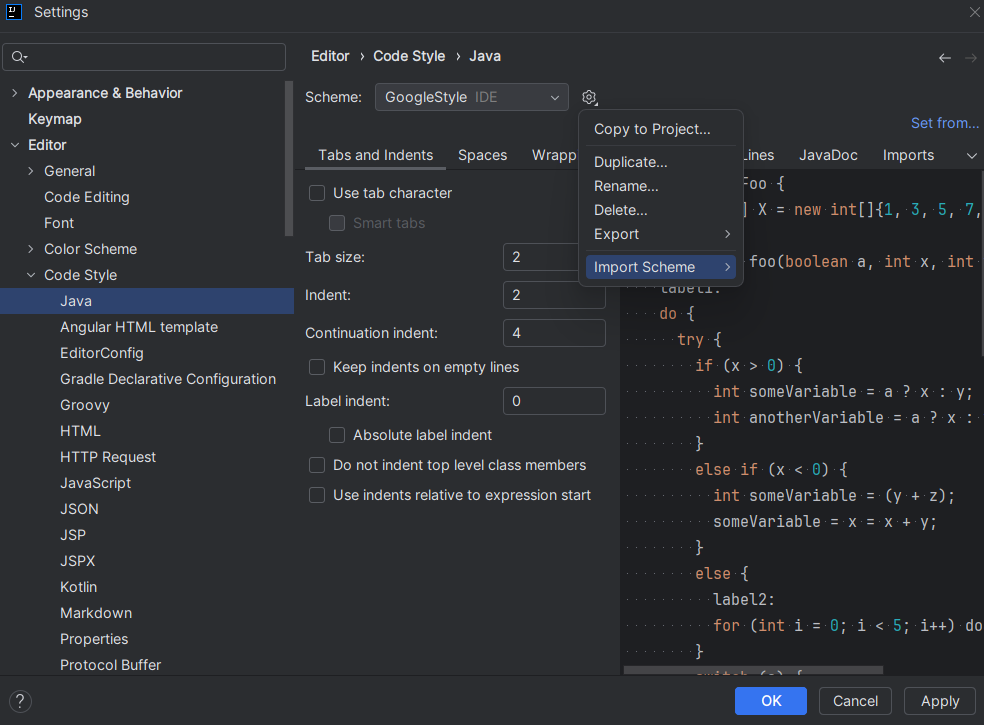
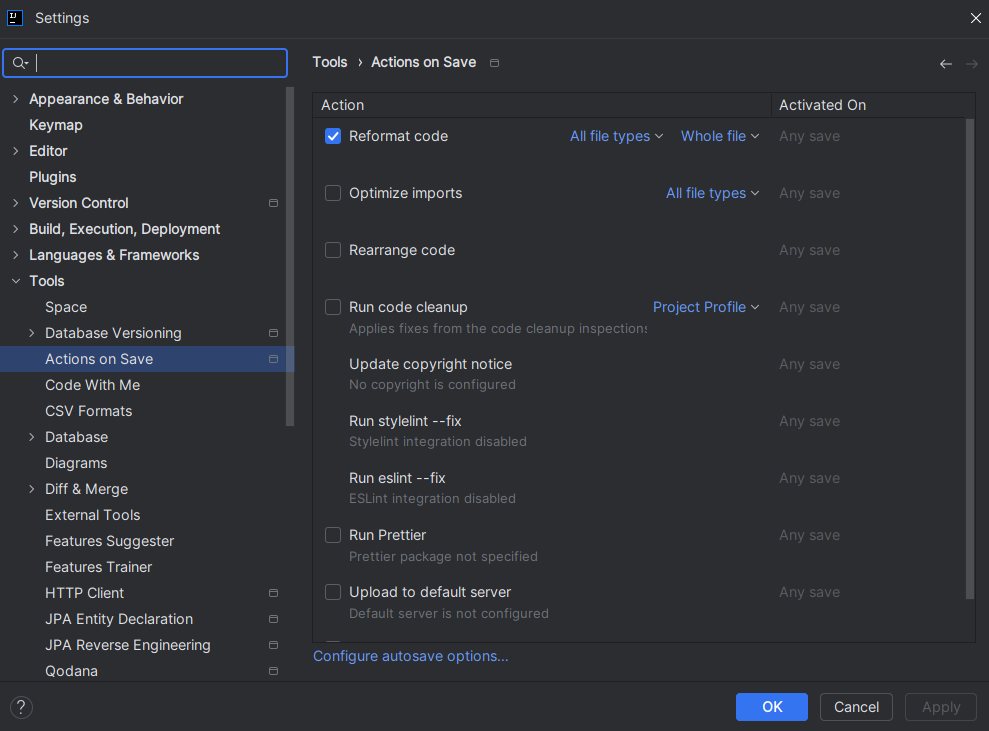
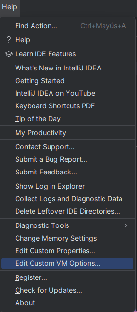
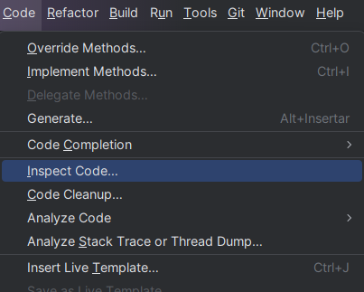
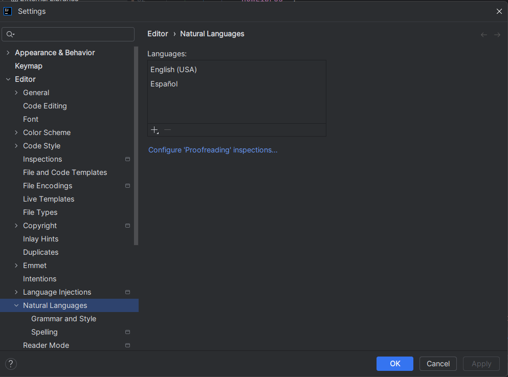

# Guías de estilo, naming convention, coding rules y linters en Java

## Introducción

En el ámbito del desarrollo de software, la consistencia y la claridad en la escritura del código son factores clave para garantizar la legibilidad, mantenibilidad y escalabilidad de los proyectos. A medida que los equipos crecen o los proyectos se vuelven más complejos, la adopción de guías de estilo y convenciones de nombres (naming conventions) se vuelve fundamental para establecer estándares comunes que faciliten la colaboración entre los programadores y aseguren un código limpio y fácil de entender.

Este documento recoge las pautas de estilo recomendadas para el desarrollo en Java, basadas en las convenciones oficiales de Oracle, y proporciona lineamientos sobre la elección de nombres para clases, métodos, variables y constantes, así como la organización del código. También abordaremos el uso de linters, herramientas que automatizan la validación del cumplimiento de estas guías, permitiendo detectar y corregir inconsistencias de estilo de forma eficiente.

En particular, cubriremos los siguientes aspectos:

- **Guías de Estilo**: Reglas sobre el formato y la estructura del código, como la indentación, el uso de espacios, la longitud de las líneas, el posicionamiento de llaves, y el uso de comentarios.  
- **Naming Convention**: Convenciones para asignar nombres a clases, variables, métodos y constantes, asegurando que el código sea fácil de seguir y entender.  
- **Configuración de Linters**: Implementación de linters en el entorno de desarrollo (IntelliJ IDEA) para automatizar la revisión del estilo y asegurar que se sigan las convenciones establecidas.

El objetivo es que este documento sirva como una referencia integral para la escritura de código claro y coherente, facilitando la colaboración entre los desarrolladores, reduciendo errores comunes y mejorando la calidad del código en general. Al final, la aplicación de estas buenas prácticas no solo mejora la legibilidad y mantenibilidad del código, sino que también sienta las bases para el desarrollo de software de alta calidad en proyectos de cualquier escala.

## Guía de estilos

Las guías de estilos recogen diferentes aspectos relacionados con el uso y organización o estructura del código, en relación a aspectos como el uso de los espacios, la longitud de las líneas, el uso de llaves, paréntesis o corchetes… y que facilitan la legibilidad del código. Existen diferentes guías de estilos ya propuestas por distintas organizaciones, aunque se pueden crear guías de estilos propias que encajen con la naturaleza del proyecto en el que estemos trabajando.

La guía de estilo más común para **Java** es la **Java Code Conventions** de **Oracle**, pero en la práctica, muchas organizaciones y proyectos usan también la **Google Java Style Guide**. A continuación se detallan cuáles son las más comunes y cuándo o por qué se suelen usar:

### Java Code Conventions (Oracle)

Esta es la guía oficial de Oracle para Java, publicada en 1997, y ha sido la base de muchas prácticas estándar en la comunidad de Java. Algunas de sus características clave incluyen:

- **Sangría de 4 espacios**.  
- **Longitud de línea recomendada de 80 caracteres**.  
- Reglas para nombres de clases, métodos, variables y constantes (PascalCase para clases, camelCase para métodos y variables, y mayúsculas para constantes).

**Ventajas**:

- Es la guía oficial de Java, por lo que está bien documentada y ampliamente aceptada.

**Contras**:

- Aunque sigue siendo muy utilizada, algunos consideran que está un poco desactualizada comparada con guías más modernas.

**Uso**: Se suele aplicar en proyectos que siguen de cerca las prácticas oficiales de Oracle o en entornos empresariales tradicionales.

Puedes encontrar el detalle en este enlace: [Java Code Conventions \- Oracle](https://www.oracle.com/java/technologies/javase/codeconventions-contents.html)

### Google Java Style Guide

La guía de estilo de Google es una de las más populares en proyectos modernos y de código abierto. Es conocida por ser estricta en algunos aspectos, lo que ayuda a mantener un estilo de código uniforme entre grandes equipos.

**Características clave**:

- **Sangría de 2 espacios**, en lugar de los 4 comunes en otros estilos.  
- **Longitud de línea de 100 caracteres**, un valor intermedio entre las guías más estrictas de 80 y las más permisivas de 120\.  
- Uso consistente de **espacios** en lugar de tabulaciones.  
- Enfoque en **claridad y simplicidad**.  
- Reglas más detalladas para la organización de importaciones y el formato de anotaciones.

**Ventajas**:

- Es muy utilizada en proyectos de código abierto, especialmente en proyectos con contribuciones de muchas personas.  
- La guía es más clara y detallada en muchos aspectos en comparación con las convenciones de Oracle.

**Contras**:

- Algunas personas prefieren la sangría de 4 espacios en lugar de 2, ya que consideran que los 2 espacios reducen la legibilidad en algunos casos.

**Uso**: Es común en proyectos modernos, especialmente los gestionados por grandes empresas de tecnología o en proyectos de código abierto en GitHub.

**Enlace**: [Google Java Style Guide](https://google.github.io/styleguide/javaguide.html)

### Sun Code Conventions

Esta fue la convención original creada por **Sun Microsystems**, la empresa que desarrolló Java antes de ser adquirida por Oracle. Básicamente, es el precursor de la guía de estilo de Oracle.

**Uso**: Ha sido reemplazada por la guía de Oracle, por lo que hoy en día no se usa directamente, pero algunos equipos antiguos pueden seguirla.

### Spring Framework Code Style

El equipo de desarrollo del **Spring Framework** tiene sus propias reglas de estilo de código. Si trabajas con **Spring** o proyectos basados en **Spring Boot**, es posible que adopten estas convenciones.

**Características clave**:

- Similar a la guía de Google, con algunas variaciones específicas para trabajar con el framework.  
- Se sigue una longitud de línea de **120 caracteres** en lugar de los 80 o 100 recomendados en otras guías.

**Uso**: Común entre proyectos que usan intensamente Spring, como en muchas aplicaciones empresariales.

**Enlace**: [Spring Java Format](https://github.com/spring-io/spring-javaformat)

### Airbnb Java Style Guide

Aunque Airbnb es más conocida por su guía de estilo para JavaScript, también tiene recomendaciones para Java en ciertos proyectos de código abierto.

**Características clave**:

- Similar a Google, pero menos formal en algunos aspectos.  
- Enfocado en el uso moderno de Java.

### ¿Cuál elegir?

A continuación de indica cómo podríamos elegir la guía de estilos:

- **Si buscas seguir los estándares oficiales**: La **Java Code Conventions (Oracle)** es la opción más clásica y segura.  
- **Si prefieres un estilo más moderno y ampliamente usado**: La **Google Java Style Guide** es la más recomendada, especialmente para proyectos con equipos distribuidos o de código abierto.  
- **Si usas frameworks específicos**: Si trabajas con **Spring**, podrías considerar adoptar las convenciones del equipo de Spring.

Para esta guía, trabajaremos con la guía de estilos de Google (Google Java Style Guide), por lo que se describirán sus aspectos más importantes, así como su configuración en el IDE Intellij IDEA.

## Reglas de Codificación (Coding Rules)

Las reglas de codificación establecen las prácticas que se deben seguir para mantener un código legible, coherente y fácil de mantener. A continuación, se detallan las 10 reglas más importantes de la **Google Java Style Guide**:

### Sangría de 2 espacios

Se utiliza una sangría de **2 espacios** por nivel de indentación, en lugar de tabulaciones o 4 espacios.

```java
public class Example {
  public void exampleMethod() {
    if (true) {
      System.out.println("Indented with 2 spaces");
    }
  }
}
```

### Longitud máxima de línea: 100 caracteres

Las líneas no deben exceder los **100 caracteres**. Si es necesario, las líneas largas deben dividirse para mejorar la legibilidad.

```java
// Incorrecto: Línea demasiado larga
String message = "This is an extremely long string that exceeds the recommended 100 character line length.";

// Correcto: Línea dividida
String message = "This is an extremely long string that exceeds the recommended "
               + "100 character line length.";
```

### Colocación de llaves

Las llaves deben abrirse en la **misma línea** que la declaración (`if`, `for`, `while`, etc.), y cerrarse en una línea separada.

```java
// Correcto
if (x == 1) {
  System.out.println("X is 1");
}
```

### Espacios en expresiones y declaraciones

Siempre debe haber un espacio después de las palabras clave (`if`, `for`, `while`), entre operadores (`+`, `-`, `=`, etc.), y después de las comas.

```java
// Correcto
if (x == 1) {
  y = x + 2;
}
```

### Uso de líneas en blanco

Se deben usar líneas en blanco para separar bloques de código relacionados, como métodos o secciones dentro de un método. Sin embargo, no debe haber más de una línea en blanco consecutiva.

```java
public class Example {
  private int count;

  public void increment() {
    count++;
  }

  public int getCount() {
    return count;
  }
}
```

### Comentarios

Los comentarios deben ser claros y concisos. Se deben utilizar **JavaDoc** para documentar clases y métodos públicos, y comentarios en línea (`//`) para anotar pequeñas explicaciones de bloques de código.

```java
/**
 * Calcula el área de un círculo.
 * 
 * @param radius El radio del círculo.
 * @return El área del círculo.
 */
public double calculateArea(double radius) {
  // Fórmula: Pi * radio * radio
  return Math.PI * radius * radius;
}
```

### Uso de paréntesis

Se recomienda el uso explícito de **paréntesis** en expresiones complejas para evitar confusiones en la precedencia de operadores.

```java
// Incorrecto
if (a == b && c == d || e == f) {
  // código
}

// Correcto
if ((a == b && c == d) || e == f) {
  // código
}
```

### Importaciones organizadas

No se deben utilizar **importaciones globales** (como `import java.util.*`). Se deben importar solo las clases que realmente se están utilizando.

```java
// Incorrecto
import java.util.*;

// Correcto
import java.util.List;
import java.util.ArrayList;
```

### Declaración de variables

Cada variable debe declararse en una línea propia. No se deben combinar múltiples declaraciones en una sola línea.

```java
// Incorrecto
int a, b;

// Correcto
int a;
int b;
```

### Organización del código

Las clases deben seguir un orden lógico: primero las **variables estáticas**, luego las **variables de instancia**, después los **constructores**, y finalmente los **métodos**.

```java
public class Example {
  // Variables estáticas
  private static final int MAX_COUNT = 100;

  // Variables de instancia
  private int count;

  // Constructor
  public Example() {
    this.count = 0;
  }

  // Métodos
  public void increment() {
    count++;
  }
}
```

## Convenciones de Nombres (Naming Conventions)

El uso adecuado de nombres es crucial para que el código sea comprensible y mantenible. En general, los nombres empleados para variables, constantes, clases, métodos, etc., deben ser descriptivos y completos, evitando el uso de diminutivos o nombres ambiguos. Las Google Java Style Guide rules no contemplan el uso de prefijos y sufijos para añadir información a las variables, como si hacen otras guias de estilo en otros lenguajes (por ejemplo, **Hungarian Notation** en C/C++.

Por destacar las más relevantes, la **Google Java Style Guide** establece las siguientes 10 convenciones de nombres clave para Java:

### Nombres de clases

Los nombres de clases deben usar **PascalCase** (la primera letra de cada palabra en mayúscula).

```java
public class EmployeeManager {
  // código
}
```

### Nombres de métodos

Los métodos deben seguir el formato **camelCase** y ser verbos que describan la acción que realizan.

```java
public void calculateSalary() {
  // código
}
```

### Nombres de variables

Las variables deben usar **camelCase** y tener nombres descriptivos que indiquen claramente su propósito.

```java
int employeeCount;
String firstName;
```

### Nombres de constantes

Las constantes deben escribirse en **mayúsculas**, con palabras separadas por guiones bajos (`_`).

```java
public static final int MAX_EMPLOYEES = 100;
```

### Nombres de interfaces

Las interfaces deben usar **PascalCase**, igual que las clases, y no deben llevar el prefijo "I" (como en algunos lenguajes).

```java
public interface EmployeeService {
  void hireEmployee();
}
```

### Nombres de paquetes

Los nombres de paquetes deben estar en **minúsculas** y reflejar la estructura del proyecto o el dominio de la organización.

```java
package com.mycompany.hr;
```

### Nombres de parámetros de método

Los parámetros de método deben ser en **camelCase** y lo suficientemente descriptivos para indicar su uso.

```java
public void setEmployeeName(String employeeName) {
  // código
}
```

### Nombres de tipos genéricos

Para tipos genéricos en clases o métodos, se debe utilizar una letra en mayúscula (generalmente `T` para "Type"), o una letra descriptiva si se trata de algo específico (como `E` para "Element").

```java
public class Box<T> {
  private T item;
  
  public void setItem(T item) {
    this.item = item;
  }
}
```

### Nombres de excepciones

Las clases que representan excepciones deben terminar en **"Exception"**.

```java
public class EmployeeNotFoundException extends Exception {
  // código
}
```

### Nombres de variables booleanas

Las variables booleanas deben comenzar con **"is"**, **"has"**, o alguna expresión que refleje un estado o condición.

```java
boolean isActive;
boolean hasPermission;
```

## Configuración de linter en el IDE

En este apartado, abordaremos el concepto de **linter**, su relación con los **analizadores estáticos de código**, las diferencias entre ambos, y cómo configurar el uso de la **Guía de Estilos de Google** en el entorno de desarrollo integrado (IDE) **IntelliJ IDEA**.

### ¿Qué es un Linter?

Un **linter** es una herramienta que se utiliza para analizar el código fuente en busca de errores o inconsistencias en cuanto a **estilo** y **convenciones** de codificación. El objetivo principal de un linter es mejorar la legibilidad y mantener la coherencia en el código. Detecta problemas como:

- Mala indentación.  
- Nombres de variables mal definidos.  
- Uso incorrecto de llaves y paréntesis.  
- Falta de comentarios o comentarios incorrectos.

El linter revisa el código antes de la compilación, asegurándose de que siga un conjunto de reglas definidas (como la Guía de Estilos de Google) y previniendo errores o prácticas de codificación poco recomendadas.

### ¿Qué es un Analizador Estático de Código?

Un **analizador estático de código** es una herramienta que examina el código fuente sin ejecutarlo, evaluando la estructura y el flujo de control para identificar posibles errores, problemas de seguridad o ineficiencias en el rendimiento. A diferencia de los linters, los analizadores estáticos no solo se enfocan en el estilo, sino también en la **calidad técnica** del código.

Los analizadores estáticos pueden detectar:

- Variables no inicializadas.  
- Código inalcanzable.  
- Posibles fugas de memoria.  
- Errores lógicos.

### Diferencias entre Linter y Analizador Estático de Código

Aunque ambos se utilizan para mejorar el código antes de la ejecución, las principales diferencias entre un **linter** y un **analizador estático** son:

| Característica | Linter | Analizador Estático de Código |
| ----- | ----- | ----- |
| **Enfoque** | Verifica el estilo y las convenciones de codificación. | Evalúa la calidad técnica y lógica del código. |
| **Errores detectados** | Principalmente errores de formato, estilo o convención. | Errores técnicos, de rendimiento y seguridad. |
| **Profundidad** | Superficial (centrado en el formato y estructura). | Profundo (incluye análisis del flujo de control y estructuras internas). |
| **Objetivo** | Mantener el código legible y coherente. | Mejorar la calidad del código y evitar errores en tiempo de ejecución. |

Por lo tanto, mientras que el **linter** ayuda a mantener un código limpio y consistente según unas reglas predefinidas (como la Guía de Estilos de Google), el **analizador estático de código** es más amplio, detectando errores que pueden causar problemas en la ejecución o afectando el rendimiento.

### Configuración del Linter en IntelliJ IDEA

IntelliJ IDEA es uno de los entornos de desarrollo más populares y potentes para trabajar con Java. Para asegurar que el código sigue las pautas de la **Guía de Estilos de Google**, es posible configurar un linter que valide automáticamente el código y señale cualquier violación de estilo o convención.

A continuación se detallan los pasos para configurar la Guía de Estilos de Google en IntelliJ IDEA:

1. **Instalar el plugin de Google Java Style Guide:**  
   - Abre IntelliJ IDEA.  
   - Ve a `File` \> `Settings` (o `Preferences` en macOS).  
   - En el menú lateral, selecciona `Plugins`.  
   - Busca **"Google Java Format"** en el cuadro de búsqueda.  
   - Instala el plugin llamado **Google Java Format**.  
   - Reinicia IntelliJ IDEA para activar el plugin.  
2. **Configurar el formato de código:**  
   - Ve a `File` \> `Settings` (o `Preferences` en macOS).  
   - En el menú lateral, navega a `Editor` \> `Code Style`.  
   - Selecciona **Java** en el menú desplegable.  
   - Haz clic en el botón `Manage Schemes` (esquina superior derecha, botón con forma de engranaje).  
   - Selecciona **Import Scheme** \> **Google Style Guide**.  
   - Si el archivo de configuración no está preinstalado, puedes **descargar** el archivo de configuración de la Guía de Estilos de Google desde su [repositorio oficial](https://github.com/google/styleguide/blob/gh-pages/intellij-java-google-style.xml).  
   - Importa el archivo `.xml` descargado.

    

3. **Aplicar el formato automáticamente:**  
   - Puedes configurar IntelliJ IDEA para que aplique automáticamente las reglas de formato cada vez que guardes o antes de cada commit.  
   - Ve a `File` \> `Settings` (o `Preferences` en macOS).  
   - En el menú lateral, selecciona `Tools` \> `Actions on Save`.  
   - Marca la opción **Reformat code**. Esto hará que IntelliJ IDEA aplique el formato de acuerdo con la Guía de Estilos de Google cada vez que guardes un archivo. 

    

4. **IntelliJ JRE Config**:  
   - Tal y como se indica [aquí](https://github.com/google/google-java-format/blob/master/README.md#intellij-jre-config), “*The google-java-format plugin uses some internal classes that aren't available without extra configuration. To use the plugin, you need to add some options to your IDE's Java runtime. To do that, go to Help→Edit Custom VM Options... and paste in these lines. Once you've done that, restart the IDE*:

    ```plaintext
    --add-exports=jdk.compiler/com.sun.tools.javac.api=ALL-UNNAMED
    --add-exports=jdk.compiler/com.sun.tools.javac.code=ALL-UNNAMED
    --add-exports=jdk.compiler/com.sun.tools.javac.file=ALL-UNNAMED
    --add-exports=jdk.compiler/com.sun.tools.javac.parser=ALL-UNNAMED
    --add-exports=jdk.compiler/com.sun.tools.javac.tree=ALL-UNNAMED
    --add-exports=jdk.compiler/com.sun.tools.javac.util=ALL-UNNAMED
    ```

    

5. **Ejecutar un análisis de código:**  
   - IntelliJ tiene un linter integrado que puedes usar para revisar tu código en busca de problemas de estilo.  
   - Ve a `Code` \> `Inspect Code`.  
   - Selecciona el alcance del análisis (puede ser el proyecto completo, una clase, o un archivo).  
   - IntelliJ marcará todas las violaciones a las reglas de estilo con advertencias que puedes revisar y corregir.

    

### Análisis Estático Adicional: SonarLint

Aunque IntelliJ IDEA tiene su propio sistema de análisis estático, puedes instalar **SonarLint**, una herramienta avanzada de análisis estático de código que se integra con IntelliJ IDEA para ofrecer análisis en tiempo real. Esto complementa las capacidades del linter y ayuda a identificar problemas de calidad y seguridad en el código.

Pasos para instalar SonarLint:

1. Abre **IntelliJ IDEA**.  
   - Ve a `File` \> `Settings` (o `Preferences` en macOS).  
   - En el menú lateral, selecciona `Plugins`.  
   - Busca **SonarLint**.  
   - Instala el plugin y reinicia el IDE.  
2. Tras la instalación, SonarLint analizará automáticamente tu código en busca de errores de calidad.

Es posible que haya reportes de SonarLint a los que no queramos hacer caso en ciertos momentos. Por ejemplo, SonarLint recomienda NO utilizar `System.out.println` y utilizar, en su lugar, un `Logger`. Por el momento podemos obviar esa recomendación. Para ello, podemos suprimir el warning arrojado de la siguiente forma:

- Ubicamos el cursor encima de la expresión `System.out`  
- Pulsamos en `More actions…`
- Hacemos click en `Disable rule`.

Esto lo podemos aplicar para todas aquellas reglas que no queremos que se evalúen, aunque no debemos abusar de la supresión de evaluaciones.

## Errores Typo en Intellij IDEA

IntelliJ IDEA incluye una función de corrección de errores tipográficos (Typo) que resalta las palabras mal escritas en el código y sugiere correcciones. Esto es útil para detectar errores de escritura y mejorar la calidad del código. Por defecto, viene configurado para el idioma inglés, por lo que si nombras tus variables, métodos, o clases, en español, el IDE marcará como errores tipográficos las palabras que no reconozca. Podemos añadir nuevos idiomas o personalizar las reglas de corrección de errores tipográficos en IntelliJ IDEA.

Para añadir el español como lenguaje natural, debemos ir a `file` \> `settings` \> `Editor` \> `Natural Language` y añadir el idioma español. De esta forma, IntelliJ IDEA corregirá los errores tipográficos en español.



## Automatización del Formato de Código en Git

En un nivel más avanzado, y para facilitar el trabajo y asegurar que todos los desarrolladores de un equipo sigan la misma guía de estilo, se puede automatizar la aplicación de la Guía de Estilos de Google. Esto puede hacerse integrando el formato en el flujo de trabajo de integración continua (CI) o creando **ganchos pre-commit** en Git que validen el formato del código antes de permitir que se haga un commit.

**Hook de Pre-Commit con Google Java Format:**

1. Crea un archivo `.git/hooks/pre-commit` en tu proyecto.

    Escribe un script para ejecutar `google-java-format` como parte del hook de pre-commit:

    ```bash
    #!/bin/sh
    ./gradlew googleJavaFormat
    ```

2. Haz el script ejecutable:

    ```bash
    chmod +x .git/hooks/pre-commit
    ```

De esta manera, cualquier intento de hacer commit con código que no siga las reglas de formato será rechazado hasta que se ajuste correctamente.

## Conclusiones

La implementación de guías de estilo y convenciones de nomenclatura es fundamental para mantener la calidad y la legibilidad del código en el desarrollo de software. A lo largo de este documento, se ha destacado la importancia de adoptar estándares uniformes que no solo mejoren la comprensión del código, sino que también faciliten la colaboración entre los miembros del equipo.

1. **Mejora en la Legibilidad**: Seguir una guía de estilo, como la Guía de Estilo de Google para Java, garantiza que el código sea consistente y fácil de leer, lo que es crucial para el mantenimiento a largo plazo.  
2. **Reducción de Errores**: Al aplicar convenciones de nomenclatura claras y consistentes, se minimizan los errores comunes y se mejora la capacidad para identificar problemas en el código.  
3. **Eficiencia en el Desarrollo**: La utilización de herramientas como linters y formateadores automáticos permite a los desarrolladores centrarse en la lógica del negocio en lugar de preocuparse por detalles de formato. Esto aumenta la eficiencia en el proceso de desarrollo.  
4. **Facilitación del Trabajo en Equipo**: Con un estilo de codificación uniforme, los nuevos miembros del equipo pueden integrarse más rápidamente, entendiendo y contribuyendo al código existente sin necesidad de un largo periodo de adaptación.  
5. **Configuración del Entorno de Desarrollo**: Configurar adecuadamente el IDE y las herramientas de análisis estático, como SonarLint, permite a los desarrolladores recibir retroalimentación en tiempo real sobre su código, ayudando a detectar y corregir violaciones de estilo de manera temprana.  
6. **Prácticas Continuas**: La adopción de estas prácticas no debe ser vista como un ejercicio único, sino como un proceso continuo que requiere revisión y adaptación a medida que el equipo y los proyectos evolucionan.
