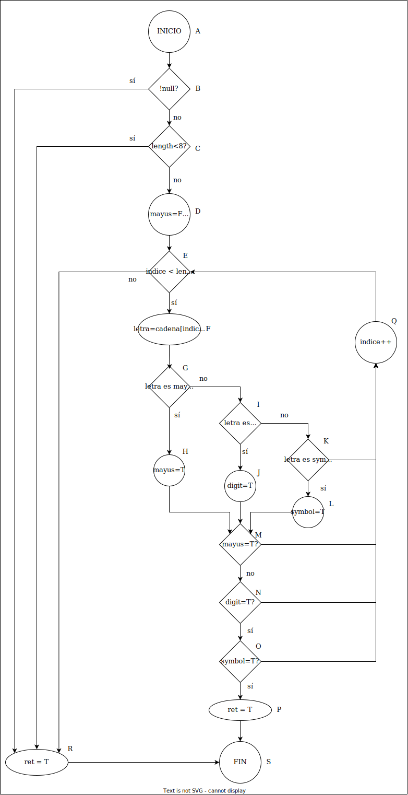
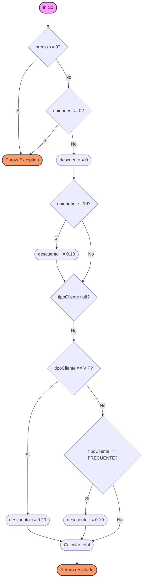
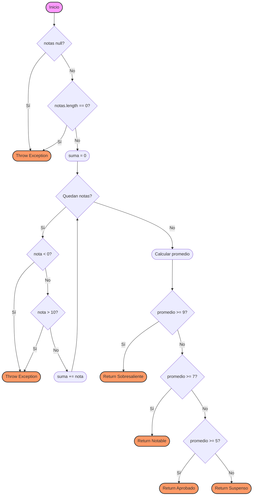
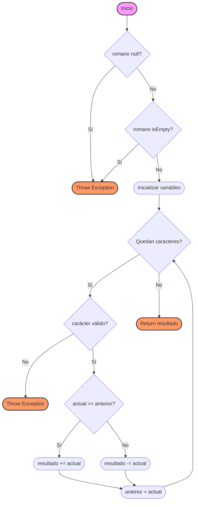
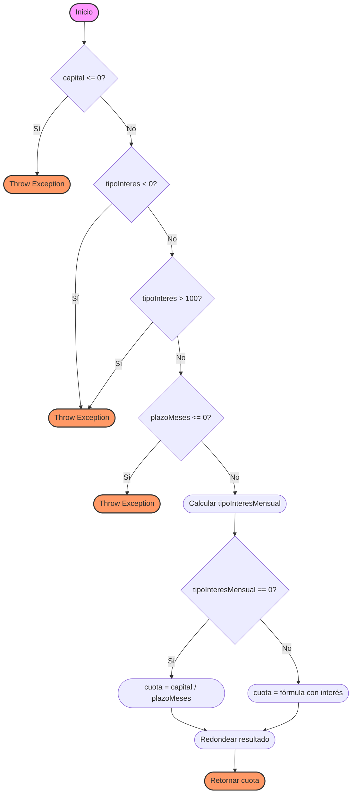

# SOLUCIONES DEL BOLETÍN UD5

## 1. SOLUCIÓN EJERCICIO 1: Validador de Contraseñas

### 1.1. Grafo de Flujo

Nodos:

1. A: Inicio.
2. B: Verifica si password es null.
3. C: Verifica si la longitud de password es menor que 8.
4. D:: Inicializa las variables tieneMayuscula, tieneNumero y tieneEspecial y el indice del for.
5. E: Verifica si quedan caracteres por procesar (índice < longitud de password).
6. F: asigna a letra el carácter actual de password.
7. G: Verifica si el carácter actual es una mayúscula.
8. H: Establece tieneMayuscula como true.
9. I: Verifica si el carácter actual es un dígito.
10. J: Establece tieneNumero como true.
11. K: Verifica si el carácter es un símbolo.
12. L: Establece tieneSimbolo como true.
13. M: Verifica si tieneMayuscula es verdadero.
14. N: Verifica si tieneNumero es verdadero.
15. O: Verifica si tieneSimbolo es verdadero.
16. P: asigna true a la variable retorno.
17. Q: incrementa el índice.
18. R: asigna false a la variable retorno.
19. S: Retorna el valor de retorno.



### 1.2. Complejidad Ciclomática

$ V(G) = a - n + 2 = 27 - 19 + 2 = 10 $

$ V(G) = r = 10 $  

$ V(G) = c + 1 = 9 + 1 = 10$  

### 1.3. Caminos Independientes

1. Password null → false
2. Password corto → false
3. Password sin mayúscula, número ni símbolo → false
4. Password sin número ni símbolo → false
5. Password sin mayúscula ni símbolo → false
6. Password sin mayúscula ni número → false
7. Password sin mayúscula → false
8. Password sin número → false
9. Password sin símbolo → false
10. Password cumple todos los requisitos → true

### 1.4. Casos de Prueba

1. `validarPassword(null)` → false
2. `validarPassword("abc")` → false
3. `validarPassword("abcdefghi")` → false
4. `validarPassword("abcdefGHI")` → false
5. `validarPassword("abcdef122")` → false
6. `validarPassword("abcdef¿?_")` → false
7. `validarPassword("abcd123¿?")` → false
8. `validarPassword("abcdEFG¿?)` → false
9. `validarPassword("abcdEFG123` → false
10. `validarPassword("abcdefghE1@")` → true

| **Camino** | **Ruta**                                                                 | **Condiciones**                                                                                     | **Resultado esperado** |
|------------|--------------------------------------------------------------------------|-----------------------------------------------------------------------------------------------------|-------------------------|
| 1          | $A \rightarrow B \rightarrow R \rightarrow P$                          | `password` es `null`.                                                                              | `retorno = false`       |
| 2          | $A \rightarrow B \rightarrow C \rightarrow R \rightarrow P$                          | `password` no es `null` y `length < 8`.                                                            | `retorno = false`       |
| 3          | $A \rightarrow B \rightarrow C \rightarrow D \rightarrow E \rightarrow G \rightarrow G \rightarrow I \rightarrow K \rightarrow Q  ... \rightarrow R \rightarrow P$ | `password` no es `null`, `length >= 8`, y no quedan caracteres para procesar.                      | `retorno = false`       |
| 4          | ... | ... | ... |


### **Casos de prueba resumidos**

| **Caso** | **Entrada**       | **Condiciones**                                                                                     | **Resultado esperado** |
|----------|-------------------|-----------------------------------------------------------------------------------------------------|-------------------------|
| 1        | `password = null` | `password` es `null`.                                                                               | `retorno = false`       |
| 2        | `password = "abc"` | `password` no es `null` y `length < 8`.                                                            | `retorno = false`       |
| 3        | `password = "abcdefg"` | `password` no es `null`, `length >= 8`, y no quedan caracteres para procesar.                  | `retorno = false`       |
| 4        | `password = "abcdefGHI"` | `password` no es `null`, `length >= 8`, y no hay números ni símbolos especiales.             | `retorno = false`       |
| 5        | `password = "abcdef122"` | `password` no es `null`, `length >= 8`, y no hay mayúsculas ni símbolos especiales.          | `retorno = false`       |
| 6        | .... | ... | ... |
| 10       | `password = "abcdefghE1@"` | `password` no es `null`, `length >= 8`, y cumple todos los requisitos.                     | `retorno = true`        |

## 2. SOLUCIÓN EJERCICIO 2: Calculador de Descuentos

### 2.1. Grafo de Flujo

Nodos:

1. A: Inicio.
2. B: Verifica si precio <= 0.
3. C: Lanza una excepción si precio o unidades son inválidos.
4. D: Verifica si unidades <= 0.
5. E: Inicializa descuento = 0.
6. F: Verifica si unidades >= 10.
7. G: Aplica un descuento del 10% si unidades >= 10.
8. H: Verifica si tipoCliente es null.
9. I: Verifica si tipoCliente es VIP.
10. J: Aplica un descuento del 20% si tipoCliente es VIP.
11. K: Verifica si tipoCliente es FRECUENTE.
12. L: Aplica un descuento del 10% si tipoCliente es FRECUENTE.
13. M: Calcula el precio final con el descuento aplicado.
14. N: Retorna el resultado.



### 2.2. Complejidad Ciclomática

a) V(G) = A - N + 2
- Aristas = 17
- Nodos = 14
V(G) = 17 - 14 + 2 = 5

b) V(G) = P + 1
- Predicados = 4 (validación, unidades, tipo cliente)
V(G) = 4 + 1 = 5

c) V(G) = R = 8 

### 2.3. Caminos Independientes

1. Parámetros inválidos → excepción
2. Sin descuentos
3. Descuento solo por volumen
4. Descuento VIP con volumen

### 2.4. Casos de Prueba

1. `calcularDescuento(-100, 5, "VIP")` → IllegalArgumentException
2. `calcularDescuento(100, 5, null)` → 500.0
3. `calcularDescuento(100, 15, null)` → 450.0
4. `calcularDescuento(100, 15, "VIP")` → 350.0

## 3. SOLUCIÓN EJERCICIO 3: Validador de Fechas

### 3.1. Grafo de Flujo

Nodos:

1. A: Inicio.
2. B: Verifica si año < 1900.
3. C: Retorna false si el año es inválido.
4. D: Verifica si año > 2100.
5. E: Verifica si mes < 1.
6. F: Verifica si mes > 12.
7. G: Verifica si es febrero y el año es bisiesto.
8. H: Verifica si el día está entre 1 y 29 (febrero bisiesto).
9. I: Verifica si el día está dentro del rango válido para el mes actual.
10. J: Retorna true si la fecha es válida.
11. K: Retorna false si la fecha es inválida.

```mermaid
flowchart TD
    A([Inicio]) --> B{año < 1900?}
    B -->|Sí| C([Return false])
    B -->|No| D{año > 2100?}
    D -->|Sí| C
    D -->|No| E{mes < 1?}
    E -->|Sí| C
    E -->|No| F{mes > 12?}
    F -->|Sí| C
    F -->|No| G{mes == 2 y año bisiesto?}
    G -->|Sí| H{1 <= día <= 29?}
    G -->|No| I{1 <= día <= diasPorMes[mes-1]?}
    H -->|Sí| J([Return true])
    H -->|No| K([Return false])
    I -->|Sí| J
    I -->|No| K

    style A fill:#f9f,stroke:#333,stroke-width:2px
    style C fill:#f96,stroke:#333
```

### 3.2. Complejidad Ciclomática

a) V(G) = A - N + 2
- Aristas = 9
- Nodos = 7
V(G) = 9 - 7 + 2 = 4

b) V(G) = P + 1
- Predicados = 3 (año válido, mes válido, bisiesto)
V(G) = 3 + 1 = 4

c) V(G) = R + 1
- Regiones = 3
V(G) = 3 + 1 = 4

### 3.3. Caminos Independientes
1. Año inválido
2. Mes inválido
3. Fecha válida en mes normal
4. Fecha válida en febrero bisiesto

### 3.4. Casos de Prueba
1. `esFechaValida(1, 1, 1800)` → false
2. `esFechaValida(1, 13, 2000)` → false
3. `esFechaValida(31, 7, 2023)` → true
4. `esFechaValida(29, 2, 2024)` → true

## 4. SOLUCIÓN EJERCICIO 4: Evaluador de Calificaciones

### 4.1. Grafo de Flujo

Nodos:

1. A: Inicio.
2. B: Verifica si notas es null.
3. C: Lanza una excepción si notas es null o está vacío.
4. D: Verifica si notas.length == 0.
5. E: Inicializa suma = 0.
6. F: Verifica si quedan notas por procesar.
7. G: Verifica si nota < 0.
8. H: Lanza una excepción si la nota es inválida.
9. I: Verifica si nota > 10.
10. J: Suma la nota al total.
11. K: Calcula el promedio.
12. L: Verifica si el promedio es mayor o igual a 9.
13. M: Retorna Sobresaliente.
14. N: Verifica si el promedio es mayor o igual a 7.
15. O: Retorna Notable.
16. P: Verifica si el promedio es mayor o igual a 5.
17. Q: Retorna Aprobado.
18. R: Retorna Suspenso.



### 4.2. Complejidad Ciclomática

a) V(G) = A - N + 2
- Aristas = 13
- Nodos = 11
V(G) = 13 - 11 + 2 = 4

b) V(G) = P + 1
- Predicados = 3 (array válido, notas válidas, rangos de calificación)
V(G) = 3 + 1 = 4

c) V(G) = R + 1
- Regiones = 3
V(G) = 3 + 1 = 4

### 4.3. Caminos Independientes

1. Array inválido → excepción
2. Nota inválida → excepción
3. Notas con promedio sobresaliente
4. Notas con promedio suspenso

### 4.4. Casos de Prueba

1. `evaluarCalificacion(null)` → IllegalArgumentException
2. `evaluarCalificacion(new int[]{11})` → IllegalArgumentException
3. `evaluarCalificacion(new int[]{9, 9, 9})` → "Sobresaliente"
4. `evaluarCalificacion(new int[]{4, 4, 4})` → "Suspenso"

## 5. SOLUCIÓN EJERCICIO 5: Conversor de Números Romanos

### 5.1. Grafo de Flujo

Nodos:

1. A: Inicio.
2. B: Verifica si romano es null.
3. C: Lanza una excepción si romano es null o está vacío.
4. D: Verifica si romano.isEmpty().
5. E: Inicializa las variables.
6. F: Verifica si quedan caracteres por procesar.
7. G: Verifica si el carácter es válido.
8. H: Lanza una excepción si el carácter no es válido.
9. I: Verifica si actual >= anterior.
10. J: Suma el valor actual al resultado.
11. K: Resta el valor actual al resultado.
12. L: Actualiza anterior.
13. M: Retorna el resultado.



### 5.2. Complejidad Ciclomática

a) V(G) = A - N + 2
- Aristas = 12
- Nodos = 10
V(G) = 12 - 10 + 2 = 4

b) V(G) = P + 1
- Predicados = 3 (entrada válida, carácter válido, comparación valores)
V(G) = 3 + 1 = 4

c) V(G) = R + 1
- Regiones = 3
V(G) = 3 + 1 = 4

### 5.3. Caminos Independientes

1. String inválido → excepción
2. Carácter inválido → excepción
3. Número romano simple
4. Número romano con restas

### 5.4. Casos de Prueba

1. `romanoADecimal(null)` → IllegalArgumentException
2. `romanoADecimal("ABC")` → IllegalArgumentException
3. `romanoADecimal("XVI")` → 16
4. `romanoADecimal("IV")` → 4

## 6. SOLUCIÓN EJERCICIO 6: Calculadora de Cuotas Mensuales

### 6.1. Grafo de Flujo

El grafo de flujo del método es el siguiente:



Nodos identificados:

1. A: Inicio.
2. B: Verifica si capital <= 0.
3. C: Lanza una excepción si el capital es inválido.
4. D: Verifica si tipoInteres < 0.
5. E: Lanza una excepción si el tipo de interés es inválido.
6. F: Verifica si tipoInteres > 100.
7. G: Verifica si plazoMeses <= 0.
8. H: Lanza una excepción si el plazo es inválido.
9. I: Calcula tipoInteresMensual.
10. J: Verifica si tipoInteresMensual == 0.
11. K: Calcula la cuota sin interés.
12. L: Calcula la cuota con interés.
13. M: Redondea el resultado.
14. N: Retorna la cuota.

### 6.2. Complejidad Ciclomática

a) V(G) = Aristas - Nodos + 2
- Aristas = 16 (incluyendo las aristas implícitas de la condición compuesta)
- Nodos = 13
- V(G) = 16 - 13 + 2 = 5

b) V(G) = Nodos Predicado + 1
Nodos predicado:
1. capital <= 0
2. tipoInteres < 0 || tipoInteres > 100
3. plazoMeses <= 0
4. tipoInteresMensual == 0

V(G) = 4 + 1 = 5

c) V(G) = Regiones cerradas + 1
Regiones identificadas:

1. Camino de error capital
2. Camino de error tipo interés
3. Camino de error plazo
4. Camino cálculo sin interés
5. Camino cálculo con interés

V(G) = 4 + 1 = 5

Los tres métodos coinciden en V(G) = 5, lo que indica que necesitamos 5 casos de prueba para cubrir todos los caminos.

### 6.3. Caminos Independientes

1. Camino 1: A-B-C (error por capital)
2. Camino 2: A-B-D-E (error por tipo de interés)
3. Camino 3: A-B-D-F-G (error por plazo)
4. Camino 4: A-B-D-F-H-I-J-L-M (cálculo sin interés)
5. Camino 5: A-B-D-F-H-I-K-L-M (cálculo con interés)

### 6.4. Casos de Prueba

1. `calcularCuotaMensual(-1000, 12, 12)` → IllegalArgumentException("El capital del préstamo debe ser positivo")
2. `calcularCuotaMensual(1000, 101, 12)` → IllegalArgumentException("El tipo de interés debe estar entre 0 y 100")
3. `calcularCuotaMensual(1000, 12, 0)` → IllegalArgumentException("El plazo debe ser positivo")
4. `calcularCuotaMensual(1000, 0, 12)` → 83.33
5. `calcularCuotaMensual(1000, 12, 12)` → 88.85
