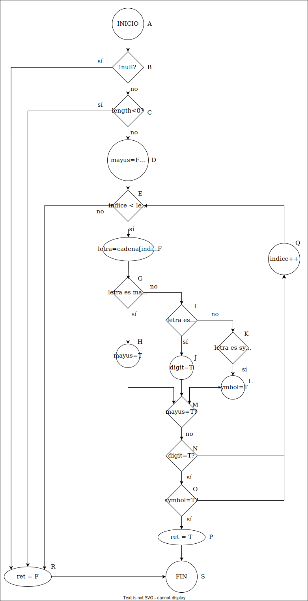

# SOLUCIONES DEL BOLETÍN UD5

## 1. SOLUCIÓN EJERCICIO 1: Validador de Contraseñas

### 1.1. Grafo de Flujo

Nodos:

1. A: Inicio.
2. B: Verifica si password es null.
3. C: Verifica si la longitud de password es menor que 8.
4. D:: Inicializa las variables tieneMayuscula, tieneNumero y tieneEspecial y el indice del for.
5. E: Verifica si quedan caracteres por procesar (índice < longitud de password).
6. F: asigna a letra el carácter actual de password.
7. G: Verifica si el carácter actual es una mayúscula.
8. H: Establece tieneMayuscula como true.
9. I: Verifica si el carácter actual es un dígito.
10. J: Establece tieneNumero como true.
11. K: Verifica si el carácter es un símbolo.
12. L: Establece tieneSimbolo como true.
13. M: Verifica si tieneMayuscula es verdadero.
14. N: Verifica si tieneNumero es verdadero.
15. O: Verifica si tieneSimbolo es verdadero.
16. P: asigna true a la variable retorno.
17. Q: incrementa el índice.
18. R: asigna false a la variable retorno.
19. S: Retorna el valor de retorno.

### 1.2. Complejidad Ciclomática

$ V(G) = a - n + 2 = 27 - 19 + 2 = 10 $

$ V(G) = r = 10 $  

$ V(G) = c + 1 = 9 + 1 = 10$  

### 1.3. Caminos Independientes

1. Password null → false
2. Password corto → false
3. Password sin mayúscula, número ni símbolo → false
4. Password sin número ni símbolo → false
5. Password sin mayúscula ni símbolo → false
6. Password sin mayúscula ni número → false
7. Password sin mayúscula → false
8. Password sin número → false
9. Password sin símbolo → false
10. Password cumple todos los requisitos → true

### 1.4. Casos de Prueba

1. `validarPassword(null)` → false
2. `validarPassword("abc")` → false
3. `validarPassword("abcdefghi")` → false
4. `validarPassword("abcdefGHI")` → false
5. `validarPassword("abcdef122")` → false
6. `validarPassword("abcdef¿?_")` → false
7. `validarPassword("abcd123¿?")` → false
8. `validarPassword("abcdEFG¿?)` → false
9. `validarPassword("abcdEFG123` → false
10. `validarPassword("abcdefghE1@")` → true

| **Camino** | **Ruta**                                                                 | **Condiciones**                                                                                     | **Resultado esperado** |
|------------|--------------------------------------------------------------------------|-----------------------------------------------------------------------------------------------------|-------------------------|
| 1          | $A \rightarrow B \rightarrow R \rightarrow P$                          | `password` es `null`.                                                                              | `retorno = false`       |
| 2          | $A \rightarrow B \rightarrow C \rightarrow R \rightarrow P$                          | `password` no es `null` y `length < 8`.                                                            | `retorno = false`       |
| 3          | $A \rightarrow B \rightarrow C \rightarrow D \rightarrow E \rightarrow G \rightarrow G \rightarrow I \rightarrow K \rightarrow Q  ... \rightarrow R \rightarrow P$ | `password` no es `null`, `length >= 8`, y no quedan caracteres para procesar.                      | `retorno = false`       |
| 4          | ... | ... | ... |

### **Casos de prueba resumidos**

| **Caso** | **Entrada**       | **Condiciones**                                                                                     | **Resultado esperado** |
|----------|-------------------|-----------------------------------------------------------------------------------------------------|-------------------------|
| 1        | `password = null` | `password` es `null`.                                                                               | `retorno = false`       |
| 2        | `password = "abc"` | `password` no es `null` y `length < 8`.                                                            | `retorno = false`       |
| 3        | `password = "abcdefg"` | `password` no es `null`, `length >= 8`, y no quedan caracteres para procesar.                  | `retorno = false`       |
| 4        | `password = "abcdefGHI"` | `password` no es `null`, `length >= 8`, y no hay números ni símbolos especiales.             | `retorno = false`       |
| 5        | `password = "abcdef122"` | `password` no es `null`, `length >= 8`, y no hay mayúsculas ni símbolos especiales.          | `retorno = false`       |
| 6        | .... | ... | ... |
| 10       | `password = "abcdefghE1@"` | `password` no es `null`, `length >= 8`, y cumple todos los requisitos.                     | `retorno = true`        |

## 2. SOLUCIÓN EJERCICIO 2: Calculador de Descuentos

## 3. SOLUCIÓN EJERCICIO 3: Validador de Fechas

## 4. SOLUCIÓN EJERCICIO 4: Evaluador de Calificaciones

## 5. SOLUCIÓN EJERCICIO 5: Conversor de Números Romanos

## 6. SOLUCIÓN EJERCICIO 6: Calculadora de Cuotas Mensuales