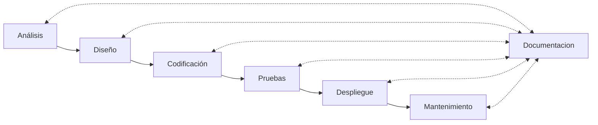

# UD6 - Optimización y Documentación

- [1. Introducción a la optimización: concepto de refactorización](#1-introducción-a-la-optimización-concepto-de-refactorización)
- [2. Introducción a la documentación](#2-introducción-a-la-documentación)

Hasta este momento del curso hemos revisado diferentes fases y procesos del ciclo de vida del desarrollo de software. En esta unidad vamos a revisar dos aspectos fundamentales en el desarrollo de software: la optimización y la documentación.

## 1. Introducción a la optimización: concepto de refactorización

La refactorización es una técnica de la ingeniería del software que se utiliza para mejorar la estructura interna de un programa **sin cambiar su comportamiento externo**. Es decir, se trata de modificar el código fuente de un programa para hacerlo más fácil de entender y de mantener, sin cambiar su funcionalidad.

Algunos de los beneficios que ofrece la refactorización son:

- **Mejora la legibilidad del código**: al refactorizar un programa, se eliminan los elementos innecesarios y se simplifica la estructura del código, lo que facilita su comprensión.
- **Facilita la detección y corrección de errores**: al simplificar la estructura del código, se hace más fácil identificar y corregir los errores que puedan existir en
- **Facilita la incorporación de nuevas funcionalidades**: al tener un código más limpio y ordenado, es más sencillo añadir nuevas funcionalidades al programa. Ojo, porque esto no significa que se puedan añadir nuevas funcionalidades en el proceso de refactorización; todo lo contrario, nunca se deben cambiar las funcionalidades del programa en este proceso.
- **Facilita la colaboración entre desarrolladores**: un código bien estructurado y fácil de entender facilita la colaboración entre los miembros de un equipo de desarrollo.
- **Reduce el tiempo y el coste de mantenimiento**: al tener un código más limpio y ordenado, se reduce el tiempo y el coste de mantenimiento del programa.

Para llevar a cabo la refactorización de un programa, disponemos de diferentes técnicas y herramientas, como por ejemplo:

- **Extracción de métodos**: consiste en extraer un fragmento de código de un método y convertirlo en un nuevo método.
- **Renombrado de variables y métodos**: consiste en cambiar el nombre de una variable o un método para que sea más descriptivo.
- **Eliminación de código muerto**: consiste en eliminar el código que no se utiliza en el programa.
- **Reorganización de código**: consiste en reorganizar la estructura del código para hacerlo más fácil de entender.

Los IDEs modernos, como Visual Studio Code, IntelliJ IDEA o Eclipse, ya integran herramientas que facilitan y aceleran la refactorización de un programa.

## 2. Introducción a la documentación

La documentación es un aspecto fundamental en el desarrollo de software, ya que permite a los desarrolladores y a los usuarios entender cómo funciona un programa y cómo utilizarlo. La documentación afecta a todas las fases del ciclo de vida de desarrollo de software, y puede ser de diferentes tipos, como por ejemplo:

- **Documentación de diseño**: describe la arquitectura y el diseño del programa.
- **Documentación de código**: describe el código fuente del programa.
- **Documentación de usuario**: describe cómo utilizar el programa.
- **Documentación de mantenimiento**: describe cómo mantener y actualizar el programa.
- **Documentación de pruebas**: describe cómo probar el programa.

La documentación puede ser generada de forma automática a partir del código fuente del programa, utilizando herramientas como Doxygen, Javadoc o Sphinx. Estas herramientas permiten generar documentación en diferentes formatos, como HTML, PDF o XML, a partir del código fuente del programa. Además, para la documentación de las fases de análisis, diseño o mantenimiento, se pueden utilizar herramientas como Microsoft Word, Excel o PowerPoint, pero también herramientas propias del desarrollo de software, como mkdocs o github pages.

A continuación, vamos a revisar en detalle el proceso de documentación en el desarrollo de software.

[UD6.2 - Documentacion](./ud6_2_tipos_documentacion.md)
