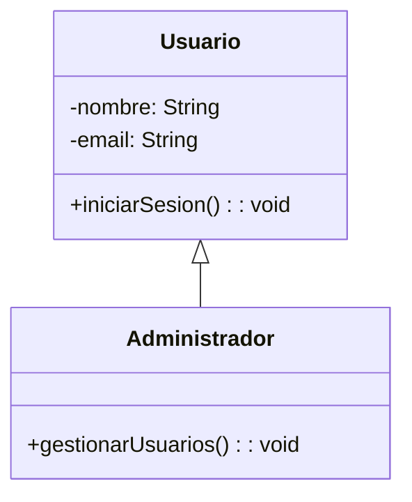

# UD6 - Optimización y Documentación

- [1. Introducción a la documentación de software](#1-introducción-a-la-documentación-de-software)
- [2. Tipos de documentación en un proyecto de software](#2-tipos-de-documentación-en-un-proyecto-de-software)
  - [2.1. Documentación interna vs. externa](#21-documentación-interna-vs-externa)
    - [2.1.1. Documentación interna](#211-documentación-interna)
    - [2.1.2. Documentación externa](#212-documentación-externa)
  - [2.2. Documentación técnica vs. funcional](#22-documentación-técnica-vs-funcional)
    - [2.2.1. Documentación técnica](#221-documentación-técnica)
    - [2.2.2. Documentación funcional](#222-documentación-funcional)
- [3. Documentación de requisitos y diseño](#3-documentación-de-requisitos-y-diseño)
  - [3.1. Especificación de Requisitos de Software (SRS)](#31-especificación-de-requisitos-de-software-srs)
    - [3.1.1. Objetivos de la SRS](#311-objetivos-de-la-srs)
    - [3.1.2. Estructura típica de un documento SRS](#312-estructura-típica-de-un-documento-srs)
  - [3.2. Diagramas UML en la documentación](#32-diagramas-uml-en-la-documentación)
    - [3.2.1. Tipos de diagramas UML más utilizados en la documentación](#321-tipos-de-diagramas-uml-más-utilizados-en-la-documentación)
- [4. Manual de usuario y guía de instalación](#4-manual-de-usuario-y-guía-de-instalación)
  - [4.1. ¿Cómo documentar un software para el usuario final?](#41-cómo-documentar-un-software-para-el-usuario-final)
  - [4.2. Manual de usuario](#42-manual-de-usuario)
    - [4.2.1. Ejemplo de una sección del manual de usuario](#421-ejemplo-de-una-sección-del-manual-de-usuario)
  - [4.3. Guía de instalación](#43-guía-de-instalación)
    - [4.3.1. Ejemplo de una sección de guía de instalación](#431-ejemplo-de-una-sección-de-guía-de-instalación)
- [Documentación de la fase de mantenimiento](#documentación-de-la-fase-de-mantenimiento)
  - [Plan de mantenimiento](#plan-de-mantenimiento)
- [5. Herramientas de documentación de proyectos de software](#5-herramientas-de-documentación-de-proyectos-de-software)

## 1. Introducción a la documentación de software

La documentación de software es un conjunto de documentos que describen el funcionamiento, la arquitectura, el diseño y otros aspectos relacionados con un sistema de software. La documentación es esencial para el desarrollo, mantenimiento y evolución de los sistemas de software, ya que facilita la comprensión, la colaboración y la toma de decisiones informadas.

## 2. Tipos de documentación en un proyecto de software  

La documentación es un elemento clave en el desarrollo de software, ya que facilita la comprensión, el mantenimiento y la evolución de los sistemas. Existen distintos tipos de documentación según su propósito y público objetivo, y cada uno cumple una función específica dentro del ciclo de vida del desarrollo.  

A grandes rasgos, la documentación se puede clasificar en dos categorías principales:  

- **Documentación interna vs. externa** → Según si está destinada a los desarrolladores o a los usuarios y otras partes interesadas.  
- **Documentación técnica vs. funcional** → Según si describe aspectos técnicos del software o su funcionamiento desde el punto de vista del usuario.  

### 2.1. Documentación interna vs. externa

#### 2.1.1. Documentación interna

La documentación interna está dirigida a los desarrolladores y miembros del equipo técnico. Su objetivo es proporcionar información que facilite la comprensión y el mantenimiento del código fuente.  

**Ejemplos de documentación interna:**

- **Comentarios en el código** (Javadoc, Doxygen, Pydoc).
- **Diagramas UML** (clases, secuencia, componentes).  
- Documentación de **arquitectura del sistema**.  
- **Guías de desarrollo** y **estándares de codificación**.  
- **Especificaciones técnicas** y **manuales de instalación**.

Ejemplo de documentación interna con Javadoc:  

```java

/**
 * Clase que gestiona los pagos en línea.
 *
 * @author Equipo de Desarrollo
 * @version 1.0
 */
public class Pago {
    private double monto;

    /**
     * Realiza un pago.
     *
     * @param cantidad Cantidad a pagar.
     * @throws IllegalArgumentException Si la cantidad es negativa.
     */
    public void procesarPago(double cantidad) {
        if (cantidad < 0) {
            throw new IllegalArgumentException("Cantidad inválida");
        }
        this.monto += cantidad;
    }
}

```

#### 2.1.2. Documentación externa

La documentación externa está dirigida a usuarios finales, clientes o cualquier persona ajena al desarrollo que necesite comprender cómo usar el software.  

**Ejemplos de documentación externa:**

- **Manual de usuario**.  
- Guía de **instalación** y **configuración**.  
- **FAQ** y resolución de problemas.  
- Documentación de **API** (por ejemplo, con Swagger para servicios REST).  

Ejemplo de documentación externa en un manual de usuario:  

---

**Cómo procesar un pago en la aplicación**

1. Inicie sesión con su cuenta.
2. Acceda al menú "Pagos".
3. Ingrese la cantidad y confirme la transacción.
4. Revise el estado del pago en la sección "Historial de transacciones".

---

### 2.2. Documentación técnica vs. funcional

#### 2.2.1. Documentación técnica

La documentación técnica detalla el **diseño**, la **arquitectura** y los **aspectos internos del software**. Está orientada a desarrolladores, administradores de sistemas y equipos de mantenimiento.  

**Ejemplos de documentación técnica:**

- **Especificación de requisitos de software (SRS).**  
- **Diagramas UML.**  
- **Guías de integración con otras aplicaciones.**  
- **Especificación de base de datos (modelo entidad-relación, diagramas SQL).**  

Ejemplo de documentación técnica con un diagrama UML de clases en **Mermaid**:  



#### 2.2.2. Documentación funcional

La documentación funcional describe el **comportamiento del software** desde el punto de vista del **usuario**, sin entrar en detalles técnicos.  

**Ejemplos de documentación funcional:**

- **Casos de uso y escenarios de usuario.**
- **Especificaciones de funcionalidad.**  
- **Requisitos del sistema.**  
- **Manual del usuario.**  

Ejemplo de un caso de uso en formato textual:  

---

**Caso de uso: Procesar pago en línea.**

- **Actor:** Usuario registrado
- **Precondiciones:** El usuario debe estar autenticado.
- **Flujo principal:**
  1. El usuario accede a la sección de pagos.
  2. Introduce el monto a pagar y selecciona un método de pago.
  3. Confirma la transacción.
  4. El sistema procesa el pago y muestra un mensaje de éxito.
- **Excepciones:**
  - Si el saldo es insuficiente, el sistema muestra un error.
  - Si la conexión falla, el pago queda en estado "pendiente".

## 3. Documentación de requisitos y diseño  

En el desarrollo de software, la documentación de requisitos y diseño juega un papel fundamental, ya que define qué debe hacer el sistema y cómo será implementado. Esta documentación garantiza que todos los miembros del equipo (desarrolladores, analistas, testers y clientes) tengan una comprensión clara del proyecto.  

### 3.1. Especificación de Requisitos de Software (SRS)

La **Especificación de Requisitos de Software (ERS, o en inglés Software Requirements Specification, SRS)** es un documento formal que describe **las características y funcionalidades** que debe cumplir el sistema. Se basa en los requerimientos del cliente y en el análisis del problema a resolver.  

#### 3.1.1. Objetivos de la SRS

- Definir con claridad lo que debe hacer el software antes de su desarrollo.  
- Servir como referencia para diseñadores, programadores y testers.  
- Reducir la ambigüedad en la implementación del sistema.  
- Facilitar la comunicación entre el equipo de desarrollo y el cliente.  

#### 3.1.2. Estructura típica de un documento SRS

Una SRS suele incluir los siguientes apartados:  

1. **Introducción**  
   - Propósito del sistema  
   - Alcance  
   - Definiciones y abreviaturas  
   - Referencias  

2. **Descripción general**  
   - Perspectiva del producto  
   - Funcionalidades principales  
   - Características de los usuarios  

3. **Requisitos funcionales**  
   - Descripción de las funciones del sistema  
   - Respuestas del sistema a entradas específicas  

4. **Requisitos no funcionales**  
   - Rendimiento, seguridad, usabilidad, compatibilidad  

5. **Restricciones del sistema**  
   - Requerimientos de hardware y software  
   - Regulaciones o normativas aplicables  

Ejemplo de un requisito funcional en SRS:  

---

**Requisito 3.1: Registro de Usuarios**

El sistema debe permitir que los usuarios se registren proporcionando nombre, correo electrónico y contraseña.  
Después del registro, el usuario recibirá un correo de confirmación.  
Si la dirección de correo ya está en uso, se debe mostrar un mensaje de error.

---

Puedes encontrar una plantilla de SRS en formato .doc en [este enlace](./plantilla_formato_ieee830.doc){:target="_blank"}.

### 3.2. Diagramas UML en la documentación

El lenguaje **UML (Unified Modeling Language)** es una herramienta esencial en la documentación de software, ya que permite visualizar estructuras y comportamientos del sistema antes de su implementación.  

#### 3.2.1. Tipos de diagramas UML más utilizados en la documentación

1. **Diagrama de clases**  
   - Representa la estructura del software y la relación entre sus componentes.  
   - Se usa para definir los objetos del sistema y sus atributos/métodos.  

   **Ejemplo en Mermaid:**  

   ```mermaid
   classDiagram
       class Usuario {
           - nombre: String
           - email: String
           + iniciarSesion(): void
           + cerrarSesion(): void
       }

       class Administrador {
           + gestionarUsuarios(): void
       }

       Usuario <|-- Administrador
   ```

2. **Diagrama de casos de uso**  
   - Representa las interacciones entre los actores (usuarios) y el sistema.  
   - Permite identificar las funciones clave del software.  

   **Ejemplo en Mermaid:**  

   ```mermaid
   graph TD;
       Usuario -->|Realiza| Login;
       Usuario -->|Registra| NuevaCuenta;
       Administrador -->|Gestiona| Usuarios;
   ```

3. **Diagrama de secuencia**  
   - Describe cómo interactúan los objetos en el tiempo.  
   - Se usa para documentar flujos de procesos en el software.  

   **Ejemplo en Mermaid:**  

   ```mermaid
   sequenceDiagram
       Usuario->>Sistema: Introduce credenciales
       Sistema-->>BaseDatos: Verifica credenciales
       BaseDatos-->>Sistema: Retorna estado de autenticación
       Sistema-->>Usuario: Acceso concedido o denegado
   ```

Los diagramas UML son una herramienta clave en la documentación de diseño, ya que facilitan la visualización del sistema antes de su desarrollo.  

En la siguiente sección, se abordará la **documentación para el usuario final**, incluyendo manuales de usuario y guías de instalación.

## 4. Manual de usuario y guía de instalación  

Además de la documentación técnica, un software debe incluir documentación dirigida a los usuarios finales. Esta documentación les permite comprender cómo utilizar el sistema, solucionar problemas comunes y realizar configuraciones necesarias.  

### 4.1. ¿Cómo documentar un software para el usuario final?

Para que la documentación del usuario sea efectiva, debe cumplir con las siguientes características:  

- **Claridad**: Usar un lenguaje accesible, sin tecnicismos innecesarios.  
- **Estructura lógica**: Organizar la información en secciones bien definidas.  
- **Ejemplos prácticos**: Incluir capturas de pantalla, diagramas o pasos detallados.  
- **Resolución de problemas**: Anticiparse a errores comunes y proporcionar soluciones.  

### 4.2. Manual de usuario

El **manual de usuario** explica cómo interactuar con el software desde una perspectiva práctica. Se suele dividir en:  

1. **Introducción**  
   - Descripción general del software.  
   - Propósito y público objetivo.  

2. **Instalación y configuración inicial**  
   - Requisitos del sistema.  
   - Pasos de instalación.  
   - Configuración inicial.  

3. **Uso del sistema**  
   - Explicación de las principales funcionalidades.  
   - Capturas de pantalla con ejemplos.  

4. **Solución de problemas comunes**  
   - Preguntas frecuentes (FAQ).  
   - Errores comunes y cómo solucionarlos.  

#### 4.2.1. Ejemplo de una sección del manual de usuario

---

**Inicio de sesión en la aplicación**

Para acceder al sistema, siga estos pasos:

1. Abra la aplicación e ingrese su correo y contraseña.
2. Presione el botón "Iniciar sesión".
3. Si las credenciales son correctas, será redirigido al panel principal.
4. Si olvidó su contraseña, haga clic en "Recuperar contraseña".

**Nota:** Después de 3 intentos fallidos, la cuenta será bloqueada temporalmente.

---

### 4.3. Guía de instalación

La guía de instalación proporciona instrucciones detalladas sobre cómo instalar y configurar el software en diferentes entornos.  

1. **Requisitos previos**  
   - Hardware mínimo y recomendado.  
   - Dependencias necesarias (Java, bases de datos, frameworks, etc.).  

2. **Pasos de instalación**  
   - Descarga del software.  
   - Instalación en distintos sistemas operativos.  
   - Configuración inicial.  

3. **Verificación y solución de errores**  
   - Pruebas para verificar la instalación.  
   - Errores comunes y cómo solucionarlos.  

#### 4.3.1. Ejemplo de una sección de guía de instalación

---

**Instalación en Windows**

1. Descargue el instalador desde [nuestra página web](https://ejemplo.com).
2. Haga doble clic en el archivo descargado y siga las instrucciones.
3. Asegúrese de que Java está instalado en su sistema.
4. Una vez completada la instalación, ejecute la aplicación desde el menú Inicio.

**Instalación en Linux**

1. Abra una terminal y descargue el paquete:

   ```bash
   wget https://ejemplo.com/software.tar.gz
   ```

2. Extraiga el contenido:

   ```bash
   tar -xvzf software.tar.gz
   ```

3. Ejecute el script de instalación:

   ```bash
   ./instalar.sh
   ```

4. Inicie la aplicación:

   ```bash
   ./ejecutar.sh
   ```

---

Una documentación bien estructurada para el usuario final mejora la experiencia de uso y reduce la carga de soporte técnico.

## Documentación de la fase de mantenimiento

La documentación de la fase de mantenimiento es esencial para garantizar que el software pueda ser actualizado, corregido y mejorado de manera eficiente. Esta documentación incluye información sobre cómo realizar cambios en el software, cómo solucionar problemas y cómo mantener la integridad del sistema a lo largo del tiempo.

La documentación de la fase de mantenimiento puede incluir:

- **Procedimientos de actualización**: instrucciones detalladas sobre cómo actualizar el software a nuevas versiones.
- **Procedimientos de corrección de errores**: instrucciones sobre cómo identificar y corregir errores en el software.
- **Procedimientos de mejora**: instrucciones sobre cómo mejorar el software para añadir nuevas funcionalidades o mejorar el rendimiento.
- **Procedimientos de copia de seguridad y restauración**: instrucciones sobre cómo realizar copias de seguridad del software y restaurarlas en caso de fallo.
- **Procedimientos de monitorización y mantenimiento preventivo**: instrucciones sobre cómo monitorizar el software y prevenir problemas antes de que ocurran.

### Plan de mantenimiento

Además de la documentación detallada sobre los procedimientos de mantenimiento, es recomendable elaborar un plan de mantenimiento que defina las tareas, responsabilidades y recursos necesarios para mantener el software en funcionamiento. El plan de mantenimiento puede incluir:

- **Objetivos del mantenimiento**: definición de los objetivos y metas del mantenimiento del software.
- **Roles y responsabilidades**: asignación de responsabilidades a los miembros del equipo de mantenimiento.
- **Procedimientos de comunicación**: definición de los canales de comunicación interna y externa para reportar problemas y solicitar soporte.
- **Procedimientos de seguimiento y control**: definición de los procedimientos para monitorizar y controlar el mantenimiento del software.
- **Procedimientos de escalado y soporte**: definición de los procedimientos para escalar problemas y solicitar soporte técnico.

## 5. Herramientas de documentación de proyectos de software

Todos los documentos de los que hemos hablado previamente (manuales de instalación, manuales de uso, especificaciones de requisitos, etc.) pueden ser creados y editados con herramientas genéricas como Microsoft Word, Google Docs o LibreOffice Writer. Sin embargo, existen herramientas específicas para la documentación de proyectos de software que facilitan la creación de documentos técnicos y su integración con el código fuente. Además de crear estos documentos, es necesario estructurarlos y relacionarlos entre ellos. Dependiendo de las exigencias de la naturaleza del proyecto, la trazabilidad entre requisitos, diseño y código puede ser más o menos restrictiva.

Algunas de las herramientas más populares son:

- **Markdown**: Formato de texto plano que permite crear documentos con formato sencillo y legible. Es el lenguaje utilizado en GitHub para la documentación de proyectos.
- **AsciiDoc**: Formato de texto similar a Markdown, pero con mayor capacidad de personalización. Permite generar documentos en varios formatos (HTML, PDF, etc.).
- **Github Pages**: Plataforma de GitHub que permite publicar documentación de proyectos directamente desde un repositorio.
- **Doors**: Herramienta de IBM para la gestión de requisitos y trazabilidad en proyectos de software.
- **Confluence**: Plataforma de Atlassian para la creación de documentación colaborativa y gestión de proyectos.
- **Jira**: Herramienta de Atlassian para la gestión de proyectos ágiles, que incluye la creación de historias de usuario y tareas.
- **Redmine**: Plataforma de gestión de proyectos que incluye funcionalidades de seguimiento de tareas y documentación.
