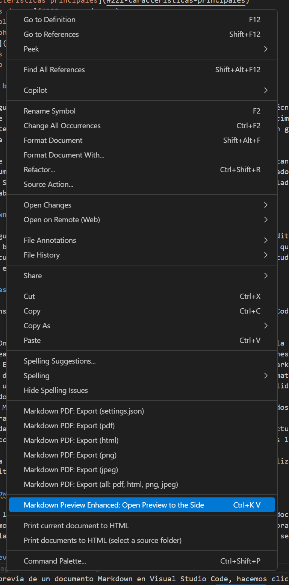
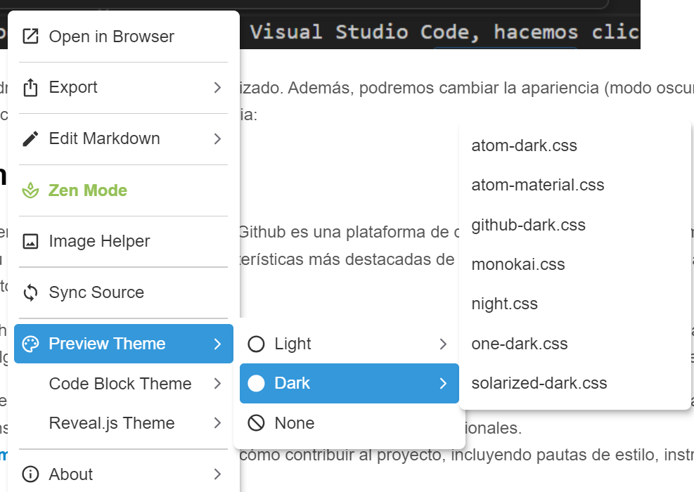
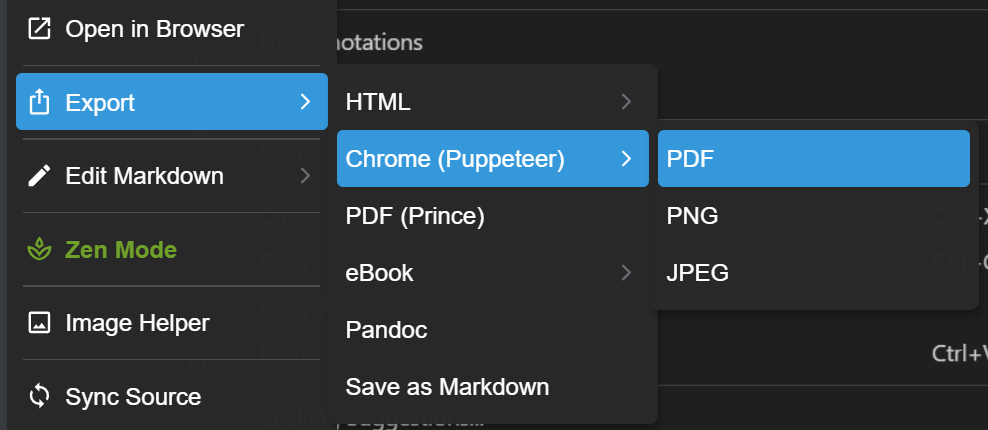
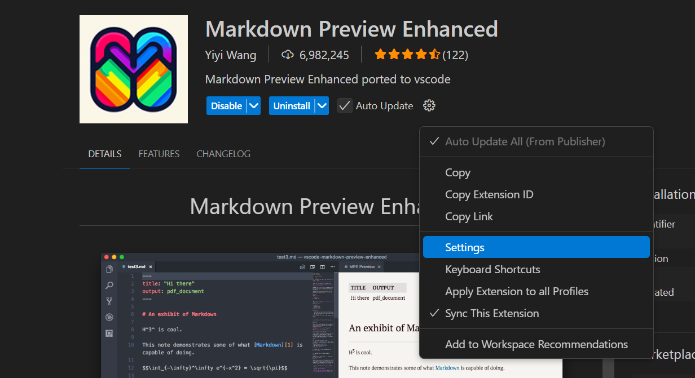

# UD6 - Optimización y Documentación

- [1. Herramientas basadas en Markdown](#1-herramientas-basadas-en-markdown)
- [2. Editando Markdown en Visual Studio Code](#2-editando-markdown-en-visual-studio-code)
  - [2.1. Extensiones recomendadas para Markdown en VSCode](#21-extensiones-recomendadas-para-markdown-en-vscode)
  - [2.2. Editando Markdown en Visual Studio Code](#22-editando-markdown-en-visual-studio-code)
    - [2.2.1. Vista previa de Markdown](#221-vista-previa-de-markdown)
  - [2.3. Alternativa para exportar a PDF](#23-alternativa-para-exportar-a-pdf)
- [3. Markdown en Github](#3-markdown-en-github)
  - [3.1. GitHub Wikis](#31-github-wikis)
    - [3.1.1. Casos de uso](#311-casos-de-uso)
    - [3.1.2. Ejemplo de uso](#312-ejemplo-de-uso)
  - [3.2. GitHub Pages](#32-github-pages)
    - [3.2.1. Características principales](#321-características-principales)
    - [3.2.2. Casos de uso](#322-casos-de-uso)
    - [3.2.3. Ejemplo de uso](#323-ejemplo-de-uso)
- [4. MkDocs y Sphinx](#4-mkdocs-y-sphinx)
  - [4.1. MkDocs](#41-mkdocs)
- [5. AsciiDoc vs Markdown](#5-asciidoc-vs-markdown)
  - [5.1. Ejemplo de AsciiDoc](#51-ejemplo-de-asciidoc)

## 1. Herramientas basadas en Markdown

Markdown es un lenguaje de marcado ligero ampliamente utilizado en documentación técnica y desarrollo de software. Su simplicidad lo hace ideal para escribir textos estructurados sin necesidad de conocimientos avanzados en HTML o LaTeX. Sin embargo, su potencial se amplía cuando se combina con herramientas que permiten gestionar, publicar y visualizar documentos de forma más avanzada.  

En este apartado se presentan diversas herramientas basadas en Markdown que facilitan la creación, organización y publicación de documentación en proyectos de software. Además, se incluye un apartado sobre cómo editar documentos de Markdown en Visual Studio Code, un editor de código muy popular entre los desarrolladores, configurando las extensiones más útiles para trabajar con este tipo de archivos y acelerar el flujo de trabajo.

## 2. Editando Markdown en Visual Studio Code

Markdown es un lenguaje de marcado ligero (texto plano) y, por lo tanto, podemos editarlo con cualquier editor de texto básico, incluso el bloc de notas. Sin embargo, existen editores de texto avanzados que permiten una edición más cómoda y rápida de los documentos Markdown. Uno de los editores más populares es Visual Studio Code (VSCode), que cuenta con una amplia gama de extensiones para mejorar la experiencia de edición de Markdown.

### 2.1. Extensiones recomendadas para Markdown en VSCode

Estas son las extensiones de Markdown que se recomienda instalar en Visual Studio Code para mejorar la experiencia de edición:

- **Markdown All in One**: proporciona una serie de atajos y funciones para facilitar la edición de Markdown, como la vista previa en tiempo real, el autocompletado de etiquetas y la navegación entre secciones.
- **Markdown Preview Enhanced**: permite una vista previa avanzada de los documentos Markdown, incluyendo soporte para gráficos, tablas y diagramas. También permite exportar documentos a diferentes formatos como PDF, HTML y LaTeX.
- **Markdownlint**: es una herramienta de análisis estático que ayuda a mantener la calidad del código Markdown, detectando errores y sugiriendo mejoras en la sintaxis.
- **Markdown Preview Mermaid Support**: añade soporte para diagramas y gráficos generados con Mermaid, una herramienta que permite crear diagramas a partir de texto en Markdown.
- **Markdown Link Updater**: ayuda a mantener los enlaces en los documentos Markdown actualizados, detectando enlaces rotos y sugiriendo correcciones. Además, actualiza de forma automática enlaces a archivos locales si estos cambian de nombre o directorio.
- **:emojisense:** para añadir emojis a los documentos Markdown de forma sencilla, utilizando un selector de emojis integrado en el editor.

### 2.2. Editando Markdown en Visual Studio Code

Una vez instalados las extensiones recomendadas, podemos empezar a crear y editar documentos markdown. Crearemos nuestro archivo como siempre, bien desde el botón de crear archivos, desde el explorador de archivos del sistema operativo o desde la terminal, recordando que la extension de nuestro archivo debe ser `.md`.

#### 2.2.1. Vista previa de Markdown

Para ver la vista previa de un documento Markdown en Visual Studio Code, hacemos click derecho en el archivo y seleccionamos "**Markdown Preview Enhanced: open preview to the Side**" o utilizamos el atajo de teclado `Ctrl + K V`. Esto abrirá una vista dividida donde podremos ver el documento en formato Markdown a la izquierda y la vista previa renderizada a la derecha.

<div align="center">

</div>

En esa vista previa podremos ver el documento renderizado. Además, podremos cambiar la apariencia (modo oscuro, tema para los bloques de código...) haciendo click derecho sobre la vista previa:

<div align="center">

</div>

Para exportar un documento, podemos hacer click derecho en la vista previa y seleccionar "**Export**". Esto nos permitirá exportar el documento a diferentes formatos como PDF, HTML o LaTeX. Para exportar en PDF, se recomienda utilizar la opción "**Export > Chrome (Puppeteer) > PDF**".

<div align="center">

</div>

Puedes configurar algunos aspectos de la exportación en el archivo de configuración de la extensión. Para ello, abre la paleta de comandos (`Ctrl + Shift + P`) y busca "**Markdown Preview Enhanced: Open Config**". Esto abrirá un archivo JSON donde podrás ajustar las opciones de exportación, como el formato de salida, la calidad del PDF y otros parámetros. También puedes editarlo accediendo a la configuración de la extensión desde la ventana de instalación, haciendo clic en el icono de engranaje :gear: y seleccionando "**Extension Settings**".

<div align="center">

</div>

### 2.3. Alternativa para exportar a PDF

Existe otra extensión, llamada Markdown PDF, que permite exportar documentos Markdown a PDF de forma sencilla. Para instalarla, abre la paleta de comandos (`Ctrl + Shift + P`) y busca "**Extensions: Install Extensions**". Luego, busca "**Markdown PDF**" e instálala. Una vez instalada, puedes exportar un documento Markdown a PDF haciendo click derecho en el archivo y seleccionando "**Markdown PDF: Export (pdf)**". Esto generará un archivo PDF en la misma carpeta que el documento original. Puedes comparar ambas opciones de exportación y elegir la que mejor se adapte a tus necesidades.

## 3. Markdown en Github

Como ya hemos visto en unidades didácticas previas, Github es una plataforma de desarrollo colaborativo que permite alojar proyectos de software y gestionar su ciclo de vida. Una de las características más destacadas de Github es su integración con Markdown, que permite documentar los proyectos de forma sencilla y eficaz.

Los repositorios de Github permiten incluir archivos Markdown en la raíz o en carpetas específicas, que se renderizan automáticamente en la interfaz web. Existen algunos archivos Markdown especiales que se utilizan para documentar proyectos de software:

- **README.md**: es el archivo principal de documentación de un proyecto. Suele contener una descripción general del proyecto, instrucciones de instalación y uso, ejemplos de código y enlaces a recursos adicionales.
- **CONTRIBUTING.md**: contiene información sobre cómo contribuir al proyecto, incluyendo pautas de estilo, instrucciones para enviar pull requests y normas de conducta.
- **LICENSE.md**: incluye la licencia de uso del proyecto, especificando los derechos y restricciones de distribución y modificación.
- **CHANGELOG.md**: registra los cambios realizados en cada versión del software, incluyendo nuevas funcionalidades, correcciones de errores y mejoras de rendimiento.
- **CODE_OF_CONDUCT.md**: establece las normas de conducta y convivencia en la comunidad de desarrollo, promoviendo un entorno inclusivo y respetuoso.
- **SUPPORT.md**: proporciona información sobre cómo obtener soporte técnico para el proyecto, incluyendo enlaces a la documentación, foros de discusión y canales de comunicación.
- **CONTRIBUTORS.md**: lista a los colaboradores que han contribuido al proyecto, reconociendo su trabajo y aportaciones.
- **ACKNOWLEDGEMENTS.md**: agradece a las personas, organizaciones o proyectos que han contribuido de alguna manera al desarrollo del software.
- **ISSUE_TEMPLATE.md**: define las plantillas para crear nuevos issues en el repositorio, facilitando la comunicación entre los usuarios y los desarrolladores.

Puedes encontrar más información sobre los archivos markdown más comunes en un repositorio de GitHub en la [documentación oficial de GitHub](https://docs.github.com/es/github/creating-cloning-and-archiving-repositories/creating-a-repository-on-github/about-readmes), [aquí](https://github.com/kmindi/special-files-in-repository-root/blob/master/README.md) o [aquí](https://docs.github.com/es/github/creating-cloning-and-archiving-repositories/licensing-a-repository).

### 3.1. GitHub Wikis

GitHub Wikis es una funcionalidad integrada en los repositorios de GitHub que permite a los desarrolladores documentar sus proyectos de manera estructurada utilizando Markdown. Sus características principales son:

- **Edición colaborativa**: cualquier miembro del equipo puede agregar o modificar contenido.  
- **Estructura organizada**: permite crear múltiples páginas enlazadas entre sí.  
- **Historial de cambios**: cada modificación queda registrada con control de versiones basado en Git.  
- **Accesibilidad**: la documentación es visible desde la interfaz web de GitHub.  

#### 3.1.1. Casos de uso

✅ Documentación interna del proyecto (guías de instalación, convenciones de desarrollo).  
✅ Manuales de uso y tutoriales para los colaboradores.  
✅ Registro de decisiones de diseño y cambios en el software.  

#### 3.1.2. Ejemplo de uso

Para clonar una wiki en local y editarla con Git:  

```sh
git clone https://github.com/usuario/proyecto.wiki.git
cd proyecto.wiki
echo "## Nueva página" > NuevaPagina.md
git add NuevaPagina.md
git commit -m "Añadir nueva página"
git push origin main
```

### 3.2. GitHub Pages

GitHub Pages permite publicar sitios web estáticos directamente desde un repositorio de GitHub. Es una solución ideal para alojar documentación generada en Markdown.  

#### 3.2.1. Características principales

- **Integración con Jekyll, MkDocs, Docusaurus...**: permite convertir archivos Markdown en páginas HTML estructuradas.  
- **Despliegue automático**: cualquier cambio en el repositorio se refleja en la web.  
- **Personalización**: posibilidad de añadir CSS y plantillas personalizadas.  

#### 3.2.2. Casos de uso

✅ Publicación de documentación técnica de proyectos de software.  
✅ Creación de blogs técnicos y manuales de usuario.  
✅ Alojar portfolios o sitios web personales.  

#### 3.2.3. Ejemplo de uso

Para habilitar GitHub Pages en un repositorio:  

1. Ir a `Settings > Pages`.  
2. Seleccionar la rama (`main` o `gh-pages`).  
3. Configurar el dominio si es necesario.  

Ejemplo de generación de una página usando Jekyll:  

```sh
gem install jekyll bundler
jekyll new mi-documentacion
cd mi-documentacion
bundle exec jekyll serve
```

## 4. MkDocs y Sphinx

MkDocs y Sphinx son generadores de documentación que permiten convertir archivos Markdown en sitios web navegables.  

### 4.1. MkDocs

- Diseñado para documentación técnica, especialmente en proyectos Python.  
- Ofrece plantillas predefinidas y una estructura fácil de mantener.  

## 5. AsciiDoc vs Markdown

AsciiDoc es un lenguaje de marcado más avanzado que Markdown, diseñado para documentación técnica compleja. Se utiliza en entornos como OpenAPI y Red Hat.  Diferencias con Markdown:

| Característica  | Markdown | AsciiDoc |
|----------------|---------|----------|
| Simplicidad   | Alta    | Media    |
| Soporte de tablas | Básico  | Avanzado |
| Extensibilidad  | Baja    | Alta     |

### 5.1. Ejemplo de AsciiDoc

```asciidoc
= Documentación con AsciiDoc
Autor: Juan Pérez
Fecha: 2024-06-15

== Introducción
Este es un documento en AsciiDoc.
```

[Guía completa de Mkdocs](ud6_5_mkdocs.md)