# UD6 - Optimización y Documentación

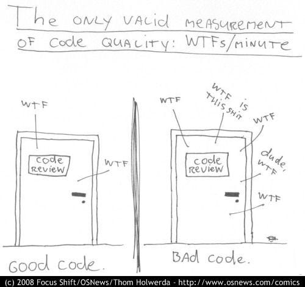

- [1. Introducción a la refactorización](#1-introducción-a-la-refactorización)
  - [1.1. Objetivos y beneficios de la refactorización](#11-objetivos-y-beneficios-de-la-refactorización)
    - [1.1.1. Principales objetivos de la refactorización](#111-principales-objetivos-de-la-refactorización)
  - [1.2. ¿Cuándo y por qué refactorizar el código?](#12-cuándo-y-por-qué-refactorizar-el-código)
    - [1.2.1. Momentos clave para refactorizar](#121-momentos-clave-para-refactorizar)
  - [1.3. Ejemplo de refactorización en Java](#13-ejemplo-de-refactorización-en-java)
  - [1.4. Conclusión](#14-conclusión)
- [2. Principios fundamentales de la refactorización](#2-principios-fundamentales-de-la-refactorización)
  - [2.1. Código limpio y mantenible - Clean Code](#21-código-limpio-y-mantenible---clean-code)
  - [2.2. Principios SOLID en la refactorización](#22-principios-solid-en-la-refactorización)
  - [2.3. Otros principios clave en la refactorización](#23-otros-principios-clave-en-la-refactorización)
  - [2.4. Conclusión](#24-conclusión)
- [3. Acoplamiento y cohesión](#3-acoplamiento-y-cohesión)
  - [3.1. Origen de los términos](#31-origen-de-los-términos)
  - [3.2. Acoplamiento](#32-acoplamiento)
  - [3.3. Cohesión](#33-cohesión)
  - [3.4. Relación de la cohesión y el acoplamiento con la refactorización](#34-relación-de-la-cohesión-y-el-acoplamiento-con-la-refactorización)
- [4. Identificación de código con necesidad de refactorización](#4-identificación-de-código-con-necesidad-de-refactorización)
  - [4.1. Code smells: Indicadores de código problemático](#41-code-smells-indicadores-de-código-problemático)
    - [4.1.1. Tipos comunes de code smells](#411-tipos-comunes-de-code-smells)
  - [4.2. Herramientas de análisis estático para detectar problemas](#42-herramientas-de-análisis-estático-para-detectar-problemas)
    - [4.2.1. Identificando code smells en Intellij IDEA](#421-identificando-code-smells-en-intellij-idea)
- [5. Técnicas de refactorización](#5-técnicas-de-refactorización)
  - [5.1. Renombrado de variables y métodos](#51-renombrado-de-variables-y-métodos)
  - [5.2. Extracción de métodos y clases](#52-extracción-de-métodos-y-clases)
  - [5.3. Inlining método](#53-inlining-método)
  - [5.4. Extracción de variables, constantes y `fields`](#54-extracción-de-variables-constantes-y-fields)
  - [5.5. Reemplazo de código duplicado](#55-reemplazo-de-código-duplicado)
  - [5.6. Introducción de interfaces y clases abstractas](#56-introducción-de-interfaces-y-clases-abstractas)
  - [5.7. Sustitución de condicionales por polimorfismo](#57-sustitución-de-condicionales-por-polimorfismo)
  - [5.8. Earlier Return](#58-earlier-return)
  - [5.9. Cambio de tipo](#59-cambio-de-tipo)
  - [5.10. Refactorización de bucles y estructuras de control](#510-refactorización-de-bucles-y-estructuras-de-control)
- [6. Refactorización sin cambiar el comportamiento del código](#6-refactorización-sin-cambiar-el-comportamiento-del-código)
  - [6.1. Uso de TDD (Test-Driven Development) en la refactorización](#61-uso-de-tdd-test-driven-development-en-la-refactorización)
    - [6.1.1. Ciclo de TDD aplicado a la refactorización](#611-ciclo-de-tdd-aplicado-a-la-refactorización)
- [7. Referencias](#7-referencias)

## 1. Introducción a la refactorización  

La refactorización es el **proceso de reestructurar el código fuente sin modificar su comportamiento externo**. Su objetivo es mejorar la calidad, claridad y mantenibilidad del código sin introducir nuevas funcionalidades.  

En muchos proyectos, a medida que el software evoluciona, el código puede volverse complejo y difícil de entender. La refactorización permite reducir esta complejidad mediante **cambios controlados**, asegurando que el sistema siga funcionando correctamente mientras se optimiza su estructura interna.

Por lo tanto, la refactorización no busca ni arreglar errores ni añadir nuevas funcionalidades, sino **mejorar la calidad del código existente y su comprensión**.

### 1.1. Objetivos y beneficios de la refactorización

Refactorizar el código aporta numerosas ventajas, tanto en términos de **legibilidad y mantenibilidad** como en **rendimiento y escalabilidad**.  

#### 1.1.1. Principales objetivos de la refactorización

✔ **Mejorar la legibilidad** → Un código más claro facilita su comprensión y mantenimiento.  
✔ **Eliminar redundancias y código duplicado** → Reduce la complejidad y el riesgo de errores.  
✔ **Facilitar la reutilización** → Un código modular puede ser reutilizado en distintos contextos.  
✔ **Reducir la deuda técnica** → La deuda técnica, también llamada deuda de diseño, es un concepto que representa el coste implícito del retrabajo causado por elegir una solución concreta en un momento determinado del desarrollo de software, en lugar de una solución más adecuada. Esta decisión puede ser premeditada (por ejemplo, para cumplir con un plazo de entrega) o involuntaria (por falta de conocimiento o experiencia). La refactorización es el mecanismo del que disponemos para reducir la deuda técnica. Hay que tener en cuenta que el coste asociado a la refactorización puede ser mayor que el coste inicial de una buena decisión de diseño. Por lo tanto, es importante evaluar el coste de la refactorización y compararlo con el coste de mantener el código actual, así como las implicaciones de una u otra decisión.  
✔ **Optimizar el rendimiento** → Permite detectar y corregir ineficiencias. Hay que recordar que la refactorización no es una técnica de optimización, sino una técnica de mejora del diseño. La optimización del rendimiento se debe realizar después de la refactorización, ya que el código refactorizado es más fácil de optimizar.  
✔ **Preparar el código para futuras modificaciones** → Hace que el sistema sea más escalable y adaptable a cambios.  

### 1.2. ¿Cuándo y por qué refactorizar el código?

Aunque la refactorización es una práctica recomendada, no siempre es el momento adecuado para aplicarla. Es importante identificar cuándo realmente es necesaria y cómo puede afectar el desarrollo del software.  

#### 1.2.1. Momentos clave para refactorizar

✅ **Antes de añadir una nueva funcionalidad**  
Si el código existente es difícil de entender o modificar, refactorizarlo previamente facilita la implementación de nuevas características.  

✅ **Después de detectar code smells**  
Cuando aparecen signos de código problemático (excesiva complejidad, repeticiones, funciones demasiado largas, etc.), es recomendable realizar refactorización.  

✅ **Durante la corrección de errores**  
Si al solucionar un bug encontramos código desordenado o mal estructurado, podemos aprovechar para refactorizarlo y evitar futuros problemas.  

✅ **Como parte del mantenimiento del software**  
En proyectos en constante evolución, la refactorización ayuda a evitar que el código se degrade con el tiempo.  

🚫 **Cuándo NO refactorizar:**

- **Si no hay pruebas automatizadas:** Refactorizar sin pruebas puede introducir errores sin darnos cuenta.  
- **Cuando se está en una fase crítica de desarrollo:** Si la entrega del software es inminente, es mejor esperar para refactorizar en una fase posterior.  
- **Si no hay un objetivo claro:** No es recomendable hacer cambios sin saber exactamente qué se está mejorando.  

### 1.3. Ejemplo de refactorización en Java

Un caso típico de código que necesita refactorización es aquel que usa estructuras redundantes o nombres poco descriptivos.  

**Código antes de refactorizar (difícil de leer y poco reutilizable):**  

```java
public class Pedido {
    private double precio;
    private int cantidad;

    public Pedido(double precio, int cantidad) {
        this.precio = precio;
        this.cantidad = cantidad;
    }

    public double calcularTotal() {
        double resultado = precio * cantidad;
        if (cantidad > 10) {
            resultado = resultado * 0.9; // Descuento del 10%
        }
        return resultado;
    }
}
```

**Código después de refactorizar (más claro y reutilizable):**  

```java
public class Pedido {
    private double precio;
    private int cantidad;
    private static final double DESCUENTO = 0.9;
    private static final int CANTIDAD_MINIMA_DESCUENTO = 10;

    public Pedido(double precio, int cantidad) {
        this.precio = precio;
        this.cantidad = cantidad;
    }

    public double calcularTotal() {
        return aplicarDescuento(precio * cantidad);
    }

    private double aplicarDescuento(double total) {
        return cantidad > CANTIDAD_MINIMA_DESCUENTO ? total * DESCUENTO : total;
    }
}
```

**🔎 Mejoras aplicadas:**  
✅ Se han extraído constantes para evitar valores "mágicos" (*magic numbers*).  
✅ Se ha separado la lógica de cálculo en un método específico (`aplicarDescuento`).  
✅ El código es más fácil de entender y modificar.  

### 1.4. Conclusión

La refactorización es una práctica fundamental en el desarrollo de software que permite mejorar la calidad del código sin cambiar su comportamiento. Aplicada de manera estratégica, ayuda a reducir la complejidad del sistema, mejorar su mantenibilidad y preparar el software para futuras evoluciones.  

En la siguiente sección se abordarán **principios fundamentales de la refactorización**, como SOLID, DRY, KISS y YAGNI.

## 2. Principios fundamentales de la refactorización  

Para que la refactorización sea efectiva, es importante seguir una serie de principios que garantizan un código más limpio, mantenible y escalable. Estos principios permiten estructurar el código de forma que sea más fácil de entender y modificar en el futuro.  

Entre los más relevantes se encuentran los principios **SOLID**, así como otras reglas generales como **DRY**, **KISS** y **YAGNI**.  

### 2.1. Código limpio y mantenible - Clean Code

Uno de los principales objetivos de la refactorización es mejorar la legibilidad del código. Un código limpio:  

✔ Usa nombres descriptivos para clases, métodos y variables.  
✔ Evita duplicación de lógica.  
✔ Mantiene las funciones cortas y con una única responsabilidad.  
✔ Se estructura de manera modular, facilitando su reutilización.
✔ Usa comentarios solo cuando sea necesario, evitando la sobrecarga de información.

El libro "**Clean Code: A Handbook of Agile Software Craftsmanship**" de Robert C. Martin es una referencia clave en este ámbito. En él se presentan principios y prácticas para escribir código limpio y mantenible, así como ejemplos de código bien estructurado y fácil de entender.

### 2.2. Principios SOLID en la refactorización

Los principios **SOLID** son una serie de buenas prácticas para el diseño de software orientado a objetos. Aplicarlos durante la refactorización ayuda a mejorar la arquitectura del código.

### 2.3. Otros principios clave en la refactorización

Además de SOLID, hay otras reglas que ayudan a escribir código más limpio y eficiente:  

✔ **DRY (Don't Repeat Yourself):** Evitar la duplicación de código.  
✔ **KISS (Keep It Simple, Stupid):** Mantener el código lo más simple posible.  
✔ **YAGNI (You Ain’t Gonna Need It):** No añadir funcionalidades innecesarias antes de que sean requeridas.  

### 2.4. Conclusión

Aplicar estos principios durante la refactorización mejora la calidad del código y facilita su mantenimiento. En la siguiente sección se abordará cómo identificar **código con necesidad de refactorización** mediante la detección de **code smells** y el uso de herramientas de análisis estático.

## 3. Acoplamiento y cohesión

Antes de continuar con el proceso de refactorización, es importante entender dos conceptos clave: **acoplamiento** y **cohesión**. Estos conceptos son fundamentales para evaluar la calidad del diseño de un sistema y su capacidad de mantenimiento.

### 3.1. Origen de los términos

Conforme el paradigma de programación secuencial fue evolucionando y aparecieron los paradigmas de programación estructurada, programación modular y programación orientada a objetos, el código se fue dividiendo en módulos, funciones y clases. Con este enfoque aprovechamos las ventajas de la **reutilización** y la **modularidad**. Sin embargo, a medida que el código se vuelve más complejo, es importante evaluar cómo interactúan estos módulos entre sí.

En este contexto, aparecen los conceptos de **acoplamiento** y **cohesión**.

### 3.2. Acoplamiento

El acoplamiento se refiere a la **dependencia entre diferentes módulos** o componentes de un sistema. Un alto acoplamiento significa que los módulos están fuertemente interconectados, lo que dificulta su modificación y reutilización. Por el contrario, un bajo acoplamiento indica que los módulos son independientes y pueden ser modificados o reemplazados sin afectar a otros módulos.

Existen diferentes tipos o grados de acoplamiento, que van desde el acoplamiento más débil (acoplamiento por datos) hasta el más fuerte (acoplamiento por contenido). A continuación se presentan los tipos de acoplamiento (ordenados de más débil a más fuerte):

- **Acoplamiento por datos (data coupling):** Los módulos comparten datos a través de parámetros, pero no dependen de la implementación interna de otros módulos. Este es el tipo de acoplamiento más débil y deseable.
- **Acoplamiento por sello (stamp coupling)**: Los módulos comparten una estructura de datos pero sólamente utilizan una parte de ella. Este tipo de acoplamiento es más fuerte que el acoplamiento por datos, pero aún aceptable.
- **Acoplamiento por control:** Un módulo controla el comportamiento de otro módulo, por ejemplo, mediante el paso de información de lo que debe hacer por parámetro (bandera del tipo *what-to-do flag*) lo que crea una dependencia más fuerte. Este tipo de acoplamiento es menos deseable, ya que dificulta la reutilización y el mantenimiento.
- **Acoplamiento externo**: Los módulos dependen de elementos externos, como archivos, bases de datos o protocolos de comunicación. Este tipo de acoplamiento puede ser problemático si los elementos externos cambian.
- **Acoplamiento común o global**:** Los módulos comparten una variable global, lo que crea una fuerte dependencia entre ellos. Cambiar el recurso compartido implica cambiar todos los módulos que lo usen.
- **Acoplamiento por contenido o acoplamiento patológico**: Un módulo accede directamente a los datos internos de otro módulo. Este tipo de acoplamiento es el más fuerte y debe evitarse siempre que sea posible.
  
### 3.3. Cohesión

La cohesión se refiere a la **relación entre las responsabilidades de un módulo**. Un módulo altamente cohesivo tiene una única responsabilidad o función, lo que facilita su comprensión y mantenimiento. Por el contrario, un módulo con baja cohesión realiza múltiples tareas no relacionadas, lo que lo hace más difícil de entender y modificar. Existen diferentes tipos o grados de cohesion, que van desde la cohesión más débil (cohesión coincidente) hasta la más fuerte (cohesión funcional). A continuación se presentan los tipos de cohesión (ordenados de más débil a más fuerte):

- **Cohesión coincidente o causal (coincidental cohesion):** Los elementos de un módulo están agrupados sin ninguna relación lógica. Este es el tipo de cohesión más débil y debe evitarse.
- **Cohesión temporal (temporal cohesion):** Los elementos de un módulo están relacionados por el tiempo en que se ejecutan, pero no tienen una relación lógica. Por ejemplo, un módulo que inicializa varias variables al mismo tiempo.
- **Cohesión lógica (logical cohesion):** Los elementos de un módulo están relacionados lógicamente, pero no físicamente. Por ejemplo, un módulo que realiza diferentes cálculos según el tipo de datos que recibe.
- **Cohesion procedimental (procedural cohesion):** Los elementos de un módulo están relacionados porque siguen una secuencia de pasos. Por ejemplo, un módulo que realiza varias operaciones en un orden específico.
- **Cohesión comunicacional (communicational cohesion):** Los elementos de un módulo están relacionados porque operan sobre los mismos datos de entrada y salida.
- **Cohesión de secuencia (sequential cohesion):** Los elementos de un módulo están relacionados en una secuencia lógica, donde la salida de un elemento es la entrada de otro. Por ejemplo, un módulo que procesa datos en varias etapas.  
- **Cohesión funcional (functional cohesion):** Los elementos de un módulo están relacionados porque realizan una única función o tarea. Este es el tipo de cohesión más fuerte y deseable, ya que facilita la comprensión y el mantenimiento del módulo.

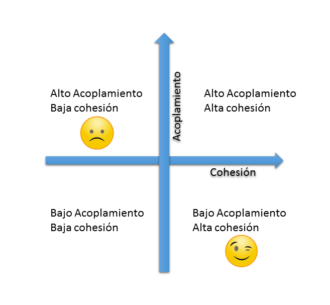

### 3.4. Relación de la cohesión y el acoplamiento con la refactorización

Cuando detectamos un código con un alto acoplamiento y baja cohesión, es un indicativo de que el diseño del sistema no es óptimo. En estos casos, la refactorización puede ayudar a mejorar la calidad del código al reducir el acoplamiento y aumentar la cohesión.

## 4. Identificación de código con necesidad de refactorización  

Refactorizar código sin un motivo claro puede ser contraproducente. Antes de iniciar cualquier proceso de optimización, es fundamental identificar qué partes del código requieren mejoras. Existen varias señales que indican que el código necesita ser refactorizado, conocidas como **code smells**, así como herramientas que ayudan a detectar estos problemas de forma automática.  

### 4.1. Code smells: Indicadores de código problemático

Un **code smell** es una señal de que el código tiene algún problema que podría dificultar su mantenimiento o escalabilidad. No significa necesariamente que haya un error, pero sí que existe una oportunidad de mejora.

Existe un recurso web, llamado [**Code Smells**](https://refactoring.guru/es/refactoring/smells), que proporciona una lista de los principales code smells y ejemplos de cómo solucionarlos. Lo utilizaremos cono referencia a lo largo de esta sección.

#### 4.1.1. Tipos comunes de code smells

Los *code smells* se pueden clasificar en varias categorías. A continuación se presentan algunos de los más comunes:

##### Bloaters (Crecimiento excesivo)

Son fragmentos de código que han crecido demasiado y se han vuelto difíciles de manejar. Algunos ejemplos son:

🔹 **Funciones demasiado largas**  
Cuando un método contiene demasiadas líneas de código, su comprensión y mantenimiento se vuelven más difíciles. Como norma general, se extrae parte del contenido del método a un método independiente, con un nombre descriptivo.

**Ejemplo antes de refactorizar (método extenso y difícil de leer):**  

```java
public void procesarOrden(Orden orden) {
    // Validar la orden
    if (orden == null) {
        System.out.println("La orden no puede ser nula.");
        return;
    }
    if (orden.getItems().isEmpty()) {
        System.out.println("La orden no tiene productos.");
        return;
    }

    // Calcular el total
    double total = 0;
    for (Item item : orden.getItems()) {
        double precio = item.getPrecio();
        int cantidad = item.getCantidad();
        total += precio * cantidad;
        if (cantidad > 10) {
            total -= precio * cantidad * 0.1; // Descuento del 10% por cantidad
        }
    }

    // Aplicar impuestos
    double impuestos = total * 0.21; // IVA del 21%
    total += impuestos;

    // Actualizar inventario
    for (Item item : orden.getItems()) {
        Inventario inventario = Inventario.obtenerInventario();
        if (!inventario.reducirStock(item.getId(), item.getCantidad())) {
            System.out.println("No hay suficiente stock para el producto: " + item.getNombre());
            return;
        }
    }

    // Enviar confirmación
    Cliente cliente = orden.getCliente();
    if (cliente.getEmail() != null && !cliente.getEmail().isEmpty()) {
        System.out.println("Enviando confirmación a " + cliente.getEmail());
    } else {
        System.out.println("No se puede enviar confirmación. El cliente no tiene email.");
    }

    // Finalizar
    System.out.println("Orden procesada correctamente. Total: " + total);
}
```

Problemas detectados:

- Demasiadas responsabilidades: La función valida la orden, calcula el total, aplica impuestos, actualiza el inventario y envía confirmaciones.
- Valores mágicos: El 10% de descuento y el 21% de IVA están codificados directamente.
- Código duplicado: Se recorren los mismos elementos de la orden varias veces.
- Dificultad de lectura: La lógica está mezclada, lo que dificulta entender qué hace cada parte.

Ejemplo después de refactorizar (extracción de métodos):

```java
public void procesarOrden(Orden orden) {
    if (!validarOrden(orden)) {
        return;
    }

    double total = calcularTotal(orden);
    if (!actualizarInventario(orden)) {
        return;
    }

    enviarConfirmacion(orden.getCliente());
    finalizarOrden(total);
}

private boolean validarOrden(Orden orden) {
    if (orden == null) {
        System.out.println("La orden no puede ser nula.");
        return false;
    }
    if (orden.getItems().isEmpty()) {
        System.out.println("La orden no tiene productos.");
        return false;
    }
    return true;
}

private double calcularTotal(Orden orden) {
    double total = 0;
    for (Item item : orden.getItems()) {
        total += calcularSubtotal(item);
    }
    total += aplicarImpuestos(total);
    return total;
}

private double calcularSubtotal(Item item) {
    double subtotal = item.getPrecio() * item.getCantidad();
    if (item.getCantidad() > 10) {
        subtotal -= subtotal * DESCUENTO_POR_CANTIDAD;
    }
    return subtotal;
}

private double aplicarImpuestos(double total) {
    return total * IVA;
}

private boolean actualizarInventario(Orden orden) {
    for (Item item : orden.getItems()) {
        if (!Inventario.obtenerInventario().reducirStock(item.getId(), item.getCantidad())) {
            System.out.println("No hay suficiente stock para el producto: " + item.getNombre());
            return false;
        }
    }
    return true;
}

private void enviarConfirmacion(Cliente cliente) {
    if (cliente.getEmail() != null && !cliente.getEmail().isEmpty()) {
        System.out.println("Enviando confirmación a " + cliente.getEmail());
    } else {
        System.out.println("No se puede enviar confirmación. El cliente no tiene email.");
    }
}

private void finalizarOrden(double total) {
    System.out.println("Orden procesada correctamente. Total: " + total);
}
```

Mejoras aplicadas:

- Extracción de métodos: Cada responsabilidad se mueve a un método independiente (validarOrden, calcularTotal, actualizarInventario, etc.).
- Uso de constantes: Se definen constantes como DESCUENTO_POR_CANTIDAD y IVA para evitar valores mágicos.
- Legibilidad: El método principal procesarOrden es ahora más claro y fácil de entender.
- Reutilización: Los métodos extraídos pueden ser reutilizados en otras partes del código.

🔹 **Lista de parámetros demasiado extensa**

Cuando un método recibe demasiados parámetros, se vuelve difícil de entender y usar. En este caso:

- se puede crear una clase que agrupe los parámetros relacionados.
- En ocasiones se puede sustituir algún parámetro por una llamada interna a otro método.

**Ejemplo**:

```java
public void crearPedido(String cliente, String producto, int cantidad, double precio) {
    // Lógica para crear un pedido
}
```

**Solución después de refactorizar (creación de una clase Pedido):**  

```java
public class Pedido {
    private String cliente;
    private String producto;
    private int cantidad;
    private double precio;

    public Pedido(String cliente, String producto, int cantidad, double precio) {
        this.cliente = cliente;
        this.producto = producto;
        this.cantidad = cantidad;
        this.precio = precio;
    }

    // Métodos para procesar el pedido
}
```

🔹 **Clases con demasiadas responsabilidades**  
Si una clase maneja múltiples tareas, se vuelve difícil de modificar sin afectar otras partes del sistema.  

**Ejemplo antes de refactorizar (violación del principio de responsabilidad única - SRP):**  

```java
public class GestorPedidos {
    public void crearPedido() { /* lógica de creación */ }
    public void actualizarInventario() { /* lógica de inventario */ }
    public void enviarCorreoConfirmacion() { /* lógica de email */ }
}
```

**Solución después de refactorizar (separar responsabilidades en clases distintas):**  

```java
public class GestorPedidos {
    public void crearPedido() { /* lógica de creación */ }
}

public class GestorInventario {
    public void actualizarInventario() { /* lógica de inventario */ }
}

public class GestorCorreos {
    public void enviarCorreoConfirmacion() { /* lógica de email */ }
}
```

✅ Ahora cada clase tiene una única responsabilidad, facilitando su mantenimiento.  

Otros ejemplos de bloaters son:

- **Primitive Obsession**: Cuando se utilizan tipos primitivos en lugar de objetos, lo que puede dificultar la comprensión del código. En este caso, se recomienda crear una clase para encapsular el comportamiento y los datos relacionados.
- **Data Clumps**: Cuando un grupo de datos relacionados se encuentra disperso en diferentes partes del código, es recomendable agruparlos en una clase o estructura de datos.

##### Object-Oriented Abusers (Abusos de la programación orientada a objetos)

Estos son problemas relacionados con el uso inadecuado de los principios de la programación orientada a objetos. Algunos ejemplos son:

🔹 **Switch Statement**

Cuando se utilizan múltiples sentencias `switch` o `if-else` para manejar diferentes tipos de objetos, es un indicativo de que el código no está utilizando correctamente la **herencia** o el **polimorfismo**. En este caso, se recomienda utilizar clases e interfaces para manejar la lógica de manera más eficiente.

**Ejemplo antes de refactorizar (uso excesivo de switch):**  

```java
public class ProcesadorPagos {
    public void procesarPago(String tipoPago) {
        switch (tipoPago) {
            case "Tarjeta":
                // Lógica para procesar pago con tarjeta
                break;
            case "Transferencia":
                // Lógica para procesar transferencia
                break;
            default:
                throw new IllegalArgumentException("Tipo de pago no soportado");
        }
    }
}
```

Tras la refactorización, se puede crear una interfaz `ProveedorPagos` y clases concretas para cada tipo de pago:

```java
public interface ProveedorPagos {
    void procesarPago();
}

public class Tarjeta implements ProveedorPagos {
    public void procesarPago() {
        // Lógica para procesar pago con tarjeta
    }
}


public class Transferencia implements ProveedorPagos {
    public void procesarPago() {
        // Lógica para procesar transferencia
    }
}
    
public class ProcesadorPagos {
    private ProveedorPagos proveedorPagos;

    public ProcesadorPagos(ProveedorPagos proveedorPagos) {
        this.proveedorPagos = proveedorPagos;
    }

    public void procesarPago() {
        proveedorPagos.procesarPago();
    }
}
```

🔹 **Refused Bequest**

Cuando una subclase hereda métodos o propiedades de una superclase que no utiliza, es un indicativo de que la jerarquía de clases no está bien diseñada. En este caso, se recomienda revisar la relación entre las clases y considerar la posibilidad de crear nuevas clases o interfaces para mejorar la estructura.

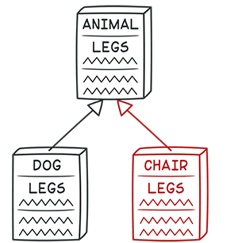

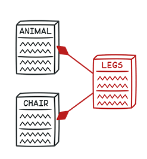

##### Dispensables (Innecesarios)

Estos son fragmentos de código que no aportan valor al sistema y pueden ser eliminados. Algunos ejemplos son:

🔹 **Código duplicado**  
Cuando un mismo fragmento de código se repite en varias partes del sistema, aumenta el riesgo de inconsistencias y dificulta el mantenimiento.  

**Ejemplo antes de refactorizar (código duplicado):**  

```java
public class Pedido {
    public double calcularTotal(double precio, int cantidad) {
        double total = precio * cantidad;
        if (cantidad > 10) {
            total *= 0.9;
        }
        return total;
    }
}

public class Factura {
    public double calcularTotalFactura(double precio, int cantidad) {
        double total = precio * cantidad;
        if (cantidad > 10) {
            total *= 0.9;
        }
        return total;
    }
}
```

**Solución después de refactorizar (extracción de método en una clase común):**  

```java
public class CalculadoraDescuentos {
    public static double calcularTotal(double precio, int cantidad) {
        return (cantidad > 10) ? precio * cantidad * 0.9 : precio * cantidad;
    }
}
```

Ahora ambas clases (`Pedido` y `Factura`) pueden reutilizar `CalculadoraDescuentos` en lugar de duplicar código.  

Otros ejemplos de *dispensables* son:

- **Dead Code**: Código que nunca se ejecuta o que no tiene ningún efecto en el sistema. Este código puede ser eliminado para mejorar la legibilidad y reducir la complejidad.
- **Comentarios**: Algunos comentarios pueden ser indicios de código problemático. Si un comentario es necesario para entender el código, es posible que el código no esté bien escrito, o que se trate de un método demasiado largo y deba ser dividido en métodos más sencillos.
- **Data class**: Clases que solo contienen datos y no tienen comportamiento. Estas clases pueden ser reemplazadas por estructuras de datos más simples o por el uso de objetos inmutables. Si la clase contiende atributos públicos, podemos encapsularlos para acceder a ellos vía métodos getter y setter. Si la clase tiene métodos públicos que no se están utilizando, debemos revisar su visibilidad y modificar la encapsulación.
- **Lazy class**: Clases que no tienen métodos o atributos útiles. Estas clases pueden ser eliminadas o combinadas con otras clases para mejorar la estructura del código (por ejemplo, clases que solo contienen un método o atributo y solo se utilizan dentro de otra, pueden convertirse en inline classes).

##### Couplers (Acopladores)

Estos son fragmentos de código que dependen demasiado de otros módulos o clases, es decir, que presentan un alto acoplamiento, lo que dificulta su reutilización y mantenimiento. Algunos ejemplos son:

- **Feature Envy**: Cuando un método de una clase accede a los datos de otra clase en lugar de utilizar sus propios datos. Esto indica que la lógica del método debería estar en la otra clase.
- **Inappropriate Intimacy**: Cuando dos clases están demasiado interconectadas y una clase utiliza los atributos internos de la otra. Puede resolverse moviendo atributos de esa clase a la primera si solo ésta los utilizao, o creando una nueva clase que represente esos atributos compartidos, haciendo esa relación
- **Message Chains**: Cuando un objeto envía mensajes a otros objetos en una cadena larga, lo que dificulta la comprensión del flujo de datos. Esto puede resolverse utilizando el patrón de diseño **Mediator** o **Observer** para reducir la dependencia entre los objetos.
  
### 4.2. Herramientas de análisis estático para detectar problemas

Como ya hemos visto en la unidad didáctica 5, un analizador estático de código es una herramienta que **inspecciona el código fuente sin ejecutarlo** para detectar posibles problemas. El análisis estático también permite identificar **code smells** sin necesidad de ejecutar el programa.

#### 4.2.1. Identificando code smells en Intellij IDEA

**IntelliJ IDEA** es un entorno de desarrollo integrado (IDE) que incluye herramientas de análisis estático para detectar problemas en el código.

**Pasos para identificar code smells en IntelliJ IDEA:**

1. **Abrir el proyecto en IntelliJ IDEA.**
2. **Ir a "Analyze" > "Inspect Code".**
3. **Seleccionar el alcance del análisis (proyecto, directorio, archivo).**
4. **Elegir los perfiles de inspección.**
5. **Hacer clic en "OK" para iniciar el análisis.**
6. **Revisar los resultados y corregir los problemas detectados.**

Es recomendable explorar las diferentes opciones en el perfil de inspección y entender qué tipo de problemas se pueden detectar.

<div align="center">
    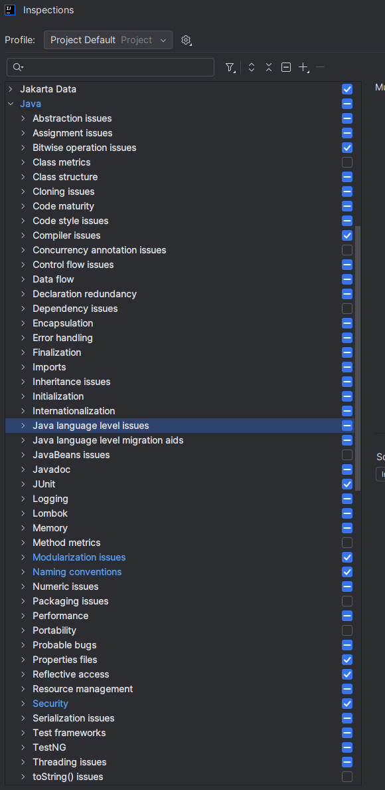
</div>

## 5. Técnicas de refactorización  

Una vez identificados los problemas en el código, el siguiente paso es aplicar técnicas de refactorización para mejorar su estructura sin alterar su funcionalidad. Estas técnicas permiten hacer el código más claro, modular y fácil de mantener.  

A continuación, se presentan algunas de las técnicas más utilizadas en la refactorización. Se van a presentar los ejemplos de refactorización aplicados con Intellij IDEA, pero la mayoría de estas técnicas se pueden aplicar en cualquier IDE o editor de texto. Es altamente recomendable conocer y manejar los atajos del teclado para agilizar el proceso de refactorización.

### 5.1. Renombrado de variables y métodos

Uno de los cambios más simples pero efectivos es **renombrar variables y métodos** para que reflejen mejor su propósito.

**Antes de refactorizar (nombres poco descriptivos):**  

```java
public class Pedido {
    private double p;
    
    public void c(double v) {
        p += v;
    }
}
```

**Después de refactorizar (nombres descriptivos):**  

```java
public class Pedido {
    private double totalPedido;
    
    public void agregarCuantia(double cantidad) {
        totalPedido += cantidad;
    }
}
```

Para renombrar variables y métodos en IntelliJ IDEA, con el cursor sobre la variable o método a renombrar, se puede utilizar la opción **Refactor > Rename** o el atajo de teclado `Shift + F6`. Al renombrar, el IDE actualizará automáticamente todas las referencias al nombre cambiado, evitando errores.

### 5.2. Extracción de métodos y clases

Cuando un método hace demasiadas cosas, se puede dividir en varios métodos más pequeños y específicos.  

**Antes de refactorizar (método con múltiples responsabilidades):**  

```java
public void procesarPedido(Pedido pedido) {
    if (pedido.estaPagado()) {
        if (pedido.getCliente().esFrecuente()) {
            pedido.aplicarDescuento(10);
        } else {
            pedido.aplicarDescuento(5);
        }
        pedido.actualizarInventario();
        pedido.enviarConfirmacion();
    } else {
        System.out.println("El pedido no ha sido pagado.");
    }
}
```

**Después de refactorizar (extracción de métodos):**  

```java
public void procesarPedido(Pedido pedido) {
    if (!pedido.estaPagado()) {
        System.out.println("El pedido no ha sido pagado.");
        return;
    }
    aplicarDescuentoSegunCliente(pedido);
    finalizarPedido(pedido);
}

private void aplicarDescuentoSegunCliente(Pedido pedido) {
    int descuento = pedido.getCliente().esFrecuente() ? 10 : 5;
    pedido.aplicarDescuento(descuento);
}

private void finalizarPedido(Pedido pedido) {
    pedido.actualizarInventario();
    pedido.enviarConfirmacion();
}
```

Para extraer métodos en IntelliJ IDEA, con el código que queremos que forme parte del nuevo método, se puede utilizar la opción **Refactor > Extract/Introduce > Method** o el atajo de teclado `Ctrl + Alt + M`. También, al seleccionar las lineas, nos aparece un menú contextual donde podemos seleccionar **Extract/Method** directamente. Al extraer un método, el IDE actualizará automáticamente todas las referencias al nuevo método.

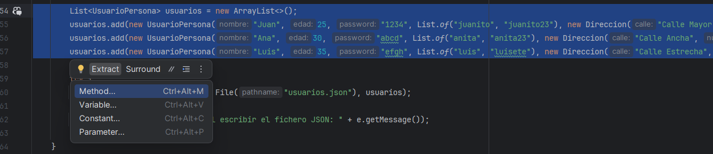

Como vemos, el IDE ajusta la firma del método según las acciones de las instrucciones que se han seleccionado y extraido, y propone algunos nombres para el método (que puedes cambiar en el mismo momento).

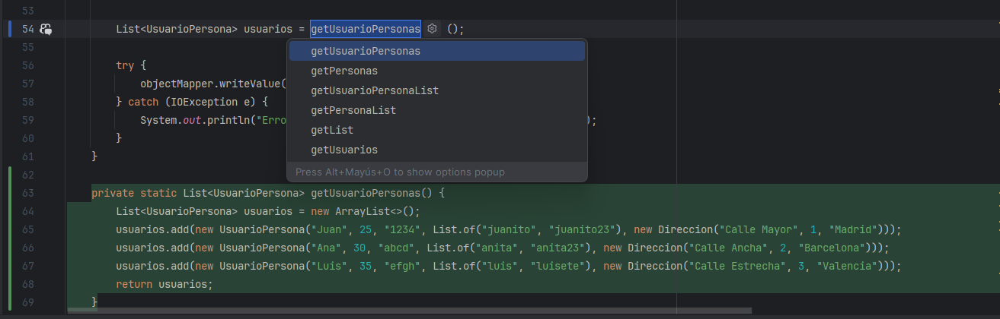

Si un grupo de métodos está poco relacionado, también se puede extraer una nueva **clase** que represente mejor a una entidad con responsabilidades claras.  

**Antes de refactorizar (una sola clase con muchas responsabilidades):**  

```java
public class ReporteVentas {
    public void generarReporte() { /* Genera el informe */ }
    public void guardarEnArchivo() { /* Guarda en un archivo */ }
    public void enviarPorCorreo() { /* Envía por email */ }
}
```

**Después de refactorizar (separación en varias clases):**  

```java
public class ReporteVentas {
    public void generarReporte() { /* Genera el informe */ }
}

public class ReporteArchivo {
    public void guardarEnArchivo(ReporteVentas reporte) { /* Guarda en archivo */ }
}

public class ReporteCorreo {
    public void enviarPorCorreo(ReporteVentas reporte) { /* Envía por email */ }
}
```

Para ello, en IntelliJ IDEA, se puede utilizar la opción **Refactor > Extract/Introduce > Delegate** seleccionar "Extract Class". Ponemos nombre a la nueva clase, seleccionamos el paquete y el directorio de destino, confirmamos los métodos que queremos extraer así como la visibilidad, y hacemos click en "Refactor".

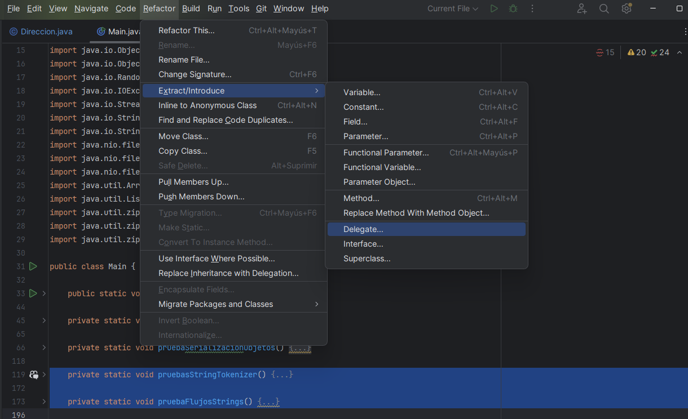

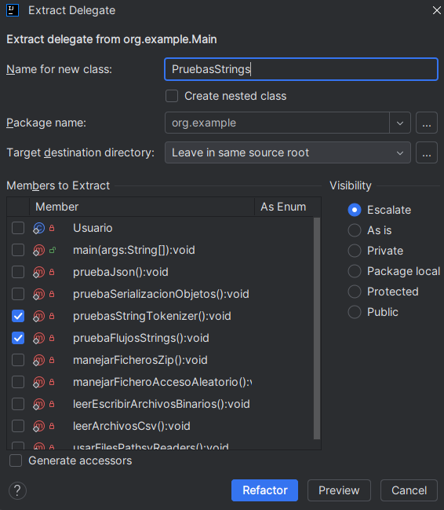

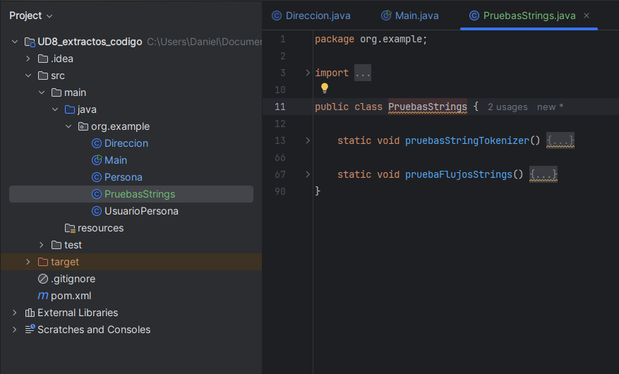

### 5.3. Inlining método

Si un método es demasiado simple o no se utiliza en otros lugares, se puede **eliminar** y **reemplazar** su contenido directamente en el lugar donde se llama. Esto se conoce como **inlining**. Para ello disponemos de la opción **Refactor > Inline Method** o el atajo de teclado `Ctrl + Alt + N`. Al hacer esto, el IDE reemplazará automáticamente todas las referencias al método con su contenido.

### 5.4. Extracción de variables, constantes y `fields`

En ocasiones, nos encontramos fragmentos de código con valores "mágicos" (magic numbers) o cadenas de texto que se repiten en varias partes del código. Para mejorar la legibilidad y facilitar el mantenimiento, es recomendable extraer estos valores en **variables**, **constantes** o **fields**.

***Antes de refactorizar (valores mágicos):**  

```java
public class Pedido {   
    private double precio;
    private int cantidad;

    public Pedido(double precio, int cantidad) {
        this.precio = precio;
        this.cantidad = cantidad;
    }

    public double calcularTotal() {
        return aplicarDescuento(precio * cantidad);
    }

    private double aplicarDescuento(double total) {
        return cantidad > 10 ? total * (1 - 0.1) : total;
    }
}
```

***Después de refactorizar (uso de constantes):**  

```java
public class Pedido {
    private static final double DESCUENTO = 0.1;
    private static final int CANTIDAD_MINIMA_DESCUENTO = 10;
    
    private double precio;
    private int cantidad;

    public Pedido(double precio, int cantidad) {
        this.precio = precio;
        this.cantidad = cantidad;
    }

    public double calcularTotal() {
        return aplicarDescuento(precio * cantidad);
    }

    private double aplicarDescuento(double total) {
        return cantidad > CANTIDAD_MINIMA_DESCUENTO ? total * (1 - DESCUENTO) : total;
    }
}
```

Para realizar la extracción de constantes en IntelliJ IDEA, se puede utilizar la opción **Refactor > Extract > Constant** o el atajo de teclado `Ctrl + Alt + C`. Al extraer una constante, el IDE actualizará automáticamente todas las referencias al valor extraído.

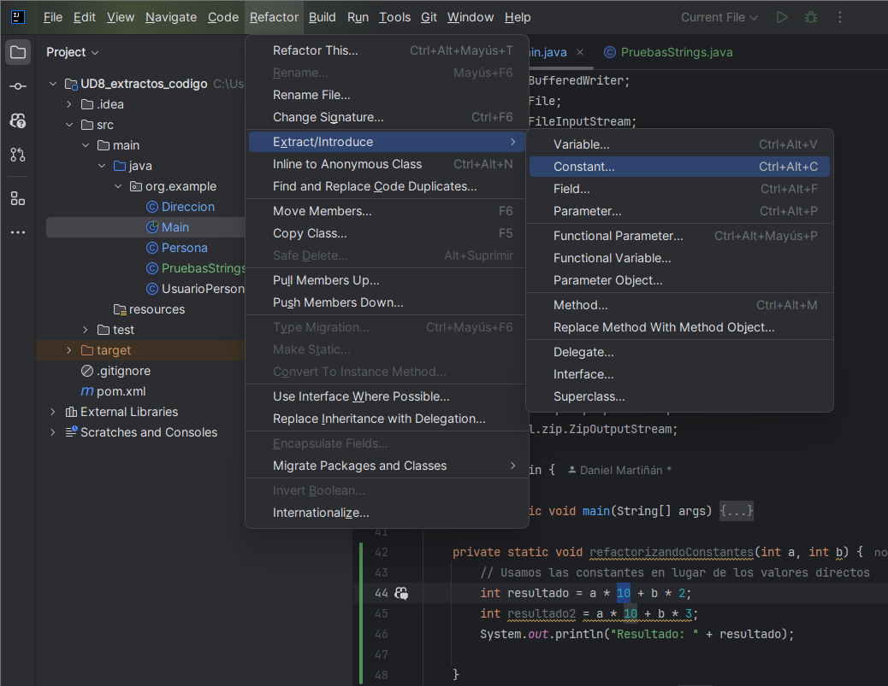

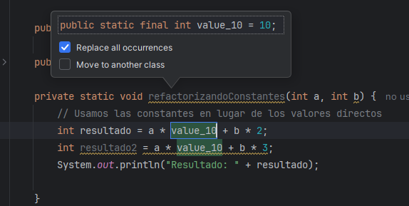

### 5.5. Reemplazo de código duplicado

Si encontramos código repetido en diferentes partes del sistema, debemos extraerlo en un **método o clase reutilizable**.  

**Antes de refactorizar (código duplicado en varias clases):**  

```java
public class Pedido {
    public double calcularTotal(double precio, int cantidad) {
        double total = precio * cantidad;
        if (cantidad > 10) {
            total *= 0.9;
        }
        return total;
    }
}

public class Factura {
    public double calcularTotalFactura(double precio, int cantidad) {
        double total = precio * cantidad;
        if (cantidad > 10) {
            total *= 0.9;
        }
        return total;
    }
}
```

**Después de refactorizar (uso de una clase común):**  

```java
public class CalculadoraDescuentos {
    public static double calcularTotal(double precio, int cantidad) {
        return (cantidad > 10) ? precio * cantidad * 0.9 : precio * cantidad;
    }
}
```

Para reemplazar código duplicado en IntelliJ IDEA, se puede usar la opción **Refactor > Find and Replace Code Duplicates**, aunque en realidad no funciona del todo bien, así que se podría aplicar un `extract method` sobre una de las repeticiones y aplicarla en todas las secciones de código donde corresponda.

### 5.6. Introducción de interfaces y clases abstractas

Para mejorar la flexibilidad y reducir la dependencia de implementaciones concretas, podemos **introducir interfaces o clases abstractas**.  

**Antes de refactorizar (uso de implementación concreta):**  

```java
public class Coche {
    private Motor motor = new Motor();
    
    public void arrancar() {
        motor.encender();
    }
}
```

**Después de refactorizar (uso de una interfaz):**  

```java
public interface IMotor {
    void encender();
}

public class MotorCombustion implements IMotor {
    public void encender() {
        System.out.println("Motor de combustión encendido");
    }
}

public class MotorElectrico implements IMotor {
    public void encender() {
        System.out.println("Motor eléctrico encendido");
    }
}

public class Coche {
    private IMotor motor;

    public Coche(IMotor motor) {
        this.motor = motor;
    }

    public void arrancar() {
        motor.encender();
    }
}
```

Para introducir una interfaz en IntelliJ IDEA, sobre el método que se quiere crear la interfaz, se puede utilizar la opción **Refactor > Extract/Introduce > Interface**. Podremos configurar el nombre de la interfaz, su paquete y directorio de destino y confirmar los métodos que queremos insertar. Al extraer una interfaz, el IDE actualizará automáticamente todas las referencias a la nueva interfaz.

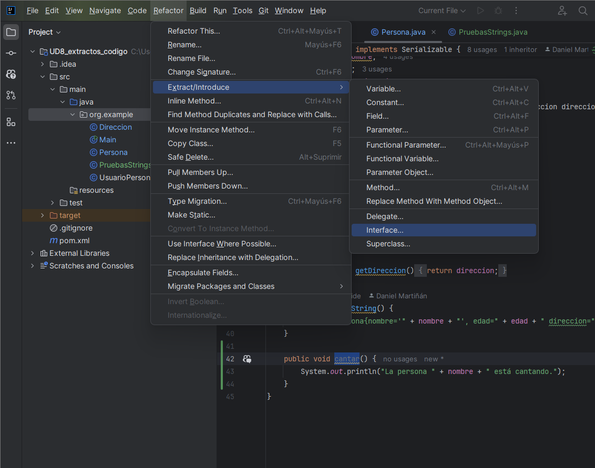

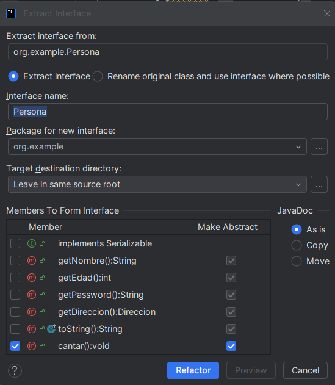

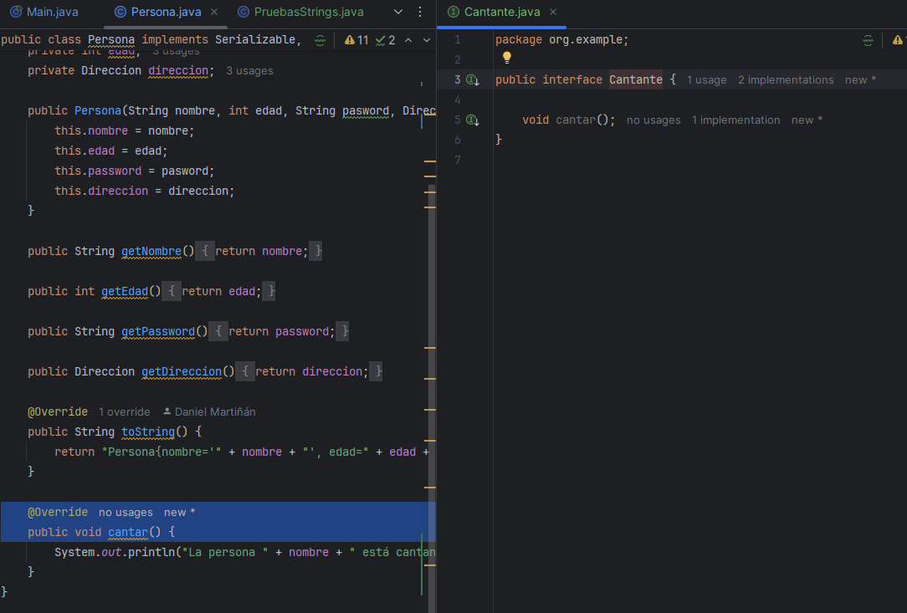

También podemos usar **Extract Superclass** si lo que queremos es aplicar un proceso de **generalizacion** creando una clase padre.

### 5.7. Sustitución de condicionales por polimorfismo

Si un código contiene muchas estructuras `if-else` o `switch`, puede beneficiarse del **uso de polimorfismo** para evitar la rigidez.  

**Antes de refactorizar (uso excesivo de condicionales):**  

```java
public class CalculadoraDescuentos {
    public double calcularDescuento(String tipoCliente, double precio) {
        if (tipoCliente.equals("VIP")) {
            return precio * 0.8;
        } else if (tipoCliente.equals("Normal")) {
            return precio * 0.9;
        }
        return precio;
    }
}
```

**Después de refactorizar (uso de polimorfismo):**  

```java
public interface Descuento {
    double aplicarDescuento(double precio);
}

public class DescuentoVIP implements Descuento {
    public double aplicarDescuento(double precio) {
        return precio * 0.8;
    }
}

public class DescuentoNormal implements Descuento {
    public double aplicarDescuento(double precio) {
        return precio * 0.9;
    }
}
```

No hay una opción específica para realizar esta refactorización automaticamente, pero podemos combinar algunas de las opciones anteriores para conseguirlo.

### 5.8. Earlier Return

En ocasiones, es recomendable **simplificar la lógica de un método** utilizando el patrón de **Early Return**. Este patrón consiste en devolver el resultado de una función tan pronto como se tenga la información necesaria, evitando estructuras de control anidadas.

***Antes de refactorizar (uso de estructuras de control anidadas):**  

```java
    private static int ejemplo(int a, int b) {
        int resultado = a * 10 + b * 2;

        if (a>0) {
            if (b > 0) {
                if (resultado > 0) {
                    return resultado + 1;
                } else {
                    return resultado - 1;
                }
            } else {
                return -2;
            }
        } else {
            return -1;
        }
    }
```

***Después de refactorizar (uso de Early Return):**  

```java
    private static int ejemplo(int a, int b) {
        int resultado = a * 10 + b * 2;

        if (a <= 0) {
            return -1;
        }
        if (b <= 0) {
            return -2;
        }
        if (resultado > 0) {
            return resultado + 1;
        } 
        return resultado - 1;
    }
```

Ambos extractos de código hacen lo mismo, pero el segundo es más legible y fácil de entender.

En este caso, no disponemos de una opción directa en el menu **Refactor** pero, si hacemos click en el if afectado y pulsamos en la bombilla amarilla :bulb: o hacemos botón derecho y clickamos en **Show Context Actions**, podemos seleccionar **Invert if condition** que cambiará el orden de los ifs y nos permitirá aplicar el Early Return más fácilmente.

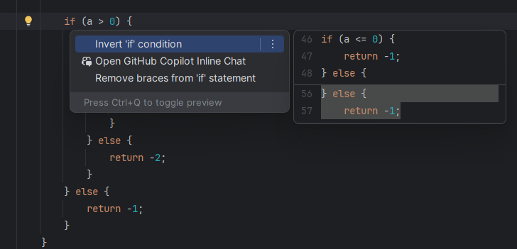

### 5.9. Cambio de tipo

Podemos cambiar el tipo de una variable si el escogido anteriormente no es adecuado (por ejemplo, tenemos una variable de tipo short pero necesitamos almacenar valores más grandes de los permitidos por el tipo short, en este caso, podemos cambiar el tipo a int). Para esto, sobre el tipo de la variable podemos usar la opción **Refactor > Type Migration**. En este caso, el IDE actualizará automáticamente todas las referencias a la variable ajustándose al nuevo tipo.

### 5.10. Refactorización de bucles y estructuras de control

Los bucles complejos pueden ser reemplazados por estructuras más legibles, como el uso de **streams en Java**.  

**Antes de refactorizar (bucle tradicional):**  

```java
int suma = 0;
for (int i = 0; i < numeros.size(); i++) {
    suma += numeros.get(i);
}
```

**Después de refactorizar (uso de streams):**  

```java
int suma = numeros.stream().mapToInt(Integer::intValue).sum();
```

Para refactorizar bucles en IntelliJ IDEA, se puede abrir el menú contextual (`alt + enter`) y seleccionar **Collapse loop with stream ...**. El IDE convertirá automáticamente el bucle en una expresión de stream, mejorando la legibilidad del código. Dependiendo del bucle, proporcionará diferentes opciones de conversión.

## 6. Refactorización sin cambiar el comportamiento del código

Una refactorización exitosa **no debe alterar el comportamiento observable del sistema**. Para garantizarlo, se recomienda seguir estos pasos:  

1️⃣ **Ejecutar las pruebas antes de refactorizar**

- Antes de realizar cambios, se deben ejecutar las pruebas unitarias para asegurarse de que el código actual funciona correctamente.  
- Si alguna prueba falla, es necesario corregir el código antes de continuar con la refactorización.  

2️⃣ **Aplicar cambios incrementales**  

- La refactorización debe realizarse en **pequeños pasos** para evitar grandes modificaciones que puedan generar errores difíciles de detectar.  
- Después de cada cambio significativo, es recomendable volver a ejecutar las pruebas.  

3️⃣ **Ejecutar las pruebas después de refactorizar**

- Una vez completada la refactorización, es imprescindible volver a ejecutar el conjunto de pruebas.  
- Si las pruebas pasan correctamente, significa que el comportamiento del código sigue siendo el mismo.  

4️⃣ **Revisar el impacto en el código y la documentación**

- Si la refactorización afecta a la API pública del sistema, es necesario actualizar la documentación para reflejar los cambios.  

### 6.1. Uso de TDD (Test-Driven Development) en la refactorización

El **Desarrollo Guiado por Pruebas (TDD, Test-Driven Development)** es una metodología que **prioriza la escritura de pruebas antes del código**. Este enfoque es especialmente útil en la refactorización, ya que garantiza que cada nueva modificación está respaldada por pruebas sólidas.  

#### 6.1.1. Ciclo de TDD aplicado a la refactorización

1️⃣ **Escribir una prueba que falle**

- Antes de realizar cualquier cambio, se escribe una prueba automatizada que verifique la funcionalidad esperada.  
- La prueba inicialmente fallará porque el código aún no ha sido refactorizado.  

2️⃣ **Refactorizar el código para mejorar su estructura**

- Se aplican las técnicas de refactorización necesarias para mejorar el diseño del código.  
- Se asegura que la funcionalidad original se mantenga sin cambios.  

3️⃣ **Ejecutar la prueba para validar la refactorización**

- Si la prueba pasa correctamente, significa que la refactorización ha sido exitosa.  
- Si la prueba falla, se revisa el código y se corrigen posibles errores antes de continuar.  

## 7. Referencias

- [Refactorización (Wikipedia)](https://es.wikipedia.org/wiki/Refactorizaci%C3%B3n)
- [Refactoring: Improving the Design of Existing Code (Martin Fowler)](https://martinfowler.com/books/refactoring.html)
- [Clean Code: A Handbook of Agile Software Craftsmanship (Robert C. Martin)](https://www.amazon.com/Clean-Code-Handbook-Software-Craftsmanship/dp/0132350882)
- [SOLID Principles (Wikipedia)](https://en.wikipedia.org/wiki/SOLID)
- [Code Smells (Wikipedia)](https://en.wikipedia.org/wiki/Code_smell)
- [Refactoring Guru](https://refactoring.guru/)
- [La regla de oro del Clean Code (CodelyTV - Youtube)](https://www.youtube.com/watch?v=4GEM9DzkuXE)
- [¿Tiene sentido hablar de Clean Code en 2024? (CodelyTV - Youtube)](https://www.youtube.com/watch?v=cPsTdShqM7w)
- [Code Refactoring (Intellij IDEA)](https://www.jetbrains.com/help/idea/refactoring-source-code.html)
- [Código sostenible (Carlos Blé Jurado)](https://savvily.company.site/Codigo-Sostenible-Como-programar-codigo-facil-de-mantener-Formato-Papel-p463236348)
