# UD7. Diagramas de comportamiento

## 1. Introducción a los diagramas de comportamiento

En el desarrollo de software, es fundamental comprender cómo se comportan los sistemas, cómo interactúan los diferentes elementos y cómo responden ante ciertos eventos o acciones. Para representar este tipo de información de forma visual y estandarizada, se utilizan los **diagramas de comportamiento** de UML (Unified Modeling Language).

Los diagramas de comportamiento forman parte de los tipos de diagramas definidos por UML y se centran en **mostrar el comportamiento dinámico** del sistema, es decir, cómo se desarrollan los procesos, cómo se comunican los objetos y cómo evolucionan los estados a lo largo del tiempo.

### 1.1. ¿Qué muestran los diagramas de comportamiento?

- Las **interacciones** entre usuarios, sistemas y componentes.
- El **flujo de actividades** o acciones en un proceso.
- La **comunicación entre objetos** en tiempo de ejecución.
- El **ciclo de vida** o cambios de estado de un objeto según los eventos que lo afectan.

A diferencia de los **diagramas estructurales** (como el diagrama de clases), que representan la estructura estática del sistema (los elementos y sus relaciones), los diagramas de comportamiento **modelan lo que hace el sistema**: cómo reacciona, cómo fluye la información mediante eventos o interacciones entre objetos, y cómo cambian los elementos en respuesta a eventos.

**¿Por qué son importantes?**

- Ayudan a **comprender el funcionamiento interno** del sistema.
- Facilitan la **comunicación entre desarrolladores, analistas y clientes**.
- Son útiles en las fases de **análisis, diseño y pruebas** del ciclo de vida del software.
- Permiten identificar casos de uso, errores de lógica o incoherencias antes de comenzar la codificación.

## 2. Clasificación de los diagramas de comportamiento

UML define varios tipos de **diagramas de comportamiento**, cada uno con un propósito específico dentro del análisis y diseño de un sistema. Estos diagramas permiten observar **cómo se comporta un sistema o componente** desde diferentes perspectivas: flujos de trabajo, interacciones entre objetos, respuestas a eventos, etc.

A continuación, se describen brevemente los principales tipos de diagramas de comportamiento utilizados en UML:

### 2.1. Diagrama de casos de uso

- **Objetivo:** Representa las funcionalidades que el sistema ofrece a los usuarios (actores).
- **Enfoque:** Qué hace el sistema (requisitos funcionales), no cómo lo hace.
- **Útil para:** Análisis de requisitos funcionales, comunicación con el cliente.

### 2.2. Diagrama de actividades

- **Objetivo:** Modela el flujo de actividades o procesos dentro del sistema.
- **Enfoque:** Flujo de trabajo, decisiones, paralelismo.
- **Útil para:** Modelar algoritmos, procesos de negocio, lógica condicional o repetitiva.

### 2.3. Diagrama de secuencia

- **Objetivo:** Representa la interacción entre objetos o componentes a lo largo del tiempo.
- **Enfoque:** Orden temporal de los mensajes.
- **Útil para:** Modelar escenarios concretos de ejecución, verificar la lógica de interacción.

### 2.4. Diagrama de comunicación (anteriormente "de colaboración")

- **Objetivo:** Muestra las interacciones entre objetos y sus relaciones estructurales.
- **Enfoque:** Comunicación entre objetos, sin centrarse en el tiempo.
- **Útil para:** Ver conexiones entre objetos y cómo se envían mensajes entre ellos.

### 2.5. Diagrama de estados (o de estados de transición)

- **Objetivo:** Describe los diferentes estados por los que pasa un objeto y cómo cambia de estado según los eventos.
- **Enfoque:** Ciclo de vida de un objeto.
- **Útil para:** Modelar objetos con comportamiento complejo, como máquinas de estados. También es útil cuando un objeto cambia de comportamiento en función del estado en el que se encuentra.

### 2.6. Diagrama de interacción general

- **Objetivo:** Vista global de una interacción compleja (puede incluir secuencias, decisiones, bucles).
- **Enfoque:** Combina aspectos de diagramas de secuencia y de actividades.
- **Útil para:** Modelar procesos con interacciones detalladas y condiciones.

### 2.7. Diagrama de temporización

- **Objetivo:** Muestra el cambio de estado o valor de los objetos a lo largo del tiempo.
- **Enfoque:** Control preciso del tiempo y duración de los eventos.
- **Útil para:** Sistemas en tiempo real o donde el tiempo de ejecución es crítico.

### 2.8. Diagramas más utilizados

Aunque UML incluye todos estos diagramas, **los más utilizados en entornos profesionales y educativos** suelen ser:

- Casos de uso
- Actividades
- Secuencia
- Estados

El resto se utiliza en contextos más específicos o avanzados.

## 3. Diagrama de casos de uso

El **diagrama de casos de uso** es uno de los diagramas más utilizados en UML, especialmente en las **fases iniciales del desarrollo**. Representa **las funcionalidades que el sistema ofrece a los usuarios o a otros sistemas** externos (denominados *actores*).

Su objetivo principal es **mostrar qué hace el sistema desde el punto de vista del usuario**, sin entrar en detalles técnicos sobre cómo se implementan esas funcionalidades.

### 3.1. Herramientas para modelar diagramas de casos de uso

Como para la creación de diagramas de clases, existen diferentes herramientas de modelado que permiten crear diagramas de casos de uso. Algunas de las más utilizadas son:

- **StarUML:** Herramienta de modelado UML que permite crear diagramas de casos de uso y otros tipos de diagramas UML.
- **Visual Paradigm:** Herramienta de modelado UML que ofrece una amplia gama de diagramas, incluyendo casos de uso.
- **Lucidchart:** Herramienta en línea que permite crear diagramas de casos de uso y otros tipos de diagramas UML.
- **Draw.io:** Herramienta gratuita y en línea que permite crear diagramas de casos de uso y otros tipos de diagramas UML.
- **PlantUML:** Herramienta que permite crear diagramas de casos de uso a **partir de texto**, ideal para desarrolladores que prefieren escribir el código del diagrama en lugar de dibujarlo.

A diferencia de los diagramas de clases, **Mermaid no permite crear diagramas de casos de uso**. Sin embargo, podemos utilizar PlantUML para crear un diagrama de casos de uso a partir de texto. A continuación, se muestra un ejemplo:

```plaintext
@startuml
actor Cliente
actor ClienteVip
actor Administrador

Cliente <|-- ClienteVip

package "Sistema de Compras" {
    usecase "Iniciar sesión" as UC7
    usecase "Registrar cuenta" as UC8

    usecase "Buscar productos" as UC1
    usecase "Añadir al carrito" as UC2
    usecase "Realizar compra" as UC3

    usecase "Acceder a productos VIP" as UC9

    Cliente -- UC1
    Cliente -- UC2
    Cliente -- UC3
    ClienteVip -- UC9

    UC7 <|-- UC8
    UC2 .> UC7 : <<include>>
    UC3 .> UC7 : <<include>>
    UC9 .> UC7 : <<include>>
}

package "Sistema de Soporte" {
    usecase "Consultar FAQ" as UC4
    usecase "Contactar soporte" as UC5
    usecase "Actualizar FAQ" as UC6

    Cliente -- UC4
    Cliente -- UC5
    Administrador -- UC6
}

left to right direction

@enduml
```

Este código generaría el siguiente diagrama de casos de uso:

<div style="text-align: center;">
   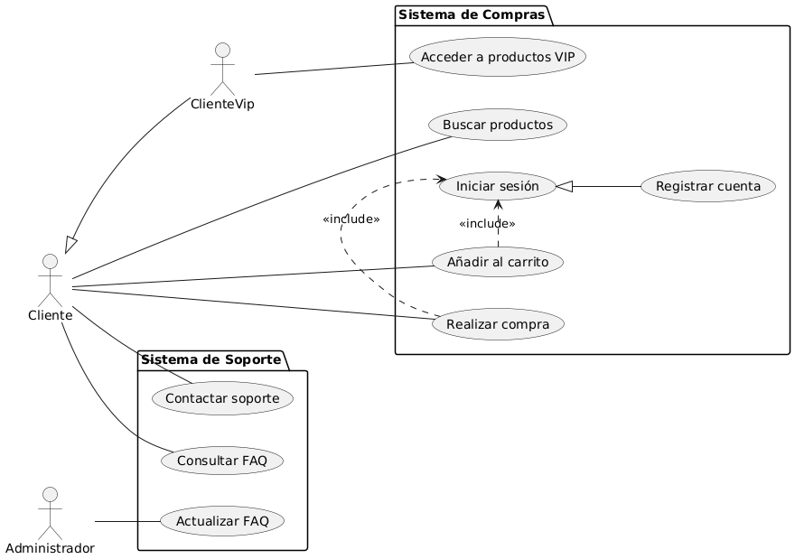
   <p>Ejemplo de diagrama de casos de uso</p>
</div>

### 3.2. Elementos principales

1. **Actor**
   - Representa a un usuario, sistema o entidad **externa** que interactúa con el sistema.
   - Puede ser una persona (ej. "Cliente"), otro sistema (ej. "Pasarela de pagos") o una organización.
   - Se representa como un *muñeco de palo*.

   <div style="text-align: center;">
      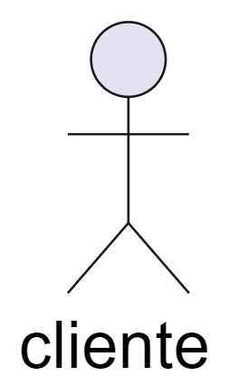
   </div>

2. **Caso de uso**
   - Es una funcionalidad específica o servicio que el sistema proporciona a un actor.
   - Se representa como una *elipse* con el nombre del caso dentro.
   - Ej: `Buscar Productos`, `Añadir al carrito` o `Realizar compra`.

   <div style="text-align: center;">
      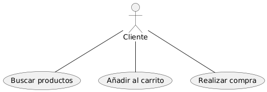
   </div>

3. **Sistema**
   - Se representa con un rectángulo grande que contiene los casos de uso.
   - Define el límite del sistema que estamos modelando.
   - Ejemplo: "Sistema de compras" y "Sistema de soporte" dentro de una tienda online.

   <div style="text-align: center;">
      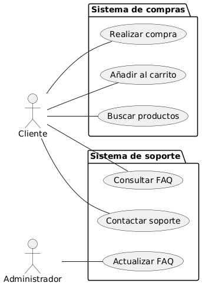
   </div><br>
   
4. **Relaciones**: los actores y los casos de uso están conectados por líneas que indican la interacción entre ellos. Existen diferentes tipos de relaciones:
   - **Asociación (línea simple):** Une actores con los casos de uso que utilizan.
   - **Inclusión (`<<include>>`):** Un caso de uso siempre incluye a otro (**reutilización obligatoria**). La relación *include* ocurre cuando se tiene una porción de comportamiento que es similar en más de un caso de uso. Por ejemplo, en una aplicación de sistema de viajes aéreos, los casos de uso `RealizarReserva` y `ModificarReserva` incluyen el caso de uso `ComprobarAsiento`, ya que ambos casos de uso requieren comprobar la disponibilidad de asientos. En este caso, el caso de uso `ComprobarAsiento` es un caso de uso común que se incluye en otros casos de uso:

      <div style="text-align: center;">
         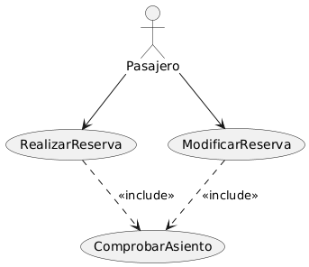
      </div><br>

      Se representa mediante una flecha discontinua con una etiqueta `<<include>>`, apuntando desde el caso de uso que incluye al caso de uso incluido.

   - **Extensión (`<<extend>>`):** Un caso de uso puede extender a otro en situaciones específicas (**opcional**). Se usa la relación *extend* cuando se tiene un caso de uso que extiende o amplia la funcionalidad de otro (llamado caso de uso base). En la relación *extend* el caso de uso extra no es indispensable que ocurra, y cuando lo hace ofrece un valor extra al objetivo original. Por ejemplo, en una aplicación de sistema de viajes aéreos, el caso de uso `RealizarReserva` puede extenderse con el caso de uso `AplicarDescuentoVip`, que solo se aplica si el cliente es un miembro VIP. En este caso, el caso de uso `AplicarDescuentoVip` es opcional y solo se ejecuta si se cumplen ciertas condiciones:
   <br>

      <div style="text-align: center;">
         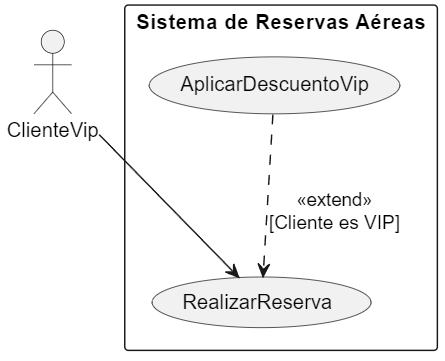
      </div><br>

      Podemos detallar, dentro del caso de uso, el **punto de extensión**, momento en el que se puede extender el caso de uso. Por ejemplo, en el caso de uso `RealizarReserva`, el punto de extensión podría ser "Establecer clase de asiento". Esta información sería importante de cara a la definición del comportamiento del caso de uso, que veremos en apartados siguientes.

      <br><div style="text-align: center;">
         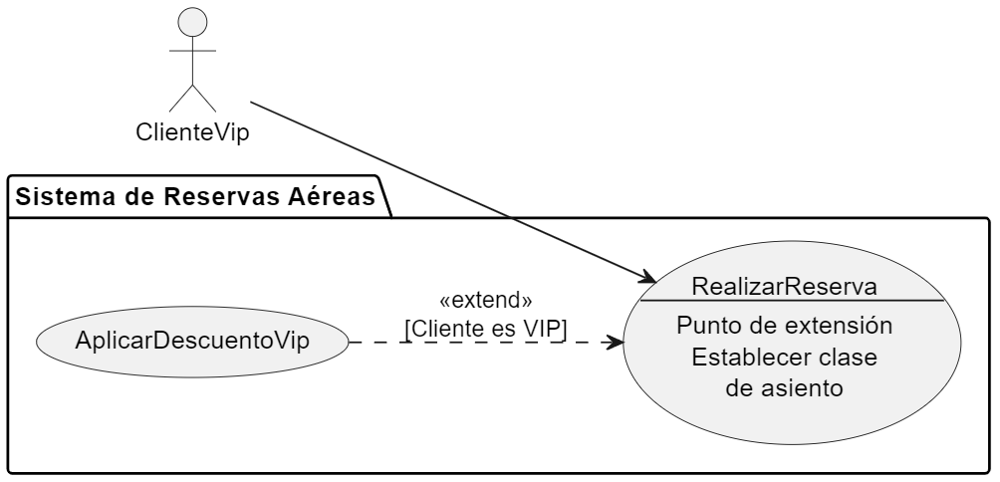
      </div><br>

   - **Generalización:** Se puede aplicar tanto a actores como a casos de uso, mostrando herencia o especialización. Se representa mediante una linea continua con punta de tipo triángulo (igual que la herencia en los diagramas de clases). Por ejemplo, en un sistema con verificación de identidad de usuarios, contamos con un caso de uso llamado `ValidarUsuario`, que se especializa en diferentes casos de uso: `ComprobarClave`, `EscanearRostro`, `ComprobarHuella`. En este caso, el caso de uso `ValidarUsuario` es un caso de uso general que se especializa en otros casos de uso:

      <div style="text-align: center;">
         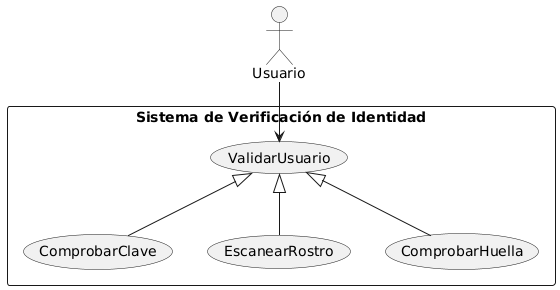
      </div>

### 3.3. Definición del comportamiento de un caso de uso

Los casos de uso indicados en el diagrama de casos de uso deben ser definidos con detalle en un documento de requisitos o especificación. Para cada caso de uso suele utilizarse una tabla o plantilla similar a la siguiente, incluyendo:

- **Nombre del caso de uso:** el nombre indicado en el diagrama.
- **Identificador único**. Por ejemplo, `CU-001`.
- **Descripción breve:** qué hace el caso de uso.
- **Actor(es):** quiénes interactúan con el caso de uso.
- **Precondiciones:** qué debe cumplirse antes de iniciar el caso de uso.
- **Curso normal:** pasos que siguen los actores y el sistema.
- **Curso(s) alternativo(s):** qué ocurre si hay excepciones o errores.
- **Postcondiciones:** qué se espera al finalizar el caso de uso.

Ejemplo:

| Elemento | Descripción |
|---- | -------|
| **Nombre del caso de uso** | Realizar compra |
| **Identificador** | CU-001 |
| **Descripción** | Permite al cliente realizar una compra de productos seleccionados. |
| **Actor(es)** | Cliente |
| **Precondiciones** | El cliente debe estar registrado e iniciar sesión. |
| **Curso normal** | 1. Cliente selecciona productos.<br>2. Cliente añade productos al carrito.<br>3. Cliente procede al pago.<br>4. Sistema valida el pago y confirma la compra. |
| **Curso alternativo 1** | 4. Si el pago es rechazado, se muestra un mensaje de error.
| **Curso alternativo 2** | 4. Si el stock no está disponible, se informa al cliente. |
| **Postcondiciones** | Se genera un pedido en el sistema y se envía un correo de confirmación al cliente.
| **Notas** | Se puede incluir un resumen del pedido y el total a pagar. |

Como vemos, el caso de uso presenta dos cursos alternativos que no vuelven al curso normal (errores o excepciones).  Si queremos representar un paso condicional dentro del propio curso normal, podemo sutilizar las palabras claves *SI* y *SINO* para indicar el flujo alternativo. Además, también podemos utilizar pasos repetitivos, como por ejemplo: "Repetir hasta que el cliente confirme el pedido".

Por ejemplo:

| Elemento | Descripción |
|---- | -------|
| **Nombre del caso de uso** | Registrarse |
| **Identificador** | CU-002 |
| **Descripción** | Permite al cliente crear una cuenta en el sistema. |
| **Actor(es)** | Cliente |
| **Precondiciones** | Ninguna |
| **Curso normal** | 1. Cliente accede a la página de registro.<br>2. Cliente introduce datos personales.<br>3. Cliente acepta términos y condiciones.<br>4. *SI* los datos son válidos <br> &emsp; 4.1 se crea la cuenta.<br> 5. *SI NO* <br> &emsp; 5.1 Se informa al cliente de los datos inválidos <br> 6. Se repiten los pasos 4 a 5 hasta que el usuario introduce los datos correctamente <br> 7. Se envía un correo de confirmación al cliente.<br> |
| **Curso alternativo 1** | 4. Si el correo ya está registrado, se informa al cliente. |
| **Postcondiciones** | Se crea una cuenta de usuario en el sistema y se envía un correo de confirmación. |

Podemos definir tantos cursos alternativos como sea necesario, siempre que no se repitan los pasos del curso normal. En caso de que haya un paso repetitivo, podemos utilizar la palabra clave *HASTA* o *PARA*, para indicar el final del bucle.

| Elemento | Descripción |
|---- | -------|
| **Nombre del caso de uso** | Buscar productos |
| **Identificador** | CU-003 |
| **Descripción** | Permite al cliente buscar productos en el catálogo. |
| **Actor(es)** | Cliente |
| **Precondiciones** | El cliente debe estar registrado e iniciar sesión. |
| **Curso normal** | 1. Cliente accede a la página de búsqueda.<br>2. Cliente introduce criterios de búsqueda.<br>3. Sistema muestra resultados.<br>4. *HASTA* que el cliente encuentre el producto deseado <br> &emsp; 4.1 Cliente selecciona un producto.<br> 5. Se muestra la información del producto.<br> |
| **Curso alternativo 1** | 4. Si no se encuentran resultados, se informa al cliente. |
| **Postcondiciones** | Se muestra la información del producto seleccionado. |

| Elemento | Descripción |
|---- | -------|
| **Nombre del caso de uso** | Consultar historial de pedidos |
| **Identificador** | CU-004 |
| **Descripción** | Permite al cliente ver su historial de pedidos. |
| **Actor(es)** | Cliente |
| **Precondiciones** | El cliente debe estar registrado e iniciar sesión. |
| **Curso normal** | 1. Cliente accede a la sección de historial.<br>2. *PARA* cada pedido en el historial <br> &emsp; 2.1 Se muestra la información del pedido.<br> 3. Se permite al cliente filtrar por fecha o estado.<br> |
| **Curso alternativo 1** | 2. Si no hay pedidos, se informa al cliente. |
| **Postcondiciones** | Se muestra el historial de pedidos del cliente. |

A la hora de describir casos de uso con relación de *include*, debemos indicar en el curso normal el momento en el que se incluye el caso de uso. Por ejemplo, en el caso de uso `RealizarReserva`, el caso de uso `ComprobarAsiento` se incluiría en el paso 3 del curso normal, quedando así:

| Elemento | Descripción |
| ---- | -------|
| **Nombre del caso de uso** | Realizar reserva |
| **Identificador** | CU-010 |
| **Descripción** | Permite al cliente realizar una reserva de vuelo. |
| **Actor(es)** | Cliente |
| **Precondiciones** | El cliente debe estar registrado e iniciar sesión. |
| **Curso normal** | 1. Cliente selecciona vuelo.<br>2. Cliente introduce datos de pasajero.<br>3. **Punto de inclusión**: *ComprobarAsiento (CU-011)*.<br> 4. Se confirma la reserva.<br> |
| **Curso alternativo 1** | 3. Si el vuelo no está disponible, se informa al cliente. |
| **Postcondiciones** | Se genera una reserva en el sistema y se envía un correo de confirmación al cliente. |

Y por su parte, el caso de uso `ComprobarAsiento`:

| Elemento | Descripción |
| ---- | -------|
| **Nombre del caso de uso** | Comprobar asiento |
| **Identificador** | CU-011 |
| **Descripción** | Verifica la disponibilidad de asientos en un vuelo. |
| **Actor(es)** | Cliente |
| **Precondiciones** | El cliente debe haber seleccionado un vuelo. |
| **Curso normal** | 1. Se consulta la disponibilidad de asientos.<br>2. Se muestra la disponibilidad al cliente.<br> |
| **Postcondiciones** | Se actualiza la disponibilidad de asientos en el sistema. |
| **Curso alternativo** | No existe. |

A la hora de describir un caso de uso con una relación de *extend*, debemos de indicar en el curso normal el momento en el que se puede extender el caso de uso. Volviendo al ejemplo del sistema de aerolíneas, en el que teníamos un caso de uso `RealizarReserva` que se extiende con el caso de uso `AplicarDescuentoVip`, el caso de uso `RealizarReserva` podría quedar así:

| Elemento | Descripción |
|---- | -------|
| **Nombre del caso de uso** | Realizar reserva |
| **Identificador** | CU-005 |
| **Descripción** | Permite al cliente realizar una reserva de vuelo. |
| **Actor(es)** | Cliente |
| **Precondiciones** | El cliente debe estar registrado e iniciar sesión. |
| **Curso normal** | 1. Cliente selecciona vuelo.<br>2. Cliente introduce datos de pasajero.<br>3. *HASTA* que el cliente seleccione la clase de asiento <br> &emsp; 3.1 Se muestra la información del vuelo.<br> 4. **Punto de extensión**: *AplicarDescuentoVip (CU-006)*.<br> 5. Se confirma la reserva.<br> |
| **Curso alternativo 1** | 3. Si el vuelo no está disponible, se informa al cliente. |
| **Postcondiciones** | Se genera una reserva en el sistema y se envía un correo de confirmación al cliente. |

Y por su parte, el caso de uso `AplicarDescuentoVip`:

| Elemento | Descripción |
| ---- | -------|
| **Nombre del caso de uso** | Aplicar descuento VIP |
| **Identificador** | CU-006 |
| **Descripción** | Aplica un descuento especial a clientes VIP. |
| **Actor(es)** | ClienteVip |
| **Precondiciones** | El cliente debe ser un miembro VIP. El cliente debe estar realizando una reserva y haber seleccionado un asiento |
| **Curso normal** | 1. Se calcula el precio para el asiento seleccionado.<br>2. Se aplica un descuento del 20% al precio total.<br>3. Se muestra el precio final al cliente.<br> |
| **Postcondiciones** | Se aplica el descuento al precio de la reserva. |
| **Curso alternativo** | No existe. |

### 3.4. Ventajas del diagrama de casos de uso

- Clarifica **los requisitos funcionales** del sistema.
- Facilita la **comunicación con el cliente** o usuarios no técnicos.
- Sirve como base para el diseño posterior y para la **documentación del sistema**.
- Permite identificar actores clave y sus necesidades.

## 4. Diagrama de actividades

### 4.1. ¿Qué es un diagrama de actividades?

El **diagrama de actividades** es un tipo de diagrama UML que se utiliza para **modelar flujos de trabajo o procesos** dentro de un sistema. Representa la secuencia de acciones, decisiones, bifurcaciones y posibles caminos que puede seguir un proceso desde su inicio hasta su fin.

Es especialmente útil para describir:

- Algoritmos o lógica de negocio.
- Procesos complejos con múltiples pasos.
- Flujos que pueden incluir decisiones, repeticiones o tareas paralelas.

### 4.2. Elementos principales

1. **Nodo de inicio (Inicio)**
   - Indica el punto donde comienza la actividad.
   - Representado por un círculo negro sólido.

2. **Acciones / Actividades**
   - Son las tareas o pasos que realiza el sistema.
   - Se representan con un rectángulo de bordes redondeados.

3. **Decisión**
   - Permite representar condiciones lógicas (como un "si... entonces...").
   - Representada por un rombo. De ella salen varias flechas, cada una con una condición.

4. **Flujo / Transición**
   - Conectores que indican el orden en que se ejecutan las acciones.
   - Representados por flechas.

5. **Concurrencia (Fork y Join)**
   - **Fork:** Divide el flujo en varios hilos paralelos.
   - **Join:** Reúne flujos paralelos en uno solo.
   - Representados por una barra negra horizontal o vertical.

6. **Nodo de fin**
   - Marca el final del proceso.
   - Representado por un círculo negro con un borde blanco.

### 4.3. Ejemplo práctico

Supongamos que queremos modelar el proceso de "Realizar un pedido" en una tienda online:

1. Inicio  
2. Seleccionar productos  
3. Iniciar sesión  
4. Introducir datos de envío  
5. Elegir forma de pago  
6. Confirmar pedido  
7. Fin

Además, podría haber una **decisión** si el usuario no está registrado:  
→ ¿Está registrado?  
→ Si no, se redirige al registro.

Y también se podría representar una **tarea paralela**, como enviar correo de confirmación al mismo tiempo que se actualiza el stock.

### 4.4. Representación gráfica

Los diagramas de actividad tienen una apariencia similar al mostrado a continuación:

<div style="text-align: center;">
   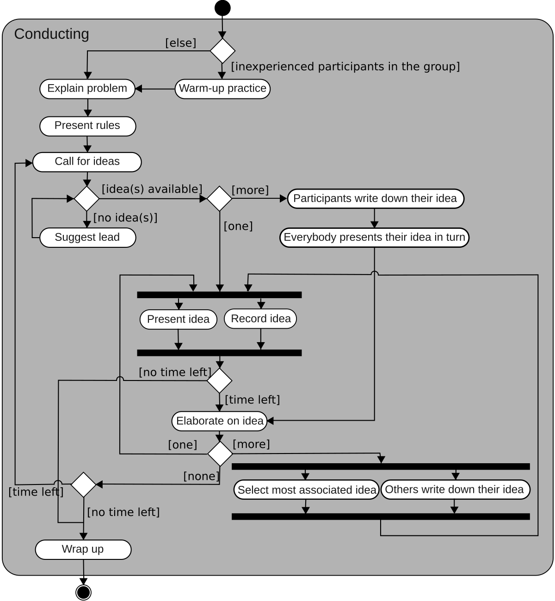
   <p>Ejemplo de diagrama de actividades </p>
</div>

Son muy similares a los **diagramas de flujo** que hemos utilizado en la UD1 para representar algoritmos, y no profundizaremos en ellos.

### 4.5. ¿Para qué sirve?

- Para **visualizar claramente** cómo fluye un proceso o algoritmo.
- Para **detectar errores o cuellos de botella** en procesos de negocio.
- Para facilitar la **comunicación entre analistas, desarrolladores y usuarios**.

## 5. Diagrama de secuencia

### 5.1. ¿Qué es un diagrama de secuencia?

El **diagrama de secuencia** representa cómo los objetos interactúan entre sí mediante el **envío de mensajes en un orden temporal específico**. Se enfoca en mostrar **el flujo de mensajes** que se intercambian entre objetos o componentes para llevar a cabo una funcionalidad.

Este tipo de diagrama es especialmente útil para:

- Modelar escenarios de uso del sistema (como una historia de usuario).
- Verificar la lógica de interacción entre componentes.
- Entender el comportamiento de métodos o procesos complejos.

### 5.2. Elementos principales

1. **Líneas de vida (*lifelines*)**
   - Representan a los objetos o actores que participan.
   - Se representan con una línea vertical bajo el nombre del objeto.
   - Los actores los representaremos mediante un muñeco de palo, como en los diagramas de casos de uso, y los objetos dentro de un rectángulo. 

2. **Mensajes**
   - Son las llamadas a métodos o comunicaciones entre los objetos.
   - Se representan con flechas horizontales de un objeto a otro. Los mensajes pueden ser:
     - **Síncronos**: el objeto que envía espera una respuesta. Se representa con una flecha sólida.
     - **Asíncronos**: el objeto que envía no espera respuesta. Se representa con una flecha abierta
     - **De retorno**: se representa con una flecha discontinua. Son utilizados para representar las respuestas de un mensaje.

3. **Activaciones**
   - Rectángulos delgados sobre la línea de vida que indican que un objeto está "activo" ejecutando una acción. Sirven para indicar una duración temporal de la acción.

4. **Retornos**
   - Flechas de respuesta, opcionalmente con un valor devuelto.

5. **Creación y destrucción de objetos**
   - `create` y `destroy` también se pueden representar.

### 5.3. Ejemplo práctico en Mermaid

Modelaremos el proceso **"Realizar pedido"** de una tienda online:

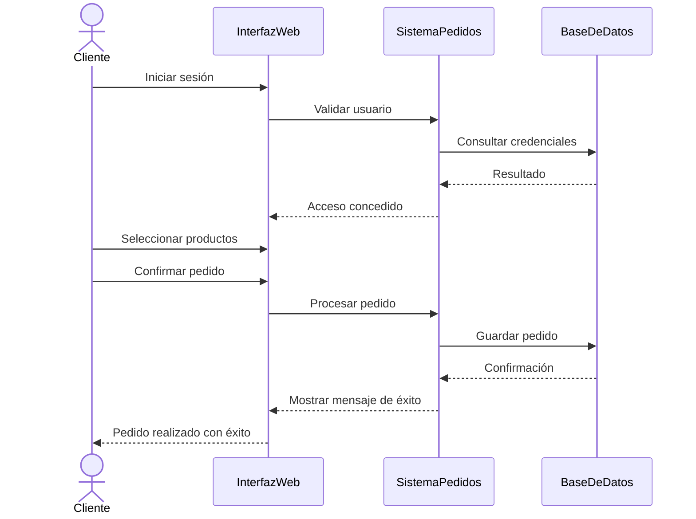

### 5.4. Definición de bucles

Para definir bucles en un diagrama de secuencia, podemos utilizar la palabra clave `loop` para indicar que una parte del flujo se repite. Por ejemplo, si el cliente puede seleccionar varios productos, podríamos representar el bucle de la siguiente manera:

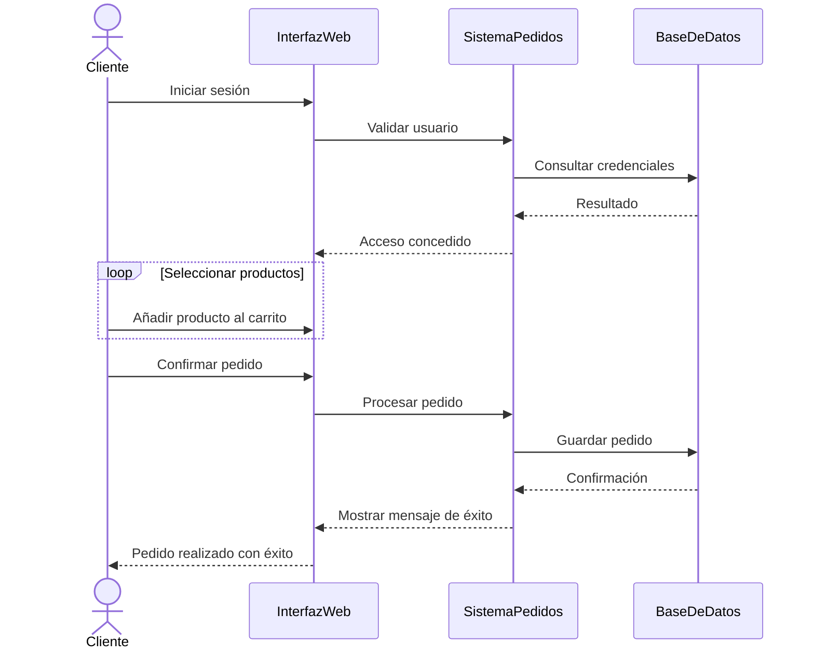

### 5.5. Diagramas en sistemas orientados a objetos

En los ejemplos anteriores, hemos visto cómo los mensajes podían fluir desde un actor (por ejemplo, cliente), hacia distintas partes del sistema. En el caso de querer indicar interacciones con un mayor nivel de detalle, entre distintos objetos de distintas clases, utilizaremos la siguiente nomenclatura:

- `Clase`: representamos la clase del objeto, por ejemplo `Cliente` o `Producto`. Lo utilizaremos en el caso de que los métodos empleados sean estáticos o de clase.
- `objeto:Clase`: representamos un objeto concreto de una clase, por ejemplo `cliente1:Cliente` o `producto1:Producto`.
- `:Clase`: representamos un objeto cualquiera de una clase, por ejemplo `:Cliente` o `:Producto`.

Vamos a ilustrarlo con un ejemplo. Supongamos que tenemos un sistema de gestión de pedidos, y queremos representar la interacción entre un cliente y el sistema al realizar un pedido. Podríamos tener los siguientes objetos:

- `Cliente`: es el actor que interactúa con el sistema.
- `:Pantalla`: es un objeto que representa la interfaz de usuario.
- `GestorPedidos`: es un objeto que se encarga de gestionar los pedidos.
- `p:producto`: es un objeto que representa un producto específico.

```mermaid
sequenceDiagram
   actor Cliente
   participant :Pantalla
   participant GestorClientes
   participant GestorPedidos

   Cliente->>Pantalla: Iniciar sesión
   Pantalla->>GestorClientes: Validar usuario
   GestorClientes-->>Pantalla: Acceso concedido

   loop Seleccionar productos
      Cliente->>Pantalla: Añadir producto al carrito
      Pantalla->>GestorPedidos: Añadir producto al carrito
      create participant Product as p:Producto
      GestorPedidos->>Product: <<create>>
   end


   Cliente->>Pantalla: Confirmar pedido
   Pantalla->>GestorPedidos: Procesar pedido
   GestorPedidos-->>Pantalla: Confirmación de pedido

   Pantalla-->>Cliente: Pedido realizado con éxito
```

### 5.6. Creación y destrucción de objetos

En el diagrama anterior hemos incluido la creación de un objeto `p:Producto` al añadir un producto al carrito. Para indicar la creación de un objeto, utilizamos la palabra clave `create` antes del mensaje que lo crea. En un diagrama de secuencia, también podemos representar la destrucción de un objeto utilizando la palabra clave `destroy` en el mensaje que lo elimina. Por ejemplo, si queremos eliminar un objeto `p:Producto` antes de continuar con el pedido, podríamos hacerlo de la siguiente manera:

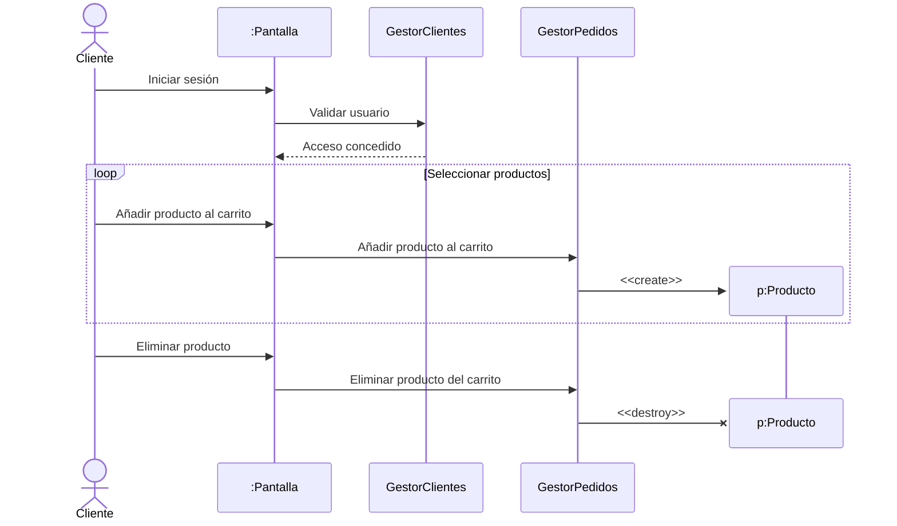

### 5.7. Alternativas y condicionales

Para representar alternativas o condicionales en un diagrama de secuencia, podemos utilizar la palabra clave `alt` para indicar que hay diferentes caminos posibles. Por ejemplo, si el cliente puede elegir entre pagar con tarjeta o PayPal, podríamos representarlo de la siguiente manera:

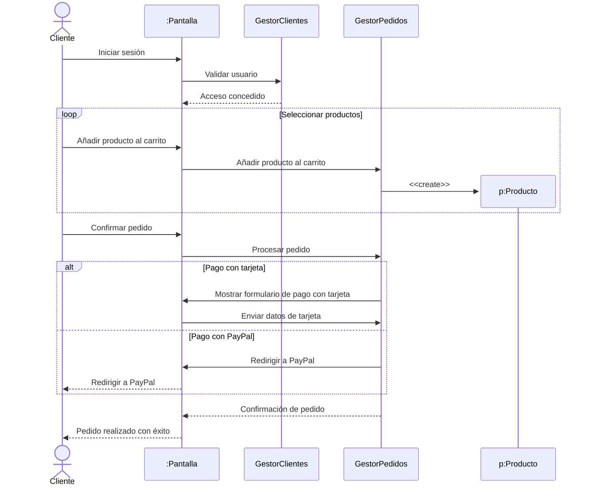

Por supuesto, podemos anidar alternativas y bucles. Por ejemplo, podemos añadir una condicion dentro de un bucle para indicar que el cliente puede añadir productos al carrito hasta que alcance un límite de cantidad. En este caso, podríamos utilizar la palabra clave `opt` para indicar una opción opcional dentro del bucle:

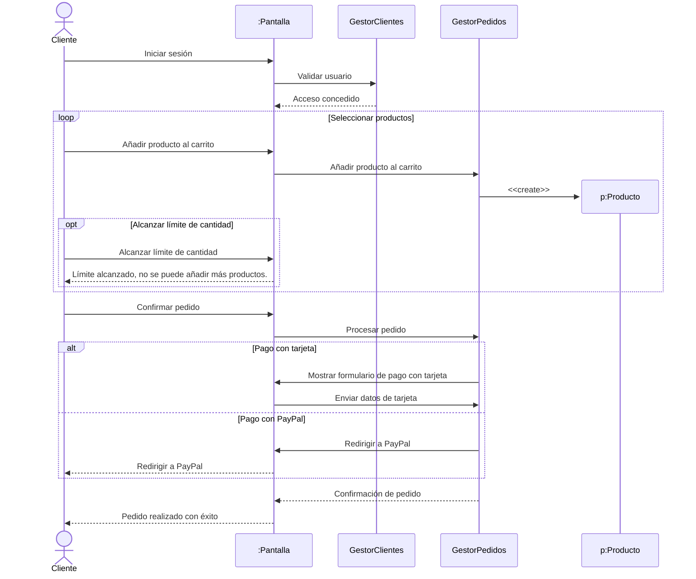

### 5.8. ¿Qué aporta este diagrama?

- Permite **ver paso a paso** cómo interactúan los actores y componentes.
- Ayuda a **detectar errores de lógica** en el flujo.
- Es excelente para **documentar escenarios de uso o test**.

### 5.9. Cuándo usarlo

- Para **modelar el comportamiento dinámico** de un caso de uso concreto.
- Cuando necesitas entender o explicar **cómo colaboran los objetos** para lograr un objetivo.
- Al diseñar la **lógica de interacción entre capas** (vista, lógica, datos).

## 6. Diagrama de comunicación

### 6.1. ¿Qué es un diagrama de comunicación?

El **diagrama de comunicación** (antes llamado *diagrama de colaboración*) representa las **interacciones entre objetos** u otros elementos del sistema, **enfocándose en la estructura y los mensajes intercambiados**, más que en el orden temporal como en los diagramas de secuencia.

A diferencia del diagrama de secuencia (que es vertical y cronológico), el diagrama de comunicación es más **estructural y espacial**: muestra cómo están conectados los objetos y **qué mensajes** se envían entre ellos, **numerados según el orden de ejecución**.

### 6.2. Elementos principales

1. **Objetos o participantes**
   - Representan instancias concretas que interactúan.
   - Se nombran como `objeto:Clase`.

2. **Enlaces (relaciones)**
   - Representan asociaciones entre los objetos.
   - Se conectan mediante líneas.

3. **Mensajes**
   - Flechas que indican qué mensaje se envía a través del enlace.
   - Se numeran para indicar el orden de ejecución.

### 6.3. Diferencia con el diagrama de secuencia

| Diagrama de secuencia         | Diagrama de comunicación         |
|------------------------------|----------------------------------|
| Enfocado en el **tiempo**     | Enfocado en la **estructura**     |
| Vertical, con líneas de vida | Espacial, con objetos conectados |
| Muestra activaciones          | Muestra relaciones entre objetos |
| Más detallado para flujos     | Más visual para arquitectura     |

No vamos a profundizar en este diagrama, ya que es menos utilizado.

### 6.4. ¿Cuándo usarlo?

- Cuando se quiere ver cómo **están conectados los objetos** y cómo se comunican.
- Para representar **arquitecturas colaborativas** o diagramas centrados en componentes.
- Para complementar o simplificar la vista del diagrama de secuencia.

## 7. Diagrama de estados (o diagrama de transición de estados)

### 7.1. ¿Qué es un diagrama de estados?

El **diagrama de estados** muestra los **distintos estados por los que pasa un objeto** (o sistema) en respuesta a eventos, así como las **transiciones** entre esos estados. Es especialmente útil cuando los objetos tienen comportamientos complejos o dependen de eventos externos.

Este tipo de diagrama es una representación de una **máquina de estados finita determinista, donde cada transición depende de un evento**, muy común en sistemas de control, aplicaciones interactivas o componentes que responden a eventos.

### 7.2. Elementos principales

1. **Estado**
   - Representa una situación en la que se encuentra un objeto durante un periodo de tiempo.
   - Se dibuja como un rectángulo con esquinas redondeadas.
   - Puede tener nombre, entradas, salidas y acciones internas.

2. **Transición**
   - Indica el cambio de un estado a otro provocado por un **evento**.
   - Representada como una flecha, con el nombre del evento (y opcionalmente una acción o condición).

3. **Estado inicial**
   - Punto de entrada al diagrama.
   - Círculo negro sólido.

4. **Estado final**
   - Punto de finalización.
   - Círculo negro con borde blanco.

5. **Acciones internas**
   - Pueden incluir `entry/`, `do/`, `exit/` para representar acciones que ocurren al entrar, durante o salir del estado.

### 7.3. Ejemplo práctico: Ciclo de vida de un pedido

Vamos a representar los estados de un pedido en una tienda online:

- Estados: `Nuevo`, `Pagado`, `Enviado`, `Entregado`, `Cancelado`
- Eventos: `confirmarPago`, `enviarPedido`, `confirmarEntrega`, `cancelar`

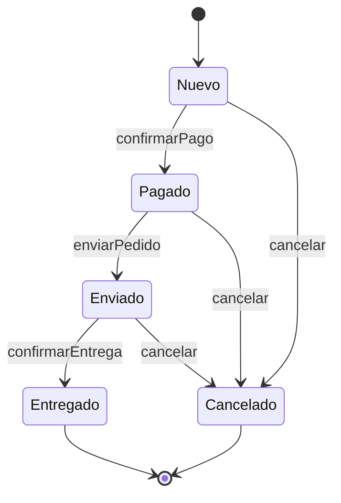

### Ejemplo 2: diagrama de estados para el estado civil de una persona

Una persona, desde que nace, puede pasar por distintos estados civiles:

- Estados: `Soltero`, `Casado`, `Divorciado`, `Viudo`
- Eventos: `casarse`, `divorciarse`, `morir`

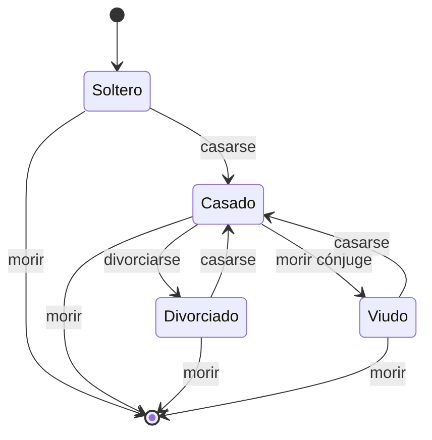

### 7.4. ¿Para qué sirve?

- Modelar el **ciclo de vida de objetos o sistemas** con comportamiento dependiente de eventos.
- Entender cómo un componente **reacciona ante estímulos externos**.
- Ideal para sistemas que manejan **estados, eventos y transiciones** (interfaces gráficas, juegos, controladores, etc.).

### 7.5. Cuándo usarlo

- Cuando un objeto tiene **varios estados posibles y reglas específicas para transicionar entre ellos**.
- En diseño de interfaces o procesos que dependen de decisiones del usuario.
- En sistemas embebidos, autómatas, workflows y lógica compleja.
